# 我为红队和蓝队解释了 AWS

> 原文：<https://infosecwriteups.com/aws-iam-explained-for-red-and-blue-teams-2dda8b20fbf7?source=collection_archive---------0----------------------->

# 介绍

当我开始进入 AWS pentesting 时，最难完全理解的事情之一是 IAM。AWS 文档通常很棒，但也可能很广泛，IAM 也有很多类似的术语。您有用户、角色、组、受管策略、内联策略、实例角色等…
本文将尝试阐明这个主题，以及用不同工具列举这些信息的一些方法。

**警告:这篇文章将只包含理论，我将在下周发表一篇关于这方面的实际例子，但在“有趣”之前，你需要这方面的知识。**

稍后编辑:[这是我提到的](https://medium.com/@securityshenaningans/exploiting-fine-grained-aws-iam-permissions-for-total-cloud-compromise-a-real-world-example-part-5a2f3de4be08)的实际例子的链接

# 理论

AWS 将 IAM 定义为一种安全管理 AWS 服务和资源访问的方式。这都归结于权限。IAM 是管理访问您的云资源的权限的一种方式。**这些权限被分配给实体。实体是你可以分配权限给**的东西。IAM 中有 3 个可能的实体:

*   用户
*   组
*   角色。

**用户是与 AWS 交互的人或服务的代表。**

**群组是 IAM 用户的集合。**

这两个概念都相当直观，并且类似于在其他环境(如 Active Directory)中发现的概念。

**角色类似于用户，因为它是具有权限策略的身份，权限策略决定了身份在 AWS 中可以做什么和不可以做什么。** **然而，一个角色没有任何与之相关联的凭证(密码或访问密钥)**。角色不是只与一个人相关联，而是旨在被任何需要它的人所接受。(来源:[https://docs.aws.amazon.com/IAM/latest/UserGuide/id.html](https://docs.aws.amazon.com/IAM/latest/UserGuide/id.html))

这些定义大多来自 AWS 的官方文档。但是这里有点复杂。**您通过策略向实体分配权限。**政策有两种形式:

*   托管策略
*   内联策略(将其视为不受管理的策略)

它们之间的区别在于**托管策略是独立的策略，由它们自己定义。它们不与任何特定实体相关联，并且可以附加到多个实体。**

**内嵌策略(或非托管策略)是嵌入在 IAM 身份(用户、组或角色)中的策略。政策是身份的固有部分。它不能分配给任何其他实体。**把它们想象成一个实体的特定属性。

相比内联策略，建议使用托管策略，因为它们更易于管理和审核。您可以让一千个用户使用相同的托管策略，策略的一个更改会影响所有用户。您只需审核一个策略。如果您对每个用户都有内联策略，您将不得不审核 1000 个不同的策略，而且您没有办法一次修改所有的策略。

还有一个需要注意的区别。托管策略也可以分为两类:

*   托管策略(为了消除歧义，我们称之为 AWS 托管策略)
*   客户管理的策略

区别很简单。受管策略由 AWS 管理。它们定义了您可能需要的常见角色，并且您不能修改它们。

客户管理的策略是客户创建和管理的策略。您可以定义自定义策略，以适应您的特定需求。

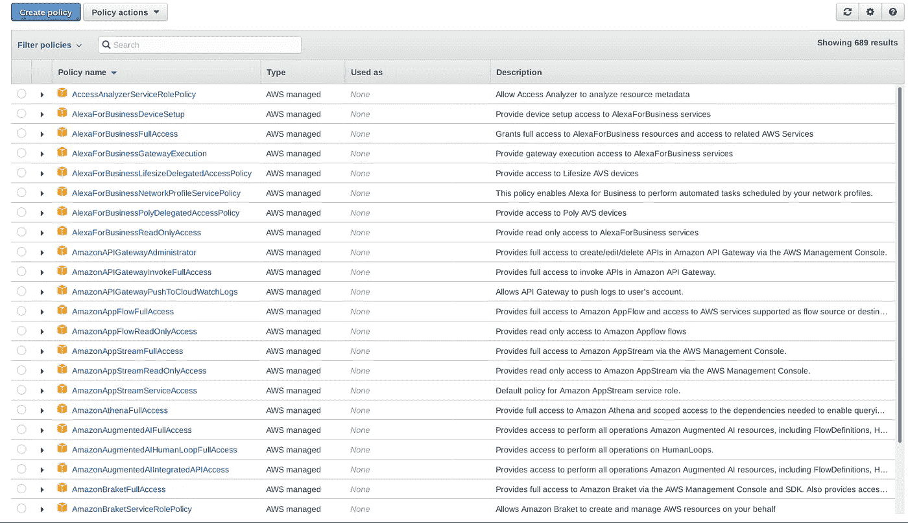

亚马逊 AWS 托管策略

您可以进行的另一个区分是:

*   基于身份的策略
*   基于资源的政策

还记得我之前说过，实体是可以分配策略的事物吗？嗯，这有点不完整。身份是您可以向其分配基于身份的策略的事物。它们被分配给用户、组和角色。

还有一种策略叫做基于资源的策略，只能分配给资源。想想 AWS 服务(S3 桶、SQS 队列等)..).此外，EC2 实例。每当您拥有需要特定权限才能完成任务的资源时，您都可以使用基于资源的策略。

有一件事你需要知道，这非常重要。可以通过基于资源的策略(直接附加)以及通过角色授予资源权限。在开始时，我说过角色可以由任何需要的人担任。这也包括实例和 AWS 服务([https://docs . amazonaws . cn/en _ us/IAM/latest/user guide/id _ roles _ compare-resource-policies . html](https://docs.amazonaws.cn/en_us/IAM/latest/UserGuide/id_roles_compare-resource-policies.html))。

你问为什么这些知识很重要？嗯，在 AWS 环境中，旋转访问最常见的方式之一是劫持实例角色。

每当您希望实例拥有某些权限时，您可以授予它承担特定角色的权限。这称为实例角色。一个实例只能应用一个角色，但是可以有多个实例具有相同的角色。与该角色相关联的临时凭证保存在所谓的实例元数据中。您可以从实例内部访问此元数据，方法是向

```
curl [http://169.254.169.254/latest/meta-data/iam/security-credentials/role-name](http://169.254.169.254/latest/meta-data/iam/security-credentials/scripts-role)
```

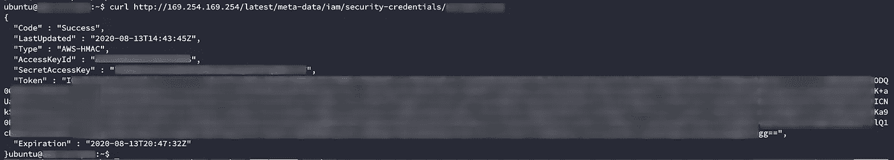

访问实例角色凭据

该请求可以由实例中的任何用户执行。如果实例角色具有与其相关联的高特权，任何有权访问该实例的用户都可以劫持它。在下一个故事中，我将通过一个真实的例子来展示这一点。

这也为利用开放重定向/ SSRF 漏洞开辟了新的途径。如果在实例中找到一个角色，可以请求它的元数据并劫持该角色。

使用[元数据服务 V2](https://docs.aws.amazon.com/AWSEC2/latest/UserGuide/configuring-instance-metadata-service.html)可以防止大多数涉及元数据的利用，但我们很少看到这一功能的实现(如果你想知道这是如何工作的，我推荐这篇文章:[https://blog . artis 3 nal . com/2019-11-23-AWS-instance-Metadata-v2-announcement/](https://blog.artis3nal.com/2019-11-23-aws-instance-metadata-v2-announcement/))

假设您可以获得一个 AccessKey、一个 SecretAccessKey 和一个 ExpirationToken，您会想要枚举您的可用权限并找到一种方法来保持访问，因为此凭据有一个到期日期(如您在图片中所见)，并且有可能不会续订。默认情况下这个时间是一个小时，所以你最好快点！我发现最好的工具是 enumerate-iam . py(【https://github.com/andresriancho/enumerate-iam】T4)。您可以像这样使用它(会话令牌是可选的)

```
enumerate-iam.py --access-key "ACCESSKEY" --secret-key "SECRETKEY" (--session-token "$AWS_SESSION_TOKEN")
```

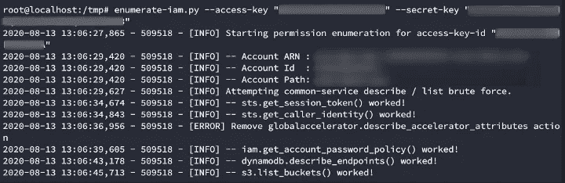

enumerate-iam.py

# IAM 枚举工具

现在我们已经了解了 IAM 的大部分是如何工作的，我们可以开始学习如何枚举它。我们必须采取不同的方式:

## GUI 枚举

如果你喜欢使用图形用户界面，你可以使用 cs-suite([https://github.com/SecurityFTW/cs-suite](https://github.com/SecurityFTW/cs-suite))。这将其他几个工具组合起来执行全面的审计。你也可以使用 ScoutSuite，它是 cs-suite 使用的工具之一 scout2 的继任者([https://github.com/nccgroup/ScoutSuite](https://github.com/nccgroup/ScoutSuite))。

我通常像这样通过 docker 运行它:

```
cd /tmp
mkdir .awscat > .aws/config <<EOF
[default]
output = json
region = us-east-1
EOFcat > .aws/credentials <<EOF
[default]
aws_access_key_id = XXXXXXXXXXXXXXX
aws_secret_access_key = XXXXXXXXXXXXXXXXXXXXXXXXX
EOFdocker run -v `pwd`/.aws:/root/.aws -v `pwd`/reports:/app/reports securityftw/cs-suite -env aws
```

运行完成后，您将在/tmp/reports 中获得一个图形报告。


生成的报告显示了它使用的工具。

这将向您显示许多有用的信息，包括公共攻击面、一般不安全的权限和薄弱的配置。它还将为您提供所有云资源的摘要。


这种方法适合希望强化其基础设施的蓝队。我个人觉得红队有点吵。这类似于使用漏洞扫描器。当然，Nessus 可能会发现许多 Nmap 无法发现的东西，但它也会提醒方圆一百英里内的每个 SOC 注意你的存在。在进行红队评估时，我通常更喜欢通过 CLI 进行手动枚举。

## CLI 枚举

这种方法减少了日志中的活动，但是您必须自己关联信息。您可以从 cs-suite 中获得的大多数东西都可以从 awscli 中手动获得。在故事的开始，我花时间解释了角色和策略的区别，因为您将需要不同的命令来查询它们。

我通常做的枚举过程是

1.  定义我们将要使用的个人资料。

要防止在每个命令中键入您的凭据，您可以:

```
aws configure --profile test 
```

粘贴凭证后，您将能够使用配置文件标志运行以下所有命令。这也使得同时处理多个概要文件更加容易。

**2。让我们的用户可以使用托管策略。**

要获得每个策略的详细信息，您需要策略版本和策略 arn。您可以通过以下方式获取适用于您的个人资料的策略的 arn:

```
aws --profile "$profile" iam list-policies | jq -r ".Policies[].Arn"
```

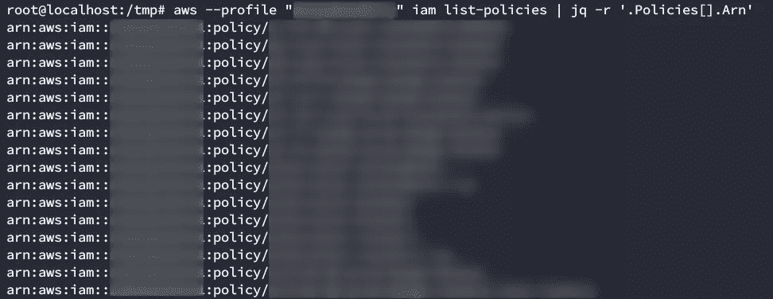

获取警方的亚马逊资源名称。

您可以通过以下方式获得特定的策略版本

```
aws --profile "$profile" iam get-policy --policy-arn "$i" --query "Policy.DefaultVersionId" --output text
```

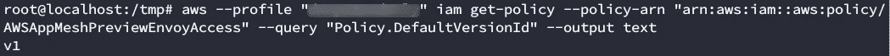

获取策略的版本

您可以将这两个命令组合在一起，以获得所有相关的配置:

```
profile="test"; for i in $(aws --profile "$profile" iam list-policies | jq -r '.Policies[].Arn'); do echo "Describing policy $i" && aws --profile "$profile" iam get-policy-version --policy-arn "$i" --version-id $(aws --profile "$profile" iam get-policy --policy-arn "$i" --query 'Policy.DefaultVersionId' --output text); done | tee /tmp/policies.log
```

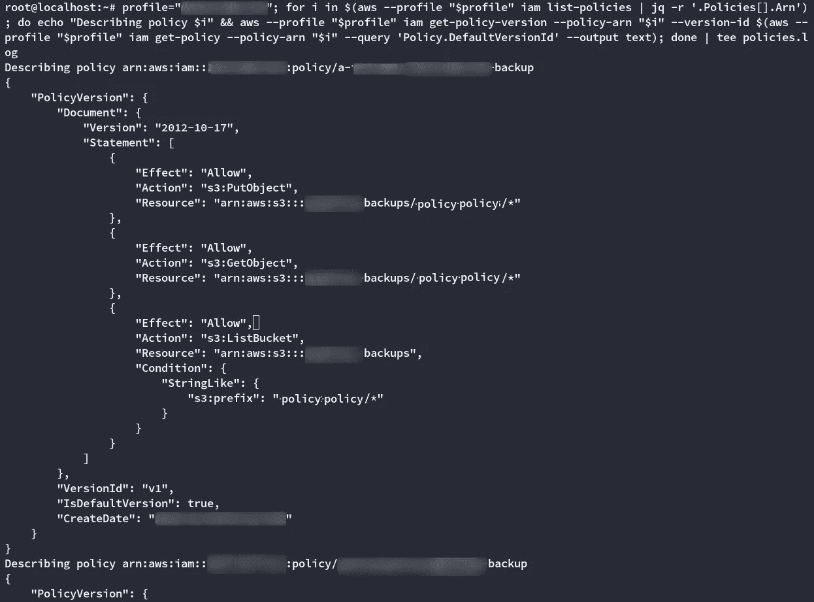

枚举所有策略

如您所见，每个策略由一个效果(允许/拒绝)+动作(您希望执行什么操作)+资源(受操作影响的资源的 ARN)组成。您也可以选择关联一个条件。

你应该寻找这样的东西:

```
Describing policy arn:aws:iam::aws:policy/AdministratorAccess
{
    "PolicyVersion": {
        "Document": {
            "Version": "2012-10-17",
            "Statement": [
                {
                    "Effect": "Allow",
                    "Action": "*",
                    "Resource": "*"
                }
            ]
        },
        "VersionId": "v1",
        "IsDefaultVersion": true,
        "CreateDate": "2015-02-06T18:39:46Z"
    }
}
```

这个策略允许您对任何资源做任何事情。完全访问。

**3。查看哪些实体附加了有趣的策略。**

这应该让您知道应该瞄准哪些用户/组/角色。您可以使用以下命令枚举**托管策略**的分配

```
#List Managed User policies
aws --profile "test" iam list-attached-user-policies --user-name "test-user"#List Managed Group policies
aws --profile "test" iam list-attached-group-policies --group-name "test-group"#List Managed Role policies
aws --profile "test" iam list-attached-role-policies --role-name "test-role"
```

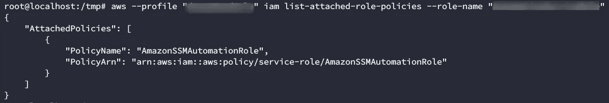

托管角色策略的枚举。

您还可以使用命令来枚举**内联策略**。你可以用

```
#List Inline User policies
aws --profile "test" iam list-user-policies --user-name "test-user"#List Inline Group policies
aws --profile "test" iam list-group-policies --group-name "test-group"#List Inline Role policies
aws --profile "test" iam list-role-policies --role-name "test-role"
```

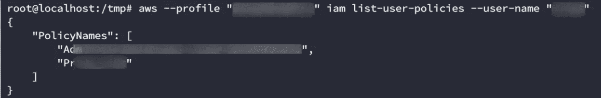

内联用户策略的枚举。

最后，要获得内联策略的详细信息，您可以:

```
#Describe Inline User policies 
aws --profile "test" iam get-user-policy --user-name "test-user" --policy-name "test-policy"#Describe Inline Group policies
aws --profile "test" iam get-group-policy --group-name "test-group" --policy-name "test-policy"#Describe Inline Role policies
aws --profile "test" iam get-role-policy --role-name "test-role" --policy-name "test-policy"
```

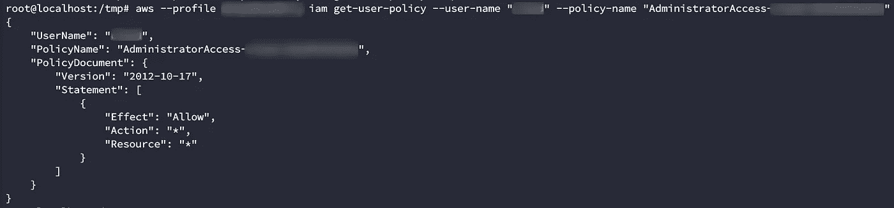

授予对所有资源的完全访问权限的内联用户策略的情况。你应该瞄准这个用户。

## 信任关系

还有一件事你需要知道。当角色被创建时，它们有一个特性叫做**信任关系**。在名为**承担角色策略**的 JSON 文档中，信任关系指定谁可以承担该角色。

一个承担角色策略看起来像这样。

```
"AssumeRolePolicyDocument": {
            "Version": "2012-10-17",
            "Statement": [
                {
                    "Effect": "Allow",
                    "Principal": {
                        "Service": "ec2.amazonaws.com"
                    },
                    "Action": "sts:AssumeRole"
                }
            ]
        }
```

您可以使用以下命令手动查询与特定角色关联的承担角色策略:

```
aws --profile "test" iam get-role --role-name "test-role"
```

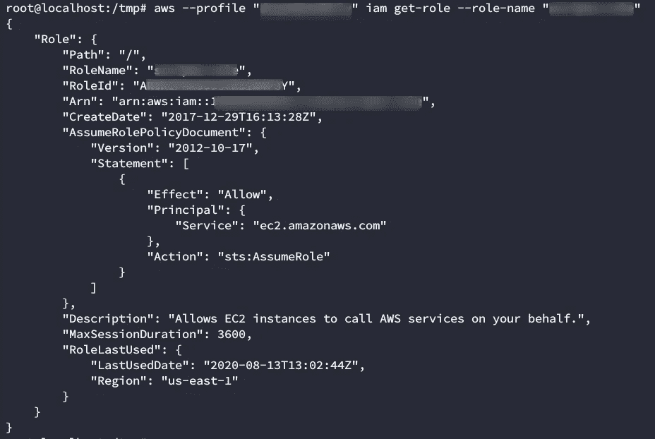

查询承担角色策略。你可以在“AssumeRolePolicyDocument”下看到它

该示例假定角色策略允许任何 ec2 资源承担该角色。我应该做一个澄清。这并不意味着您可以承担任何 ec2 实例的角色。您仍然需要一个管理员来

1.创建一个实例概要文件
2。将角色与实例概要文件
3 相关联。将实例配置文件与要使用的特定实例相关联

假设已经创建了角色，并且已经附加了感兴趣的策略，那么执行这 3 个步骤需要运行的命令是:

```
aws iam create-instance-profile --instance-profile-name YourNewRole-Instance-Profileaws iam add-role-to-instance-profile --role-name YourNewRole--instance-profile-name YourNewRole-Instance-Profileaws ec2 associate-iam-instance-profile --instance-id YourInstanceId --iam-instance-profile Name=YourNewRole-Instance-Profile
```

(更多信息请访问[https://AWS . Amazon . com/blogs/security/new-attach-an-AWS-iam-role-to-an-existing-Amazon-ec2-instance-by-using-the-AWS-CLI/？sc _ channel = sm&sc _ campaign = rolesforrunninginstances&sc _ publisher = tw&sc _ medium = social&sc _ content = read-post&sc _ country = global&sc _ geo = global&sc _ category = ec2&sc _ outcome = launch](https://aws.amazon.com/blogs/security/new-attach-an-aws-iam-role-to-an-existing-amazon-ec2-instance-by-using-the-aws-cli/)

有一件事我无法从 aws cli 中完成，那就是列出承担特定角色的每个资源。如果您有权访问某个实例，您可以看到它在中承担的角色

```
aws --profile test sts get-caller-identity
```

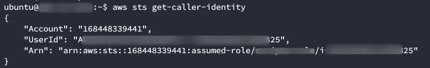

查询假定角色

您还可以看到实例元数据卷曲的角色:

```
curl [http://169.254.169.254/latest/meta-data/iam/security-credentials/](http://169.254.169.254/latest/meta-data/iam/security-credentials/)
```

# 结论

这是一篇冗长的文章。如果它变得有点乏味，我很抱歉，但是我无法找到大多数 IAM 特性的简明解释，或者手动枚举的命令参考。

如果您想要 AWS pentesting 的额外资料，我想推荐 3 个资源。这三篇文章都是由 Rinho Labs 的人写的，Rinho Labs 是 AWS pentesting 研究的先驱。

首先，这篇文章涵盖了 21 种权限提升方法，写得非常棒:[https://rhinosecuritylabs . com/AWS/AWS-privilege-escalation-methods-mitigation/](https://rhinosecuritylabs.com/aws/aws-privilege-escalation-methods-mitigation/)

第二个资源实际上是一个名为 Pacu 的 AWS 开发框架，我可能会写另一个关于它的故事。这是我发现的最好的工具之一。[https://github.com/RhinoSecurityLabs/pacu](https://github.com/RhinoSecurityLabs/pacu)

最后，有一本关于 AWS Pentesting 的很棒的书，叫做《Kali Linux 下的 AWS 渗透测试实践》(https://www.amazon.com/-/es/Karl-Gilbert/dp/1789136725)，作者是 Karl Gilbert 和 Benjamin cau dill(Pacu 的开发者之一)。我经常用这本书来温习评估中可能出现的某些话题。