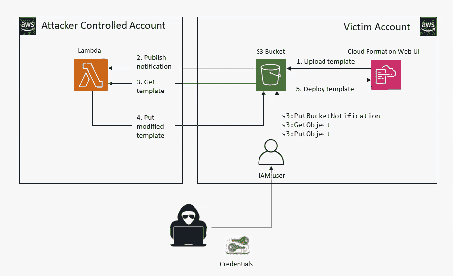
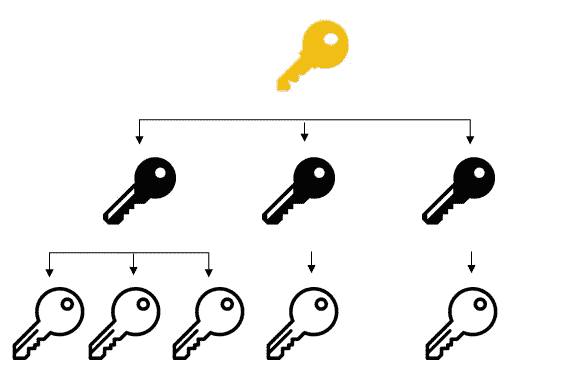
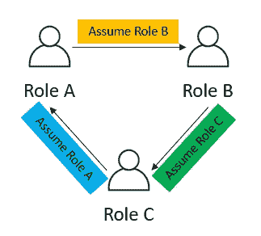

# AWS IAM 开发技术

> 原文：<https://infosecwriteups.com/aws-iam-exploitation-techniques-565830bf704b?source=collection_archive---------0----------------------->

Amazon Web Services(AWS)提供多种类型的安全服务，身份和访问管理(IAM)是应用最广泛的一种。

IAM 是您的 AWS 帐户的一项功能，免费提供，用于设置用户、组、策略和角色。当您注册成为根用户时，您将获得对所有 IAW 服务的所有资源的完全访问权。在 IAM 的帮助下，在 root 用户或帐户下，您可以设置多个用户帐户，每个帐户都有自己的凭据。IAM 用于管理这些 AWS 用户身份的验证和授权。不幸的是，IAM 的错误配置很有可能导致安全漏洞。根据【2021 年云安全状况报告，IAM 是最常被引用的云错误配置。当您面临一些问题时，您可能会感到痛苦，比如令人困惑的代理问题，幸运的是 AWS 已经给出了解决方案，但是随着您的用例的扩展和变得复杂，与 IAM 相关的安全问题将成为 AWS 管理员和安全审计员的挑战。

这篇文章将给出三种与 IAM 相关的利用技术，希望它们能引起你对可能潜伏在你的云环境中的类似风险的注意。

# 通过将角色传递给服务来提升权限

IAM 最基本的组成部分是策略。策略是一个对象，当它与用户、用户组或角色相关联时，定义它们的权限。谈到 IAM 中的安全最佳实践，您一定听说过最小特权原则，并且您知道不应该使用过于宽松的策略。

例如，如果您对下面的策略示例中的`passRole`和`Resource: "*"`有扎实的了解，您可能会保持警惕，永远不要将这样的 IAM 策略附加到 IAM 用户。

```
{
    "Version": "2012-10-17",
    "Statement": [
        {
            "Effect": "Allow",
            "Action": "iam:PassRole",
            "Resource": "*"
        }
    ]
}
```

但是随着事情变得复杂，有一个 AWS 帐户包含一个拥有`iam:AttachUserPolicy`权限的角色和一个拥有`iam:PassRole`、`lambda:CreateFunction`和`lambda:InvokeFunction`权限的用户组:

```
{
     "Version": "2012-10-17",
     "Statement": [
     {
         "Sid": "VisualEditor0",
         "Effect": "Allow",
         "Action": [
               "lambda:CreateFunction",
              "iam:PassRole"
         ],
          "Resource": [
             "arn:aws:iam::*:role/*",
             "arn:aws:lambda:*:*:function:*"
         ]
     },
     {
         "Sid": "VisualEditor1",
         "Effect": "Allow",
         "Action": "lambda:CreateEventSourceMapping",
         "Resource": "*"
     }
  ]
}
```

对于您来说，识别上述组中的用户获得 AWS 环境的完全管理权限的风险容易吗？

在各种 AWS 服务中，有更多的方法可以用来执行权限提升攻击:

01—iam:CreatePolicyVersion
02—iam:setdefaultpolicyversion 2
03—iam:pass role 和 ec2:run instances
04—iam:CreateAccessKey
05—iam:CreateLoginProfile
06—iam:UpdateLoginProfile
07—iam:AttachUserPolicy
08—iam:attachgroupolicy
09—iam:attachrole policy
10

你可以在[https://rhinosecuritylabs . com/AWS/AWS-privilege-escalation-methods-remediation/](https://rhinosecuritylabs.com/aws/aws-privilege-escalation-methods-mitigation/)上找到更多相关信息。

# 在云形成中使用偷偷摸摸的资源注入的后门植入

AWS CloudFormation 帮助您设置和管理 AWS 资源的集合，称为堆栈。您可以使用模板构建和配置堆栈。模板在部署之前被上传到 S3 存储桶中。这种设计的一个问题是，当 terraform 执行 S3 URL 中托管的模板时，它可能不是预先上传的模板，因为在模板上传和后续部署步骤之间存在一些延迟。缺乏对模板文件完整性的保证，使得攻击者有机会通过在部署之前修改原始的 CloudFormation 模板来植入后门，从而承担跨帐户 IAM 角色。

要实施这种攻击，假设存在易受攻击的 AWS 环境:

1.  CloudFormation 部署步骤使用 S3 模板 URL
2.  模板上传和部署之间存在延迟
3.  攻击者可以访问目标帐户中的 IAM 用户，该用户对 S3 存储桶拥有以下权限:s3:PutBucketNotification、s3:PutObject 和 s3:GetObject

整个攻击过程如下图所示:



每当模板被上传到桶时，Lambda 将被调用，因为攻击者具有 s3:PutBucketNotification 权限来配置 s3 桶，以向攻击者控制的 Lambda 发布通知。一旦 Lambda 收到通知，它将从 S3 桶中检索模板，通过添加 IAM 策略来修改它，以授予攻击者目标帐户中的`*:*`权限。

部署工件修改并不是一项新技术，也不是专门针对 CloudFormation 的。这个向量仍然很可怕，因为它允许权限直接提升到受害者帐户中的管理员角色。

原帖在这里:[https://rhinosecuritylabs . com/AWS/cloud-malware-cloud formation-injection/](https://rhinosecuritylabs.com/aws/cloud-malware-cloudformation-injection/)

# 临时代币的阴暗面

AWS STS 是一项 AWS 服务，它允许您请求临时安全凭据，以便使用有时间限制和受限的权限进行操作。

相对于访问密钥和长期凭据，建议使用临时安全令牌。当用户或应用程序执行某些操作时，以及 AWS 本身在后台执行的自动操作中，都会用到它们。

但是 STS 也有自己的阴暗面。一旦特权访问密钥泄露，攻击者倾向于利用 STS 生成临时令牌来隐藏他们的踪迹，而不是直接使用访问密钥。在检测到泄漏之后，即使泄漏的访问密钥已经被撤销，这些临时令牌在外部仍然有效。当泄漏或创建临时令牌时，它可以转换为“永久”令牌。这种转换可以通过使用 AssumeRole 来生成具有一个临时令牌的临时令牌束，然后使用新创建的临时令牌来创建更多令牌，最终演变成“树分支”结构来实现。



如果两个或更多角色之间存在循环信任，并且假设角色调用可以被链接任意次，则可以利用另一种技术“角色链杂耍”来帮助攻击者无限期地获得对 AWS 资源的访问权。



# 摘要

说到安全攻击，你不应该低估攻击者的创造力。众所周知，IAM 非常复杂。为了应对常见的 IAM 威胁并降低风险，我们应该了解恶意行为者使用的各种利用、工具和资源。