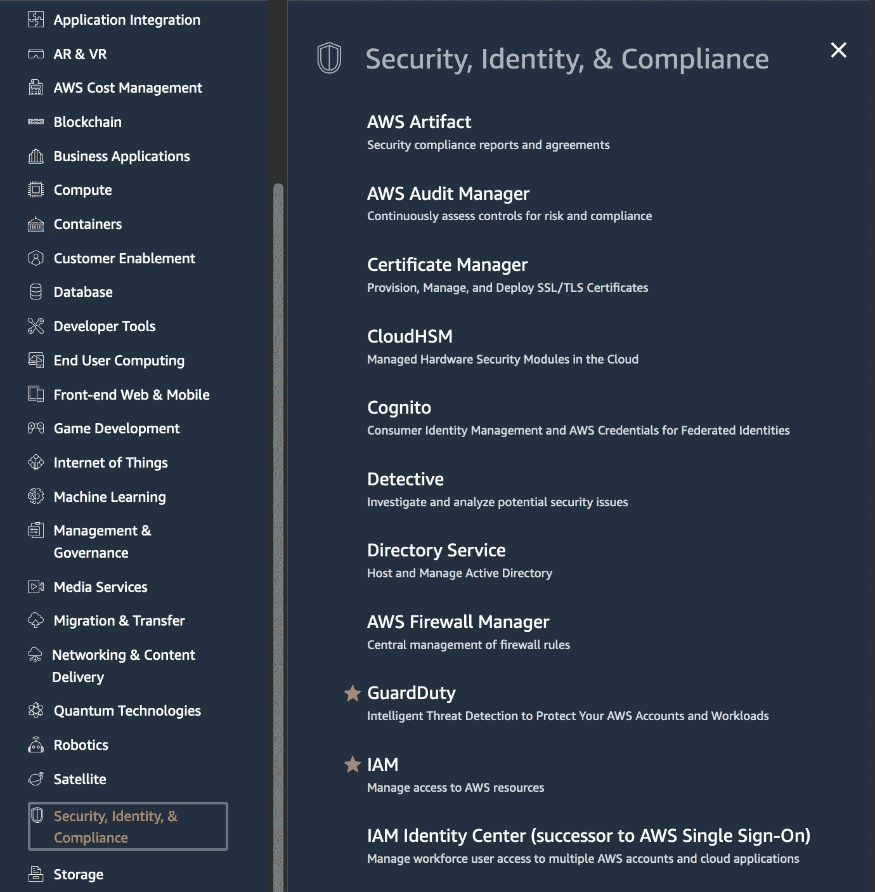
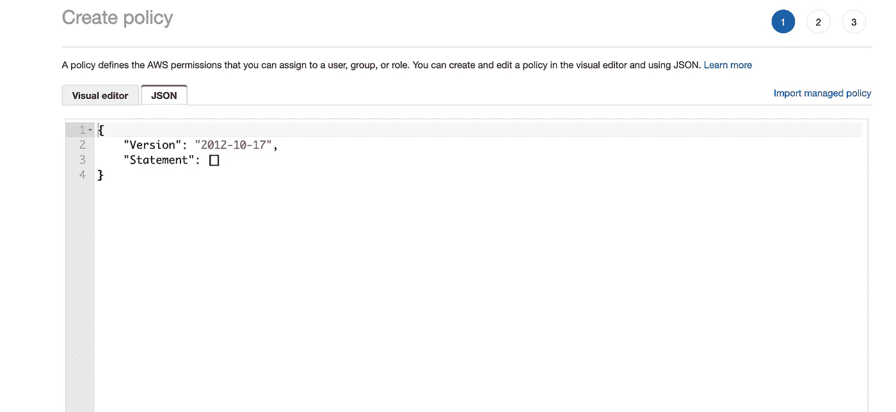
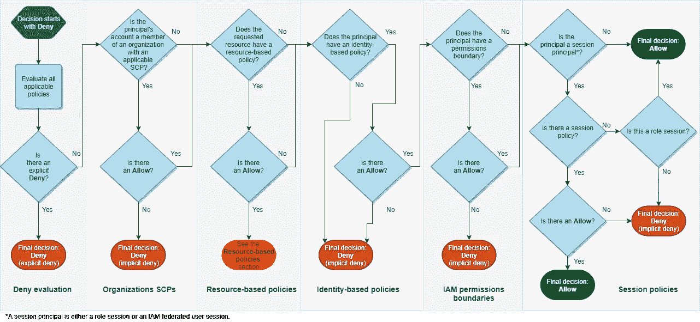

# AWS 安全性从 IAM 开始

> 原文：<https://infosecwriteups.com/aws-security-services-start-with-iam-446e1827964a?source=collection_archive---------3----------------------->

## 在做其他任何事情之前，先用 IAM 为您打下基础

费伦茨·阿尔马西在 [Unsplash](https://unsplash.com?utm_source=medium&utm_medium=referral) 上的照片

**如果您正在启动云安全，那么选择 AWS 作为您的起点是您可以做出的最佳决策之一**

它是云提供商的老大，有大量的安全服务可供选择和学习。

仅仅看下面的列表就令人印象深刻，当你读完这篇文章时，新的列表可能会出现！

AWS 安全服务

然而，这个庞大的列表也可能成为需要帮助的新人弄清楚从哪里开始的绊脚石。

我甚至看到认证和经验丰富的 AWS 专业人员从一个安全服务跳到另一个，因为他们看起来都非常令人惊讶，导致需要更多的关注。

作为一名 AWS 安全顾问，我总是给出同样的建议。

> 从 IAM 开始。

# 什么是 AWS IAM？

让我们看一下官方的 AWS 文档

> IAM 为 AWS 服务提供身份验证和授权。服务评估 AWS 请求是被允许还是被拒绝。默认情况下拒绝访问，只有当策略明确授予访问权限时才允许访问。您可以将策略附加到角色和资源，以控制跨 AWS 的访问。”

不是最激动人心的服务，对吧？？

大多数云安全专家认为 IAM 只用于创建用户和密码、设置策略、MFA 等。

Zzzzzzz。

然而，请相信我，当我说 IAM 是你将从事的最重要的 AWS 服务时

令人难以置信的是，我知道有多少安全专业人士跳过 AWS IAM，直接进入像 AWS Security Hub 和 AWS GuardDuty 这样听起来更坏的服务。

IAM 无疑是 AWS 上最重要的服务，比任何其他服务都重要。

它触及 AWS 的每个角落，也是大多数安全违规发生的地方。

*想要控制用户可以做什么..是我。*

*想控制 EC2 机器能做什么..是 IAM*

*想用超级用户权限控制开发者的爆炸半径..它是 IAM*

*想要控制第三方对您环境的访问..是我！！*

在本文中，我不想教你 IAM(因为那会花太长时间)。

我想教你如何学习 IAM，以及如何从这项被低估的服务中获得最大收益

# 如何学习 IAM

这些是我推荐的步骤:

一旦您有了 AWS 访问权限并想亲自使用 IAM，请执行以下操作:

*   创建用户并授予其权限。了解 IAM 的工作方式和控制台布局。
*   我建议在尝试创建自己的定制策略之前，先从 AWS 默认策略开始，以保持简单。
*   了解访问键如何工作以及如何旋转它们。创建一个访问键并尝试使用它
*   了解 IAM 角色以及如何承担这些角色。这些是用户或服务可以采用的临时凭据。
*   尝试跨帐户访问另一个帐户
*   现在您已经习惯了，试着创建您的定制策略来更多地锁定权限。

# 如何成为一名 IAM 大师

既然你有了基本的知识..是时候让你的知识更上一层楼了

要想精通 IAM，你需要学习两件事 1)如何理解 JSON 和 2)IAM 的策略流逻辑

## 1.了解 JSON

IAM 策略以 JSON 格式实现。

如果您不能理解 JSON，那么在对策略问题进行故障诊断时，您总是会遇到问题，即使 AWS 在编辑器中提供了所有的帮助。

像 AWS IAM Access Analyzer 这样的工具也提供了很好的建议来进一步完善它们，但是您应该能够理解原始的 JSON 来快速解决问题

AWS IAM 策略创建

## 2.理解策略流逻辑

每个到达 AWS 的请求都基于策略逻辑进行评估

这些策略可以是基于身份的策略、基于资源的策略、权限边界策略、服务控制策略等等

它可以很快变得非常复杂！

给你一个想法，下面是官方流程，它甚至没有涵盖不同政策的所有影响。

来源:[https://docs . AWS . Amazon . com/IAM/latest/user guide/reference _ policies _ evaluation-logic . html](https://docs.aws.amazon.com/IAM/latest/UserGuide/reference_policies_evaluation-logic.html)

我可以写一本关于上述内容的小书，但我可以建议你查看的最佳资源是 AWS reinvention 的以下视频。

> 相信我，下面的视频比大多数付费内容更好地理解了 IAM，它的不同政策，以及它们是如何被评估的！

# 最后的想法

IAM 很可能是 AWS 中最重要的服务，如果你对零信任这样的概念感兴趣，掌握它是必不可少的。我希望这能激励您更深入地研究 IAM 概念

Taimur Ijlal 是一家**屡获殊荣的信息安全领导者**，在金融科技行业的网络安全和 IT 风险管理方面拥有 20 多年的国际经验。Taimur 可以在 [LinkedIn](https://www.linkedin.com/in/taimurijlal/) 或他的 YouTube 频道“[云安全家伙](https://www.youtube.com/c/CloudSecurityGuy)上联系，他定期在上面发布关于云安全、人工智能和一般网络安全职业建议的帖子。

*你可以通过下面的链接注册，每月只需 5 美元就可以获得所有的媒体报道:*

 [## 通过我的推荐链接加入 Medium—tai mur Ijlal

### 阅读 Taimur Ijlal(以及媒体上成千上万的其他作家)的每一个故事。您的会员费直接支持…

taimurcloud123.medium.com](https://taimurcloud123.medium.com/membership) 

## 来自 Infosec 的报道:Infosec 每天都有很多内容，很难跟上。[加入我们的每周简讯](https://weekly.infosecwriteups.com/)以 5 篇文章、4 个线程、3 个视频、2 个 GitHub Repos 和工具以及 1 个工作提醒的形式免费获取所有最新的 Infosec 趋势！