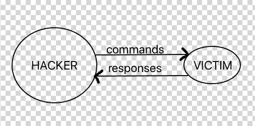
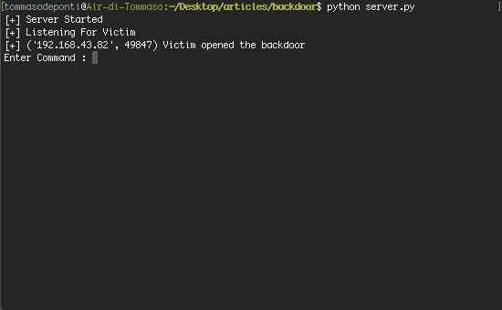

# Python 中的后门攻击

> 原文：<https://infosecwriteups.com/backdoor-attack-in-python-1395c91ea29a?source=collection_archive---------0----------------------->

## 在 Python 脚本中执行后门攻击

迈克尔·盖格在 [Unsplash](https://unsplash.com?utm_source=medium&utm_medium=referral) 上的照片

黑客攻击是找出计算机系统或网络的弱点，利用其漏洞并获取访问权限。黑客是指利用计算机实施欺诈行为，如欺诈、侵犯隐私、窃取公司个人数据等。网络犯罪每年给许多公司带来数百万美元的损失。企业需要保护自己免受此类攻击。

另一方面，Python 是一种高级的强大的编程语言，是的，它也被用于黑客攻击，因为它在所有操作系统上都受支持。

此外，用 Python 编写代码相对简单快捷，最重要的是，由于它的社区，Python 有许多与网络安全相关的库。

在众多黑客技术和工具中，我选择谈论后门:一种恶意软件，其主要目的是通过一个端口向另一个系统发送和接收数据，主要是命令。基本上，黑客会在受害者的电脑上安装一个恶意程序，该程序会(在受害者的电脑上)执行黑客给出的所有命令。

黑客可以通过几种方式在你的电脑上安装这种恶意软件，主要是通过将它合并到一个令人愉快的有用的应用程序中，这就是木马。

今天我们将看到如何创建一个简单而有效的后门，让你明白一台计算机是如何被任何懂得编码的人轻易破解的。
最后，我将建议如何避免后门攻击。

# 套接字连接入门

为了构建本地工作的后门，我们将使用套接字模块。套接字和套接字 API 用于通过网络发送消息。
正如我们所知，发送信息的是谁，这里指的是黑客，接收信息并回复的是谁，这里指的是受害者。
在受害者运行我们创建的恶意软件后，它将在黑客和受害者的机器之间建立这种类型的连接:

在这里，黑客发送命令，受害者执行它们并将输出返回给黑客。

直觉上，我们必须创建发送命令和接收输出的工具，以及执行给定命令并返回输出的恶意软件。

# 创造黑客的工具

这个工具将允许我们向受害者发送命令并接收输出

为了构建这个工具，我们将通过创建一个发送和接收数据的套接字服务器来使用套接字 API:

sever.py

**第 1 行:**插座模块导入。

**第 4–5 行:**定义了我的 IP 地址(你必须输入你的)和端口，我们使用端口 4444，因为你可能不使用它。

**第 7 行:**创建了服务器。

**第 8–10 行**:启动服务器。

**第 11 行**:等待受害者打开我们稍后会创建的恶意软件。

**第 12–13 行**:当受害者(打开后门后)要求服务器连接，我们接受。

通过运行这段代码，受害者将连接到我们的服务器(黑客的工具)。现在，我们希望服务器向受害者发送命令，并接收受害者的输出。

server.py

**第 1 行:**我们使用`while`是因为我们想要重复发送命令和接收输出的动作，直到程序关闭。

**第 2–5 行:**等待黑客输入在受害者电脑上运行的命令，然后我们编写代码并发送出去

**第 6–8 行:**我们接收受害者的输出并解码。

黑客的工具准备好了，但是显然，没有后门是不行的。

# 创建后门

后门会把我们的电脑和受害者的连接起来。之后，它将从黑客的工具中接收命令，执行它们，并将输出结果发送回我们。

后门. py

**第 1–2 行**:导入的套接字和子进程模块。我们将使用子进程在受害者的计算机上运行命令。

**第 5–6 行**:定义我们服务器的 IP 和端口。它们必须和我们用于服务器的一模一样。

第 8–9 行:创建后门并连接到服务器。

这个代码会把受害者的电脑和黑客的电脑联系起来。现在我们需要后门来接收命令并将输出发送给黑客:

后门. py

**Line 1** :和服务器中一样，我们使用`while`重复接收命令和发送输出的动作，直到黑客关闭他的工具。

**第 2–4 行**:后门程序正在等待黑客发送命令，所以当它收到命令时，就会对它们进行解码。

**第 5–7 行:**运行命令并读取输出和错误。

**第 8 行**:发送输出和错误(如果有的话)给黑客。

# 测试

搞定了。现在我们需要测试我们已经创建的内容:

打开您的终端(UNIX)或命令提示符(Windows)并运行黑客工具(服务器),其中包含:python server.py

在受害者的电脑上运行后门程序

在黑客的计算机终端上，您应该看到以下内容:

现在，通过在 Enter Command 输入字段中输入 bash 命令，您将看到终端上显示的输出，从中我们可以得出结论，我们已经入侵了受害者的计算机。

# 结论

在本教程中，我们看到了 38 行 python 代码有多么强大。后门攻击之所以强大，是因为它并不总能被检测到；杀毒软件不能阻止你安装一个看起来很无辜的应用。为了将我们创建的后门嵌入到一个看起来很无辜的应用程序中，我建议你使用 Kivy Python 框架，我将很快写下这一点。下一篇文章再见！