# 后门:黑客盒子演练

> 原文：<https://infosecwriteups.com/backdoor-hackthebox-walkthrough-6e4e8b483db1?source=collection_archive---------0----------------------->

欢迎回来！今天我们要解决 HacktheBox 的另一台机器。该盒子被列为简易盒子。只需在/etc/hosts 文件中添加 backdoor.htb，我们就可以开始了！

> 获得的知识

1.  表演 LFI
2.  使用打嗝来查找 PID
3.  了解 gdbserver
4.  使用和不使用 Metasploit 获取反向 shell
5.  权限提升

> 端口扫描

在我的端口扫描过程中，我首先使用 [**rustscan**](https://tryhackme.com/room/rustscan) 快速找出开放端口的数量…

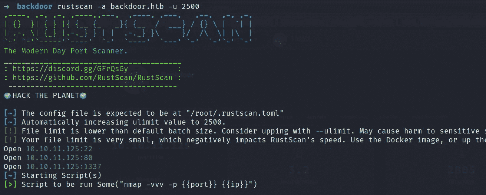

…然后在那些开放的端口上开始详细的 **Nmap** 扫描。这样会节省很多时间。

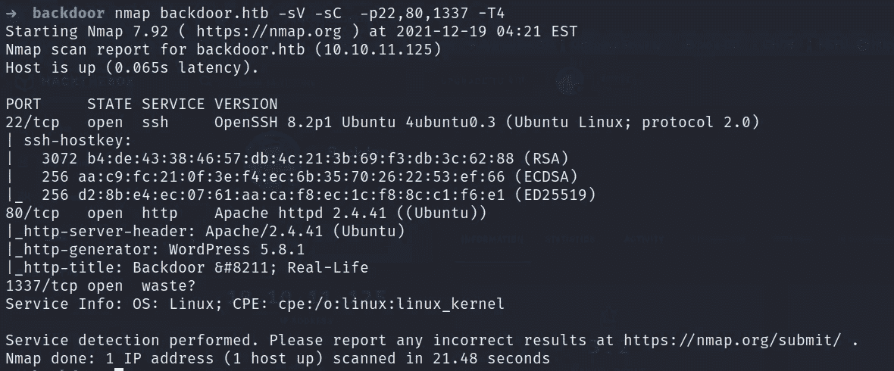

> 网络侦察

所以我们先列举一下 80 端口。我决定启动一个 **gobuster** 扫描，它告诉我这个网站是基于 WordPress CMS 的。

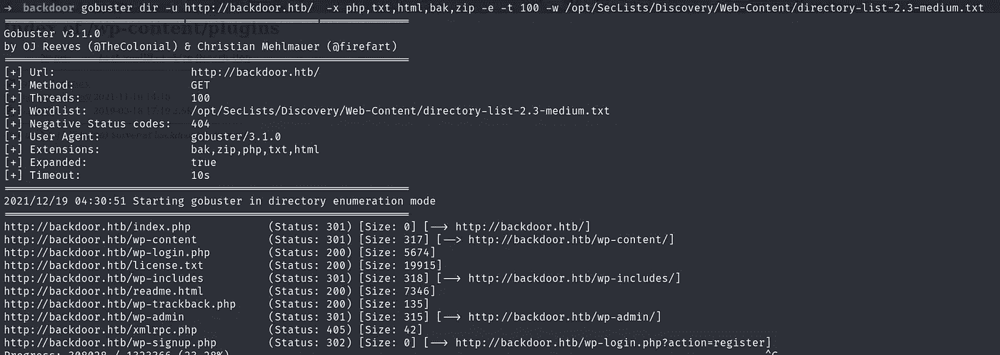

我们也可以使用 **whatweb** 命令来确认 WordPress 正在被使用。

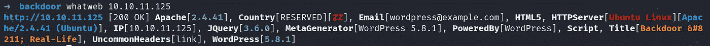

现在是时候搜索 WordPress 5.8.1 可用的漏洞了，为此我们可以使用一些方法，比如在 Linux 终端中使用 **searchsploit** 或者 Google CMS 名称。 **searchsploit** 发现了基于 3 个不同插件的 3 个漏洞，这些插件目前还没有被使用。

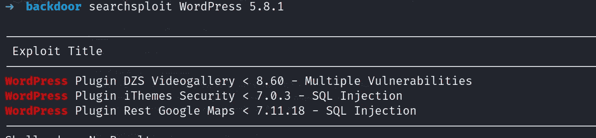

在插件检测模式下开始 **wpscan** 的时间。

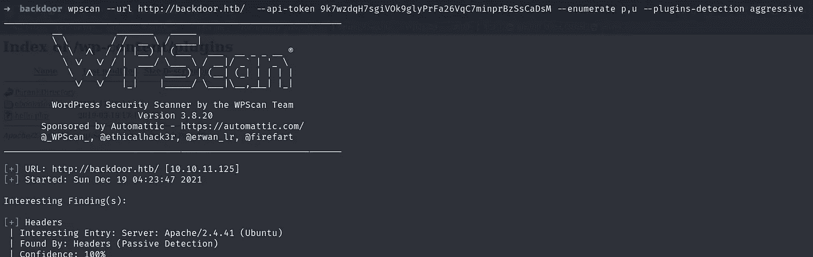

wpscan 发现正在使用的 Akismet 插件存在一个漏洞，路径为[*http://backdoor.htb/wp-content/plugins/akismet/*](http://backdoor.htb/wp-content/plugins/akismet/)

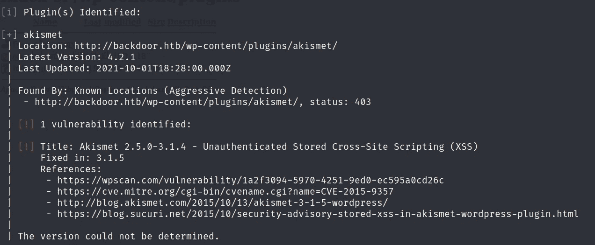

访问路径并向下一个目录，我们在这里有一个**电子书**插件。现在搜索电子书插件 [**漏洞**](https://www.exploit-db.com/exploits/39575) 。

所以，我们这里有 LFI 的弱点。让我们试一试。

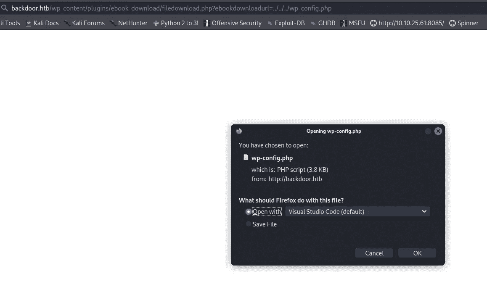

配置文件有一些凭据。我试图登录，但它是不正确的。让我们开始演奏 LFI。

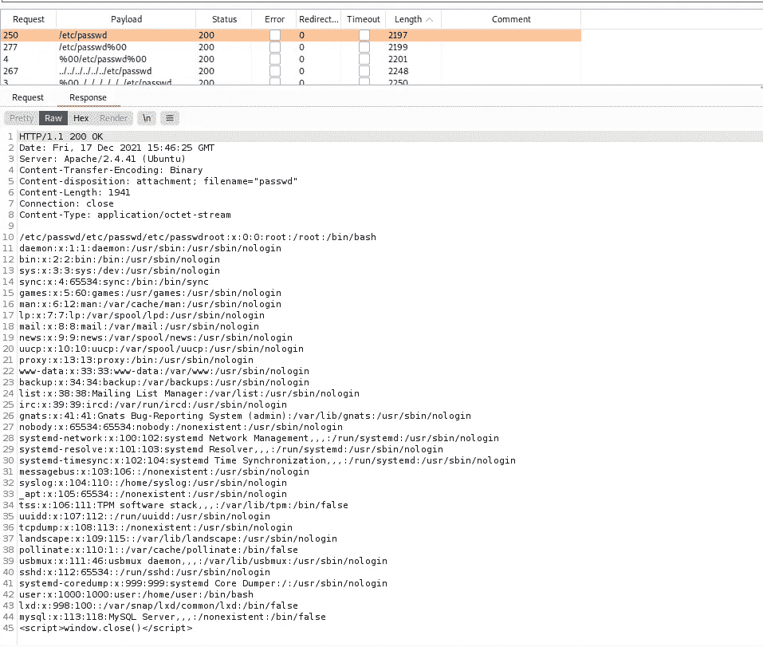

我们可以看到/etc/passwd 文件，但是没有任何有用的东西。于是我试着通过 LFI 搜索 RCE，经过大量搜索，我终于发现了一个 [**博客**](https://zsahi.wordpress.com/2018/09/10/file-inclusion/) 说我们可以暴力破解/proc/目录中的 PID。所以，Linux 中的 **/proc/[PID]/cmdline** 基本上代表了一个当前正在运行的进程。在这里 **了解更多/proc/ directory [**。**](https://tldp.org/LDP/Linux-Filesystem-Hierarchy/html/proc.html)**

**额外工具知识:-** 我尝试了另一个工具来执行 LFI，我想分享它的 [**LFISuite**](https://github.com/D35m0nd142/LFISuite) 。它将为易受攻击的路径提供一个很好的输出。如图所示设置参数…

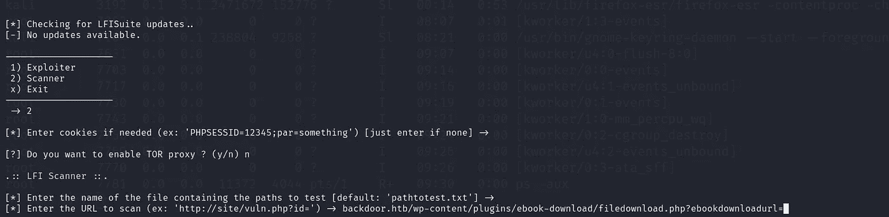

…我们将有一个易受攻击的通用 URL 列表。我们可以用 [**fimap**](https://github.com/kurobeats/fimap) 工具做同样的事情。

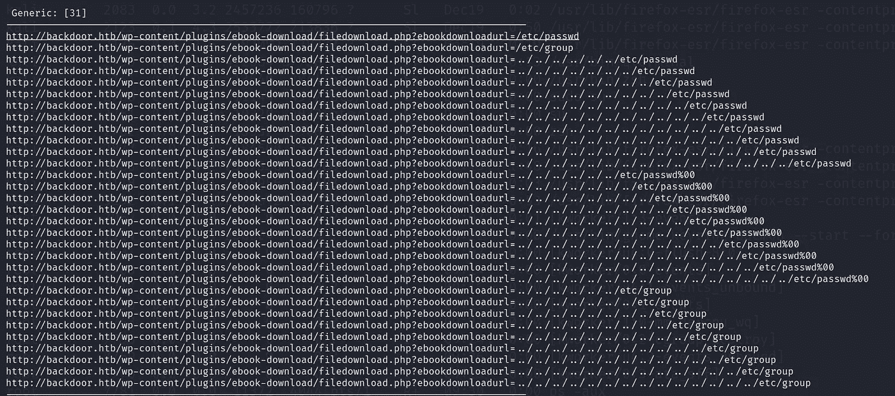

现在，是时候强行使用 PID 了。创建一个以 1 到 1000 为有效载荷的文件，并使用 burp 启动这个暴力过程。一旦完成，检查每一个反应，将得到进一步进行的提示。

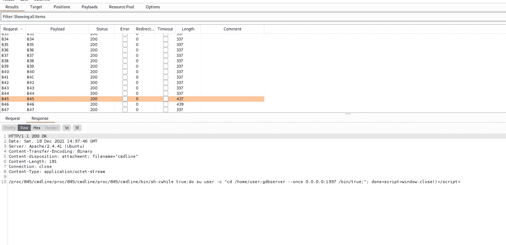

所以我们可以看到 gdbserver 运行在端口 1337。让我试着向你解释我对此的理解，因为这对我来说也是新的。所以基本上 **gdbserver** 是一个允许在不同机器上运行 GDB 的程序。在这种情况下，gdbserver 使用“-**-once”**选项运行，这只是在连接到第一个 GDB 会话后阻止任何进一步的连接尝试。我猜这可能是我们没有得到该端口的任何 Nmap 扫描结果的原因。更多详情 [**此处**](https://man7.org/linux/man-pages/man1/gdbserver.1.html) 。

> 使用 Metasploit 反转 shell

只需搜索 gdbserver 并使用模块。如下所示设置选项。

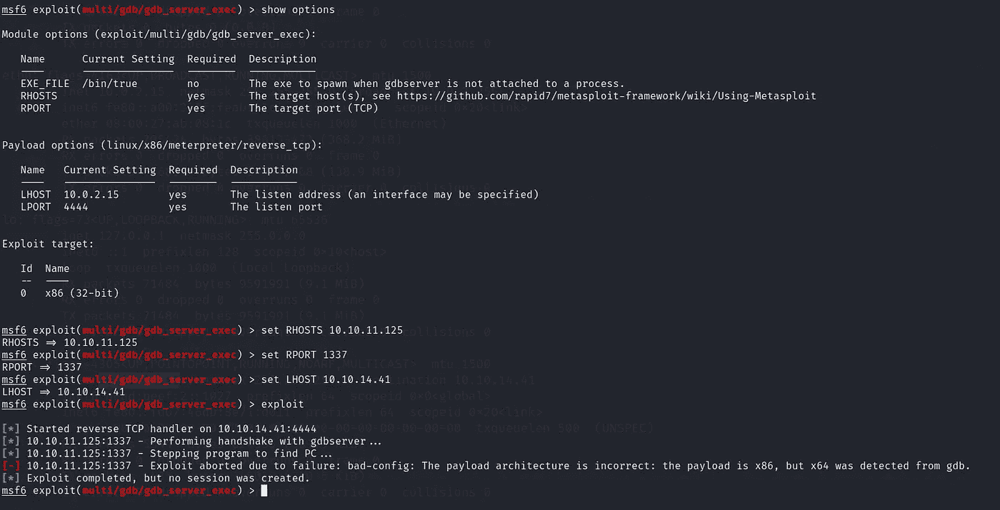

如上所述，您可能会得到同样的错误，说“有效负载是 x86”。再次搜索了很多刚刚学到的新东西，以改变目标类型。

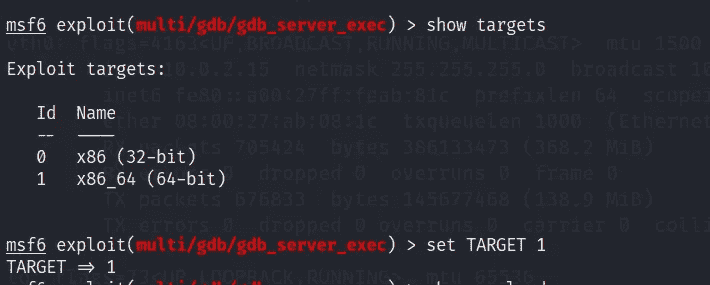

只需选择 64 位并输入“显示有效载荷”。选择有效载荷如下，你很好地 goo…

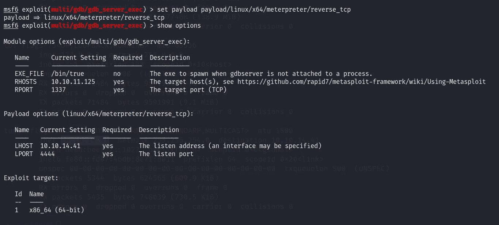

…运行漏洞利用。

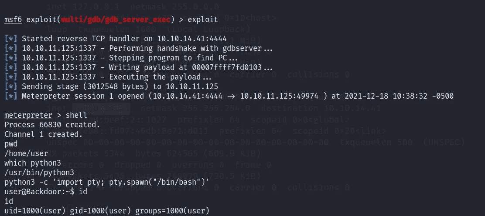

> 使用 msfvenom 和 gdb 反转外壳

只要按照 [hacktricks](https://book.hacktricks.xyz/pentesting/pentesting-remote-gdbserver) 博客中描述的过程，你就能得到外壳。

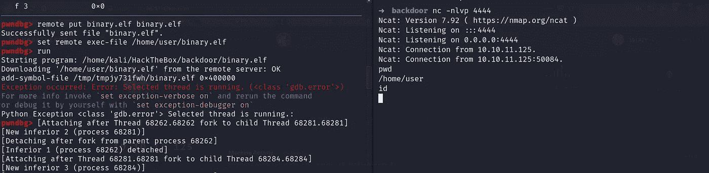

> 权限提升

尝试了所有没有脚本的东西，但有时间使用它。我使用 [**updog**](https://github.com/sc0tfree/updog) 将 [**linPEAS**](https://github.com/carlospolop/PEASS-ng/tree/master/linPEAS) 脚本传输到远程机器。

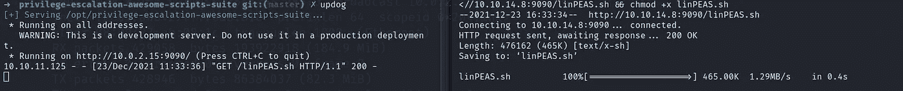

运行脚本后，您会看到类似红色的**屏幕**关键字。这引起了我的注意。

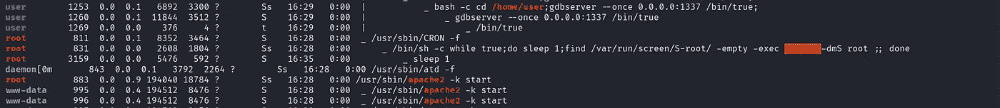

只是为了确认一下，我启动了 pspy32，看看它是否作为一个 cronjob 运行，是的，它是！经过一定次数的睡眠后。

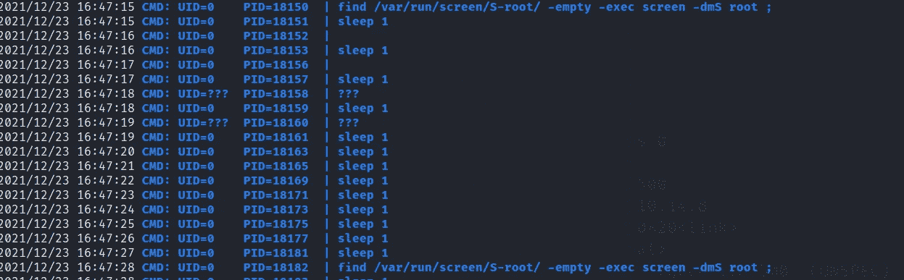

再次通过屏幕搜索权限提升，我们有一个 GNU Screen 4.5.0 的漏洞，我们的是 4.08，所以它没有用。所以，我试着学习了一下 [**屏幕**](https://www.gnu.org/software/screen/manual/screen.html#Session-Management) 命令，这里的'-x '选项非常有用。基本上，使用'-x '选项，我们可以连接到已经连接到其他位置的会话。现在，在这种情况下，一个会话已经以 root 用户身份运行，因此我们可以连接到该会话以获得 root 用户访问权限。

首先，我们必须使用 export TERM=xterm 将终端模拟器设置为 Linux。您可以通过运行 echo $TERM 来检查您的术语设置。现在只需运行屏幕命令，如图所示。

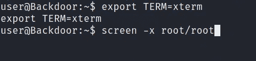

…不要忘记订阅更多演练。

 [## 懒惰先生

### 如果你喜欢你所读的，我的一点捐赠将会帮助我学习 OSCP。印度人可以支付我使用上述…

www.buymeacoffee.com](https://www.buymeacoffee.com/MrLazy) 

# 在你走之前

这是我的另一个黑客机器演练:-

 [## horizontal:HackTheBox 演练

### 描述

infosecwriteups.com](/horizontall-hackthebox-walkthrough-13090d7d59a2)  [## 编剧:黑客盒子演练

### 描述

infosecwriteups.com](/writer-hackthebox-walkthrough-1ff86b33799a)  [## 世界末日:黑客盒子演练

### 描述

infosecwriteups.com](/armageddon-hackthebox-walkthrough-6d8e2261a676)