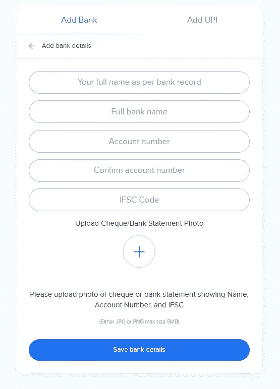
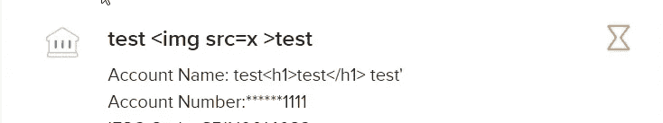
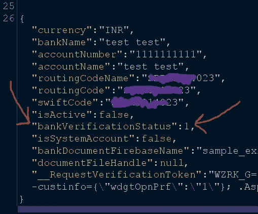
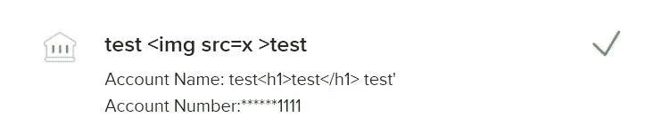

# $$$银行🏦验证旁路(中断对象级授权)

> 原文：<https://infosecwriteups.com/bank-verification-bypass-broken-object-level-authorisation-9136bdd43f0f?source=collection_archive---------0----------------------->

嗨，读者们，👋，希望你做得很好，

这是我的第八篇文章，我将一步一步地展示我如何能够绕过银行验证，并在没有任何支持/审查团队参与的情况下，从攻击者的角度完全验证我的帐户，我是在一个流行的加密货币/区块链相关组织中发现这一点的。

让我们先来看看原因，

因此，基本上，**漏洞是由于敏感请求参数的不当管理或 API 错误配置导致*对象级授权*被破坏而产生的。**

当某些敏感验证的服务器端响应依赖于客户端输入或请求时，就会出现这种情况。

在许多应用程序中，您必须首先验证您的银行、KYC 或其他详细信息，以进一步访问应用程序资源，或者换句话说，您应该通过验证才能使用应用程序货币交易，如下所示。

与此类似，还有其他形式来验证你的身份，如你的国家身份证(如印度的 aadhar 卡)，驾驶执照。

现在，我只是在表格中随意填写了一些细节，这就是“待审核状态”的样子，

现在，如果我们绕过这个从我们这边得到验证。

让我们一步一步来看，

现在，在填写**表单以捕获请求时，请求主体看起来像下面的截图**，您可以进一步利用 repeater 选项卡来分析请求和响应。

这里 API 的端点看起来像是 **api/v1/add/bank，**

现在经过大量的观察和检查，我发现只有请求参数**“bank verification status”**负责决定我行是在审核中还是已审核中。

并且**我发现改变参数值也会反映在服务器响应中，这意味着服务器验证依赖于客户端的输入或请求**，

然后，我进一步观察了参数 bankverificationStatus

如果我更新，

银行验证状态:1 →0 ( **表示团队或支持得到了我们的响应**

银行验证状态:1 →2 ( **银行永久验证**)

经过验证的银行服务器响应看起来像，

这样我绕过了一个重要的敏感验证。

***感谢阅读本文，***

希望你喜欢它😁✌️.

订阅我的 youtube 频道寻找 bug 相关素材: [**redirect _poc**](https://www.youtube.com/channel/UCq7-Qf45etdk0qc35I_n7PQ?sub_confirmation=1)

你可以在 Instagram 上关注我

在 Linkedin 上关注我: [**我的 _ Linkedin**](http://linkedin.com/in/anurag-verma-650b771a2)

给我买杯咖啡😍:[这里](https://www.buymeacoffee.com/redirectpoc)

Infosec Writeups 团队刚刚完成了我们的第一次虚拟网络安全会议和网络活动。我们有 16 位出色的演讲者，他们主持了非常有价值和鼓舞人心的会议。要查看演讲者和主题列表，请点击此处。

 [## IWCon2022 — Infosec 书面报告虚拟会议

### 与世界上最优秀的信息安全专家建立联系。了解网络安全专家如何取得成功。将新技能添加到您的…

iwcon.live](https://iwcon.live/)