# 银行木马分析

> 原文：<https://infosecwriteups.com/banking-trojan-analysis-edb374bdb9d9?source=collection_archive---------2----------------------->

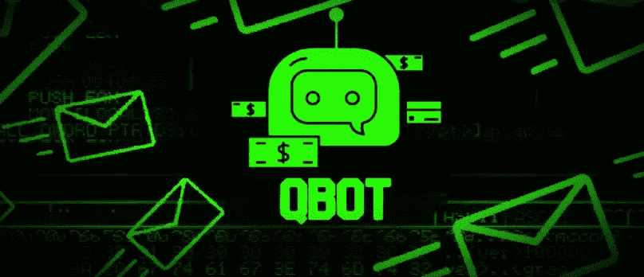

我最近偶然发现了一个有趣的恶意文档，我想为您分析一下。

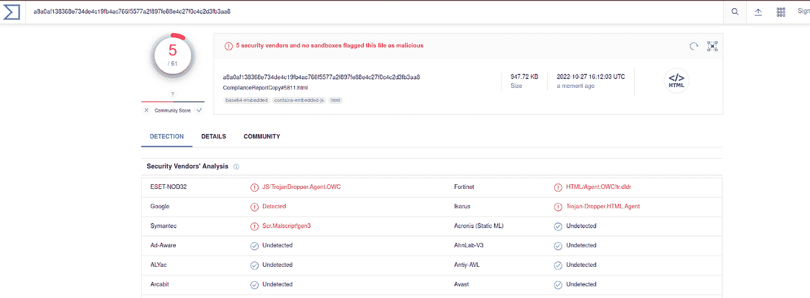

最初的扫描显示，该文件是由一些大的名字，如谷歌，赛门铁克，Fortinet 检测…

但是，让我们看看我们能找到什么，如果我们挖得更深一点！

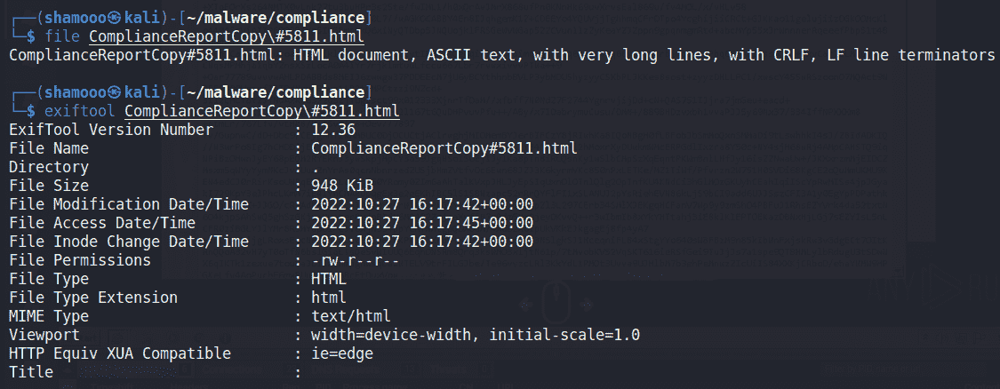

运行 File 命令验证它是一个 HTML 文档。

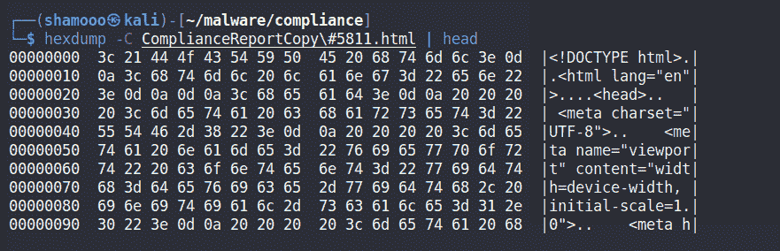

在检查初始 HTML (stage1)文档时，我们可以看到页面立即执行带有 onload 函数的 javascript。

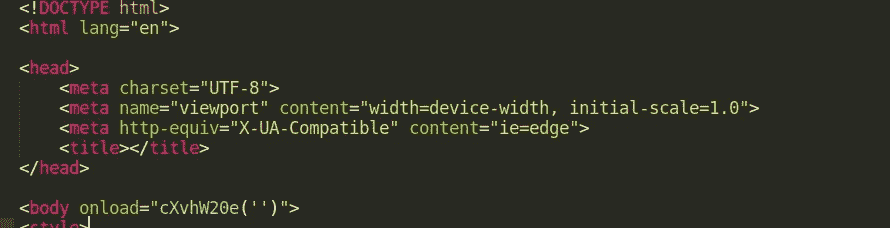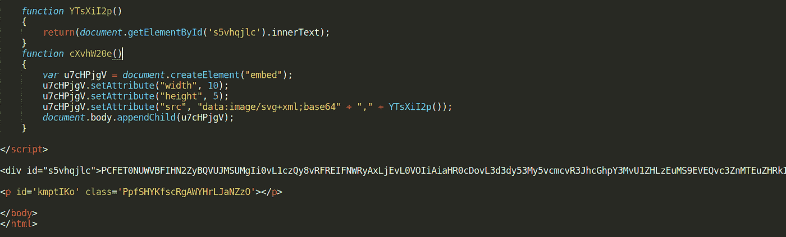

该功能似乎正在加载漏洞利用的第二阶段。这是 base64 编码的数据。我们可以从代码中看出它是 image/svg+xml，但是我们也可以通过获取 base64 编码的有效负载来验证它。

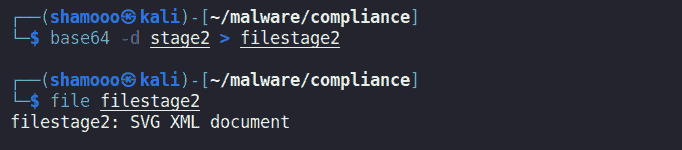

酷毙了。现在我们有了第二阶段的文件，让我们继续分析。

我们可以在文本编辑器中打开 stage2 文件，并对其进行一些语法突出显示，以获得更好的可视性。

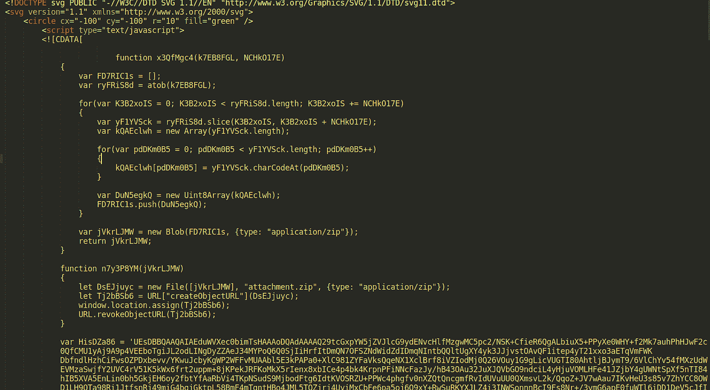

我们可以看到这里有 javascript 代码。让我们创建一个 stage3 文件，并将 javascript 代码移动到一个单独的文档中，以便进一步分析。

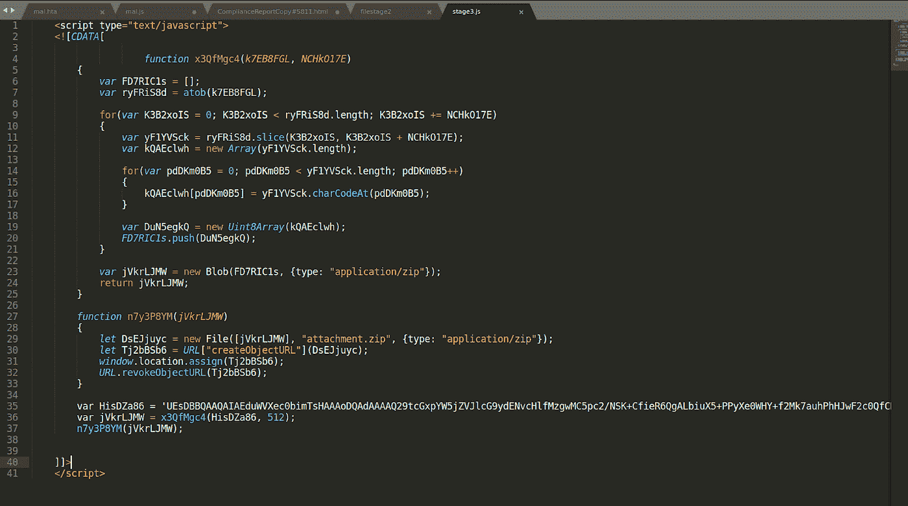

变量名很容易混淆。我们可以尝试从逻辑上理解代码和混淆的变量。并清理它，以更好地了解发生了什么。

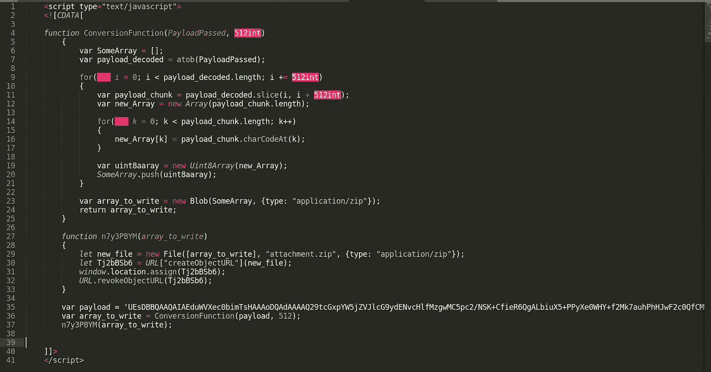

在一些基本的清理之后，我们可以看到在第 36 行有一个函数调用，参数设置为我们的下一个有效载荷和整数 512。该函数似乎循环通过 base64 编码的有效负载，对其进行解码，并将其写入文件。

似乎我们应该期待下一阶段的文件是一个存档！

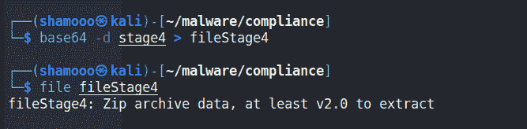

正如我们所怀疑的，我们只剩下一个 Zip 存档数据。让我们看看里面有什么。

我们将该文件重命名为 filestage4.zip，并对其运行 unzip。

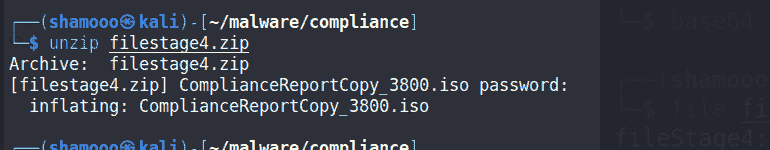

当试图解压文件时，要求输入密码。经过老约翰的修改，我们破解了密码，结果是“abc111”。

但这对我来说没有任何意义，至于为什么我必须破解密码才能提取恶意软件。后来当我在 any.run 上打开恶意软件时，我意识到密码是在最初的 HTML 文件中给出的。LOL。

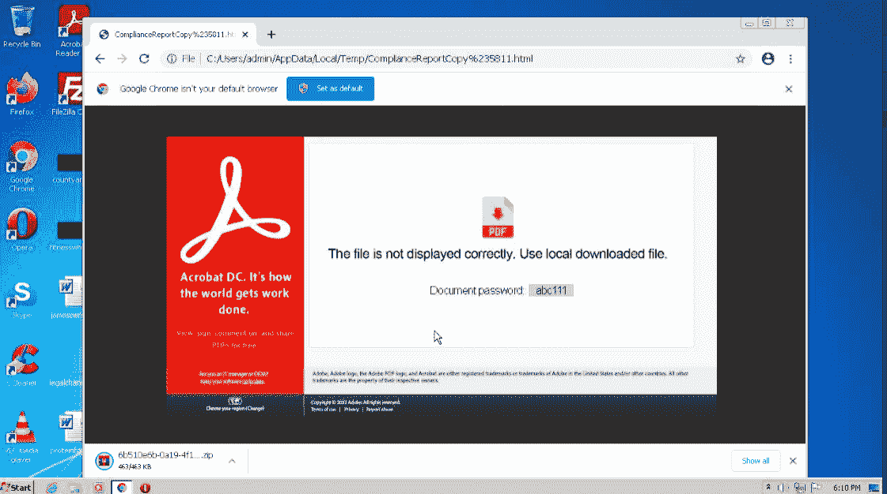

无论如何…让我们继续前进…

从档案中提取文件给我们一个. iso 文件。

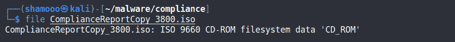

我挂载了图像文件来查看它的内容。

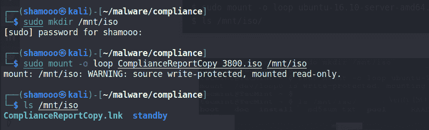

将它移动到/tmp 目录，并卸载映像，这样我就不会忘记它。

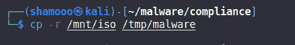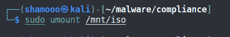

在图像中，我们看到了以下文件。

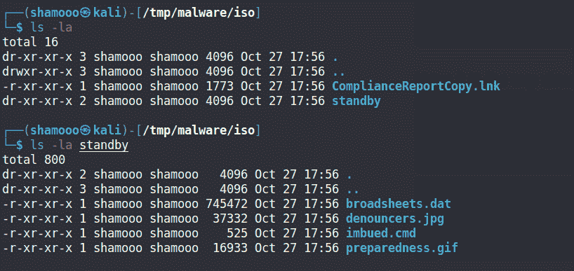

ComplianceReportCopy.lnk 是一个 windows 快捷方式文件

impulsed . cmd 和 broadsheets.dat 看起来特别有趣

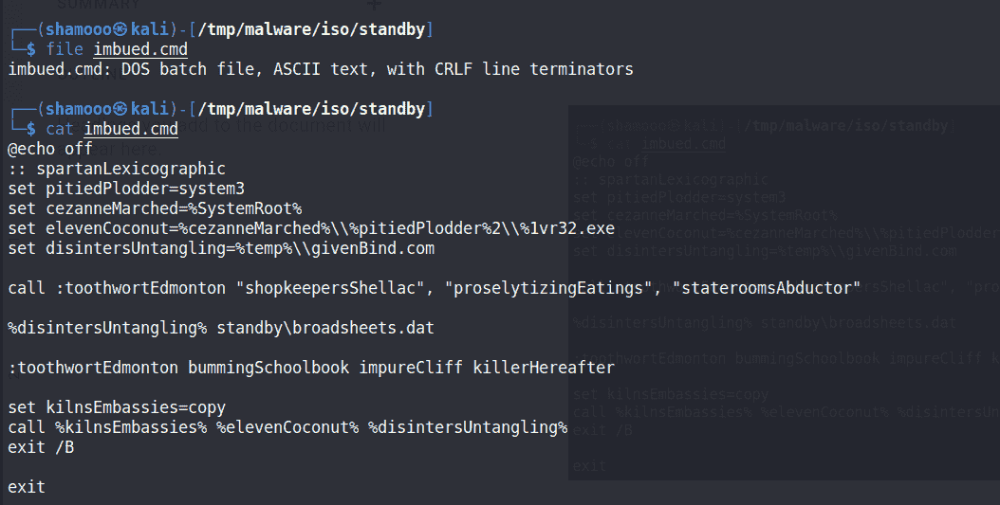

impulsed . cmd 是一个 dos 批处理文件，似乎在做一些字符串混淆。

它似乎正在构建字符串“copy % systemroot % \ System32 \ 1vr 32 . exe % temp \ given bind . com ”,并且似乎还在运行 broadsheets.dat

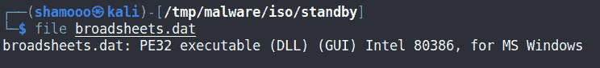

哦！多汁的 Windows PE32 可执行文件。喜欢看。让我们把它上传到 Virustotal，看看它是否能捕捉到什么。

哇哦。迅速升级:)

大多数 AVs 将可执行文件标识为 Qbot。

QBot 是一个模块化的信息窃取者。自 2007 年以来，它已经活跃了多年。它在历史上被称为银行特洛伊木马，这意味着它从受感染的系统中窃取金融数据，并且是一个使用 C2 服务器进行有效负载定位和下载的加载程序。

QBot，也称为 Qakbot、QBot、QuackBot 和 Pinkslipbot，仍然是对组织的一种危险和持续的威胁，并且已经成为全球领先的银行特洛伊木马之一。

Toodaloo。黑客快乐！

# IOCs

7 c 8 b 1 ddfedaad 57 AC 7021 D5 ea 976 df 64281 df 373

da 8615 c 02 da 6941 b 17 a 50 f 778 f 8090 f 581595 e7a

d6d 88 aff8e 2 a 0308470755 acdd 72 BC 0 c 8574 BBA

a 8 a 0 af 138368 e 734 de 4c 19 FB 4 AC 766 f 5577 a2 f 897 Fe 88 e 4c 27 f 0 C4 C2 D3 FB 3 aa 8