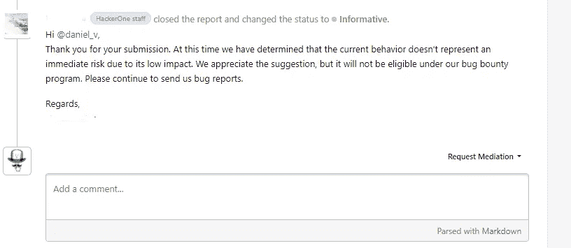
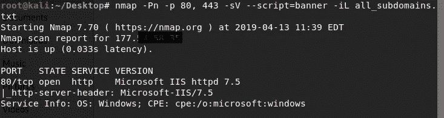
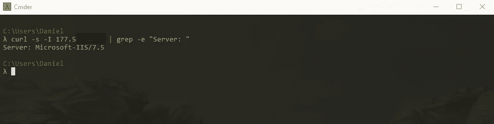
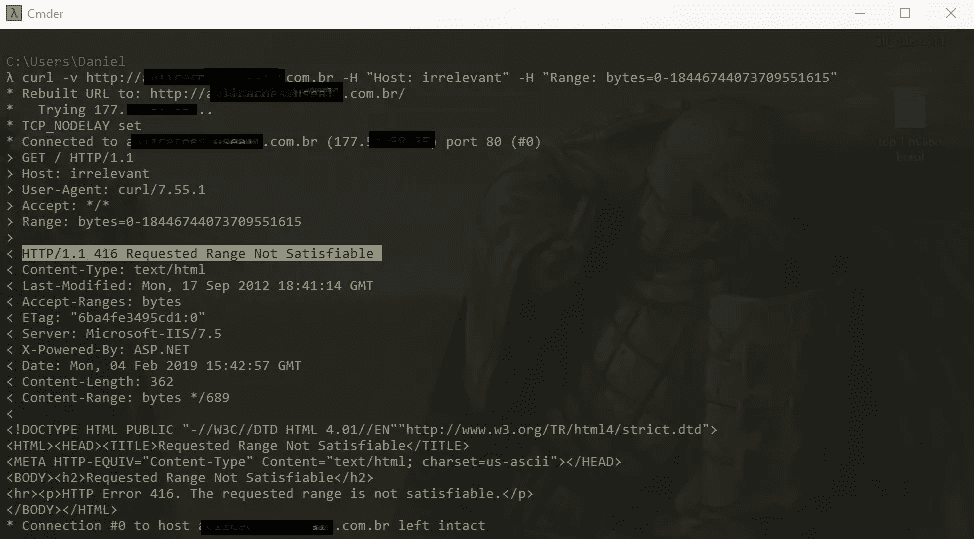
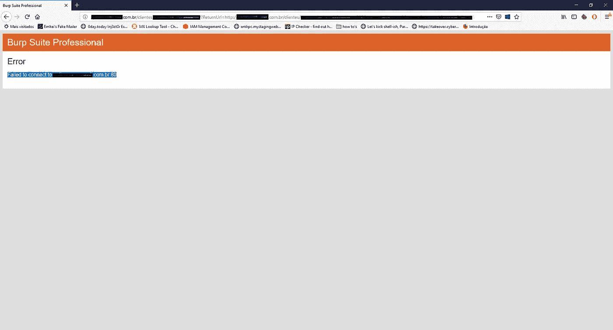
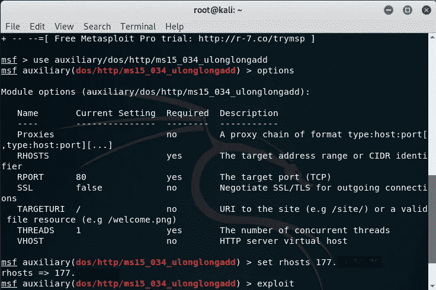
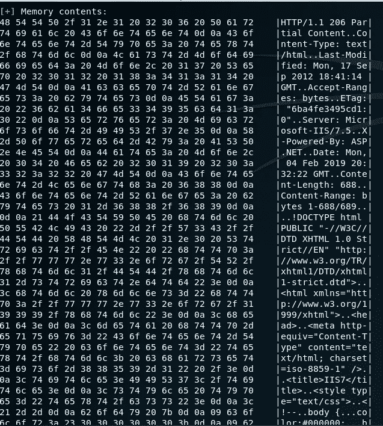

# 横幅抓取到 DoS 和内存损坏

> 原文：<https://infosecwriteups.com/banner-grabbing-to-dos-and-memory-corruption-2442b1c25bbb?source=collection_archive---------0----------------------->

朋友们好，

很抱歉我的缺席，这些天我一直在努力工作，但我在这里，为我们的社区做出我的贡献。今天的主题是关于我在一家公司遇到的一个漏洞，我私下运行了 Pentest，在那里我在它的各种* .subdomains.com 中发现了一个 IIS 服务器，这个特定的服务器有两个 CVE。

我发现分享有趣的是，在我的 bug 赏金之旅的开始，我过去常常报告低“悬挂的果实”,甚至没有试图利用它们，例如，抓横幅。

正如您在上面的图片中所看到的，通常抓取横幅本身会被视为低影响，您的报告很可能会被视为信息性报告。随着时间的推移，你获得了更多的知识，你的方法发生了变化，你开始改善看待目标的方式，说到这里，让我们开始吧:

**抢横幅和虫子赏金**

标题抓取是一个收集网络上任何远程 PC 及其开放端口上运行的服务的详细信息的过程。攻击者可以利用横幅抓取来发现网络主机，并在其开放端口和操作系统上运行带有其版本的服务，这样他就可以利用它。

要对此产生重大影响，请检查显示横幅的活动主机列表，记下它们，并开始查找版本的漏洞。一些简单的东西，但初学者很少实践，他们通常报告低影响 vuln，而不想深入到足够成为关键。

**从抢横幅到 DoS 和内存崩溃**

我将一步一步地向你展示我如何利用互联网上传播的漏洞来改造 DoS 和内存崩溃中的横幅抓取。该公司(当时不允许透露身份，我们称之为 redacted)有几个子域名，其中许多都暴露了他们的横幅，包括 ssh、ftp 等端口，但我的重点将放在端口 80 (http)上，在那里他们使用了内部票证系统。

**发现:**

我使用下面的 nmap 命令来检查可以在下一次接近目标时帮助我的标语

> **nmap****-Pn****-p****80，443****-sV**—**script = banner****-iL all _ subdomains . txt**

对于不想使用 nmap 的用户，可以通过 CURL 来完成这项检查:

> **卷曲****-s****-I****192 . 168 . 0 . 100 |****grep****-e****服务器:“**

修订后的公司在其范围内允许 DoS，因为我在本地为它工作，很容易与基础设施团队取得联系，报告这方面的一些关键缺陷。记住 IIS 服务器，在快速搜索中，我发现在微软服务器(MS15–034)上执行 DoS 的攻击并不广泛，你可以在这里阅读更多关于该漏洞的信息。

**检测漏洞:**

通过在 HTTP 请求中指定范围标题，可以触发此漏洞。易受攻击的安装程序将响应 HTTP 416 请求的范围不可满足错误。

我真的得到了这个错误吗？太好了！

按照上面链接的指导，我只需要指定有效的文件和 100 的字节范围，结果它让我看到一个蓝屏，这意味着… DoS！

**记住**，在处理一个 bounty bug 中的 DoS 时，检查这种类型的 vuln 是否被允许，如果不被允许，你仍然发现它是相关的，适当地与团队沟通，我上面所做的是由公司的负责团队陪同的。

有时，同一个版本可能有多个关键漏洞，此 IIS 服务器就是这种情况，之前已经知道可以运行内存转储，让我们看看结果如何:

**等等，内存转储？**

任何让您破坏服务器内存的行为都有可能导致远程代码执行。至少，它让你崩溃进程或操作系统。我们有一个针对这个 IIS 漏洞的 metasploit 模块(总是使用搜索选项在那里检查)

**设置 metasploit 模块**

回应:

屏幕很漂亮，但是…在我执行转储时没有“关键”数据，尽管如此，漏洞被成功确认，这就足够了:)

IIS 链接[的 Metasploit 内存转储模块此处](https://www.rapid7.com/db/modules/auxiliary/scanner/http/ms15_034_http_sys_memory_dump)。

**要点:**

正如你所观察到的，我试图更多地关注初学者社区，展示如何以不同的方式寻找那些非常常见的低影响漏洞。我希望我在某种程度上有所贡献，正如我向你们所有人学习一样。黑客快乐！

希望你喜欢，现在我有一个 [**twitter**](https://twitter.com/danielv47251669) 这样我们也可以在那里分享知识。

在这里找到我。