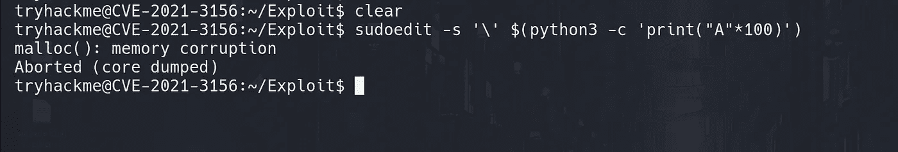
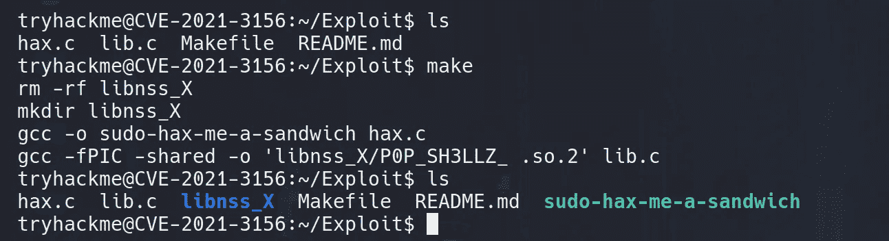
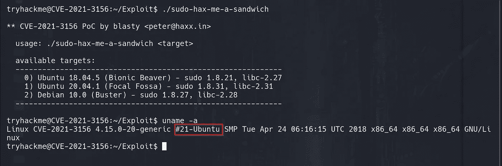
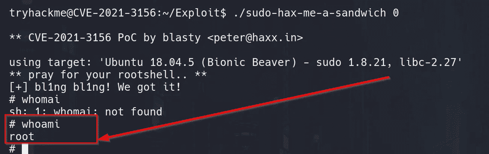
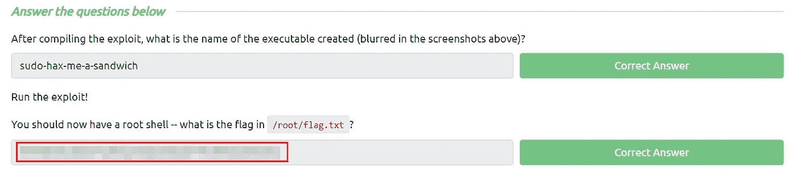

# 巴隆·萨姆迪特·CVE

> 原文：<https://infosecwriteups.com/baron-samedit-cve-2021-3156-tryhackme-76d7dedc3cff?source=collection_archive---------0----------------------->

在 Unix Sudo 程序中探索 CVE-2021–3156 的教程演练。

部署机器，ssh 进入机器使用
`username:tryhackme`
`password:tryhackme`

2021 年 1 月， [Qualys](https://qualys.com/) 发布了一篇[博文](https://blog.qualys.com/vulnerabilities-research/2021/01/26/cve-2021-3156-heap-based-buffer-overflow-in-sudo-baron-samedit)详细描述了 Unix Sudo 程序中一个可怕的新漏洞。

**具体来说，这是一个堆缓冲区溢出，允许任何用户将权限提升到 root 用户，无需错误配置。** **这个漏洞利用默认设置，对任何用户都有效，不管 Sudo 权限，这使它更加可怕。**该漏洞已被修补，但影响 1 . 8 . 2–1 . 8 . 31 p2 和 1 . 9 . 0–1 . 9 . 5 P1 的任何未修补版本的 sudo 程序，这意味着它在过去十年中一直存在。

这个程序很快就被打了补丁(打了补丁的版本很快就进入了资料库)，所以这个漏洞将不再对最新的目标起作用；然而，它仍然强大得令人难以置信。

此漏洞是 sudo 程序中的缓冲区溢出。具体来说，就是堆缓冲区溢出。堆是为动态分配内存而保留的，允许程序更灵活地创建和访问值和构造。
我们真正需要了解的是，这种漏洞非常强大，而且影响极其广泛。

那么，首先，我们可以做些什么来检查一个系统是否容易受到攻击？
幸运的是，有一个非常简单的方法我们可以用来检查；只需在终端中输入以下命令:

`sudoedit -s '\' $(python3 -c 'print("A"*1000)')`

如果系统易受攻击，这将覆盖堆缓冲区并使程序崩溃:

这个 PoC 是从一个名为 [lockedbyte](https://twitter.com/lockedbyte) 的研究员那里获得的，这里的[是](https://github.com/lockedbyte/CVE-Exploits/tree/master/CVE-2021-3156)。

当该建议首次发布时，Qualys 并未提供该漏洞的完整代码。其他研究人员很快就复制了这个漏洞；然而。第一个公开可用的漏洞工作副本是由一个名为 [bl4sty](https://twitter.com/bl4sty) 的研究人员创建的。他们的完整利用代码可以在 Github、[这里](https://github.com/blasty/CVE-2021-3156)找到。这是我们将用来利用您在第一个任务中部署的机器

该机器的设置允许轻松利用该漏洞。因此，上面链接的 Github 存储库已经被添加到目标中。

在主目录中，您会看到一个名为“Exploit”的文件夹:

我们只需要“make”来自动编译代码。

现在我们需要选择目标设备操作系统；在这种情况下，我们将使用第 0 个选项

现在只需执行它！！

然后嘣！！！我们得到了根壳

