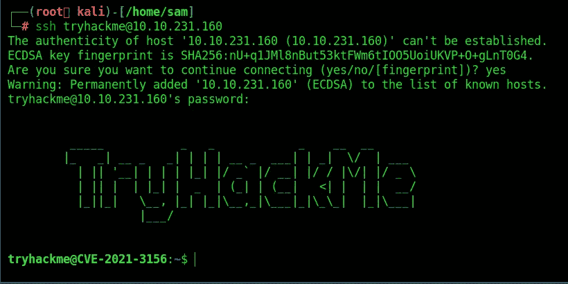
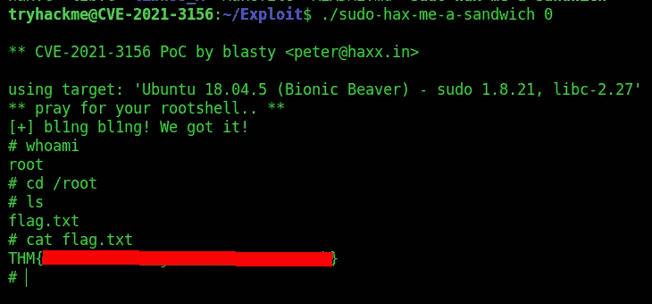

# Baron Samedit Tryhackme 报道

> 原文：<https://infosecwriteups.com/baron-samedit-tryhackme-writeup-8785e85813cf?source=collection_archive---------6----------------------->

## **这是 Tryhackme room“Baron same dit”的特写**

https://tryhackme.com/room/sudovulnssamedit

**房间链接:**[**https://tryhackme.com/room/sudovulnssamedit**](https://tryhackme.com/room/sudovulnssamedit)
**注:此房免费**

2021 年 1 月， [Qualys](https://qualys.com) 发布了一篇[博客文章](https://blog.qualys.com/vulnerabilities-research/2021/01/26/cve-2021-3156-heap-based-buffer-overflow-in-sudo-baron-samedit)详细描述了 Unix sudo 程序中一个可怕的新漏洞。

具体来说，这是一个堆缓冲区溢出，允许任何用户将权限提升到 root 用户，不需要错误配置。这种利用默认设置工作，任何用户不管 sudo 权限，这使它更加可怕。该漏洞已被修补，但会影响 sudo 程序 1 . 8 . 2–1 . 8 . 31 p2 和 1 . 9 . 0–1 . 9 . 5 P1 的任何未修补版本，这意味着它在过去十年中一直存在。

这个程序很快就被打了补丁(打了补丁的版本很快就进入了资料库)，所以这个漏洞将不再对最新的目标起作用；然而，它仍然强大得令人难以置信。

与**CVE-2019–18634**(我们在 [**第二 sudovulns 室**](https://tryhackme.com/room/sudovulnsbof) **看到的一样，**这个漏洞是 sudo 程序中的缓冲区溢出；然而，这次的漏洞是一个*堆*缓冲区溢出，而不是我们之前看到的*栈*缓冲区溢出。堆栈是内存中非常严密的部分，它存储了程序的各个重要方面。另一方面，堆是为动态分配内存而保留的，允许程序在如何创建和访问值和构造方面有更大的灵活性。与前一个房间一样，为了保持内容初学者的友好，我们不会深入讨论这是如何工作的大量细节。我们真正需要了解的是，这种漏洞非常强大，而且影响极其广泛

使用这些凭据通过 SSH 登录:

*   用户名: tryhackme
*   **密码:** tryhackme

命令将是:
**ssh tryhackme @ 10 . 10 . 231 . 160**

**问题 1** 。编译漏洞后，创建的可执行文件的名称是什么

> **答案:sudo-hax-me-a-sandwich**

现在让我们运行 exploit

你可以在:
**LinkedIn:-**[https://www.linkedin.com/in/shamsher-khan-651a35162/](https://www.linkedin.com/in/shamsher-khan-651a35162/)
**Twitter:-**[https://twitter.com/shamsherkhannn](https://twitter.com/shamsherkhannn)
**Tryhackme:-**[https://tryhackme.com/p/Shamsher](https://tryhackme.com/p/Shamsher)

你可以在:
LinkedIn:-[https://www.linkedin.com/in/shamsher-khan-651a35162/](https://www.linkedin.com/in/shamsher-khan-651a35162/)
Twitter:-[https://twitter.com/shamsherkhannn](https://twitter.com/shamsherkhannn)
Tryhackme:-[https://tryhackme.com/p/Shamsher](https://tryhackme.com/p/Shamsher)