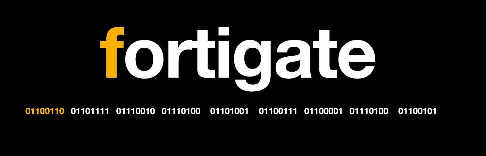
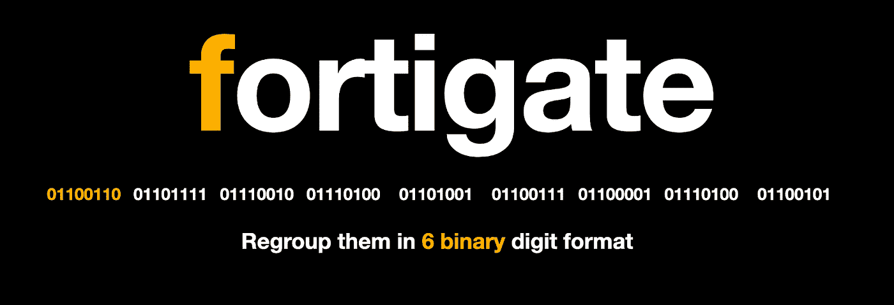
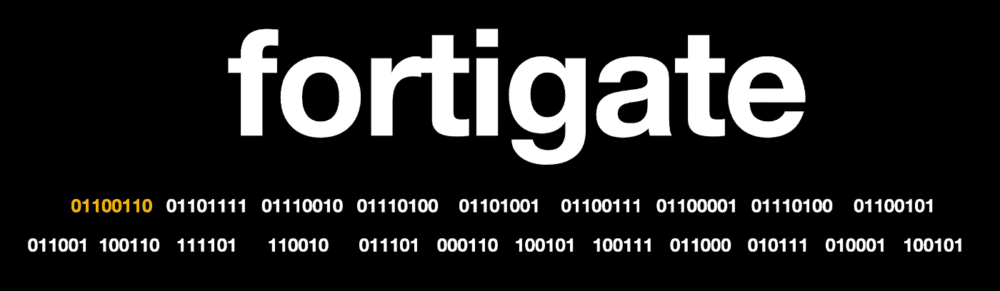
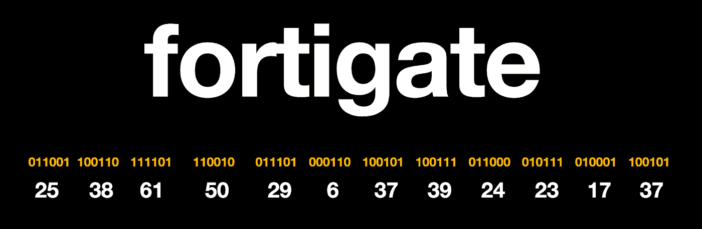
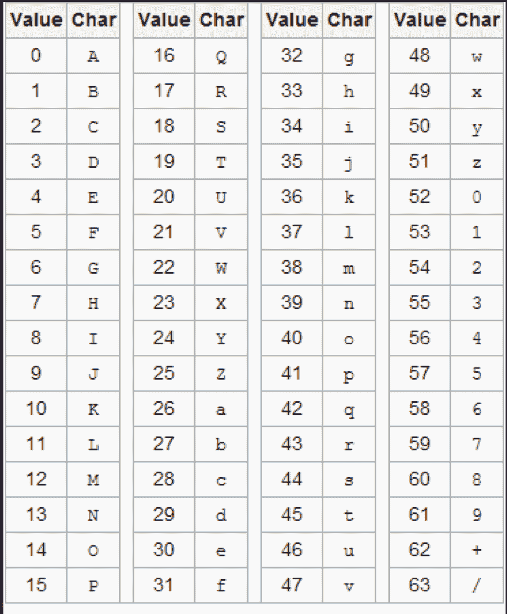

# Base64 解释

> 原文：<https://infosecwriteups.com/base64-explained-17cd8864da02?source=collection_archive---------0----------------------->

# **到处都在用 64 进制。它是最著名的编码方案，用于表示二进制数据并将其转换为 ASCII 表示。我们为什么要用它？算法是什么？它实际上是如何工作的？**

我们使用 base 64 作为将二进制数据编码成 ASCII 表示的方法。

# 为什么？

我们这样做是因为许多系统和网络并不像应该显示的那样表示二进制数据。那么它实际上是如何工作的呢？

我们举个例子吧。就拿 T2 这个词来说吧。每个字符都有一个八位表示。

如果我们将每个字符转换成它自己的 **ASCII 二进制表示**，

例如，我们将看到字符 **F** 的值为 102，

也就是字符的十进制值。如果我们将其转换为二进制表示，我们将得到 **01100110** 。

# 让我们将每个字符转换成它们的二进制表示

现在取不同的位，不同的字符位，并把它们重新组合成六位二进制数字格式。也就是说，取每个字节的最后两位，将它们加起来，得到下一个八位。

这样做，我们将有六位数的二进制组。比我们以前有更多的团体。

现在把每一组转换成它自己的十进制数。

所以现在第一组其实是 25，换算成自己的十进制值，第二组是 38，以此类推。

**Base64 表**

现在，以你可以在任何地方(谷歌)找到的 base 64 编码表为例，每个十进制值都有自己的 base 64 表示。

25 其实是 Z 38 是 M，这样换算的话，你会发现 FortiGate 这个词其实是以 64 Z M，9 Y，D G L N Y X R L 为基数的。

现在让我们使用 Python 脚本来完成它，并检查它。

 [## base64

### 由 ofershmueli 回复的 Python

replit.com](https://replit.com/@ofershmueli/base64#main.py) 

**我的秘密之书——初学者密码学手册**

[https://www.amazon.com/gp/css/order-history/?ref = hud _ 2 _ GW _ profile&pf _ rd _ r = v 6s 41k 9 cv 56 psh 9 JC fdx&pf _ rd _ p = 74587702-88fd-42 C7-8550-0760 c 67 a 45 f 3&PD _ rd _ r = 7 E0 ee 6b 5-3c 50-46 c 6-8 CCB-153 FD 78 dcb 92&PD _ rd _ w = bVVwr](https://www.amazon.com/gp/css/order-history/?ref=hud_2_gw_profile&pf_rd_r=V6S41K9CV56PSH9JCFDX&pf_rd_p=74587702-88fd-42c7-8550-0760c67a45f3&pd_rd_r=7e0ee6b5-3c50-46c6-8ccb-153fd78dcb92&pd_rd_w=bVVwr&pd_rd_wg=xRnFn&ref_=pd_gw_unk)