# 安全基线检查 I

> 原文：<https://infosecwriteups.com/baseline-security-check-i-61ce01cfcaf9?source=collection_archive---------1----------------------->

## 构建和配置审查

科林·阿姆斯壮在 [Unsplash](https://unsplash.com?utm_source=medium&utm_medium=referral) 上的照片

## 目的

建立安全基线的主要目的是识别与安全相关的业务风险，并为 IT 项目提供风险缓解措施。

任何组织，无论大小，在系统转移到渗透测试管道之前以及项目上线之前，都必须满足**最低基线安全要求(BSR)** 。

安全架构师帮助定义测试范围。这通常基于被识别为风险的特定信息系统和资产的数据分类级别(数据值)。

BSRs 适用于:

*   最终用户设备
*   网络/桌面应用程序
*   服务器
*   仇恨失控
*   云-SaaS/平台即服务
*   网络/基础设施

## 网络安全构建审查

又名主机加固评估

构建审查审核包括根据行业基准评估操作系统的配置和设备设置。公开的基准包括:独联体、亚太和 CESG

一般而言，构建审查涵盖以下数字和物理组件:

*   **服务器操作系统-** 网络服务器、应用服务器、数据库服务器、域控制器*(运行活动目录域服务(AD DS)角色的服务器)*
*   **工作站** -台式机、笔记本电脑、思杰
*   **活动目录** *【分层数据库】*
*   **网络浏览器**——谷歌浏览器、微软浏览器、Opera 浏览器
*   **网络设备** -路由器/交换机/检查点防火墙
*   **移动设备** -苹果/谷歌/安卓移动平台 iOS
*   **虚拟化平台和云** - Docker / VMWare ESXi 等
*   **其他**——微软 office/outlook/word/powerpoint 等。

# 方案

Noah 最近加入了网络安全团队，担任分析师。他的任务是针对以下机器的行业基准进行构建审查审计。

*   Linux 操作系统
*   Windows 操作系统

## 目标:

> 总体上实现良好的安全实践。

有一些自动化的工具可以运行构建审查配置扫描。但是，这里我们将手动评估这些机器。

# **********审核 Linux&Windows OS * * * * * * * * ***

# 服务器操作系统

## 1.操作系统和软件包及更新

确保系统使用最新的操作系统版本和操作系统包。

**Linux**

如下图，更新必须设置为安装**重要的**和**推荐的**更新。还要确保将“**自动检查更新**”设置为**每日**。

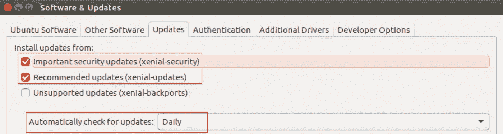

**视窗**

*Windows 设置>更新&安全*

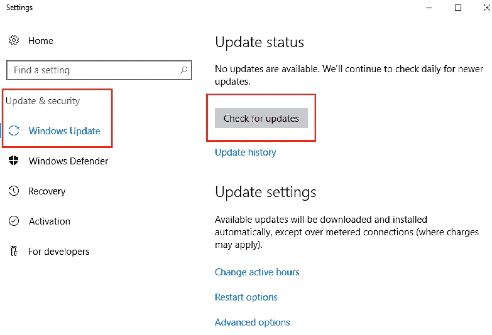

## 2.软件和/或硬件的生命周期结束(EoL)

必须更换停产产品，因为供应商不提供任何支持。

# 工作站

## 1.电脑锁屏

**窗户**

确保`Ctrl + Alt + Del`得到执行

*本地安全策略>本地策略>安全选项>禁用交互登录:不需要 CTRL + ALT + DEL*

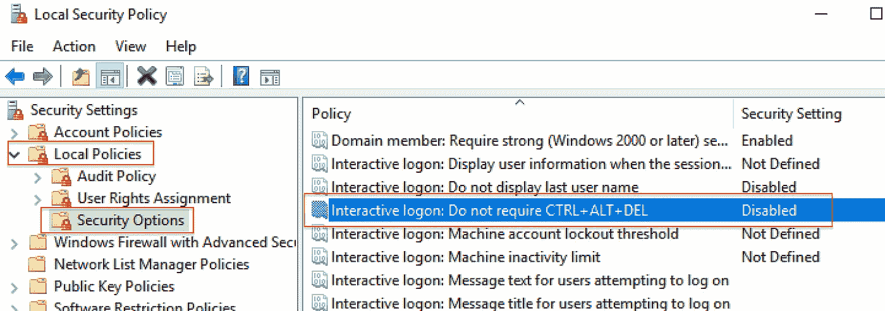

## 2.控制面板

**窗户**

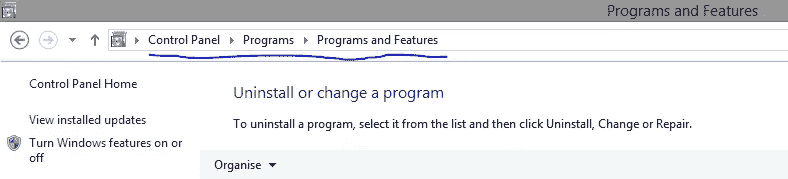

## 3.文件共享和媒体文件

禁止共享网络空间上的敏感文件/文件夹。此外，任何媒体文件都不应下载到违反公司政策的设备上。

**Linux**

检查以下目录中是否有任何不必要的文件:

*   /srv/nfs
*   /mnt 或/mount

**窗户**

检查以下目录:

*   网络上不必要的文件共享

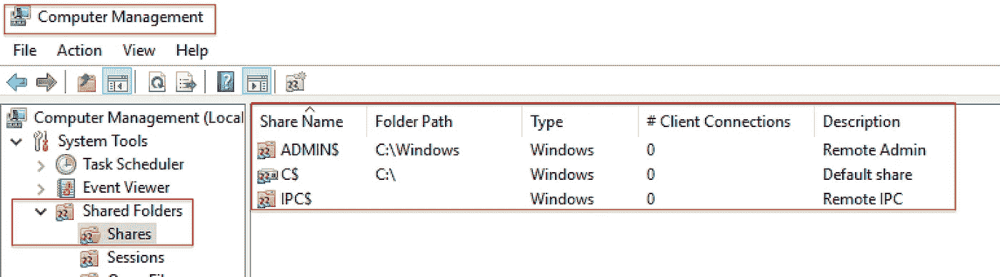

# 审核 Active Directory

## 1.员工用户和管理员帐户

确保没有未经授权的用户帐户被设置，也没有任何以前的用户帐户仍然活跃。

当员工离开公司时，确保他们的笔记本电脑被彻底清除并重新映像(重新安装操作系统)以供新员工使用。

**视窗**

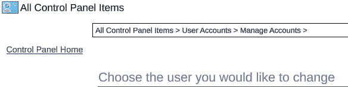

## 2.帐户角色和权限

意外(或有意)获得管理员权限的标准用户可能会对系统造成重大损害，因为他们可以访问该系统上的所有文件。

检查列出的用户是否正确设置为“普通”用户或“管理员”用户。

**窗户**

## 3.密码策略

拥有一个**弱**或**无**密码的帐户(尤其是管理员的)会让攻击者成功实施暴力攻击或轻松访问帐户。

确保实施最小密码长度策略。

设置最长密码期限策略

强制密码历史-这样用户就不能再次使用旧密码。

控制面板>管理工具>本地安全策略>密码策略

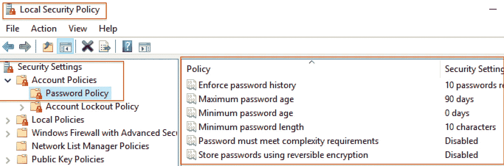

## 4.帐户锁定策略

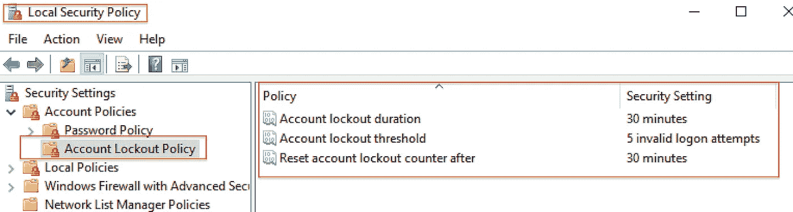

## 5.事件审核和日志记录

# 网络浏览器

## 1.浏览器弹出窗口拦截器和附件

下面是一个例子:

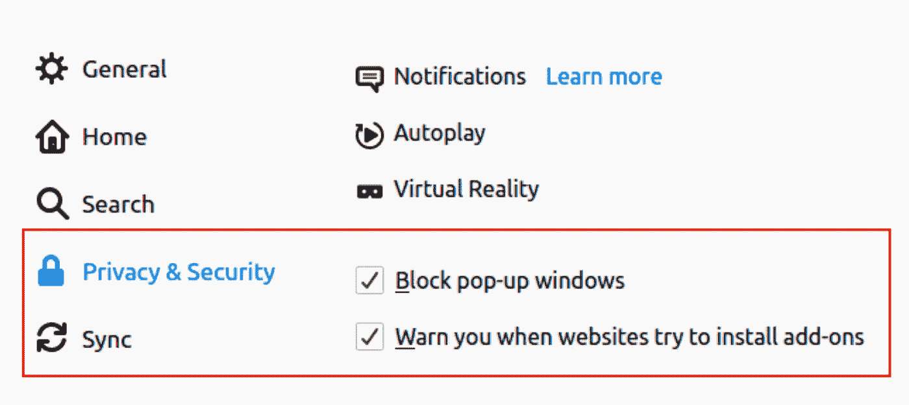

**MOZILLA FIREFOX**

# 网络设备

## 1.防火墙

禁用或错误配置的防火墙会增加攻击者渗透到网络中的机会。

**Linux 防火墙**

系统设置>防火墙配置**或**在终端输入`gufw`

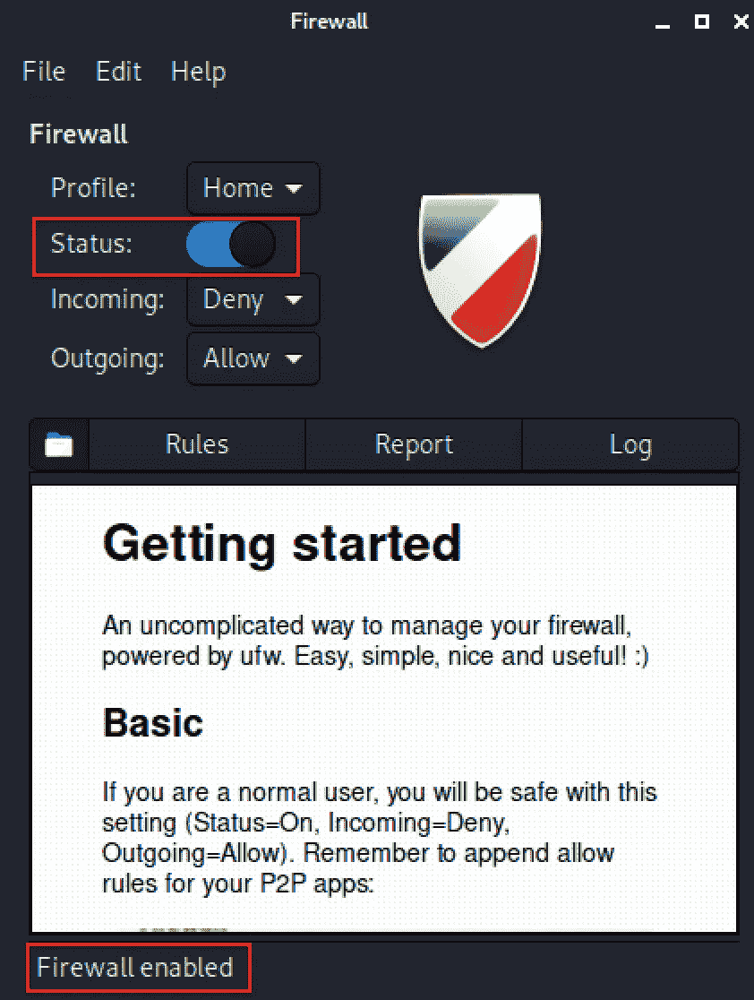

**Windows 防火墙**

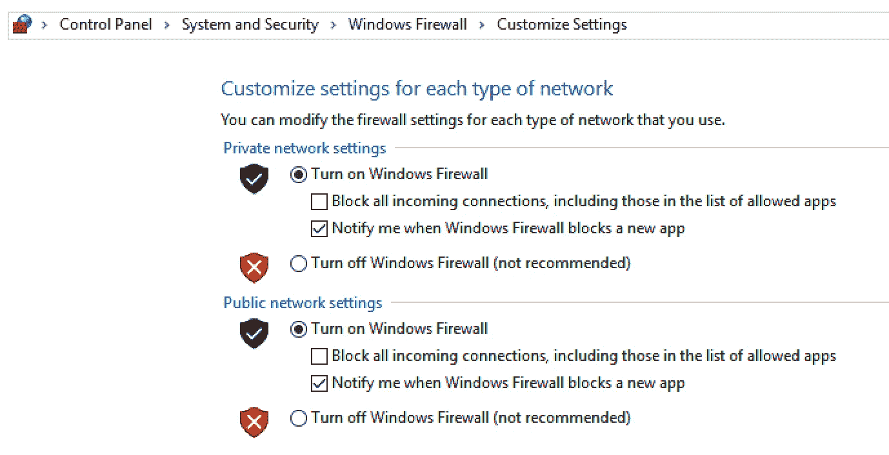

## 2.端口/服务/程序

不安全或未使用的开放端口或服务将为攻击者创造更大的攻击面，从而进一步渗透到网络中。

**Linux**

`sudo service —-status-all`

要删除或禁用 packages.services，请使用以下命令行:

`sudo apt-get remove <package>`或`sudo apt-get purge <package>`

`systemctl disable <service>`或`systemctl stop <service>`

**视窗**

请注意，出于安全目的，下图中的 **FTP 服务器**已被取消选中(**禁用**)。

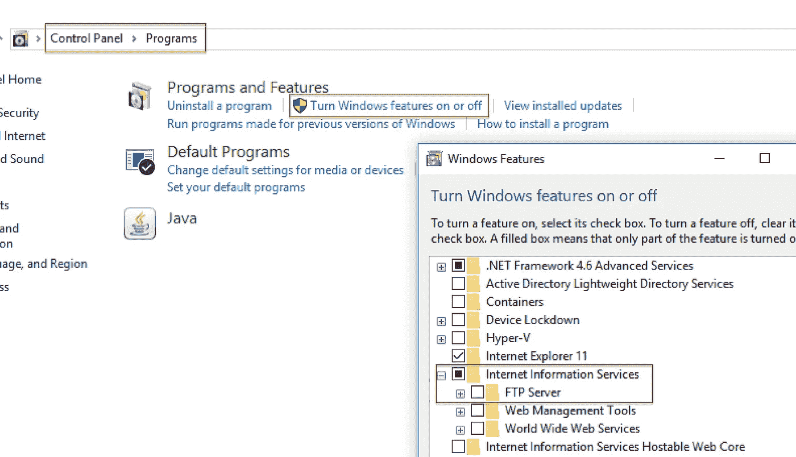

卸载程序可以在**安装/卸载程序**下找到

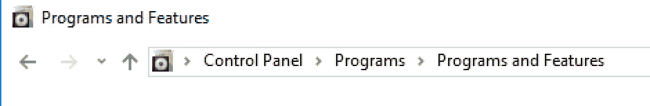

卸载后，删除该特定文件夹。请参见下面的示例:

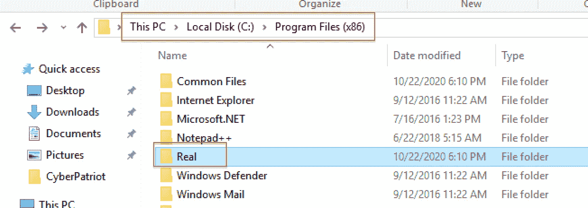

*Real 是 Realplayer 文件夹*

## 3.网络设备配置审查

**Nipper** 是发现网络设备(如交换机/路由器/防火墙等)漏洞的好工具。

**视窗**

访问这个[网站](https://www.titania.com/products/nipper/)

**Linux**

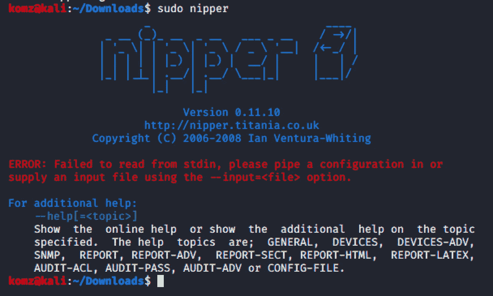

# 其他人

## 1.安全/加密的系统备份和恢复位置

## 2.反病毒审计

## 3.第三方软件审查

# 参考

*   [https://en.wikipedia.org/wiki/Cybersecurity_standards](https://en.wikipedia.org/wiki/Cybersecurity_standards)
*   [https://www . armadillosec . co . uk/cyber-security-build-reviews/](https://www.armadillosec.co.uk/cyber-security-build-reviews/)
*   [https://cyber . GC . ca/sites/default/files/publications/Baseline % 20 cyber % 20 security % 20 controls % 20 for % 20 small % 20 and % 20 medium % 20 organizations . pdf](https://cyber.gc.ca/sites/default/files/publications/Baseline%20Cyber%20Security%20Controls%20for%20Small%20and%20Medium%20Organizations.pdf)
*   [https://en.wikipedia.org/wiki/Network_File_System](https://en.wikipedia.org/wiki/Network_File_System)
*   [https://docs . Microsoft . com/en-us/windows/security/threat-protection/安全策略设置/如何配置安全策略设置](https://docs.microsoft.com/en-us/windows/security/threat-protection/security-policy-settings/how-to-configure-security-policy-settings)
*   [https://www.titania.com/products/nipper/](https://www.titania.com/products/nipper/)

观看此空间的更多更新！