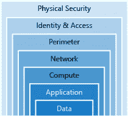

# 云基线安全策略

> 原文：<https://infosecwriteups.com/baseline-security-check-ii-a9da4f7634ae?source=collection_archive---------1----------------------->

## 云安全战略

如果你完全是新手，我建议你访问我下面的链接来了解云计算。如果你对它很熟悉，那么请继续阅读这篇文章:-)

 [## MS Azure 基础知识修订说明

### AZ-900-Azure 云计算基础

komz.medium.com](https://komz.medium.com/ms-azure-fundamentals-revision-notes-ee5ce9fbafd1) 

# 让我们从…零信任模型开始

现代安全态势使用**零信任模型**，这是一种使用持续信任验证方法的安全概念。这意味着组织在授予访问权限之前，无论是在其边界内部还是外部，都必须验证和确认连接到其系统的所有内容。

*在此，我将专门讨论* ***天蓝云*** *及其安全基线。然而，大多数清单也适用于其他云服务提供商。本文主要关注* ***云安全工程师*** *和* ***云解决方案架构师*** *。*

# 云威胁

*   **业务逻辑问题**如配置错误的 ACL 规则、未经授权的访问可能导致敏感数据暴露。
*   不安全的接口/API。
*   服务帐户或流量劫持。
*   外部数据共享。
*   内部威胁——作为员工的人比外部人员拥有更多的内部知识和数据。
*   缺乏**员工意识培训**可能会导致他们打开恶意电子邮件/附件，从而导致帐户被侵入。这进一步增加了攻击者执行恶意软件/勒索软件攻击的可能性。
*   **Azure 订阅密钥管理不善** —当使用认知服务时，订阅密钥用于在环境中验证您的应用程序。将密钥单独存储在 Azure Key Vault for environments 中是一个很好的安全实践。例如，开发人员环境密钥必须不同于生产环境中使用的密钥。确保加密密钥和应用程序机密(连接字符串、安全令牌、证书或密码)从不存储在应用程序代码或配置文件中。

# 云安全基准

**纵深防御环**

安全基线是云治理的五个原则之一。为了在云中实现安全控制，通用原则 CIA Triad 为纵深防御环的每一层定义了云安全状态。

## CIS 基准

建立安全基线的主要目的是识别与安全相关的业务风险，并为 IT 项目提供风险缓解措施。通常实施行业认可的 CIS 基准，以满足基线安全标准并确保合规性。

## 云配置审查

根据行业基准最佳实践评估云配置审查，随后是详细的解释和补救建议。接下来是对云的手动和自动评估。
在配置审查期间，安全分析师/测试人员会评估以下内容，以确保采用正确的技术来保护 Azure 基础架构。

## Azure 云安全基线

攻击者将列举并识别环境中的所有外部攻击面(入口点)。但是，有了云安全基线，将在很大程度上减少攻击面。

******* [**管理身份和基线安全**](https://docs.microsoft.com/en-gb/learn/modules/create-security-baselines/2-create-an-identity-access-management-iam) *******

*   限制对 Azure 广告管理门户网站(一种基于云的身份服务)的访问。
*   对使用 Azure AD 的应用程序用户实施**单点登录(SSO)** 。
*   使用 Azure AD 对公司网络外的所有登录强制实施**多因素身份验证**。
*   **阻止在可信设备上记住 MFA** ，以防帐户或设备丢失或被盗，记住 MFA 会对安全性造成负面影响。
*   除了 MFA 之外，**条件接收策略**也用于授权或阻止用户访问。这通常包括阻止可疑的 IP 或拒绝来自没有恶意软件保护的设备的访问等。
*   确保**不存在访客用户**或限制他们的权限。
*   **启用密码管理**并应用适当的安全策略。
*   180 天后再次确认用户验证方法。
*   禁用来自成员和来宾的邀请，以便就受您的 Azure AD 保护的资源进行协作。
*   禁用允许用户注册自定义应用程序。只有管理员可以。
*   对于本地托管的应用程序的安全远程访问， **Azure AD 应用程序代理**将满足这一领域的业务需求。
*   **Azure AD B2C(企业到云)**类似于 Azure AD，但它允许企业控制和定制 IAM 和本地应用程序访问。
*   Azure 基于角色的访问控制(RBAC)只能应用于 Azure 资源。
*   对所有输入/输出进行消毒和验证。始终使用参数化查询来减少针对 SQL 数据库的攻击和其他类型的注入攻击。需要验证的数据源可以是:来自 URL 参数的数据、收集的用户输入数据、来自第三方 API 的数据。
*   从应用程序网关安装 WAF，为 web 应用程序提供集中保护，使其免受常见利用和漏洞的攻击。

******* [**管理 Azure 安全中心基线**](https://docs.microsoft.com/en-gb/learn/modules/create-security-baselines/3-create-an-azure-security-center-baseline) *******

*   启用免费的 Azure 安全中心。
*   每天查看安全中心仪表板，以获得安全状况的概述，并根据建议采取必要的措施。
*   一旦应用程序被部署到生产环境中，应用程序就必须接受常规扫描，以识别安全漏洞。Azure Security Centre 是一项免费服务，默认情况下，它为所有提供这些扫描功能的 Azure 订阅服务启用。

******* [**Azure 存储帐户基线**](https://docs.microsoft.com/en-gb/learn/modules/create-security-baselines/4-create-a-storage-accounts-baseline) *******

*   客户端和 Azure 存储之间的通信仅通过 HTTPS 进行。
*   启用二进制大对象(blob)加密。Blob 存储存储大量的非结构化数据。
*   定期轮换存储访问密钥，以避免无意中访问或暴露这些密钥。
*   共享访问签名(SAS)是提供给客户端的 URI，用于临时访问某些存储帐户资源，必须在一小时内过期。
*   SAS 令牌也只能通过 HTTPS 共享。
*   启用 Azure 文件加密。
*   Blob 容器只能被私人访问。通过共享您的帐户密钥或提供 SAS 令牌。

******* [**Azure SQL 数据库基线**](https://docs.microsoft.com/en-gb/learn/modules/create-security-baselines/5-create-an-azure-sql-database-baseline) *******

*   启用审核
*   启用威胁检测服务和类型。
*   启用发送安全警报的选项。
*   启用电子邮件服务和共同管理员。
*   将审核保留和威胁检测保留配置为 90 天以上。

******* [**测井和监测基线**](https://docs.microsoft.com/en-gb/learn/modules/create-security-baselines/6-create-a-logging-and-monitoring-baseline) *******

*   确保日志配置文件存在
*   活动日志保留期必须设置为至少 365 天，以便有足够的时间来响应任何事件。

******* [**联网基线**](https://docs.microsoft.com/en-gb/learn/modules/create-security-baselines/7-create-a-networking-baseline) *******

*   配置逻辑防火墙以限制从互联网访问 RDP 和 SSH。
*   配置逻辑防火墙以限制从 internet 对 SQL Server 的访问。
*   使用网络安全组(NSG)过滤网络流量。
*   默认情况下，认知服务设置为**允许来自所有网络的访问**。这是很危险的，因为威胁者可以很容易地从公共互联网获取敏感数据资源。因此，这必须在部署认知服务后立即进行配置。
*   虚拟网络测试。
*   私有端点连接测试。

******* [**Azure 虚拟机基线**](https://docs.microsoft.com/en-gb/learn/modules/create-security-baselines/8-create-a-vms-baseline) *******

*   安装并启用用于 Azure 安全中心数据收集的 VM 代理。
*   确保操作系统磁盘已加密。
*   确保只安装批准的扩展。
*   确保定期为虚拟机应用操作系统补丁。
*   必须在虚拟机上安装并运行端点保护解决方案。
*   所有 Azure 虚拟机都需要由用户管理，如补丁管理和备份。Azure 不会向他们推送 windows 更新。
*   如果虚拟机是外部托管的，则测试外部接口。
*   使用认知服务时，订阅密钥用于在环境中验证您的应用程序。将密钥单独存储在 Azure Key Vault for environments 中是一种很好的安全做法。例如，开发人员环境密钥必须不同于生产环境中使用的密钥。确保加密密钥和应用程序机密(连接字符串、安全令牌、证书或密码)永远不要存储在应用程序代码或配置文件中。此外，密钥定期轮换，以限制加密密钥泄露时的暴露。

*** [**其他安全基线注意事项**](https://docs.microsoft.com/en-gb/learn/modules/create-security-baselines/9-other-security-considerations-for-a-baseline) *******

*   为 Azure 密钥库中的所有密钥设置过期日期
*   为 Azure Key Vault 中的所有机密设置过期日期
*   为关键任务 Azure 资源设置资源锁
*   码头工人/集装箱安全

# 云安全标准

*   ISO27017
*   CSA 之星

# 其他安全考虑

*   **定期框架更新。**
*   **安全依赖** -解决 OWASP 十大最差 web 应用程序漏洞列表中列出的“使用具有已知漏洞的组件”问题。有不同的工具可以识别第三方组件中的漏洞。

# 参考

1.  https://en.wikipedia.org/wiki/Cloud_computing
2.  【https://en.wikipedia.org/wiki/Microsoft_Azure 
3.  [https://en.wikipedia.org/wiki/Amazon_Web_Services](https://en.wikipedia.org/wiki/Amazon_Web_Services)
4.  [https://www . nettitude . com/uk/渗透测试/云服务测试/](https://www.nettitude.com/uk/penetration-testing/cloud-service-testing/)
5.  [https://www . Cisco . com/c/en _ uk/solutions/data-center-virtual ization/what-is-a-data-center . html](https://www.cisco.com/c/en_uk/solutions/data-center-virtualization/what-is-a-data-center.html)
6.  [https://cloud architecture . io/azure/fundamentals/security/defense-in-deep/](https://cloudarchitecture.io/azure/fundamentals/security/defence-in-depth/)
7.  [https://www . csoonline . com/article/3247848/what-is-zero-trust-a-model-for-more-effective-security . html](https://www.csoonline.com/article/3247848/what-is-zero-trust-a-model-for-more-effective-security.html)
8.  [https://new signature . com/articles/the-five-disciplines-of-cloud-governance-security-baseline/](https://newsignature.com/articles/the-five-disciplines-of-cloud-governance-security-baseline/)
9.  [https://www . docker . com/sites/default/files/WP _ IntrotoContainerSecurity _ 08 . 19 . 2016 . pdf](https://www.docker.com/sites/default/files/WP_IntrotoContainerSecurity_08.19.2016.pdf)