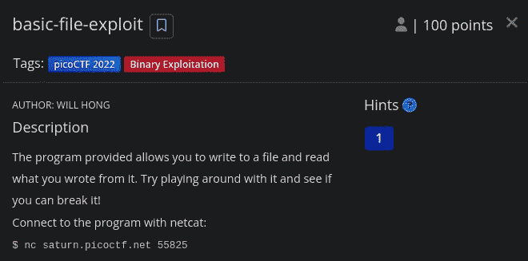
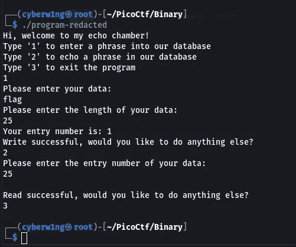
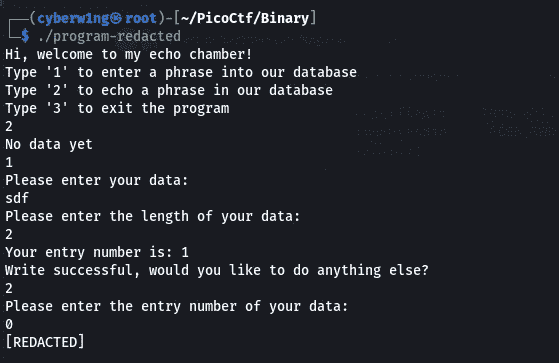
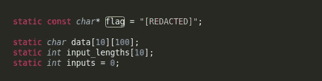
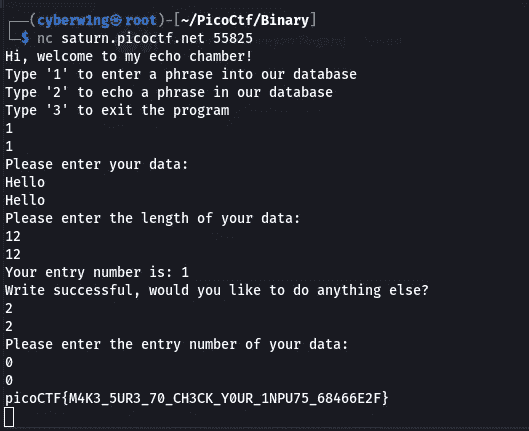

# 基本文件漏洞利用(100 分)—二进制漏洞利用报道|皮科 CTF 2022

> 原文：<https://infosecwriteups.com/basic-file-exploit-100-points-binary-exploitation-writeup-pico-ctf-2022-66d21d266a72?source=collection_archive---------3----------------------->

## 基本文件利用 PicoCTF 2022 的二进制利用挑战| Karthikeyan Nagaraj 的方法

[](https://play.picoctf.org/practice/challenge/252?category=6&page=1)

## **描述:**

*   提供的程序允许你写一个文件，并从中读取你写的内容。
*   试着玩玩它，看看你是否能打破它！
*   用 netcat 连接程序:
    `nc saturn.picoctf.net 55825`

## 使用的工具— Netcat

## **任务文件:**

[https://artifacts.picoctf.net/c/542/program-redacted.c](https://artifacts.picoctf.net/c/542/program-redacted.c)

## **分析:**

```
#include <stdio.h>
#include <stdlib.h>
#include <stdbool.h>
#include <string.h>
#include <stdint.h>
#include <ctype.h>
#include <unistd.h>
#include <sys/time.h>
#include <sys/types.h>

#define WAIT 60

static const char* flag = "[REDACTED]";

static char data[10][100];
static int input_lengths[10];
static int inputs = 0;

int tgetinput(char *input, unsigned int l)
{
    fd_set          input_set;
    struct timeval  timeout;
    int             ready_for_reading = 0;
    int             read_bytes = 0;

    if( l <= 0 )
    {
      printf("'l' for tgetinput must be greater than 0\n");
      return -2;
    }

    /* Empty the FD Set */
    FD_ZERO(&input_set );
    /* Listen to the input descriptor */
    FD_SET(STDIN_FILENO, &input_set);

    /* Waiting for some seconds */
    timeout.tv_sec = WAIT;    // WAIT seconds
    timeout.tv_usec = 0;    // 0 milliseconds

    /* Listening for input stream for any activity */
    ready_for_reading = select(1, &input_set, NULL, NULL, &timeout);
    /* Here, first parameter is number of FDs in the set, 
     * second is our FD set for reading,
     * third is the FD set in which any write activity needs to updated,
     * which is not required in this case. 
     * Fourth is timeout
     */

    if (ready_for_reading == -1) {
        /* Some error has occured in input */
        printf("Unable to read your input\n");
        return -1;
    } 

    if (ready_for_reading) {
        read_bytes = read(0, input, l-1);
        if(input[read_bytes-1]=='\n'){
        --read_bytes;
        input[read_bytes]='\0';
        }
        if(read_bytes==0){
            printf("No data given.\n");
            return -4;
        } else {
            return 0;
        }
    } else {
        printf("Timed out waiting for user input. Press Ctrl-C to disconnect\n");
        return -3;
    }

    return 0;
}

static void data_write() {
  char input[100];
  char len[4];
  long length;
  int r;

  printf("Please enter your data:\n");
  r = tgetinput(input, 100);
  // Timeout on user input
  if(r == -3)
  {
    printf("Goodbye!\n");
    exit(0);
  }

  while (true) {
    printf("Please enter the length of your data:\n");
    r = tgetinput(len, 4);
    // Timeout on user input
    if(r == -3)
    {
      printf("Goodbye!\n");
      exit(0);
    }

    if ((length = strtol(len, NULL, 10)) == 0) {
      puts("Please put in a valid length");
    } else {
      break;
    }
  }

  if (inputs > 10) {
    inputs = 0;
  }

  strcpy(data[inputs], input);
  input_lengths[inputs] = length;

  printf("Your entry number is: %d\n", inputs + 1);
  inputs++;
}

static void data_read() {
  char entry[4];
  long entry_number;
  char output[100];
  int r;

  memset(output, '\0', 100);

  printf("Please enter the entry number of your data:\n");
  r = tgetinput(entry, 4);
  // Timeout on user input
  if(r == -3)
  {
    printf("Goodbye!\n");
    exit(0);
  }

  if ((entry_number = strtol(entry, NULL, 10)) == 0) {
    puts(flag);
    fseek(stdin, 0, SEEK_END);
    exit(0);
  }

  entry_number--;
  strncpy(output, data[entry_number], input_lengths[entry_number]);
  puts(output);
}

int main(int argc, char** argv) {
  char input[3] = {'\0'};
  long command;
  int r;

  puts("Hi, welcome to my echo chamber!");
  puts("Type '1' to enter a phrase into our database");
  puts("Type '2' to echo a phrase in our database");
  puts("Type '3' to exit the program");

  while (true) {   
    r = tgetinput(input, 3);
    // Timeout on user input
    if(r == -3)
    {
      printf("Goodbye!\n");
      exit(0);
    }

    if ((command = strtol(input, NULL, 10)) == 0) {
      puts("Please put in a valid number");
    } else if (command == 1) {
      data_write();
      puts("Write successful, would you like to do anything else?");
    } else if (command == 2) {
      if (inputs == 0) {
        puts("No data yet");
        continue;
      }
      data_read();
      puts("Read successful, would you like to do anything else?");
    } else if (command == 3) {
      return 0;
    } else {
      puts("Please type either 1, 2 or 3");
      puts("Maybe breaking boundaries elsewhere will be helpful");
    }
  }

  return 0;
}
```

## 输出:



请注意`program-redacted.c`中这个特殊的代码块

*   这里条件语句有一个`puts()`函数，如果条件的结果是`True`，它将显示`flag`变量的值
*   如果操作数的结果为 0，则条件为真。
*   因此，如果我们将值 0 放在入口点编号上，我们将得到标志

```
printf(“Please enter the entry number of your data:\n”);
 r = tgetinput(entry, 4);

 if(r == -3)
 {
     printf(“Goodbye!\n”);
     exit(0);
 }
 // Notice the below Condition
 if ((entry_number = strtol(entry, NULL, 10)) == 0)
 {
     puts(flag); // This will Display the Flag if the Condition is True
     fseek(stdin, 0, SEEK_END);
     exit(0);
 }
```



`[REDACTED]`是该程序中标志变量的值。
那么让我们连接到 netcat 服务器并利用它吧！！

```
nc saturn.picoctf.net 55825
```



```
Ans: picoCTF{M4K3_5UR3_70_CH3CK_Y0UR_1NPU75_68466E2F}
```

请随时通过 [LinkedIn](https://www.linkedin.com/in/karthikeyan-nagaraj) :)提问


感谢您的阅读！！

快乐剥削~

```
Author: Karthikeyan Nagaraj
```

ctf，二进制，基本文件利用，基本文件利用，二进制利用，netcat，捕获标志，挑战，写文章，标志，karthikeyan nagaraj，cyberw1ng

## 来自 Infosec 的报道:Infosec 每天都有很多内容，很难跟上。[加入我们的每周简讯](https://weekly.infosecwriteups.com/)以 5 篇文章、4 个线程、3 个视频、2 个 GitHub Repos 和工具以及 1 个工作提醒的形式免费获取所有最新的 Infosec 趋势！