# 基本测试:1 次演练| Vulnhub

> 原文：<https://infosecwriteups.com/basic-pentesting-1-walkthrough-vulnhub-4dac91b416ff?source=collection_archive---------0----------------------->

## 这个演练是对基本的 Pentesting: 1 Vulnhub 机器由约西亚皮尔斯。它包括许多远程漏洞和提升权限的途径。点击[此处](https://www.vulnhub.com/entry/basic-pentesting-1,216/)了解更多详情或下载机器。

所以首先我得找到目标机器的 IP 地址。然后我使用了 **netdisover** 命令。

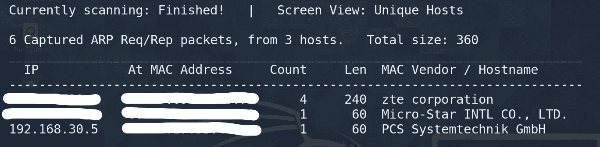

**< netdisover >**

在侦察的第一步，我执行了一个 **nmap 扫描**来识别开放的端口。

## **nmap-sC-sV-Pn<IP>**

-sC:默认脚本
-sV:默认版本
-Pn:跳过主机发现

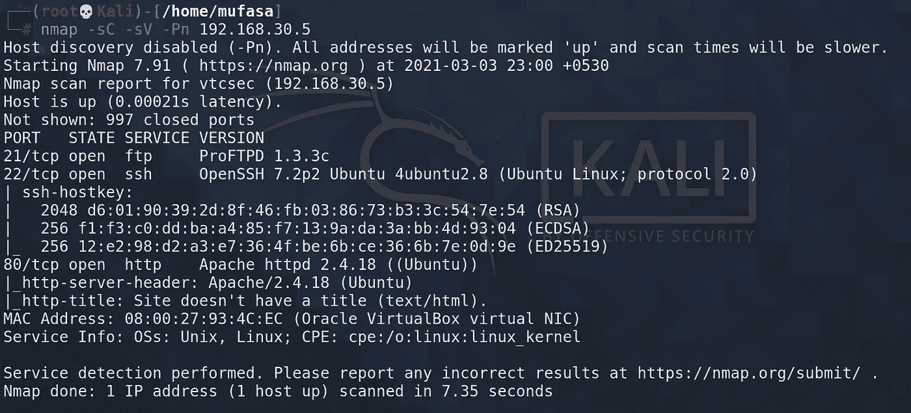

**nmap 扫描>**

所以在这台目标机器上有三个开放的端口。

*   **端口 21/tcp — FTP — (ProFTPD 1.3.3c)**
*   **端口 22/TCP—SSH—(OpenSSH 7.2 p2 Ubuntu)**
*   **端口 80/TCP—HTTP—(Apache httpd 2 . 4 . 18)**

我选择了**开放端口 21 FTP 服务**来找到一种方法来获得对这台目标机器的根访问权限。

我用**searchsploi**t command 在 **ExploitDB 上搜索 **ProFTPD 1.3.3c** 。**

*【Searchsploit 是 Exploit-DB 的命令行搜索工具，也可以让你随身携带 Exploit-DB 的副本。]*
*【ProFTPD 是一个用于 Unix/Linux 服务器的 FTP 服务器，非常可配置，非常有效，它是免费的&开源的，在 GPL 许可下发布。】*

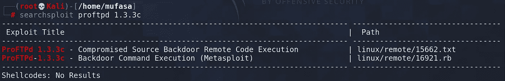

**< searchsploit >**

然后我发现了两个漏洞。ProFTPD 1.3.3c 被后门程序攻破，后门程序是源代码背后的恶意代码。Metasploit-framework 可以利用此后门命令执行漏洞。

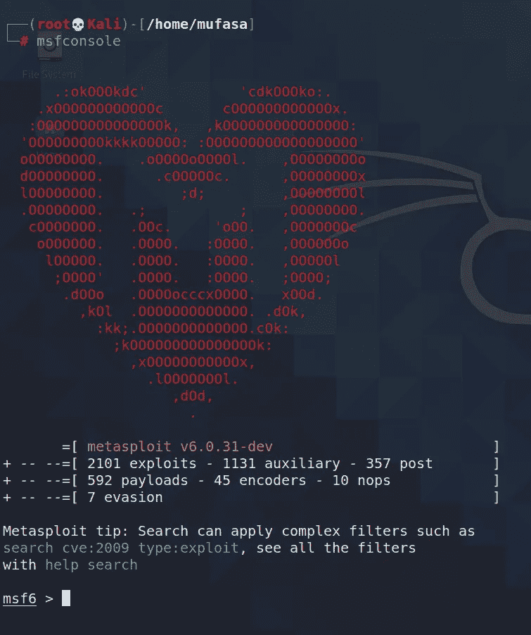

**<Metasploit-framework>**

在 Metasploit 控制台中，我搜索了 **proftpd** 以找到一个漏洞。

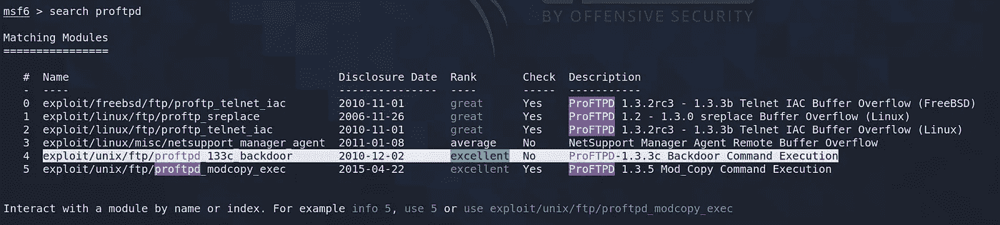

**< Metasploit-framework —搜索>**

所以有好几个功勋都得这个 **proftpd** 。而我用**exploit/UNIX/FTP/proftpd _ 133 c _ back door**攻击目标机。

现在，我将看看此利用的选项。

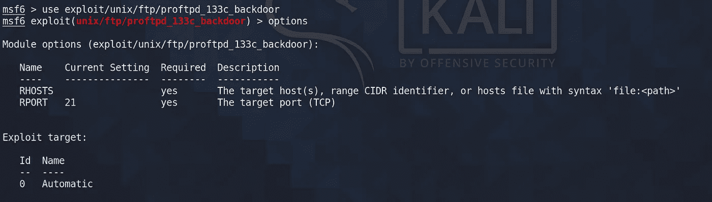

**< Metasploit-framework —选项>**

所以，现在我必须指定 **RHOST** 【目标机器的 IP 地址】

**<Metasploit-framework—set RHOST>**

设置 RHOST 后，我搜索了**有效载荷**来寻找这个。

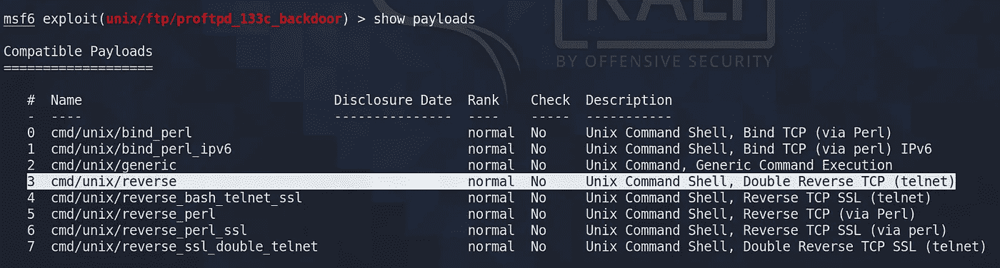

**< Metasploit-framework —显示有效负载>**

所以有各种有效载荷，我选择了 **cmd/unix/reverse** 有效载荷来利用这个漏洞。

设置**有效载荷**

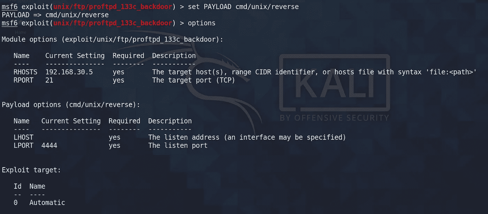

**< Metasploit-framework —设置有效载荷>**

在设置有效负载之后，我必须指定 LHOST [我的 Kali 机器的 IP]

**<Metasploit-framework—set LHOST>**

好酷，所有的设置都已经完成了。现在我必须利用这一点。

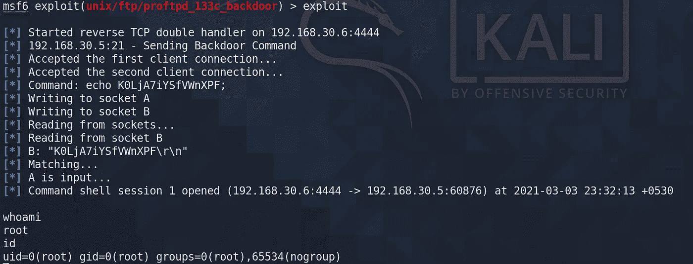

**< Metasploit-framework —漏洞利用>**

好了，现在我有了对目标机器的根访问权。现在我要去找出马林鱼的密码。

现在我打开 **python 衍生 shell**
*交互终端衍生 via Pythonedit
识别一个终端(tty——终端的 tty 命令基本上打印连接到标准输入的终端的文件名。)是通过 Python 产生的。攻击者在获得对主机的初始访问权限后，可能会将简单的反向 shell 升级为完全交互式 tty。*

然后我在看影子文件
*影子密码文件是一个存储加密用户密码的系统文件，这样那些试图闯入系统的人就无法得到这些密码。*

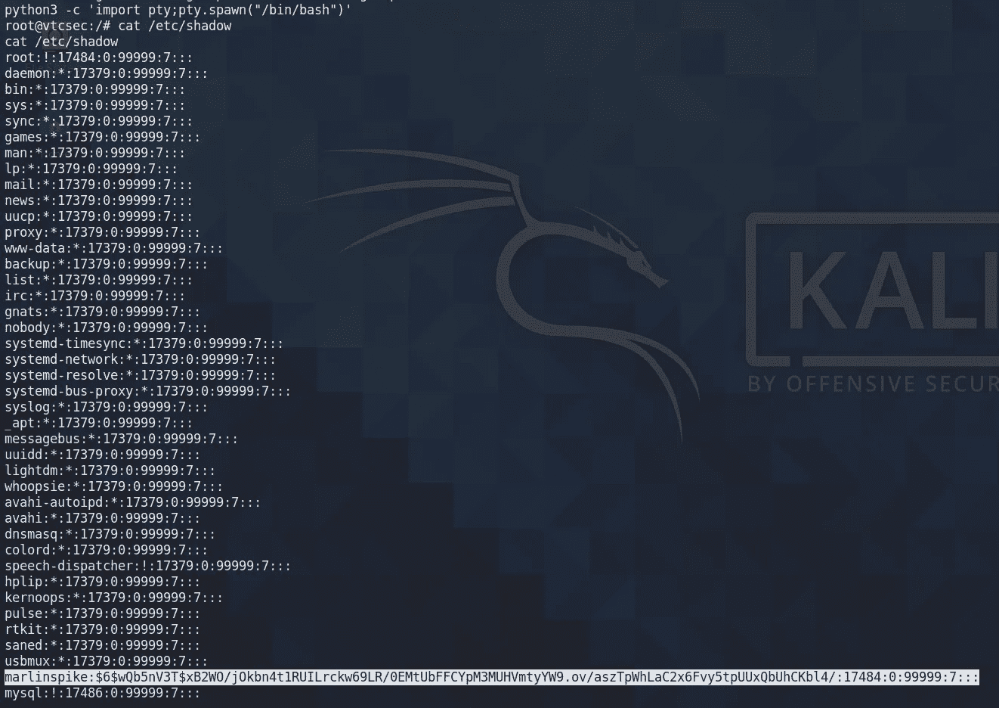

**<找到影子文件>**

现在我把这个复制到一个新文件中来破解这个**hash**
**marlin spike:$ 6 $ wqb 5 NV 3t $ xB2WO/jokbn 4 t1 ruilrckw 69 lr/0 emtubbffcypm 3 muhvmtyy w 9 . ov/asztpwhlac 2 x 6 fvy 5 tpuxqbuhckbl 4/:17484:0:99999:7:::**

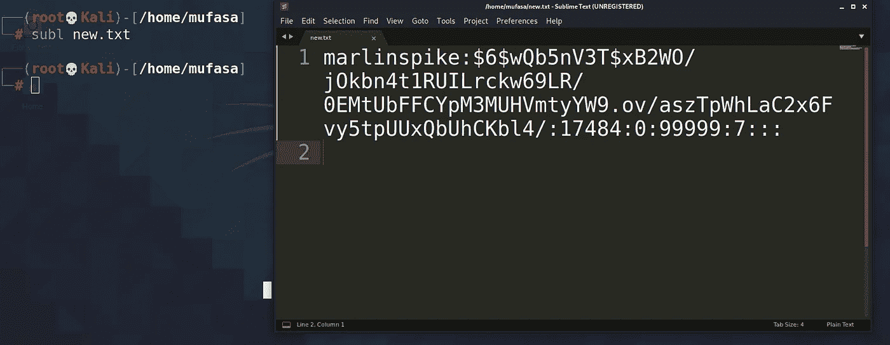

**<复制哈希>**

现在我用**开膛手约翰**来破解这个杂凑

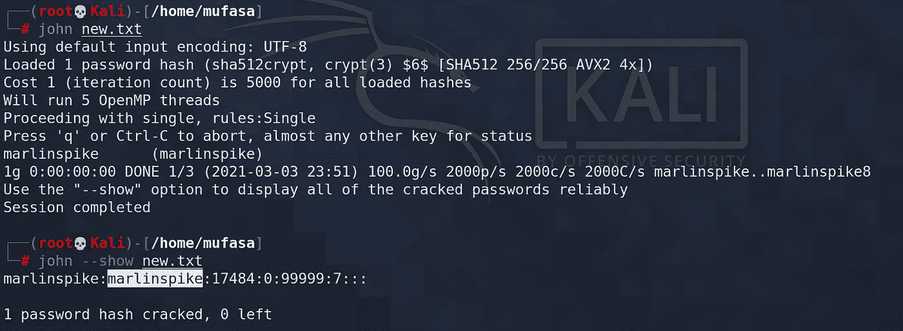

**<破解哈希>**

最后，我找到了**马林鱼**的密码，它就是**马林鱼**

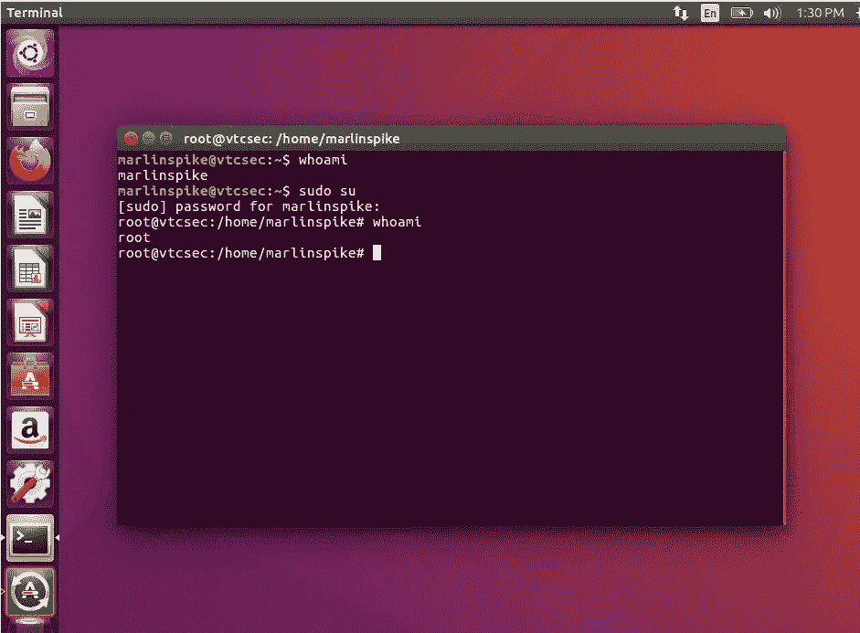

最后，我获得 root 访问权限，并找到这个机器的 **marlinspike** 用户的密码。我使用了**开放端口 21/tcp — FTP — (ProFTPD 1.3.3c)** 来开发这个基本的 Pentester:Vulnhub 中的 1 Box。

## 总的来说，这是一个有趣的任务。我花了一段时间来了解细节，但它为我提供了一个很好的渗透基本测试的介绍，并确保我的家庭实验室工作良好。