# 基本 SPLUNK 101 演练试用版

> 原文：<https://infosecwriteups.com/basic-splunk-101-walkthrough-tryhackme-24b9df21256e?source=collection_archive---------0----------------------->

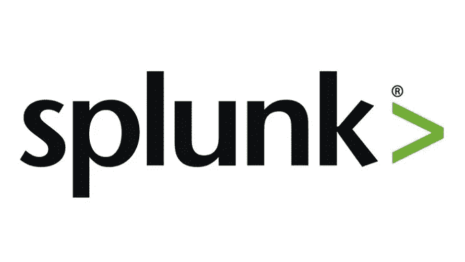

SIEM 代表安全信息和事件管理，为组织提供下一代检测、分析和响应。SIEM 软件结合了安全信息管理(SIM)和安全事件管理(SEM ),对应用程序和网络硬件生成的安全警报进行实时分析。SIEM 软件将事件与规则和分析引擎进行匹配，并对其进行索引以进行亚秒级搜索，从而使用全球收集的情报来检测和分析高级威胁。通过提供数据分析、事件关联、聚合、报告和日志管理，安全团队可以洞察并跟踪其 IT 环境中的活动。

SIEM 软件具有许多功能和优势，包括:

*   多个数据点的整合
*   自定义仪表板和警报工作流管理
*   与其他产品的集成

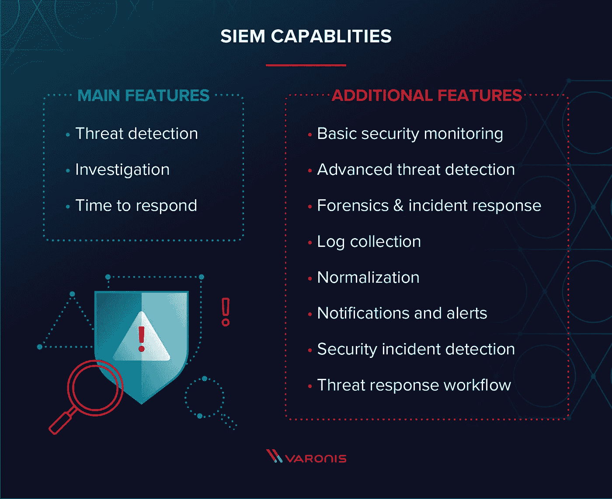

Splunk 是一个软件平台，广泛用于**实时监控、搜索、分析和可视化机器生成的数据**。它在一个可搜索的容器中执行实时数据的捕获、索引和关联，并生成图表、警报、仪表板和可视化效果

 [## 网络安全培训

### TryHackMe 是一个免费的学习网络安全的在线平台，使用动手练习和实验室，通过您的…

tryhackme.com](https://tryhackme.com/room/splunk101) 

阅读给这个房间的所有内容。因为它可以帮助你很容易地理解 Splunk

我们的第一步是将插件添加到 Splunk。

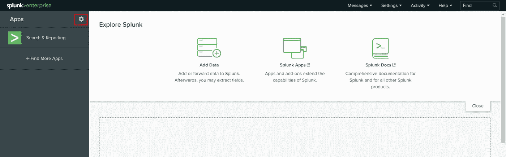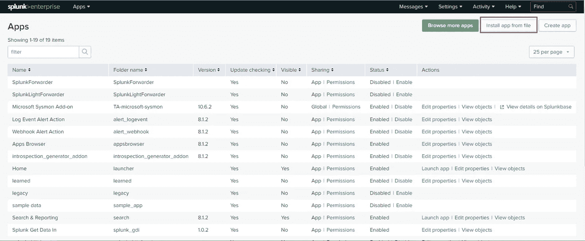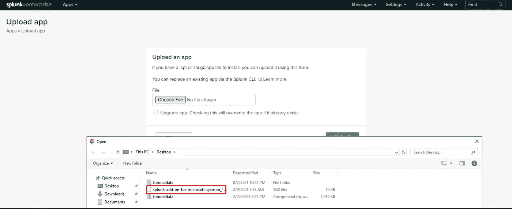

## Q1)附件的“文件夹名”是什么？

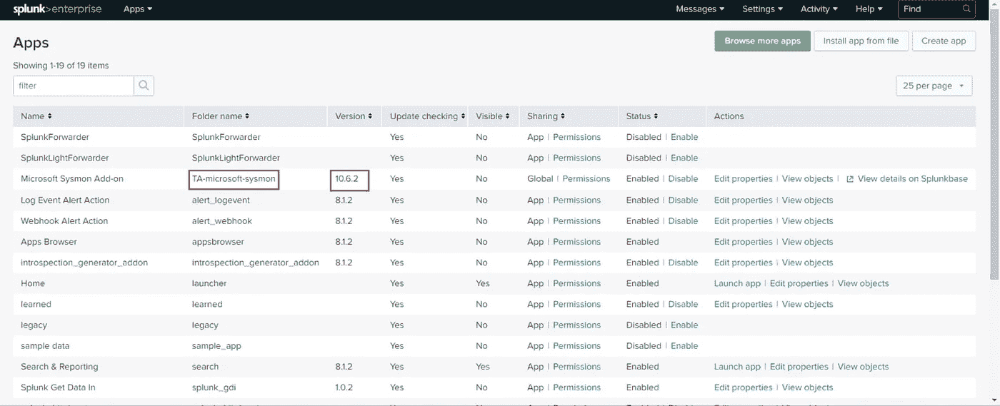

> 答:TA-微软-sysmon

## Q2)版本是什么？

> 答复:10.6.2

下一步是在 splunk 中上传 tutorialdata.zip。

让我们开始吧，

步骤 1:从 splunk 主页选择添加数据选项

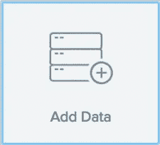

步骤 2:选择上传选项

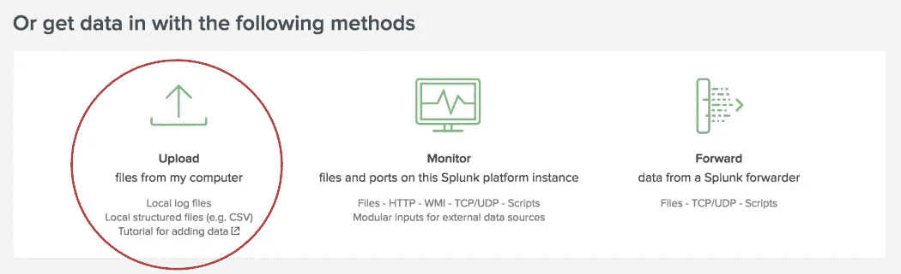

步骤 3:从桌面上选择 tutorialdata.zip

第 4 步:点击下一步，并添加下面给定的数据

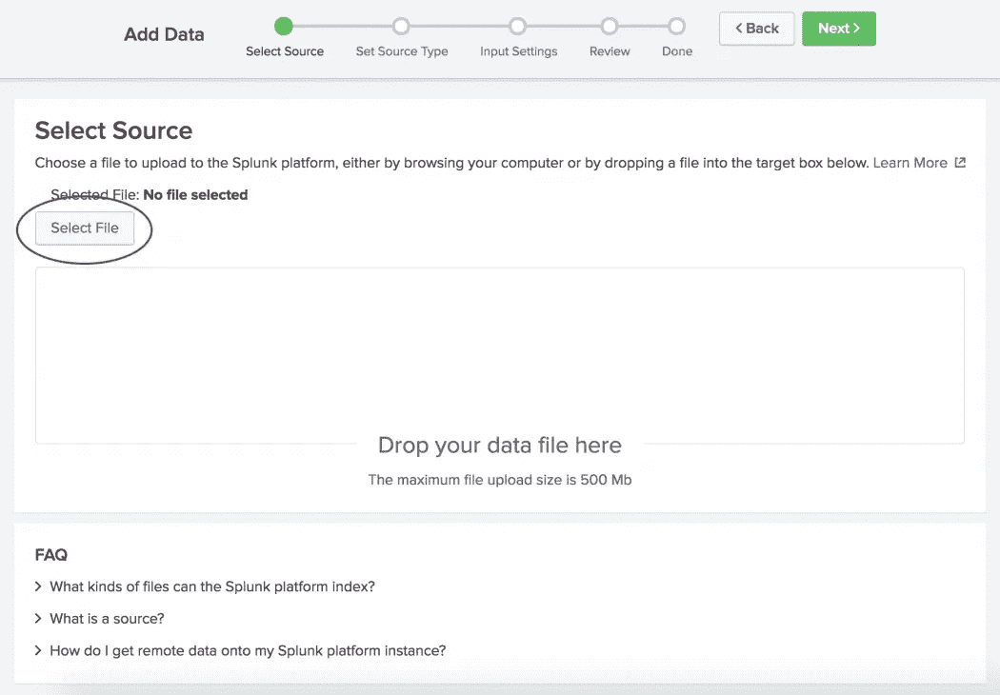

> 这取决于你使用什么操作系统

适用于 Linux 或 Mac OS X 的 Splunk 企业版

a.选择路径中的**段。**

b.键入`**1**`作为段号。

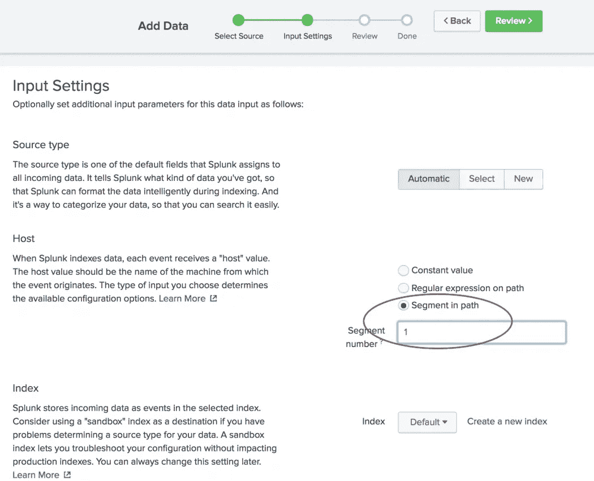

splunk Windows 企业版

a.选择路径上的**正则表达式。**

b.键入`**\\(.*)\/**`让正则表达式从路径中提取主机值。

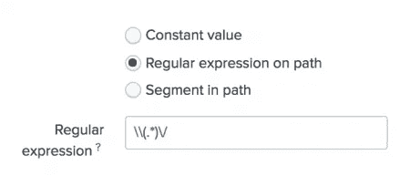

第五步:点击评论

第 6 步:点击提交并选择开始搜索选项

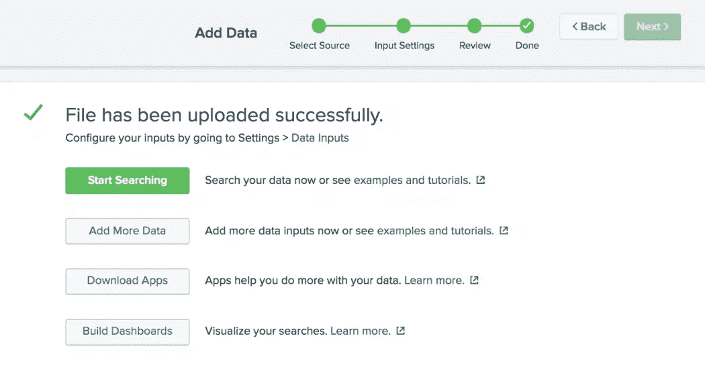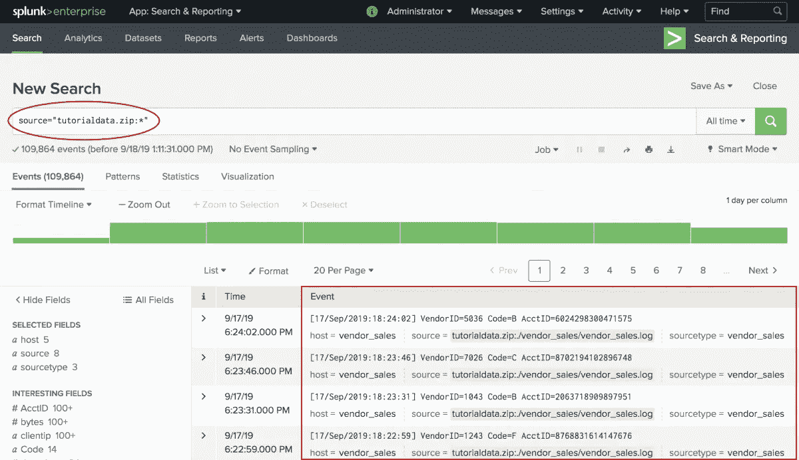

## 问题 3)在桌面上上传 Splunk 教程数据。这个源中有多少个事件？

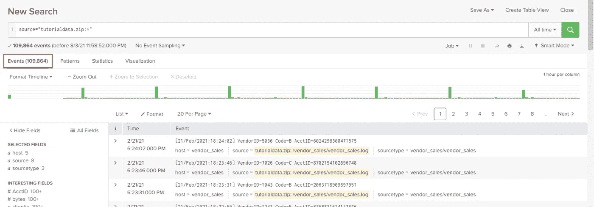

> **答案:109864**

## Splunk 查询

搜索栏中的星号*并将搜索时间范围从过去 24 小时更改为所有时间。
我们可以使用源查询来访问 sysmon 日志事件。

例如:source = " XmlWinEventLog:Microsoft-Windows-Sysmon/Operational "

在查询区域，我们可以使用不同种类的字段。不要忘记字段是区分大小写的。

例如:source = " XmlWinEventLog:Microsoft-Windows-Sysmon/Operational " event id = 12

我们也可以使用关键字。但是它们不区分大小写。

例如:源="XmlWinEventLog:微软视窗系统/操作" googleupdate.exe

## Q 4)什么是源类型？

ANS 提示:在搜索区搜索“失败的密码”并查看来源类型。打开源类型，看看底部，我们可以看到值。

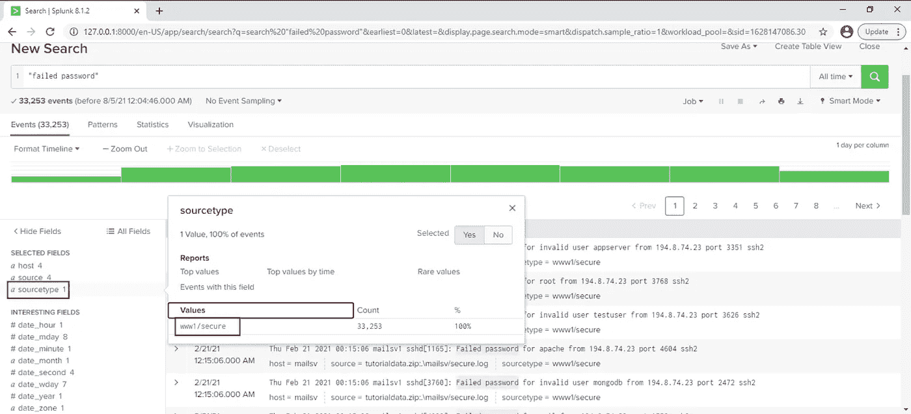

> **答:www1/secure**

## 问题 5)此选项卡中的最后一个用户名是什么？

ANS 提示:打开模式部分并搜索表中的最后一个事件

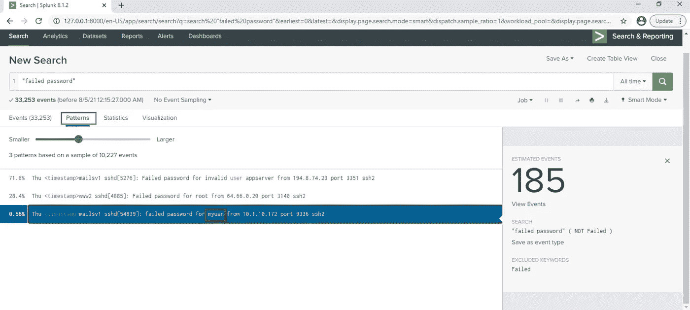

> **ANS : myuan**

## 问题 6)搜索此特定用户名的失败密码事件。返回了多少个事件？

ANS 提示:使用帐户用户名作为关键字搜索“密码失败”查询，如“密码失败”myuan

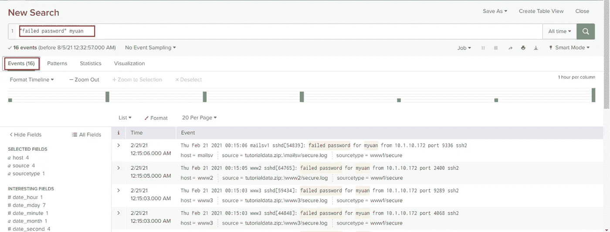

> **ANS : 16**

## Q 7)使用**选择文件**功能。Splunk 对“sigma: APT29”的查询是什么？

回答提示:转到[https://uncoder.io/](https://uncoder.io/)并从“选择文档”区域选择 APT29。从“翻译到”区域选择 Splunk，然后翻译它。这是您搜索 APT29 的 Splunk 查询

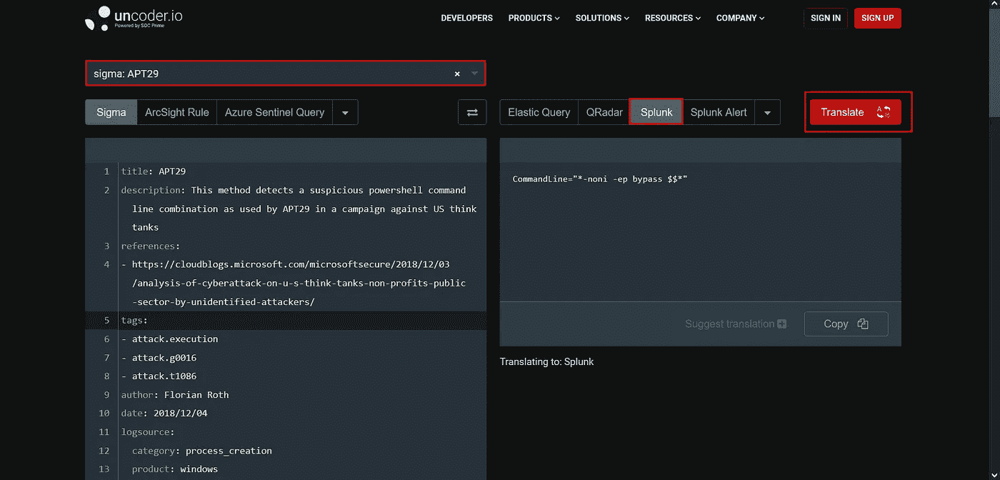

> ANS:命令行="*-noni -ep bypass $$* "

## Q 8)使用 Github 适马回购。Splunk 对“CACTUSTORCH 远程线程创建”的查询是什么？

ANS 提示:打开[https://github.com/SigmaHQ/sigma](https://github.com/SigmaHQ/sigma)->规则- >窗口->-**创建 _ 远程 _ 线程->-**sysmon _ cactus torch . yml

打开并复制它，然后将其粘贴到[https://uncoder.io/](https://uncoder.io/)，并将其转换为 Splunk 查询

> ANS:(event code = " 8 "(source image = " * \ \ System32 \ \ cscript . exe "或 source image = " * \ \ System32 \ \ wscript . exe "或 source image = " * \ \ System32 \ \ mshta . exe "或 SourceImage="*\\winword.exe "或 source image = " * \ \ excel . exe ")NOT start module = " * " target image = " * \ \ sys wow 64 \ \ * ")

## Q 9)最高的 EventID 是什么？

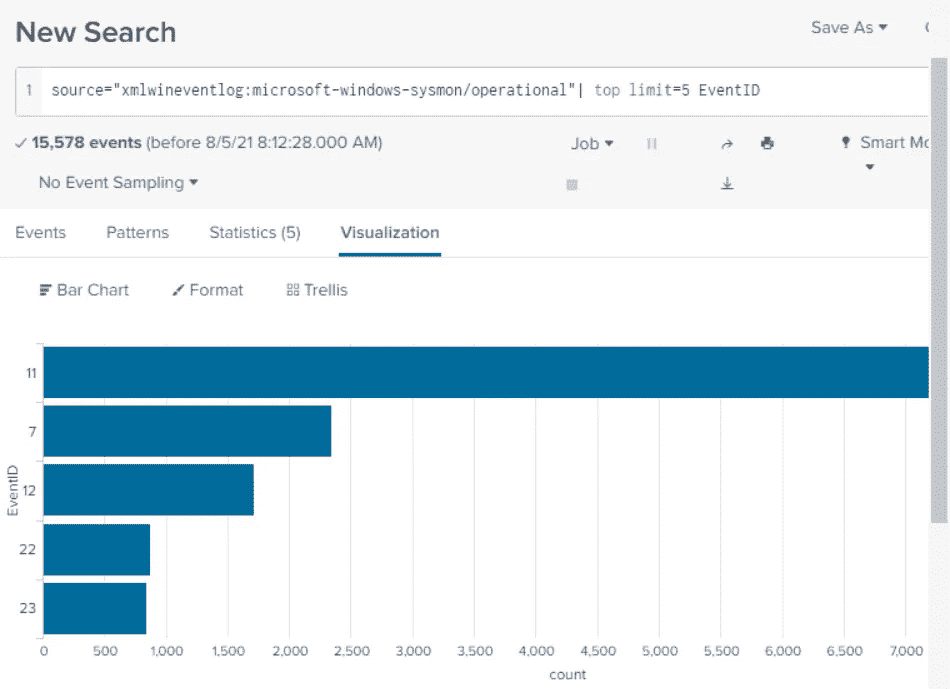

> 答:11

了解更多信息

 [## Sysmon - Windows 系统内部

### 发布时间:2021 年 7 月 27 日下载 Sysmon (2.9 MB)系统监视器(Sysmon)是一个 Windows 系统服务和设备…

docs.microsoft.com](https://docs.microsoft.com/en-us/sysinternals/downloads/sysmon)  [## 安装 Splunk 企业版

### 以 PDF 格式下载主题这些步骤仅适用于 Splunk 企业版。如果您使用的是 Splunk 云，请转到导航…

docs.splunk.com](https://docs.splunk.com/Documentation/Splunk/8.1.2/SearchTutorial/InstallSplunk)  [## 浏览 Splunk 网站

### 下载 PDF 格式的主题让我们熟悉一下 Splunk 用户界面。Splunk Web 是…的主要界面

docs.splunk.com](https://docs.splunk.com/Documentation/Splunk/8.1.2/SearchTutorial/NavigatingSplunk)  [## 管理应用程序和加载项对象

### 以 PDF 格式下载主题当 Splunk 用户创建或时，会创建组成应用程序的对象集合…

docs.splunk.com](https://docs.splunk.com/Documentation/Splunk/8.1.2/Admin/Managingappobjects)  [## 开始获取数据

### 以 PDF 格式下载主题要开始将数据导入您的 Splunk 部署，请将您的部署指向一些数据…

docs.splunk.com](https://docs.splunk.com/Documentation/Splunk/8.1.2/Data/Getstartedwithgettingdatain#Use_apps_to_get_data_in)  [## 探索搜索视图

### 以 PDF 格式下载主题在第 2 部分中，您了解了 Splunk 平台使用和上传的数据类型…

docs.splunk.com](https://docs.splunk.com/Documentation/Splunk/8.1.2/SearchTutorial/Aboutthesearchapp)  [## 基本搜索和搜索结果

### 在本节中，您将创建从索引中检索事件的搜索。本教程的数据是为…

docs.splunk.com](https://docs.splunk.com/Documentation/Splunk/8.1.2/SearchTutorial/Startsearching)  [## 指定时间范围

### 使用时间范围限制或过滤您的搜索标准是优化的最简单和最有效的方法…

docs.splunk.com](https://docs.splunk.com/Documentation/Splunk/8.1.2/SearchTutorial/Aboutthetimerangepicker)  [## 启用字段查找

### 本教程数据中使用的事件包含带有产品代码和产品 id 的字段。这些代码和 id 不…

docs.splunk.com](https://docs.splunk.com/Documentation/Splunk/8.1.2/SearchTutorial/Usefieldlookups)  [## 使用字段进行搜索

### 要利用 Splunk 软件中的高级搜索功能，您必须了解什么是字段以及如何…

docs.splunk.com](https://docs.splunk.com/Documentation/Splunk/8.1.2/SearchTutorial/Usefieldstosearch)  [## 使用字段查找进行搜索

### 以 PDF 格式下载主题现在您已经定义了 prices_lookup，您可以在您的…中看到该查找中的字段

docs.splunk.com](https://docs.splunk.com/Documentation/Splunk/8.1.2/SearchTutorial/Searchwithfieldlookups)  [## 关于 Splunk 正则表达式

### 这本入门书帮助你创建有效的正则表达式。有关正则表达式语法和用法的讨论，请参见…

docs.splunk.com](https://docs.splunk.com/Documentation/Splunk/8.1.2/Knowledge/AboutSplunkregularexpressions)  [## GitHub-sigma HQ/sigma:SIEM 系统的通用签名格式

### SIEM Systems 适马通用签名格式是一种通用的开放式签名格式，允许您描述…

github.com](https://github.com/SigmaHQ/sigma)  [## 未编码。IO |适用于 SIEM、EDR 和 NTDR 的通用适马规则转换器

### 阅读 Gartner 的免费研究报告“如何为您的 SIEM 构建安全使用案例”安全使用案例…

uncoder.io](https://uncoder.io/)  [## 仪表板概述

### 以 PDF 格式下载主题创建新仪表板或编辑现有仪表板。快速浏览最常见的使用案例和…

docs.splunk.com](https://docs.splunk.com/Documentation/Splunk/8.1.2/Viz/WebFramework)  [## 入门指南

### 本文档不适用于 Splunk 的最新版本。点击此处获取最新版本。下载…

docs.splunk.com](https://docs.splunk.com/Documentation/Splunk/8.1.2/Viz/Aboutthismanual)  [## 创建仪表板

### 下载主题，因为 PDF 仪表板是在特定应用程序的上下文中创建的。例如，如果您正在使用…

docs.splunk.com](https://docs.splunk.com/Documentation/Splunk/8.1.2/Viz/CreateDashboards)  [## 向仪表板添加面板

### 了解如何添加和编辑仪表板面板。要了解仪表板面板的类型，请参见使用仪表板…

docs.splunk.com](https://docs.splunk.com/Documentation/Splunk/8.1.2/Viz/AddPanels)  [## 创建仪表板和面板

### 下载 PDF 格式的主题在本节中，您将把搜索保存为仪表板面板，并将输入元素添加到…

docs.splunk.com](https://docs.splunk.com/Documentation/Splunk/8.1.2/SearchTutorial/Createnewdashboard) 

谢谢你的支持