# Bastion — HackTheBox 详细报道

> 原文：<https://infosecwriteups.com/bastion-hackthebox-writeup-3c57d89476e4?source=collection_archive---------0----------------------->

## ***Bastion 是一个有趣的盒子，需要通过远程共享挂载 VHD 文件，并通过 SSH 破解一些 SAM 哈希才能进入盒子。对于 privesc，我将在 mRemoteNG 的备份配置文件中找到管理员的凭据。稍后，我将使用找到的凭据以管理员身份登录来完成这个框。说了这么多，让我们直接开始吧。***

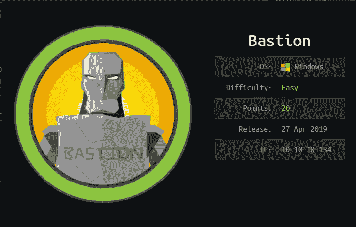

信息卡

# 计数和侦察

像往常一样，让我们从 Nmap 扫描开始。

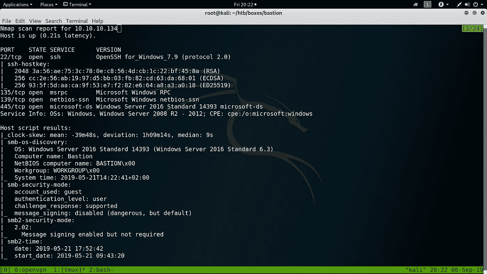

NMAP 扫描所有 TCP 端口

`**nmap**`给出了一些有趣的 Windows 服务: **SMB (135/139/445)** 和 **SSH ( 22 )**

# SMB 枚举

`smbmap`不显示任何空会话。

让我们试着以某个`invalid user`的身份登录。

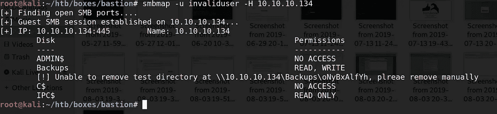

**备份**分享看起来很有趣。让我们看看有什么。

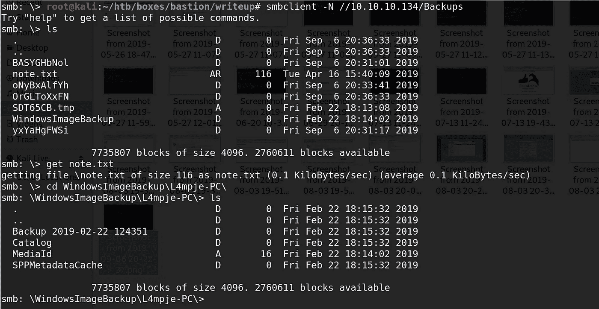

有一个有趣的文件` **note.txt** 和一个文件夹` **WindowsImageBackup**

还有一个`**备份**文件夹。让我们看看备份文件夹里有什么。

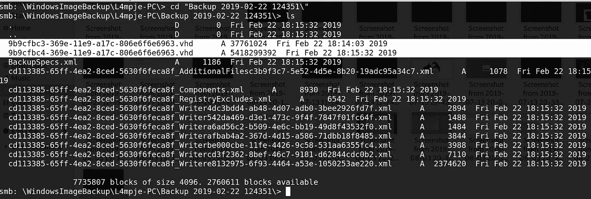

里面有很多东西。我感兴趣的是 VHD 文件(上图中突出显示的)和`BackupSpecs.xml`文件。

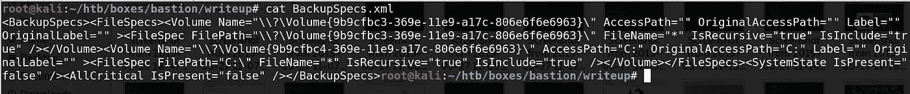

BackupSpecs.xml 讲卷 9 B9 cfbc 3–369 e-11e 9-a17c-806 E6 f 6 e 6963 和 9 B9 cfbc 3–369 e-11e 9-a17c-806 E6 f 6 e 6963。

# 通过远程共享装载 VHD 文件

我看到了这篇优秀的文章[通过远程共享在 Kali Linux 上安装 VHD 文件](https://medium.com/@klockw3rk/mounting-vhd-file-on-kali-linux-through-remote-share-f2f9542c1f25)

浏览上述文章中的步骤，这是通过远程共享挂载 VHD 文件的命令。

> **mount-t CIFS-o username = guest//10 . 10 . 10 . 134/Backups/mnt/bastion/**

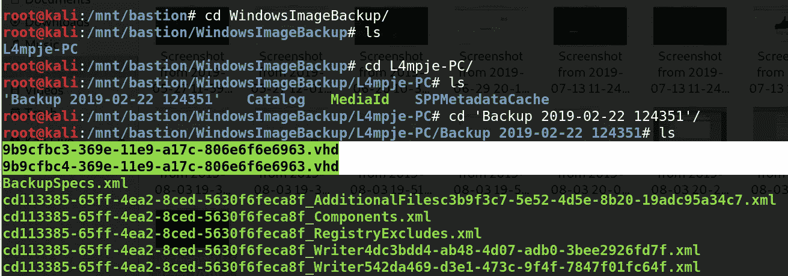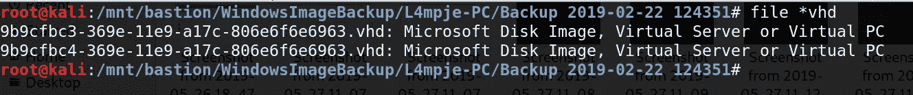

针对 VHD 映像的文件命令

> **guest mount—add/mnt/bastion/WindowsImageBackup/L4mpje-PC/Backup \ 2019–02–22 \ 124351/9 B9 cfbc 4–369 e-11e 9-a17c-806 e6f 6 e 6963 . vhd—inspector—ro/mnt/vhd-v**

在 guestmount 命令完成执行后，我们可以通过查看/mnt/vhd 文件夹来查看 VHD 文件中有什么

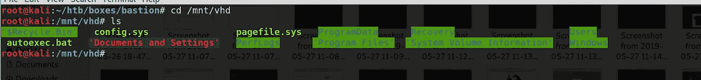

因为我们可以访问 Windows 文件系统，所以让我们首先使用这些文件来获取 NTLM 散列

> **C:\ windows \ system32 \ config \ SYSTEM
> C:\ windows \ system32 \ config \ SAM**

使用 samdump2，我们可以转储 NTLM 哈希。

# 破解哈希

用下面的命令破解散列

## hashcat-m 1000 hashes/usr/share/word lists/rock you . txt—force

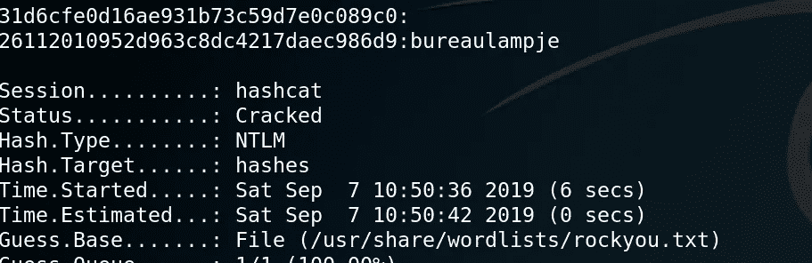

> *Hashcat 奏效了！！*
> ***用户:L4mpje***
> 
> ***密码:bureaulampje***

# 外壳为 L4mpje

用上面的密码以 L4mpje 的身份登录，我们进入了系统。

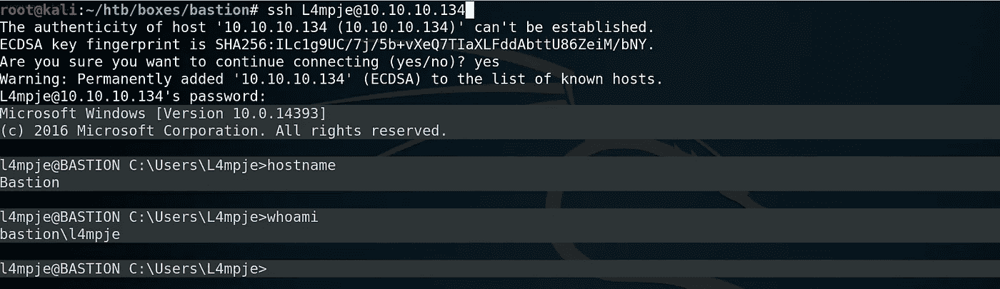

我们可以从这里获得 user.txt 标志。

# Privesc: L4mpje ->管理员

对于权限提升，我通常在运行任何枚举脚本之前尝试手动查找感兴趣的文件。在这样做的时候，我最终找到了一个名为 **mRemoteNG 的文件夹。**

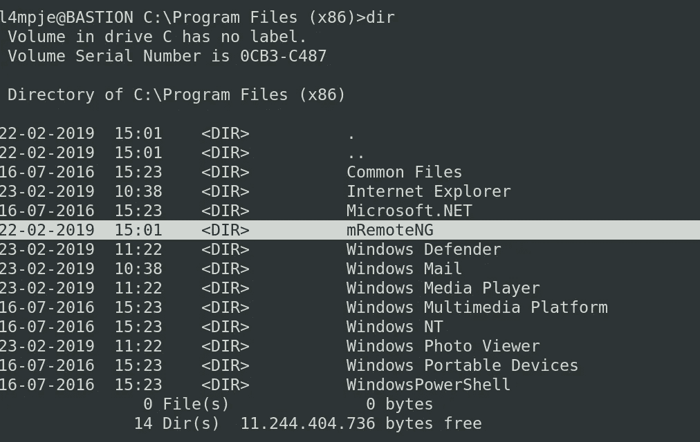

在谷歌上快速搜索一下 mRemoteNG 就可以看到这个，

> 一个开源的、选项卡式的、多协议的远程连接管理器。mRemoteNG 为 mRemote 增加了 bug 修复和新功能。它允许您在一个简单而强大的选项卡式界面中查看所有的远程连接。

经过一番研究，我发现存储在 mRemoteNG 中的密码可以被解密，也碰到了这个工具。

 [## hase ebt/mRemoteNG-解密

### 此时您不能执行该操作。您已使用另一个标签页或窗口登录。您已在另一个选项卡中注销，或者…

github.com](https://github.com/haseebT/mRemoteNG-Decrypt) 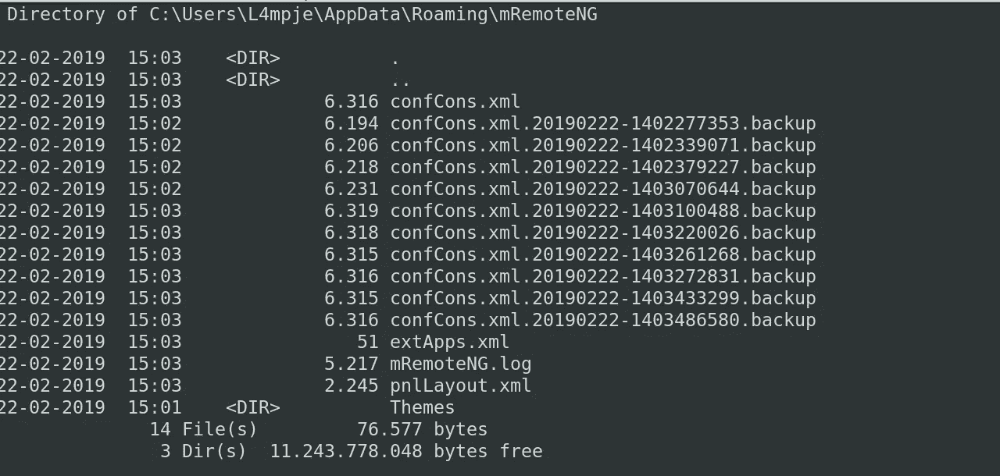

confCons.xml 文件

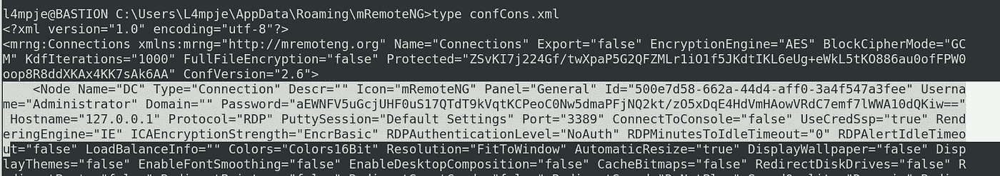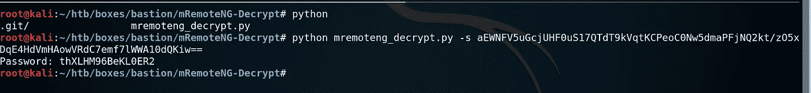

> 就在那里。我们已经得到了管理员的密码。
> 用户:管理员
> 
> 密码:thXLHM96BeKL0ER2

# 作为管理员的 Shell

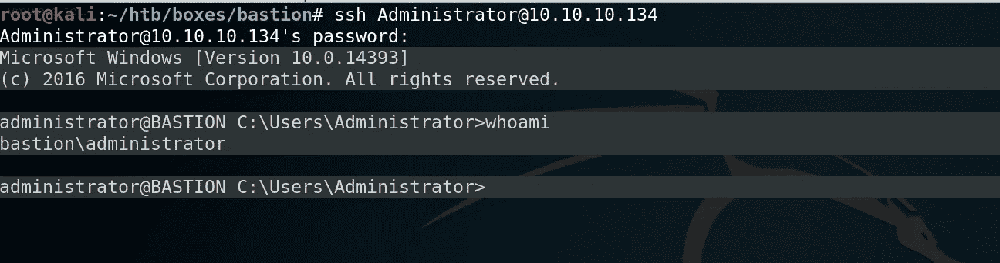

以管理员身份登录，我们成为管理员。
我就说到这里，如果你喜欢这篇文章，请鼓掌。
非常感谢您的反馈。

**感谢并快乐黑客，
Preetham(**[***@ cyber 01***](https://www.hackthebox.eu/profile/9160)***)***

**关注* [*Infosec 报道*](https://medium.com/bugbountywriteup) *获取更多此类精彩报道。**

* [## 信息安全报道

### 收集了世界上最好的黑客的文章，主题从 bug 奖金和 CTF 到 vulnhub…

medium.com](https://medium.com/bugbountywriteup)*