# 键盘记录器技术分析的 BAT 下载器—第 1 部分

> 原文：<https://infosecwriteups.com/bat-downloader-to-keylogger-technical-analysis-part-1-49e68bc6eb04?source=collection_archive---------3----------------------->

最近，我遇到了一个有趣的恶意软件，它使用多种技术来混淆文件并将其放入磁盘。我认为对样本做一个快速的记录/分析并讨论一些使用的技术会很有趣。

我将把这一分析分成两部分，第一部分我们将讨论最初的攻击媒介，以及恶意软件是如何安装和混淆自身到机器中的。第二个将关注恶意软件在其第二阶段丢弃的两个 PowerShell 脚本。

有兴趣的人可以看看下面的例子:

```
**MD5: 5f7ad1a818d95f29d7c449270d06ff8a
SHA-1: 2b382662621a82103424437e8c1c4fc217eedc48
SHA-256: dd03221a35480c483c86195956ebb5d094c3e875c5f18f2d6e95a7dc32db78a9**
```

目前，样品在 VT 中只有 **8/60** 检测

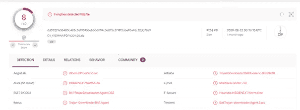

# **开头**

恶意软件是通过 Dropbox 链接传播的。下载完成后，我们会得到一个名为**的压缩文件。PDF。ZIP"** 。

zip 文件使用双扩展名来欺骗用户，使其认为这是一个 PDF 文件。这是 windows 恶意软件的常见技术，因为默认情况下，显示文件扩展名的选项是禁用的。

zip 文件包含一个带有“.”的文件。蝙蝠”分机。bat 文件再次使用了双扩展名技术来欺骗用户，让他们以为这是一个 PDF 文件。

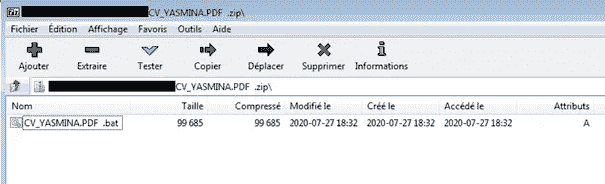

我们把 bat 文件解压一下，看看里面的代码。

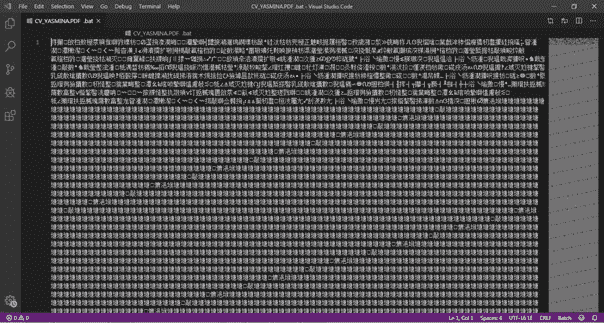

正如你所看到的，这个文件似乎在某种形式上被混淆了，所有的东西都是用中文写的。但是如果我们用命令行工具如“file”来看一下文件的编码，我们会看到它是用“UTF-16 LE”编码的。

例如，在 VSCode 中，我们可以选择用不同的编码重新打开文件。我们会选择“UTF 八号”，瞧。恶意 bat 文件的内容现在是可读的。

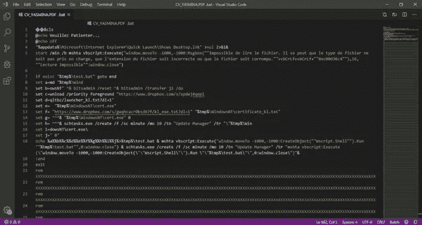

让我们开始分析。

## **“CV _ YASMINA。PDF。BAT”分析**

bat 文件做了一些事情来欺骗用户并下载它的下一阶段。让我们来看看所使用的技术。

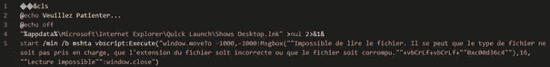

首先，恶意软件调用“Shows Desktop.lnk”文件，该文件用于最小化所有窗口并显示桌面。和按“Ctrl+M”键盘快捷键是一样的。

然后它调用“mshta”实用程序弹出一条用法语写的错误消息，翻译成**“无法读取文件。文件类型可能不受支持，文件扩展名不正确，或者文件可能已损坏。欺骗用户，使其认为某个东西已经失败。(下面是错误信息)。**

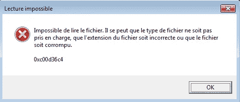

接下来是第二阶段下载器部分。该文件检查机器是否在%temp%目录中不包含“test.bat”实例。如果没有，它继续创建从字母“a”到“j”的多个变量，每个变量保存完整命令的一小部分，用于下载第二阶段。所有这些都是用来躲避检测的。

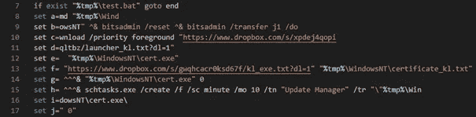

如果我们连接所有这些变量，我们将得到下面的字符串。

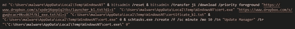

上面的代码执行以下操作:

*   在%temp%目录中创建一个名为“WindowsNT”的文件夹。

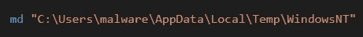

*   使用“bitsadmin”实用程序开始下载，并下载两个文件。第一个是**“launcher _ KL . txt”**，它将作为“cert.exe”保存在先前创建的目录“WindowsNT”中，第二个是**“KL _ exe . txt”**，它也将作为“certificate_kl.txt”保存在“WindowsNT”目录中。

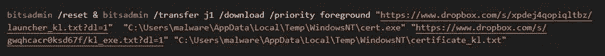

*   执行刚下载的“cert.exe”。

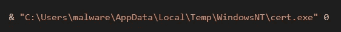

*   创建一个名为“Update Manager”的计划任务，每 10 分钟执行一次，并启动“cert.exe”文件。

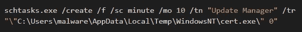

所有这些都将被推送到名为“test.bat”的文件中，该文件将放在%temp%目录中并被执行。

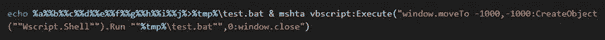

只是为了确保第二阶段下载程序无论如何都会被执行。将创建一个名为“Update Manager”的计划任务，每 10 分钟执行一次“test.bat”文件。

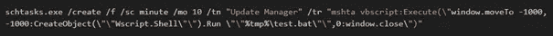

假设一切按计划进行，恶意软件成功下载了所有内容。接下来要执行的是新下载的“cert.exe”。这是我们接下来要看的文件。

## **“cert . exe”解析**

首先，我们查看可执行文件上的 file 命令的结果，我们将看到它是一个带有 GUI 的 PE32 可执行文件，并且符号被去除了。

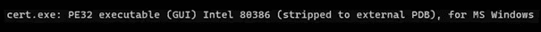

接下来，让我们通过对它执行“strings”命令来检查它是否包含任何有趣的字符串。

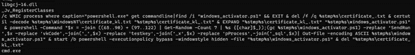

答对了。正如你所看到的，这些字符串包含看起来像 WMI 命令和一些 PowerShell。我们把这个美化一下，放到一个好看的编辑器里，开始分析。

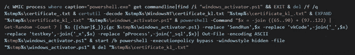

简而言之，下面的代码使用带有**-decode "**标志的 **"certutil"** 实用程序，对之前下载的 **"certificate_kl.txt"** 进行解码，该文件存储在“WindowsNT”文件夹的 temp 目录下。它用于解码 base64 编码的文件。

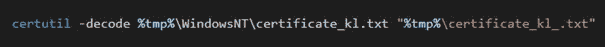

解码后的文件类型为**“微软 CAB 存档数据”**或**“CAB”**文件简称(即:压缩)。恶意软件做的下一件事是解压缩例程，包括使用“EXPAND”命令。

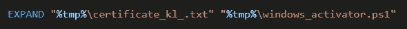

新获得的 PowerShell 文件是包含用 C#编写的“键盘记录器”的最后一个阶段(或者我是这样认为的)。(我将在第 2 部分对此进行分析)。

执行 PowerShell 脚本之前的最后一步是模糊处理。恶意软件作者创建了一个快速混淆例程来更改脚本中一些函数的名称。它使用简单的替换方法和一些随机化，用一组随机字符替换每个函数。

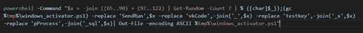

最后，脚本被执行，原始编码文件“certificate_kl.txt”被删除。

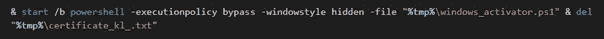

# **总结**

在我们结束分析的第一部分之前，让我们快速回顾一下恶意软件做了什么以及使用了什么技术。

*   该恶意软件以 PDF 文件的形式隐藏在名为“CV_YASMINA”的 ZIP 文件中，以欺骗用户认为它是 CV(课程表 Vita)的一个示例。
*   ZIP 文件包含一个恶意的 bat 文件，该文件通过使用 UTF-16 LE 编码和多个变量名来分隔正在执行的命令，从而混淆其内容。
*   当执行时，它会显示一条错误消息，让用户误以为出了问题。
*   它将两个文件(“cert.exe”和 certificate_kl.txt”)下载到 temp 目录中。请注意，dropbox 上的原始文件带有一个“.”。txt”扩展名，它添加了一个小的混淆层作为“txt”文件，在日志分析过程中有时会被忽略。
*   它创建了两个计划任务，以确保第二阶段无论如何都会被下载和执行。
*   一旦第二阶段下载完成。恶意软件继续执行“cert.exe ”,它将解码并创建“最终”有效负载

# **危害指示器(IoCs)**

```
**CV_YASMINA.PDF .zip:** dd03221a35480c483c86195956ebb5d094c3e875c5f18f2d6e95a7dc32db78a9**CV_YASMINA.PDF .bat:** dd42edae0008019aac47cee7962f564f1c201a232fe62f269b485e8e6332e498**launcher_kl.txt / cert.exe:** cf7fc1e176f3931bfbb508ddeb1b24b79f3db166ff1739cff69bee4d7f5d5a6a**kl_exe.txt / certificate_kl.txt:**
1dd960fad2a8d057d32a9889e1f6a7c1349697d7df0fee2bc08d39709c443bd4**windows_activator.ps1 (After Obfuscation):**
4a8f8f6053b1a43498c609599dfd2b491c957defede8a064194e6cf5de5c958d
```

# 结论

我希望你喜欢这个快速的分析，并且在这个过程中学到了一些东西。第 2 部分再见，希望很快。

如果您有任何反馈或建议，请发送给我 [**@nas_bench**](https://twitter.com/nas_bench)