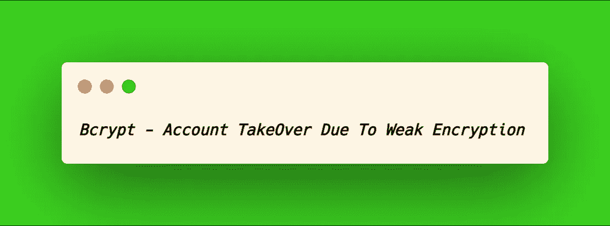
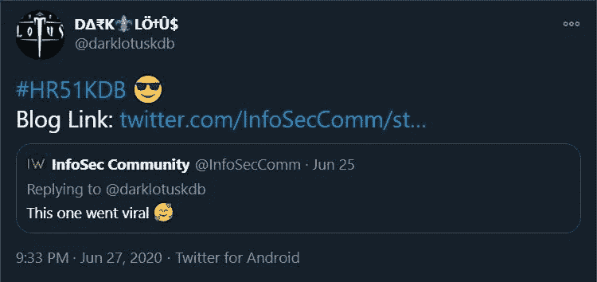
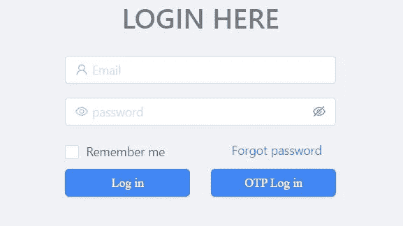
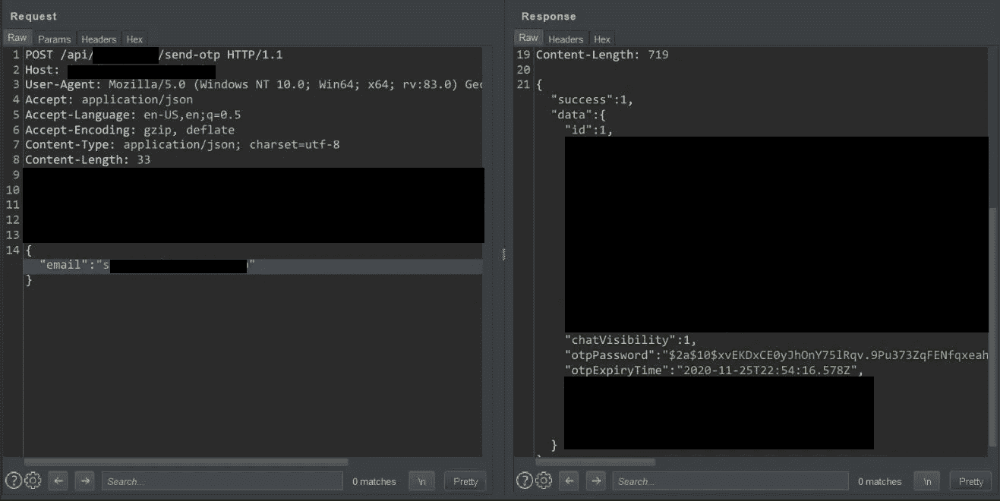
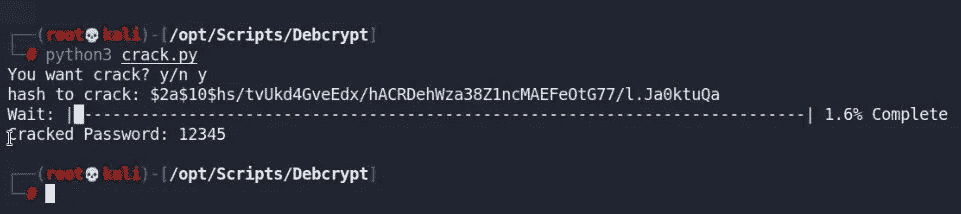

# Bcrypt —由于弱加密导致的帐户接管— #HR51KDB

> 原文：<https://infosecwriteups.com/bcrypt-account-takeover-due-to-weak-encryption-hr51kdb-4418f6e65907?source=collection_archive---------2----------------------->

嘿伙计们！我希望你们都平安无事。非常感谢您对我之前的**博客感兴趣，并使之成为 InfoSec 报道的第一篇 [**病毒性**](https://twitter.com/darklotuskdb/status/1276909010029969408?s=20) 博客文章。**

****

**我最近在测试一个私人程序，让我们以**target.com**为例。在登录页面上，有一个功能“OTP 登录”。其中 OTP 被发送到注册的移动号码。**

****

**为了检查 OTP 是否在响应体中泄漏，我在 burp 中截取了“OTP Log In”请求。是的，我是对的。动态口令在名称为“otpPassword”的响应正文中泄漏，但动态口令是加密格式，即 [**Bcrypt**](https://bcrypt-generator.com/) 。**

****

**在这个好看的 [**工具**](https://github.com/BREAKTEAM/Debcrypt)**([【https://github.com/BREAKTEAM/Debcrypt】](https://github.com/BREAKTEAM/Debcrypt))**，**的帮助下，我轻松解密了 OTP 值，成功夺下了受害者的账号。****

******步骤:******

1.  ****" OTP password ":" $ 2a $ 10 $ hs/tvukd 4 gveedx/hacrdehwza 38 z1n cmaefeotg 77/l . Ja0ktuQa "****

****2.复制 Bcrypt 加密值来解密它。****

****3.为此工具提供了价值。****

********

****4.登录的 OTP 是“12345”。****

****5.ATO 成功了。****

****我希望你喜欢这篇文章！，在 [**推特**](https://twitter.com/darklotuskdb) 上关注我一些很酷的小技巧。****