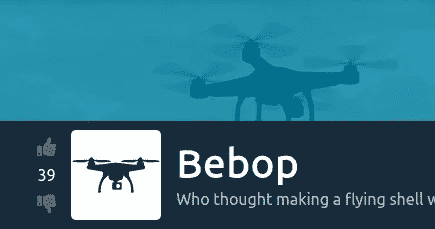
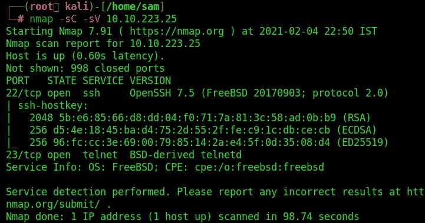
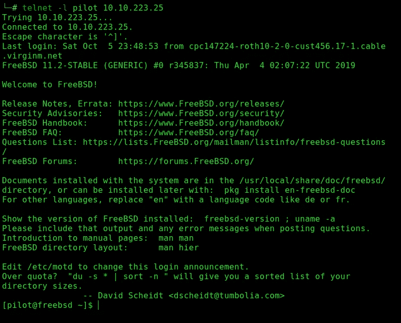
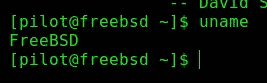
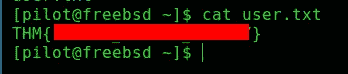
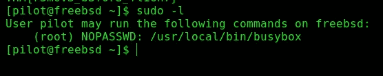
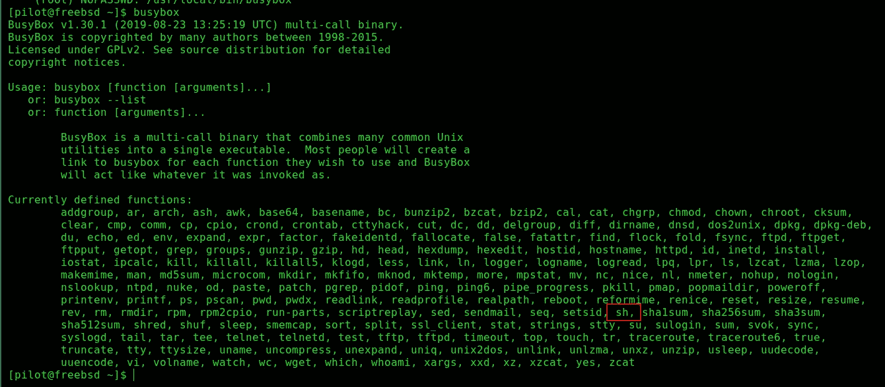

# Bebop Tryhackme 报道

> 原文：<https://infosecwriteups.com/bebop-tryhackme-writeup-374f3b6bcf5b?source=collection_archive---------3----------------------->

## **这是 Tryhackme room“Bebop”的特写**



【https://tryhackme.com/room/bebop 号

【https://tryhackme.com/room/bebop】房间链接:

**注:** **此房间仅供高级会员使用。谁购买了高级会员。**

Bebop 是一个快速的盒子，它准确地证明了一些无人机操作系统是多么不安全。这个盒子应该不会花很长时间来扎根——它真的不是特别具有挑战性(鉴于它是基于真正的无人机软件，这有点令人担忧)。更令人感兴趣的是总体概念:无人机黑客攻击。如果你还没有看过嵌入 THM 房间的视频，我强烈推荐；真的很有趣(有些地方还很搞笑)。在正式开始写文章之前，我将在下面插入一段视频:

[”<a](”<a)

https://www.youtube.com/embed/5CzURm7OpAA" frame border = " 0 " allow = "加速度计；自动播放；剪贴板-写入；加密媒体；陀螺仪；画中画" allow full screen></iframe>

**问题 1** 。你的代号是什么？

> **答案:飞行员**

# 枚举:

按照惯例，我们要对这个机器做的第一件事是运行 nmap 扫描。基本服务扫描对于我们的目的来说已经足够了:



我们在这里打开了两个端口:端口 22 (SSH)和端口 23 (telnet)。这两个服务做的事情本质上是一样的(让您能够远程访问机器上的命令行)，但是 SSH 要安全得多；有趣的是，我们首先尝试 telnet。

# 剥削:

在房间的开始，我们有一个代号:**飞行员**。让我们尝试用它登录:



在我们继续之前，我们实际上已经可以回答四个测验问题中的三个了。我们以 ***飞行员*** 的身份登录，所以这应该是低特权用户。我们使用 ***telnet*** 登录，所以这就是第三个问题的答案。第四个问题的答案应该显而易见，但为了确保万无一失，请使用 **uname** 命令来查找操作系统:



操作系统为 ***FreeBSD*** 。

现在，剩下的唯一一个测验问题是第二个问题——只有在我们升级了特权后才能得到它。

在我们开始做任何特权之前，让我们获取 pilot 主目录中的用户标志:



# 权限提升:

在 Linux 计算机上瞄准 privesc 时，你通常要做的第一件事就是看看你能以 sudo 身份运行什么(例如，拥有 Root/Administrator 权限)。FreeBSD 也不例外。运行`sudo -l`,看看我们能否以 root 用户身份运行:



我们可以以 root 身份运行 BusyBox。如果你以前没有遇到过，BusyBox 本质上是将许多不同的功能合并到一个可执行文件中。它通常用于嵌入式系统，以减少所需的磁盘空间和内存。让我们看看在这个系统上可以通过 BusyBox 执行哪些命令:



头奖！查看已定义函数的倒数第三行:

定义函数列表中的 **sh**

我们可以通过 BusyBox 运行`sh`。`sh`会给我们一个 shell，这意味着如果我们以 root 用户身份运行 BusyBox(我们可以使用 sudo 权限)，我们会得到一个 root shell！

```
sudo /usr/local/bin/busybox sh
```


现在我们有了。我们找到了一架无人机！

现在剩下要做的就是回答最后一个问题，并找到根标志。

测验问题应该很明显。哪个二进制文件用于提升权限？我们刚刚做到了: ***BusyBox*** 。

根标志同样容易找到。它在根目录下，你需要做的就是打开它:

## 小测验！

**问题 1** 。什么是低特权用户？

> **答案:飞行员**

**问题二。**哪个二进制文件用于提升权限？

> **回答:busybox**

**问题 3。使用了什么服务来获得初始外壳？**

> **回答:telnet**

**问题 4。**无人机运行什么操作系统？

> **答案:FreeBSD**

你可以在:
**LinkedIn:-**[https://www.linkedin.com/in/shamsher-khan-651a35162/](https://www.linkedin.com/in/shamsher-khan-651a35162/)
**Twitter:-**[https://twitter.com/shamsherkhannn](https://twitter.com/shamsherkhannn)
**Tryhackme:-**[https://tryhackme.com/p/Shamsher](https://tryhackme.com/p/Shamsher)


更多演练敬请关注……
出发前…

访问我的其他演练:-

感谢您花时间阅读我的演练。
如果您觉得有帮助，请点击👏按钮👏(高达 40 倍)并分享
它来帮助其他有类似兴趣的人！+随时欢迎反馈！