# [初学者指南]攻击和防御 FTP 服务器|第 1/2 部分

> 原文：<https://infosecwriteups.com/beginner-guide-on-attacking-and-defending-ftp-server-part-1-2-635d5373adf1?source=collection_archive---------1----------------------->

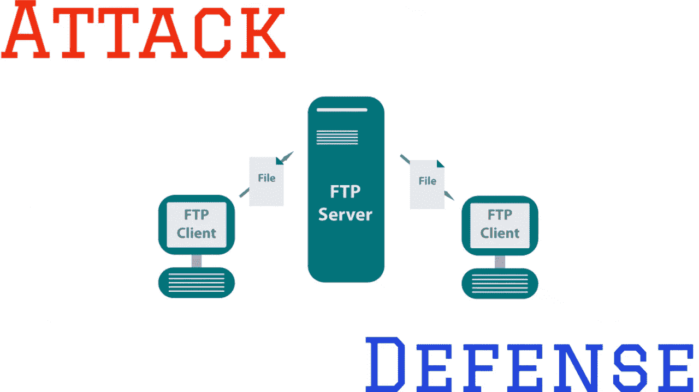

FTP 服务器的攻击与防御

从这篇文章中，我们将了解攻击者如何攻击 FTP 服务器，以及管理员应该采取什么步骤来保护它。

这是该系列的第一篇文章。请务必阅读完整的帖子，以便有一个全面的了解，如果有任何疑问，请给我留言。

**简介**:

许多组织使用暴露给他们的客户的 FTP 服务，以便他们可以发送巨大的文件。后来，无论是遗留服务器还是当该服务的业务使用结束时，管理员往往有意或无意地让服务器保持开放。

不管 FTP 服务器是暴露在互联网上还是内部托管，攻击媒介和防御都同样重要。在这里，我不打算向您介绍如何设置 FTP 服务器，相反，我已经在我的本地服务器上安装了 vsftp，并考虑将 ftp.exploit-writeup.com 的**作为我们演示的目标机器。**

**什么是 FTP，我从来没有听说过？**

文件传输协议(又称 FTP)是一种流行的网络协议，用于在客户端和服务器之间传输文件。FTP 的默认端口是 21。我们可以使用 nc、telnet 或 ftp 命令连接到 FTP 服务。

说到这里，我们开始吧。

> **第一步:端口扫描**

FTP 服务器的默认端口是 21。

**攻击者:**一旦确定了目标服务器，使用 nmap 或任何其他端口扫描工具/技术来查明 FTP 端口是否打开。下图显示了端口扫描命令。如果 FTP 服务是打开的，我们将看到状态标记为打开，如果不是，那么它可能是关闭/过滤。

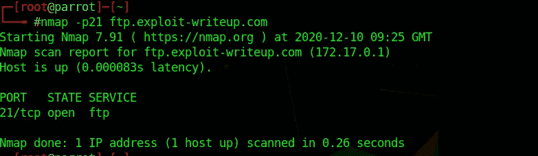

FTP 服务的端口扫描

**Defender:** 如果 FTP 服务器因为任何原因没有被使用，我强烈建议卸载服务，或者至少禁用或停止 FTP 服务的运行。

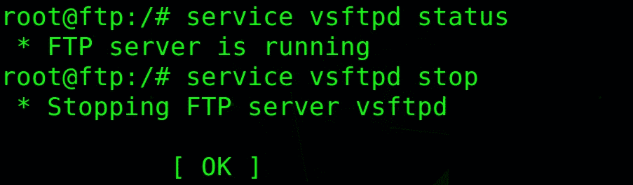

停止 FTP 服务

解决方法:如果您仍然不能做到以上任何一点，我建议将 FTP 连接限制到特定的 IP，并将端口从默认改为随机端口，以迫使攻击者猜测服务的用法。

> **第二步:抓取横幅**

安装的 FTP 服务总是与其对应的版本相关联。

**攻击者:**使用 telnet/nc/ftp 连接目标服务器或任何其他枚举技术来查找 ftp 版本。这里的 FTP 版本是 vsFTPd 3.0.3

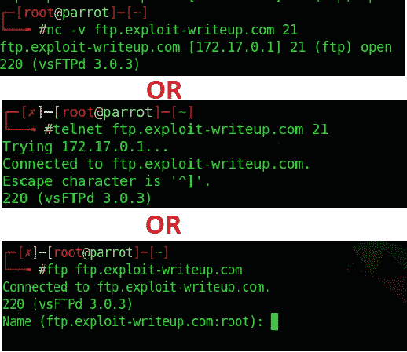

FTP 服务器的横幅抓取

一旦识别出版本，攻击者就可以使用公共漏洞数据库来搜索漏洞。如果 FTP 服务器已经过时或有 0 天的漏洞，那么使用该有效负载，就可以攻击服务器。我个人对数据库的偏好是 Exploit-DB。其 CLI 版本为 searchsploit，可安装在攻击者的机器上。快速搜索 vsftpd 漏洞会发现大量漏洞。

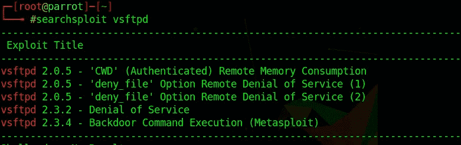

利用 vsftpd 的数据库

幸运的是，目前的服务器还没有漏洞，但是谁知道当你读到这篇文章的时候会不会有漏洞。

**防御者:**暴露服务版从来都不是什么好主意。这可能会给攻击者提供一个容易利用的线索。所以我强烈推荐隐藏 FTP 横幅。要做到这一点，请遵循以下步骤。

*   找到 vsftpd.conf 文件并编辑
*   取消对 **ftpd_banner** 的注释，将文本更改为您想要的任何内容，或者留空以隐藏版本。

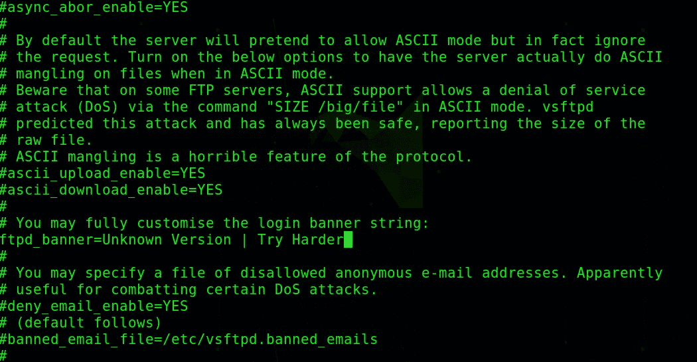

从 vsftpd.conf 更改 FTP 横幅

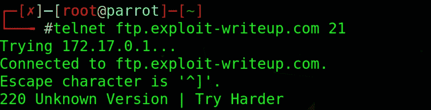

确认 FTP 横幅更改

> **第三步:匿名登录**

默认情况下，FTP 服务未配置为允许匿名登录，但是如果管理员强制进行了配置，则用户/攻击者可以登录到服务器。

**攻击者:**最常见的默认用户名为匿名，密码为空。我们可以使用 ftp 命令登录到服务器。

使用匿名登录登录到服务器

如果这不起作用，我们可以使用 FTP 用户名和密码的公共单词列表来找到有效的组合。为了做到这一点，我在这里使用 hydra 来暴力破解凭证，这可能会造成时间混乱，但如果服务器没有任何保护措施，这是有效的。

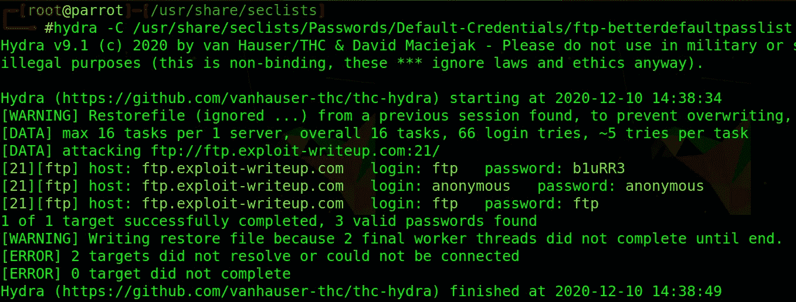

匿名凭证暴力破解

**Defender:** 通过编辑 FTP 配置文件并注释掉 anonymous_enable 行来禁用 FTP 服务器的匿名登录，或者将属性从 yes 更改为 no。

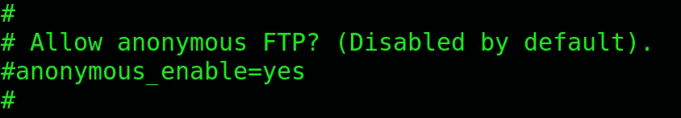

评论匿名登录

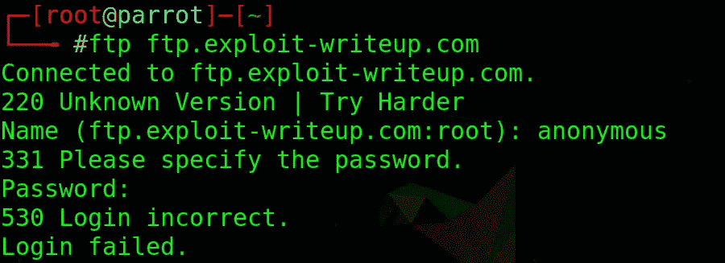

匿名登录被禁用

**步骤 4:强力 FTP 凭证**

**攻击者:**登录 FTP 服务器的方法之一就是暴力破解凭证。如果攻击者以任何方式知道有效的用户名，那么任务就很简单，攻击者只需找到密码。否则，两者都必须被强制执行，这可能需要很长时间才能找到有效的组合。我们可以利用九头蛇达到同样的目的。下图说明了这一点。

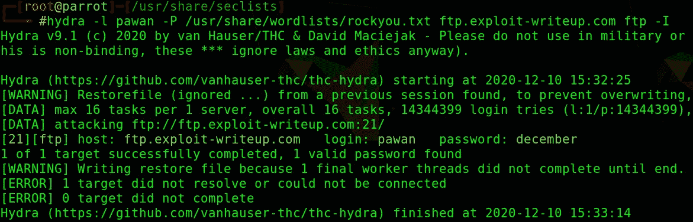

利用九头蛇暴力破解凭据

**Defender:** 处理这个问题最好的方法就是实现 Fail2ban。Fail2bain 是一个流行的工具，用于保护互联网公开的服务免受暴力和自动攻击。它通过分析服务日志和使用正则表达式来禁止使用系统防火墙的恶意用户 IP。下图显示，当连接被拒绝时，攻击者试图暴力破解 FTP 服务。

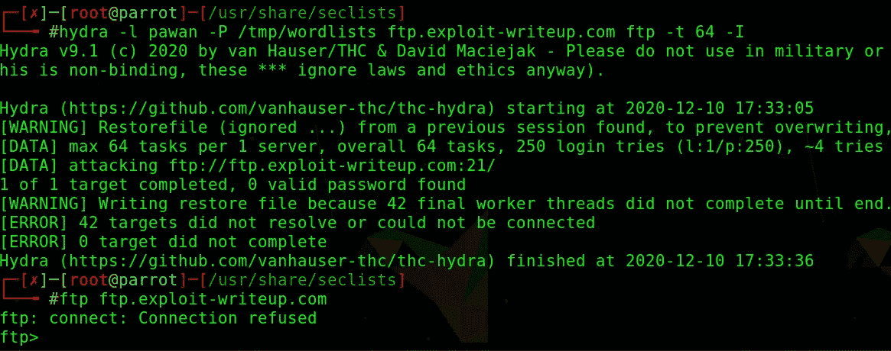

九头蛇暴力的失败 2 禁令

**第五步:嗅探**

FTP 是一种纯文本协议，这意味着如果有人在网络上拦截请求，他们可以看到明文内容。

**攻击者:**设置 Wireshark 来嗅探本地网络，如果任何人连接到没有加密的 FTP，那么攻击者就可以捕获凭证。

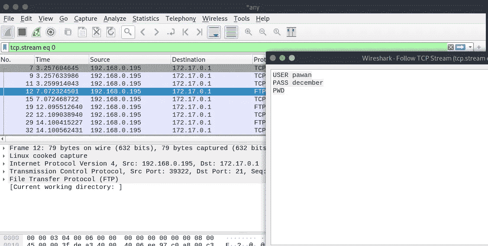

Wireshark 捕获 FTP 凭据的网络流量

**Defender:** 应该实现 SSL/TLS，以确保服务器和客户端之间的通信是加密的，攻击者无法读取密文。

下面是实现 SSL 的步骤。

*   OpenSSL req-x509-nodes-days 365-new key RSA:1024-keyut/etc/SSL/private/vsftpd . PEM-out/etc/SSL/private/vsftpd . PEM
*   编辑 vsftpd.conf 文件并添加以下行:SSL _ enable = YES allow _ anon _ SSL = NO force _ local _ data _ SSL = YES force _ local _ logins _ SSL = YES SSL _ TLS v1 = YES SSL _ SSL v2 = NO SSL _ SSL v3 = NO require _ SSL _ reuse = YES SSL _ ciphers = HIGH RSA _ cert _ file =/etc/SSL/private/vsftpd . PEM RSA _ private _ key _ file =/etc/SSL/private/vsftpd

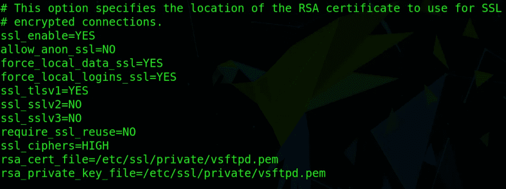

在 FTP 服务器上配置 SSL/TLS

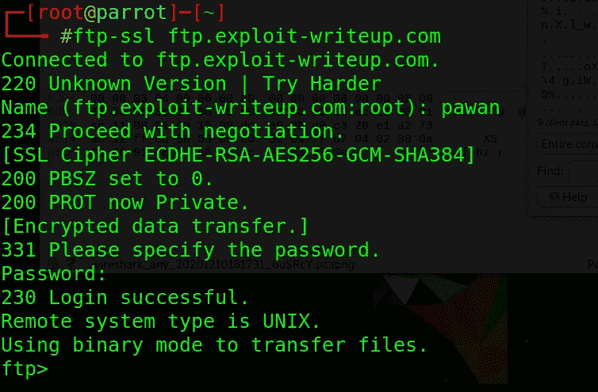

受害者连接到 ftp 服务器

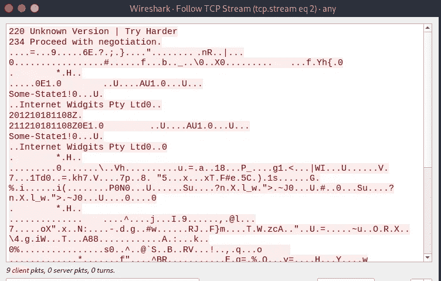

在 Wireshark 上捕获的密文

第 1 部分到此结束。即将到来的下一部分有更多的技术。

 [## 漏洞利用报告

### CTF 玩家、安全专家、Bug 赏金猎人、白帽黑客和渗透测试者的博客你好，我是…

www.youtube.com](https://www.youtube.com/@Exploit-Writeup/) 

免责声明:

这个帖子只是为了教育目的。本文表达的所有观点、信息或内容都是我自己的，不代表我曾经、现在或将来隶属的任何实体。这里描述的方法和列出的工具现在可能被证明是危险的，甚至是非法的。你对这里的信息采取的任何行动或活动都完全是你自己的风险，我不会对任何形式的滥用负责。