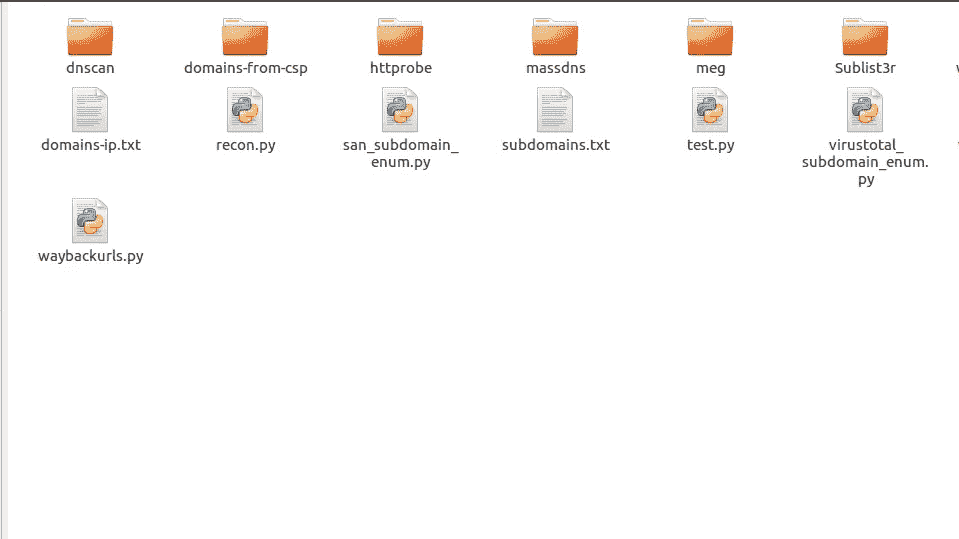
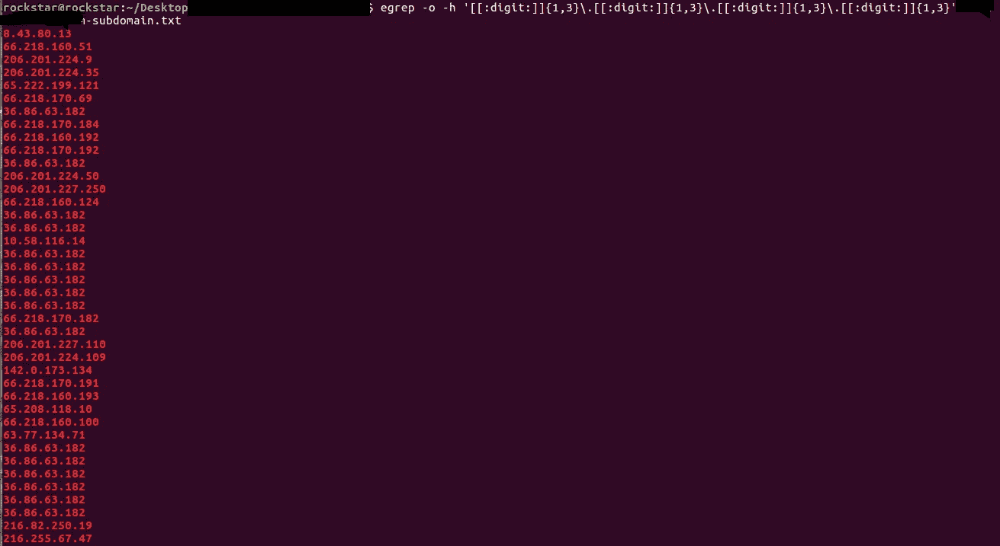
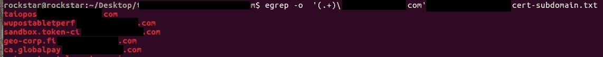
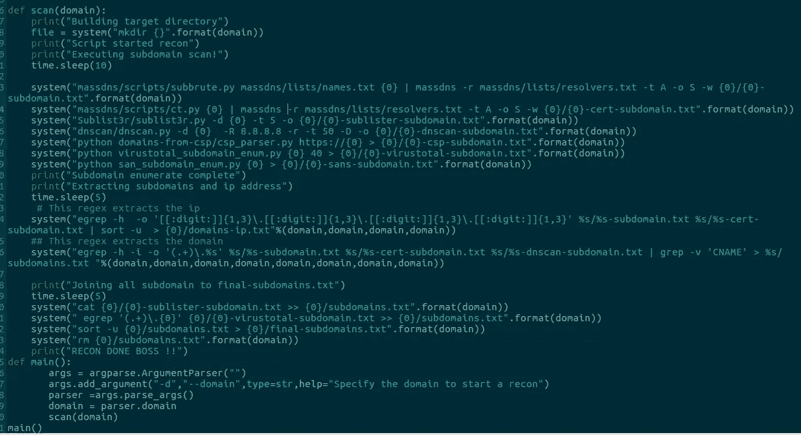
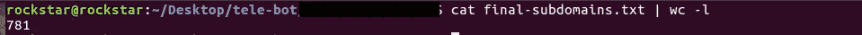

# 侦察自动化初学者指南。

> 原文：<https://infosecwriteups.com/beginners-guide-to-recon-automation-f95b317c6dbb?source=collection_archive---------0----------------------->

像专业人员一样侦察！

你好，黑客们，我是 ashish jha，再次与你们在一起，自从我写这篇文章以来，已经有很长时间了，所以我一直有一些有趣的发现，但是今天我将与你们分享我的自动侦察过程，虽然我不会分享我的**秘密接收**，但是我将与你们分享每个黑客都会做的表面侦察！

**先决条件:**

1.  计算机编程语言
2.  具有基本正则表达式知识的 Grep

让我们开始:

# 1.首先，准备好所有子域枚举工具。

我使用: [massdns 的](https://github.com/blechschmidt/massdns/)脚本(子路由和证书)[子列表](https://github.com/aboul3la/Sublist3r)， [dnsscan](https://github.com/rbsec/dnscan) ， [virustotal 的子域枚举](https://github.com/appsecco/the-art-of-subdomain-enumeration/blob/master/virustotal_subdomain_enum.py)，[来自 csp 的域](https://github.com/0xbharath/domains-from-csp)，通过使用所有这些，我收集了几乎所有的子域，并通过在 massdns 中使用证书脚本(证书透明日志),它甚至提供了 2 级和更高级别的域！

更多的工具:knockpy，aquatone，subfinder，还有很多其他的工具…..

单词列表:jasson hadix 的 [all.txt](https://gist.github.com/jhaddix/86a06c5dc309d08580a018c66354a056/raw/f58e82c9abfa46a932eb92edbe6b18214141439b/all.txt) 和内置的 massdns 单词列表，现在你可以组合任何这样的单词列表，并相应地增加你的结果！

我的工具目录

# 2.收集好你最喜欢的工具后，让我们用 python 来动手吧

首先，您将导入操作系统库，从而使用系统函数来执行脚本。

在上面的目录中，您可以看到 recon.py 脚本，这是执行所有自动化操作的脚本，无论是提取域还是提取 ip！

二。)其次，通过使用系统函数来执行脚本。

构建一个名为 recon -> system('mkdir recon ')的目录

其次，在执行脚本时，确保将您的 subdomain.txt 文件添加到这个目录中。

示例:system(' python mass DNS/scripts/subbrute . py domain.com | mass DNS/bin/mass DNS-r/lists/resolver . txt-t A-o S-w**recon/subdomain . txt**')

继续添加您的所有脚本，以便由上述相同的函数执行

现在，在从特定的 massdns 脚本中获得您的域后，您将发现域和一个记录(或者由您指定哪个记录)在一起，因此为了将所有这些分开，您需要学习 grep！

例:**domain.com 某 xxx.xxx.xxx.xxx**

# **3。让我们学习一些 grep 和 regex**

Grep 是一个内置的 linux 工具，对几乎所有使用 linux 和处理文件的人都非常有用！

Grep 基本上根据您的正则表达式模式搜索和过滤数据。我不能在这里涵盖整个正则表达式，因为它需要另一个写，我们将只讨论我在这个基本的侦察脚本中使用的！

**我很快也会发布正则表达式！**

这里有一个 subdomain.txt 文件，它是从 massdns script subbrute，cert 中获得的，其中包含 dns 记录和域名。

例子:【domain.com 一个 xxx.xxx.xxx.xxx

现在，您可以使用 grep 提取 ip，因为您必须使用 **masscan 扫描开放端口和服务范围内的 IP。**

**命令:egrep -o -h '[[:digit:]]{1，3}\。[[:digit:]]{1，3}\。[[:digit:]]{1，3}\。[[:digit:]]{1，3 } ' recon/subdomain . txt recon . subdomain-cert . txt | sort-u>IPS . txt**

让我们来分析一下

**egrep** 基本上是扩展的 grep，你也可以使用 **grep -E** 来代替，o 用于只显示匹配的结果，在这种情况下，这是我们需要的 ip，h 用于不显示文件名，最后通过将 regex 的输出管道化为 sort -u，你可以对唯一的 ip 进行排序，避免重复！

**现在正则表达式:** [[:digit:]]{1，3}\。→这基本上是 ip 地址示例的第一部分: **192** .xxx.xxx.xx，现在它有 3 个数字，我们使用的是 **{1，3}** ，一个 ip 有 4 个部分，我们对其余部分做同样的操作。例子:**216.168.1.101**->我不知道这决定了什么:)

这个正则表达式中最重要的是通过使用\来转义点号。

现在，在你提取了你的 ip 地址之后，让我们来提取子域

**命令:egrep -o -h '(。+)\ . domain . com ' subdomain . txt subdomain-cert . txt | sort-u>all domain . txt**

我们来分解一下:**’(。+)\.domain.com'** 这个正则表达式的意思基本上就是提取子域(。+) - >表示在 domain.com 和**之前把所有东西都给我弄来。**又逃掉了圆点！

**4。从 massdns 扫描中提取所有域和 ip 地址后**，再次使用系统函数将子列表和其他域枚举工具的结果附加到 alldomain.txt 文件中

示例:system(' cat subdomain-sublist . txt > > all domain . txt ')不要忘记 **> >** 的意思是追加而不是覆盖

在把你的域名放在一起后，运行另一个系统函数来排序并只保留唯一的域名！

示例:system(' sort-u all domain . txt > final domains . txt ')

完整的脚本如下所示:

侦察. py

注意:在这里你也可以使用 argv[1]作为域的参数，但是我个人还是喜欢 argparser，这取决于你自己！

在所有这些之后，我为一个程序找到了 781 个子域名，这也是排序！！

781 个子域名

在你有了你的 **alldomain.txt** 和 **domainips.txt** 之后，去检查那些域是否正在运行 http 或 https 服务器，并且也去使用 masscan 检查打开的端口和服务！

**再一次，侦查永无止境，它关乎你在侦查中的创造力和效率，这个脚本可以变得更小更复杂，但这是一个初学者指南，对你有好处，我仍然使用这个野兽！**

很快就为侦察的高级指南做好准备，直到下一次，快乐黑客！

我们的团队: [bluefire-redteam](https://www.bluefire-redteam.com/) 检查任何网络安全服务！