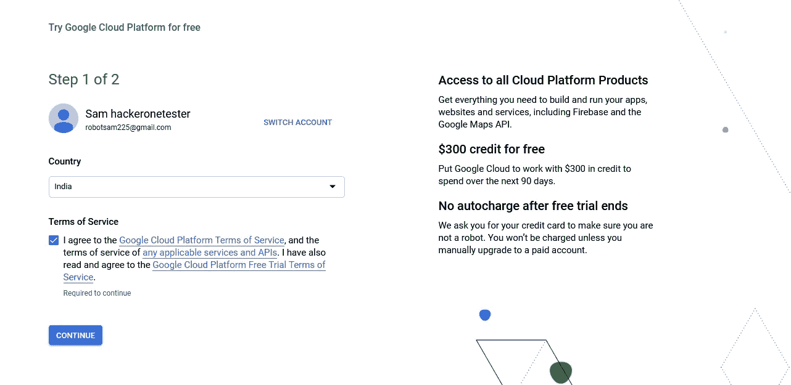
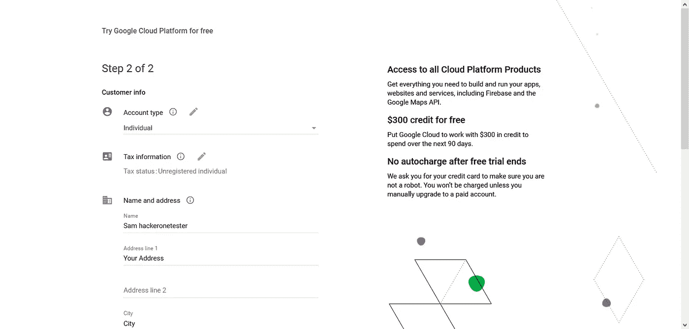
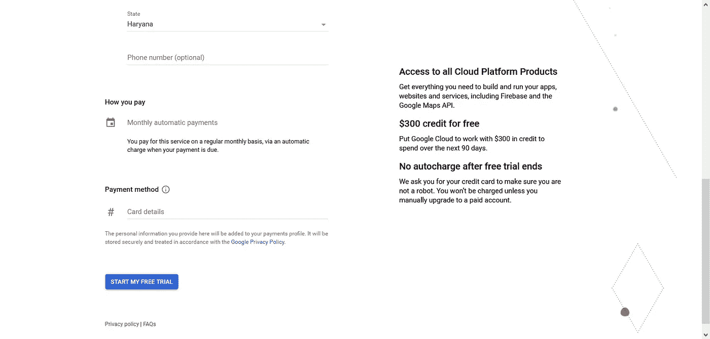
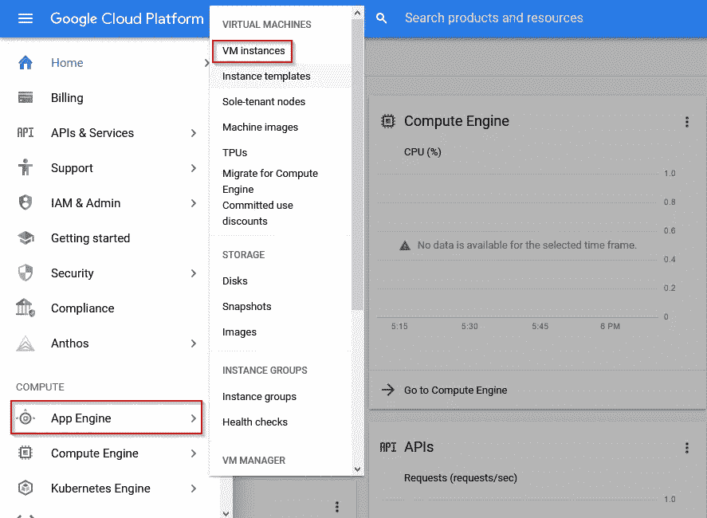
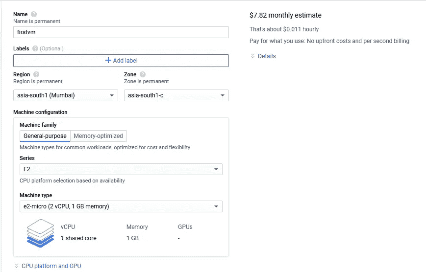
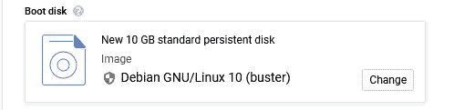
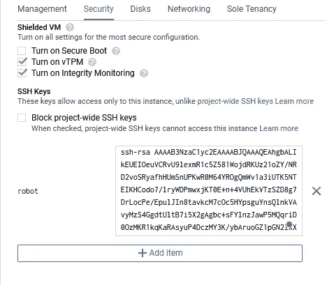

# 初学者指南:臭虫赏金侦察自动化的 VPS 设置

> 原文：<https://infosecwriteups.com/beginners-guide-vps-setup-for-bug-bounty-recon-automation-6b0ba1e051ef?source=collection_archive---------0----------------------->

大家好。我叫兰珍。我是计算机科学本科生的最后一年，也是兼职的昆虫赏金猎人。由于大学的原因，我没有足够的时间去寻找虫子。所以，我决定自动化我的一些任务，为此，我正在寻找一个 VPS(虚拟私人服务器)。

所以我发现市场上有很多虚拟副总裁，比如 Digital Ocean VPS、Linode 和 google cloud。但我喜欢谷歌云，因为它提供免费层。

我将在这篇文章中使用谷歌云，并为你提供设置 VPS 的一步一步的步骤。

# **让我们开始吧:**

对于新客户，谷歌云提供 300 美元的免费信用，你可以使用长达三个月。你需要在谷歌云中添加一个计费账户。

你可以在这里申请:

[T3【https://cloud.google.com/free】T5](https://cloud.google.com/free)

第一步:选择你的国家。

第二步:填写所有必要的信息以及你的信用卡信息。

现在，你必须通过提供你的信用卡照片或银行账户对账单的截图来验证你的支付。

验证几乎不需要 2-4 小时。核实后，你就可以走了。

现在转到控制台，在左侧菜单栏中选择*计算引擎>虚拟机实例*。

在此之后，google 将执行一些初始化任务，包括建立一个名为“我的第一个项目”的初始项目，因此您不必关心这些。

当平台初始化任务完成后，您可以通过单击 Create instance 按钮来创建您的第一个 VM。

创建虚拟机的步骤:

根据您的选择给出描述性名称。我给我的实例取了一个随机的名字。选择离你最近的地区。

现在，在启动盘中，选择一个您熟悉的映像。我选的是 Debian GNU/Linux 10 (buster)。此外，您可以通过单击“change”按钮来增加虚拟机的大小。

现在，打开*管理、安全性、磁盘、网络、独立租赁*部分。您可以将这里的大部分设置保留为默认值，但是您最可能想要做的是将您的 *SSH 密钥*粘贴到 *Security* 选项卡上的相应字段中，这样您可以在以后使用 SSH 访问系统。

用于 Linux、Mac 或 Windows 中的 SSH 访问。

参考这个文档:https://cloud . Google . com/compute/docs/instances/add-remove-ssh-keys # Linux-and-MAC OS

您将对管理 SSH 密钥有一个简要的了解。

在管理 SSH 密钥时，您必须为实例提供一个用户名。我们使用这个用户名来访问我们的实例。例如:

在整个过程之后，使用 SSH 协议通过您的终端访问您的 VM 实例。

SSH 用户名@外部 IP。

它会提示输入密码。装满它，你就可以走了。

这里有一个问题你不能在这里使用 apt 命令。

对此我们有一个解决方案。

我们必须将用户放在 sudoer 列表中，然后我们可以运行更高权限的命令。

访问这个网站，你就会知道把用户放在 Sudoer 列表中:

 [## 如何在 Ubuntu 中添加用户到 Sudoers

### sudo 是一个命令行程序，允许受信任的用户以 root 或其他用户身份执行命令。在本文中…

linuxize.com](https://linuxize.com/post/how-to-add-user-to-sudoers-in-ubuntu/) 

现在使用 Sudo 命令，您将安装 git。

有一个伟大的项目是由哈什·博思拉创建的:比恩项目

确保在运行这个 bash 脚本之前安装了 go。

> https://github.com/harsh-bothra/Bheem.git

只需克隆它并在您的 VM 实例中运行 bash 脚本，它会迭代运行以执行各种工具并以一种有组织的方式重新处理和存储输出。

这就是我的观点。现在，使用你的 VPS 自动侦察，继续搜寻你喜欢的目标，节省你的时间。

如果你喜欢这篇文章，请鼓掌，这将增强我为社区写更多文章的信心。

在那之前，再见。再见。

