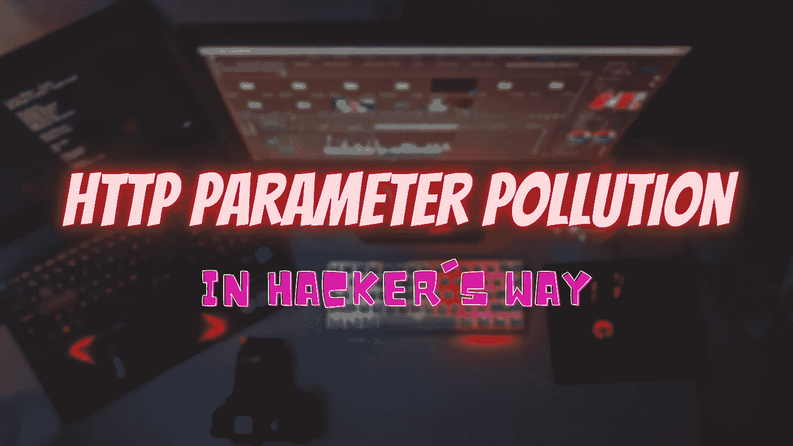
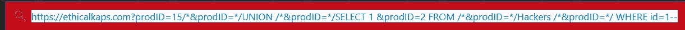
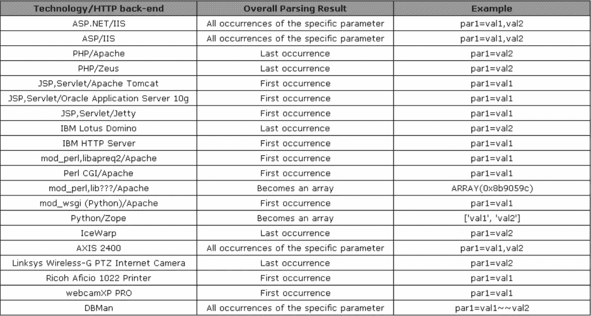
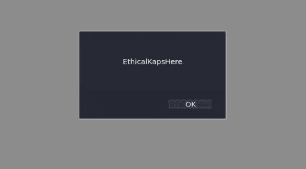

# 幕后:HTTP 参数污染

> 原文：<https://infosecwriteups.com/behind-the-scene-http-parameter-pollution-534b4fa2449c?source=collection_archive---------1----------------------->

嘿，赛博朋克们，我希望你们的生活过得很好。因为你已经知道我们将要谈论的话题。所以，**坐好，** **放松**和**我保证**你一定能**掌握这个**漏洞**的每一个方面**。不浪费任何时间，让我们直接进入 HPP。

> **注:**我会尽量保持题目简单，尽量用通俗易懂的语言解释。因此，您将能够抓住漏洞的根源，并在您的目标中找到这些漏洞，使它们更加安全，并获得奖金。
> 
> 我将**缩写**用于 **HTTP 参数污染**作为 **HPP**

# HPP 到底是什么？

让我们举个例子，这样你就永远不会忘记这个概念。假设，我给了你一个难题，同时也给了你一个解决的方法。但是作为一名黑客你告诉我，听着[道德 kap](https://medium.com/u/b8b1b3ca3831?source=post_page-----534b4fa2449c--------------------------------)我不会走你的路。我选一个我的来解决。类似的情况还有这个漏洞，这里你告诉应用程序，我不会走你的路。相反，我会选择我自己的路。(**这个我们自己选择路径的过程，基本上指的是参数污染**中的污染)。你们中的一些人可能不理解这一点，但是不要担心，请继续关注！！！！！

看这个实际的例子可以更清楚的理解这个概念。

我在这里做的是，简单地在我的目标中找到的一个参数( **prodID** )中提供 SQL 查询:

但是现在**作为一个黑客**我会用**黑客的方式**来做。所以我做的是:

我基本上，**把简单的查询**分解成多个部分 **&** **被我的参数污染了 HTTP 请求**。我们构建自己的 HTTP 请求来操作信息或检索数据的这种规避技术被称为 HTTP 参数污染。

# 开发 HPP 之前你需要知道的事情？

首先，您需要确定哪些参数反映在目标应用程序上，哪些没有。你怎么知道呢？为此，我将这个问题分为两种情况。你会遇到这些**两种情况:-**

## 场景 1

## 当你已经知道:-

1.  应用程序用哪种语言编码**。**
2.  它运行在哪个服务器上。

如果您知道这一点，那么您就已经找到了这个漏洞的一半。参考下面的**图。**识别应用程序将接受哪个注入参数将变得非常容易。

请看一下这张图表。**(你不需要学这个。随便过一遍，大致了解一下)**

参考:-[https://owasp . org/www-pdf-archive/appseceu 09 _ CarettoniDiPaola _ v 0.8 . pdf](https://owasp.org/www-pdf-archive/AppsecEU09_CarettoniDiPaola_v0.8.pdf)

## **场景 2**

## **当你不太了解目标:-**

这是您在寻找这种类型的漏洞时可能面临的另一个明显的情况，您不知道哪个参数将被执行？**这个问题**的明确答案**是手动测试**，你需要做的是找出哪个参数以有趣的方式起作用。

## **但是有一个暗示，y** 我们的参数可能反映在:-

1.  URI-使用 GET 参数。
2.  请求体-使用 POST 参数。
3.  HTTP 头-使用 Cookie 头。

您需要根据情况采取行动，并找出易受攻击的参数。

# **如何利用？**

让我们直接进入它。

现在是澄清所有理论的时候了。抱歉，我解释得太深了，但是清晰应该是我们的目标。无论如何，保持你的高动力我们就要冲过终点线了！

假设，你的目标是**(https://ethicalkaps.com)**的网络应用是**使用 PHP** 作为技术，并且在后端有 **Apache 服务器**。**参考图表的第 3 点** ( **PHP/Apache** )，它说将执行最后出现的参数。

我访问了这个 URL 并注意到一个参数( **par1)** ，它有一个与之相关联的值( **value1)** 。这只是一个示例性的观点。在 real target 中，您可能会发现不同的参数(如 uid=，id=，price=，name=，to=，amount=，from=，url=，uri=等..)可以是任何东西。你只需要操纵和检查到底是什么污染了网址。

现在，在下图中，你可以说我污染了参数或者注入了**par 2 = "><SVG/onload = alert(" ethical kap shere ")>作为**我的有效载荷来执行。据我所知**(根据上面的图表)**最后一个参数将被执行。

因此，当我运行这个特定的 URL 时，我将得到如下输出

所以在这种情况下 **par2=** 是脆弱的**导致 XSS** 在这里。

**注:-** 我想在这里再引用一句**这不是唯一的方法。**你也可以**使用字符和符号的编码来绕过任何限制。**而且，如果你**密切关注**这个漏洞，你就可以进行**许多其他攻击**。这由你决定，因为这是你所有的创造力和逻辑。我不会**把你限制在**某个特定的列表里。

# 可以用于 HPP 的工具

如果您需要找出应用程序中隐藏的参数，并希望节省时间，那么您可以选择自动化。我个人比较喜欢 [**Arjun**](https://github.com/s0md3v/Arjun) 。

**原因是什么？**

1.  它可以**处理不同的请求**，比如 GET/POST/POST-JSON 等等。
2.  它可以**自动处理速率限制。**
3.  您可以直接**将结果**导出到 BurpSuite/text 文件，它还有许多其他的优点，您在使用它时就会知道。

# 你可以和 HPP 一起做一些专业的事情

你可以通过 HPP 实现许多不同的目标。例如:-

1.  **绕过 Web 应用防火墙。**
2.  **执行客户端和服务器端攻击**等..

**如需进一步参考**您可以参考以下链接。可能是互联网上最好的链接

[**https://owasp . org/www-pdf-archive/appseceu 09 _ CarettoniDiPaola _ v 0.8 . PD**](https://owasp.org/www-pdf-archive/AppsecEU09_CarettoniDiPaola_v0.8.pdf)**f**

 [## 如何检测 HTTP 参数污染攻击| Acunetix

### 如今，web 应用程序的许多组件通常运行在用户的计算机上(如 Javascript ),而不是…

www.acunetix.com](https://www.acunetix.com/blog/whitepaper-http-parameter-pollution/) 

所以，这就是这篇文章的内容，希望你喜欢。我会带着另一个**#回到你身边。在那之前，保重，T42 继续寻找。** **不断挖掘和学习新东西。**

如果你喜欢这些内容，你可以在这里支持我:-**@**[**buymeacoffee.com/ethicalkaps**](http://buymeacoffee.com/ethicalkaps)

下一篇文章再见。在那之前珍惜你的生命。和平！

> *你可以在*[***Twitter***](https://twitter.com/EthicalKaps)*上关注我，在*[***Spotify***](https://open.spotify.com/show/49AHAyFgIy7E2NDjuGRaMm?si=lVPL_DBGRkGIC8DzfTXNbw)**上收听我的评论，在*[***insta gram***](https://www.instagram.com/iam_kapilchoudhary/)*上关注我。**

## *如果你喜欢这个故事，请点击👏想按多少次就按多少次，并分享来帮助其他人找到它！欢迎在下方留言评论。*