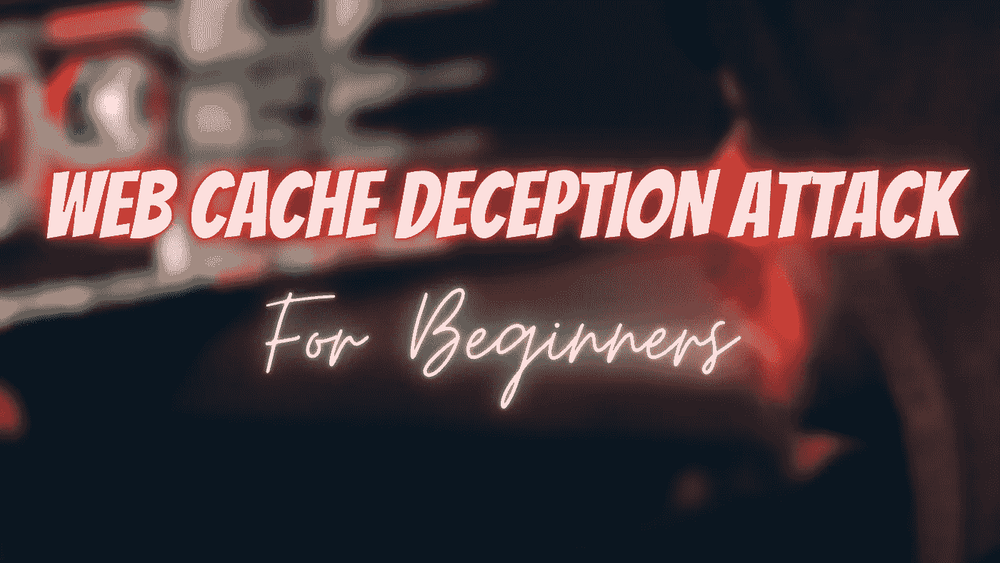
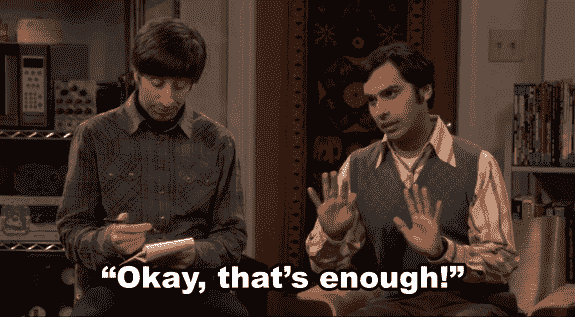

# 幕后:Web 缓存欺骗攻击

> 原文：<https://infosecwriteups.com/behind-the-scene-web-cache-deception-attack-c10bd301cf15?source=collection_archive---------1----------------------->

**嘿，网络朋克，**我希望你们都做得很好，**如果不是这样**那么我在这里让你的生活变得轻松一点，你可以利用这个(不那么容易)的漏洞😜赚取奖金。正如你已经知道的题目。所以，不浪费任何时间，让我们直接进入它。

> **注:**我会尽量让话题简单，尽量用通俗易懂的语言解释。因此，您将能够抓住漏洞的根源，并在您的目标中找到这些漏洞，使它们更加安全，并获得奖金。

# 到底什么是网页缓存欺骗？

这是一种影响 web 框架和缓存机制的攻击。简单地将此理解为一种攻击，攻击者可以暴露用户的私人信息，甚至利用攻击来接管帐户。

我们都知道，网站使用缓存机制来减少 web 服务器的延迟，以便用户可以更快地访问内容，并消除服务器反复获取详细信息的负载。

虽然有几种方法可以实现缓存。但是在这里，我们将看看两个最常用的技术。

**通常缓存的文件**是**静态和公共文件** :-

1.  **样式表(css)**
2.  **脚本(js)**
3.  **文本文件(txt)**
4.  **图片(bmp、gif、png 等。)**

## 浏览器上的缓存

通过一个简单的流程理解这个概念

**文件缓存在浏览器上**->-**浏览器不会向服务器**请求特定文件->-**延迟减少。**此类型与欺骗攻击无关。

## 服务器上的缓存

这是我们感兴趣的，因为它与这种类型的攻击相关。这项服务可以通过以下方式进行:-

1.  **负载平衡器:-** 虽然它的作用是平衡两台服务器之间的流量，但它也可以缓存内容以减少服务器的延迟。
2.  **反向代理:-** 它代表客户端从 web 服务器获取内容，并缓存内容。
3.  CDN(内容交付网络):- 这里基本上有几个代理网络，它们的作用是更快地提供内容。

好了，理论到此为止。但是理解场景背后的#是很重要的。

# 如何识别此漏洞？

我将通过把它分解成更简单的步骤来简化它

1.  假设你访问了一个 URL 为[**www.ethicalkaps.com/profile.php**](http://www.ethicalkaps.com/profile.php)**的应用程序。**
2.  之后，您指定任何 Css/txt/image 或 js 文件。(如前所述，它们通常是缓存文件。)
3.  现在我指定我的图像，假设 hackers.png 是-****。**因此，这里的请求到达不熟悉该文件的**代理**。代理将要求服务器获取这个文件。**
4.  **当你加载这个网址。(我们来分析一下#BehindtheScene)。浏览器向该 URL 发送 GET 请求。现在，根据服务器使用的技术，它可能会反映 200 OK 响应以及[**【www.ethicalkaps.com/profile.php】**](http://www.ethicalkaps.com/profile.php)**的内容，这意味着 URL 将保持不变。****
5.  ****现在发生了什么，我们的缓存机制(在这种情况下是我们的代理)将接收文件，并确定该 URL 以**hackers.png 结尾。**现在，缓存的内容将存储在那里。****
6.  ****现在，如果攻击者访问页面[**【www.ethicalkaps.com/profile.php/hackers.png】**](http://www.ethicalkaps.com/profile.php/hackers.png)**。**请求将到达代理服务器，代理服务器直接返回受害者缓存的个人资料页面。即他会收到 profile.php 的内容，其中可能包含敏感数据。****

# ****这种攻击的必要条件？****

1.  ****当访问内容[**www.ethicalkaps.com/profile.php/hackers.png**](http://www.ethicalkaps.com/profile.php/hackers.png)**时，网络服务器返回内容**profile.php。********
2.  ****受害者在访问易受攻击的 URL 时必须经过身份验证。****
3.  ****Web 缓存功能是为 web 应用程序设置的，用于根据文件扩展名缓存文件。(如。js，。txt，。css 等..)****

## ****注意:-这种攻击不仅限于这种方法。有不同的 web 框架和缓存机制允许攻击者执行这种欺骗攻击。****

****所以，这就是这篇文章的内容，希望你喜欢。我会带着另一个**#回到你身边。在那之前，保重，继续寻找。继续挖掘和学习新的东西。******

****如果你喜欢这些内容，你可以在这里支持我:-**@**[**buymeacoffee.com/ethicalkaps**](http://buymeacoffee.com/ethicalkaps)****

****下一篇文章再见。在那之前珍惜你的生命。和平！😍****

> *****你可以在*[***Twitter***](https://twitter.com/EthicalKaps)*上关注我，在*[***Spotify***](https://open.spotify.com/show/49AHAyFgIy7E2NDjuGRaMm?si=lVPL_DBGRkGIC8DzfTXNbw)**上收听我的评论，在*[***insta gram***](https://www.instagram.com/iam_kapilchoudhary/)*上关注我。******

*******参考:-**[https://www . black hat . com/docs/us-17/星期三/us-17-Gil-we B- Cache-Deception-Attack-WP . pdf](https://www.blackhat.com/docs/us-17/wednesday/us-17-Gil-Web-Cache-Deception-Attack-wp.pdf)*****

## *****如果你喜欢这个故事，请点击👏想按多少次就按多少次，并分享来帮助其他人找到它！欢迎在下方留言评论。*****