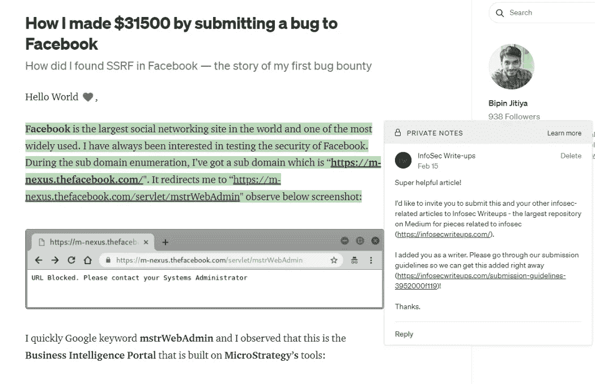

# Infosec 的幕后报道

> 原文：<https://infosecwriteups.com/behind-the-scenes-of-infosec-writeups-afa738793c9?source=collection_archive---------5----------------------->

## 该出版物自 2017 年以来如何增长，一次一条消息。

弗洛里安·奥利佛在 [Unsplash](https://unsplash.com/?utm_source=medium&utm_medium=referral) 上拍摄的照片

亲爱的读者:

你知道[InfoSec WriteUps Publication](https://www.linkedin.com/feed/#)是如何发展到今天的吗？

自 2017 年 12 月以来，我们的创造者 [Sai Krishna Kothapalli](https://medium.com/u/be0f09f27ea3?source=post_page-----764545d21373--------------------------------) 每天都会在 Medium 上发送关于每一个与 Infosec 相关的伟大故事的私人笔记。

您在这里看到的截图只是迄今为止帮助塑造该出版物的 12396598475982374 之一。

日复一日，一个故事接一个故事，一次一个作家——我们走到了今天。

我分享这个是因为人们经常看到最终的结果，而不是多年的努力，汗水和眼泪花在建设一些不可思议的事情上。

今天，我们是一个拥有 26，000 多人的社区，很快将组织我们备受喜爱的虚拟网络安全活动的 2.0 版本:[**IWCON 2022**](https://iwcon.live/):Infosec write up 于 2022 年 12 月 17 日和 18 日举办的虚拟网络安全会议和网络活动。

我们有 16 位令人惊叹的演讲者(查看我们的阵容 [*这里*](https://iwcon.live/) )和 2 个多小时的虚拟一对一和小组网络会议。

作为一个一直梦想将信息安全社区聚集在一起的人，这是我第一次尝试为您提供一些终身价值。

激动吗？在这里预订**的门票。**

**此次活动将有数百名网络安全工程师、学生和 bug 赏金猎人参加。如果你曾经对信息安全感兴趣，这是一个机会，让你了解一些真正改变生活的东西。**

**不要忘记与你所有的 CTF 朋友分享这个，这样他们就可以一起分享所有的乐趣了！**

**希望能在 IWCON 2022 上见到你。**

**最佳，
编辑团队
Infosec 报道。**