# 短信轰炸应用的背后

> 原文：<https://infosecwriteups.com/behind-the-sms-bombing-application-33ac4e9924df?source=collection_archive---------0----------------------->

## 几乎每个人都使用过或者曾经是短信/电话炸弹攻击的受害者。

短信轰炸或者电话轰炸，到现在已经很久了。

**什么是短信轰炸？**

短信轰炸是一种攻击，人们通过它向任何人发送类似 OTP、随机文本和电话的消息，而没有任何限制。人们通常利用这种攻击来恶作剧或打扰他们认识的人。
攻击者通常使用某种带有易受攻击 API 的脚本或应用程序(没有速率限制)来实施这些攻击。现在有数百个网站/应用程序进行短信轰炸。
一旦发起攻击，受害者会在一分钟内收到数百条信息，这取决于袭击者的速度。

**短信轰炸是什么原因造成的？**

通常，所使用的易受速率限制攻击的 OTP APIs(即不检查正在发送的 OTP 的数量)用于构建这些脚本或应用程序。

**故事**

最近我在多个脸书群组上看到了许多关于短信轰炸应用的帖子。所以我想为什么不深入研究一下呢？

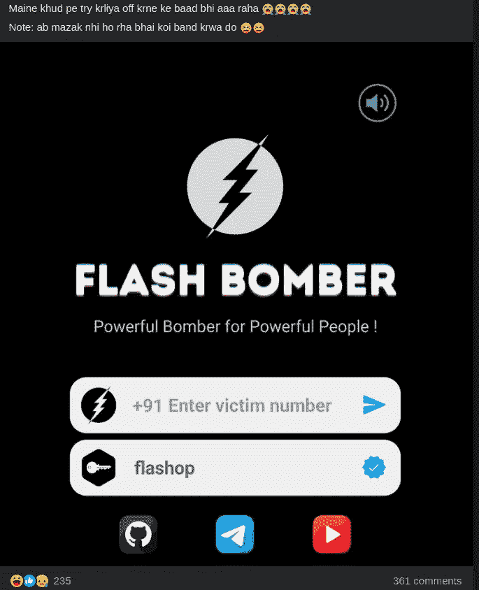

在查看评论后，我找到了下载应用程序的链接。

该应用程序被称为**闪光轰炸机**。

在我自己的设备上运行任何东西之前，为什么不在模拟器上检查一下呢？

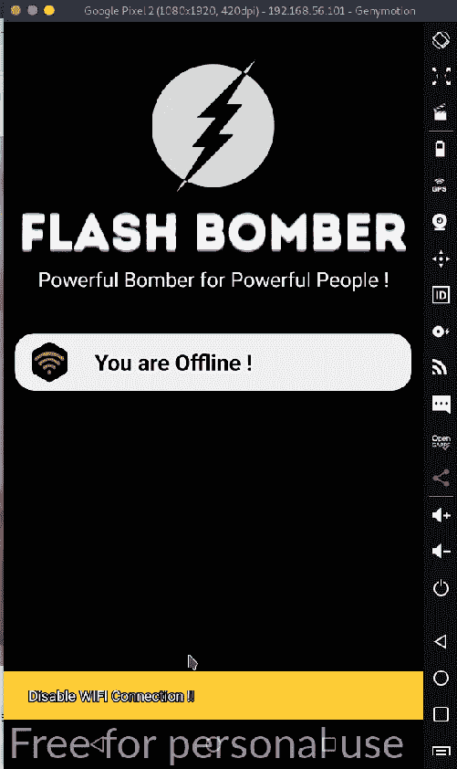

应用程序不允许 Wifi 连接。

反转应用程序

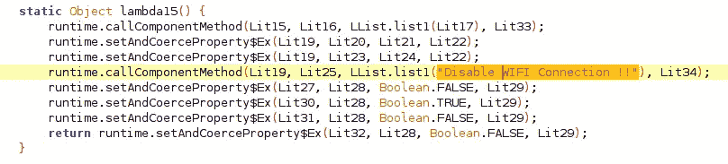

通过查看，我们可以获得用于检查的类和方法

```
Lit804 = new FString("com.google.appinventor.components.runtime.WiFiAdmin");
```

和弗丽达一起骑马

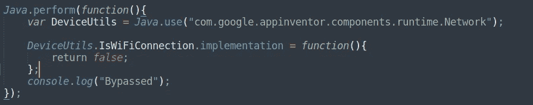

同样，它有多重检查，如 SSL 锁定，根检查，ADB 检查，IsRoSecureRoKernelQemu，仿真器和嗅探器检查-

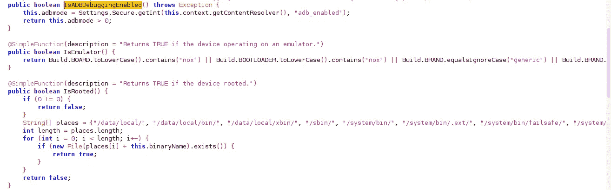

所以，我在弗里达用了同样的方法来绕过上面的检查。

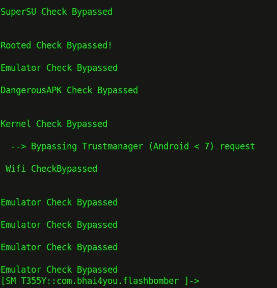

现在我们可以通过 burp 检查应用程序请求。

在启动应用程序时，它使用用户提供的电子邮件 ID 注册设备。

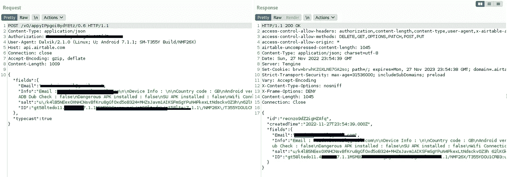

所以它将设备信息和电子邮件一起保存到 Airtable 数据库中。

现在让我们启动轰炸机。

为了启动轰炸机，它需要已经在小组中公开的密钥。按键- **flashop**

当有人启动炸弹时，它会将号码和时间一起保存在电子邮件中。

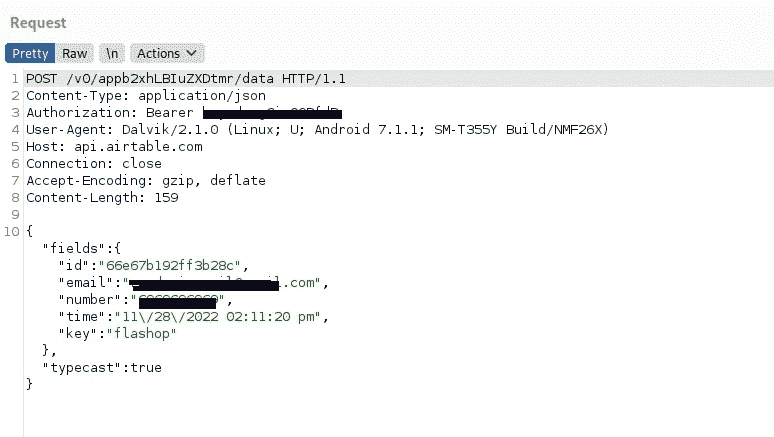

如果应用程序在你每次运行时都保存你的详细信息，那么匿名消息轰炸还有什么意义呢？

不管怎样，我们继续-

有趣的是，该应用程序正在获取保存的详细信息，而 Airtable API 本身对获取数据没有任何限制。

因此可以从数据库中获取所有细节。

授权持有人令牌在应用程序本身中。

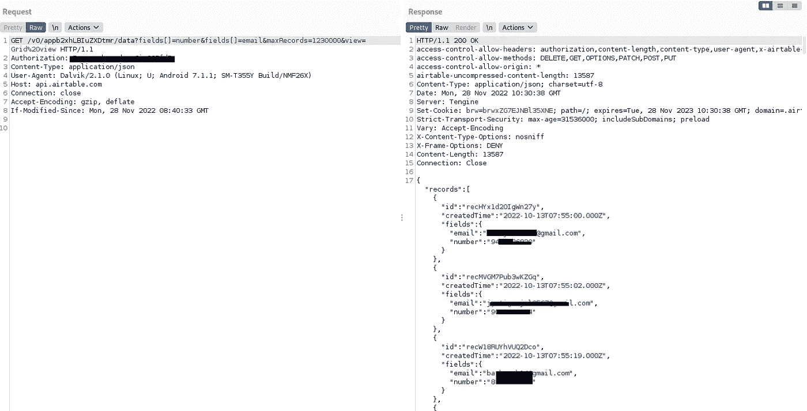

类似地，对于设备

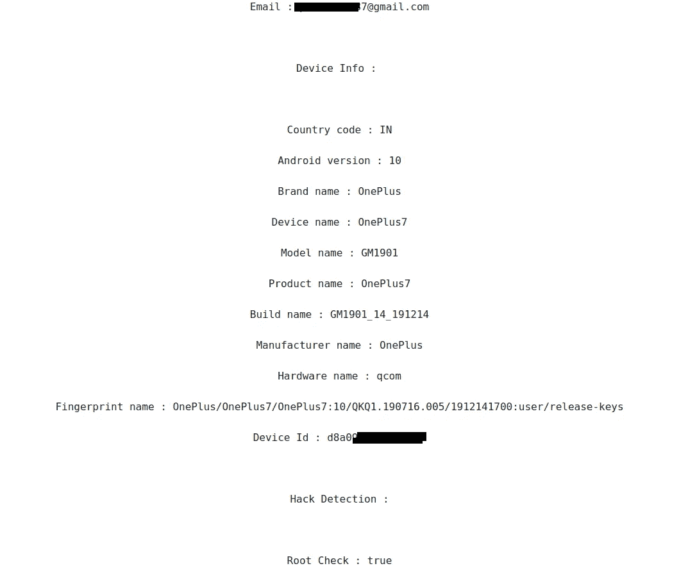

为了转储所有数据，可以使用一个小的 python 脚本来相应地调整偏移量。

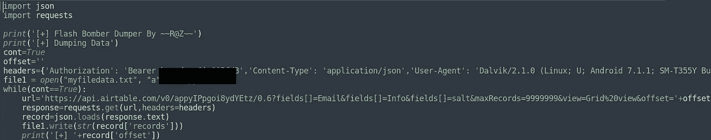

输出

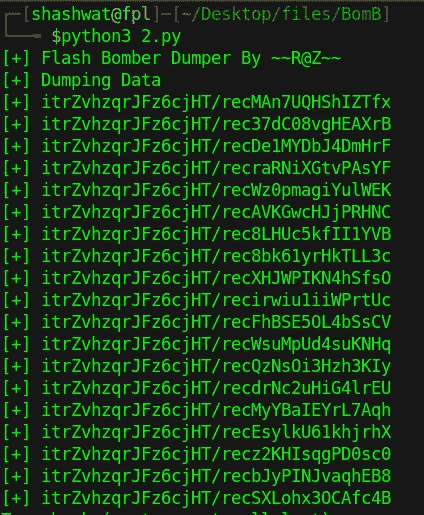

此外，你可以很容易地获得用于 SMS API 的 API，因为它保存在应用程序本身中。

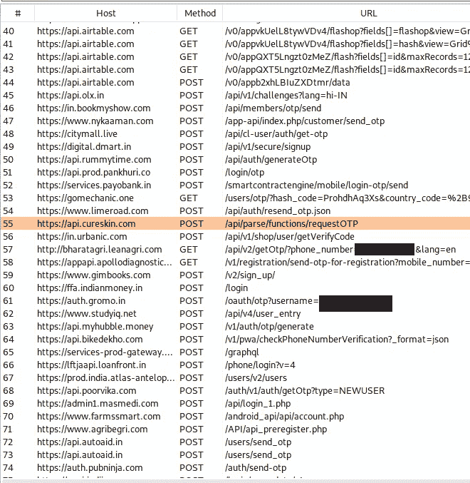

## 来自 Infosec 的报道:Infosec 每天都有很多内容，很难跟上。[加入我们的每周简讯](https://weekly.infosecwriteups.com/)以 5 篇文章、4 条线索、3 个视频、2 个 GitHub Repos 和工具以及 1 个工作提醒的形式免费获取所有最新的 Infosec 趋势！