# 最佳 CTF 平台

> 原文：<https://infosecwriteups.com/best-ctf-platforms-876cc0870f3b?source=collection_archive---------0----------------------->

我整理了一份红队/蓝队夺旗平台的清单，以测试你们的技能。

如果你想加入网络安全社区，那么你需要看看这些平台！保存此列表以备后用。

# 攻防

1800+实验室！涵盖 Windows 安全、云安全、密码破解、逆向工程等等。我强烈推荐这个平台！([攻防环节](https://attackdefense.com/))。

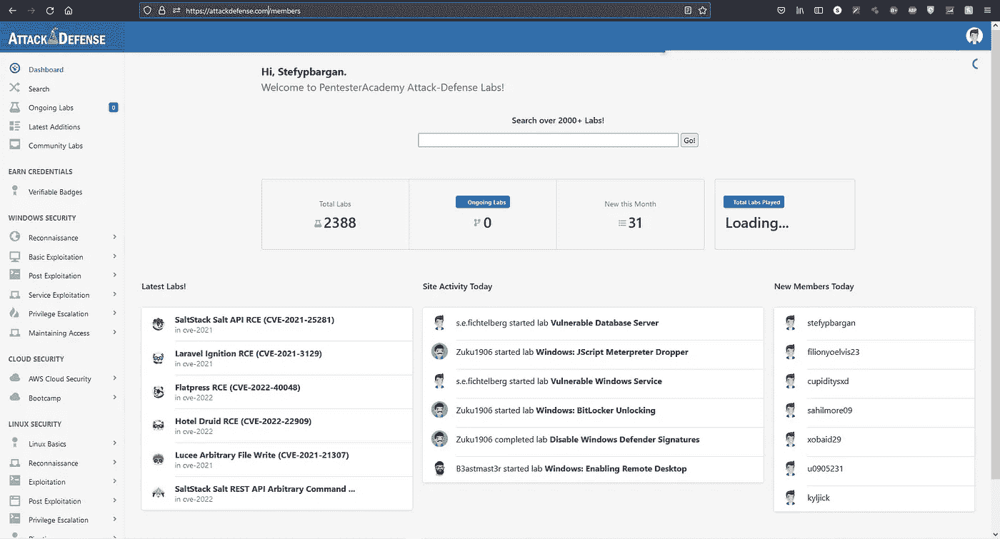

attackdefense.com 网站

# 密码黑客

“*一个有趣的免费现代密码学学习平台*”——[CryptoHack](https://cryptohack.org/)

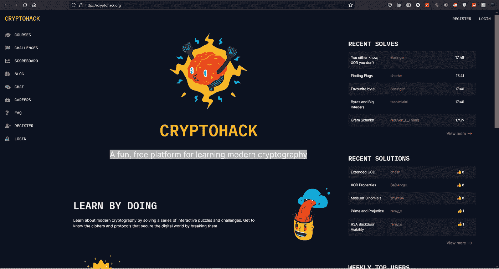

cryptohack.org 网站

# CMD 挑战

[命令行挑战](https://cmdchallenge.com)

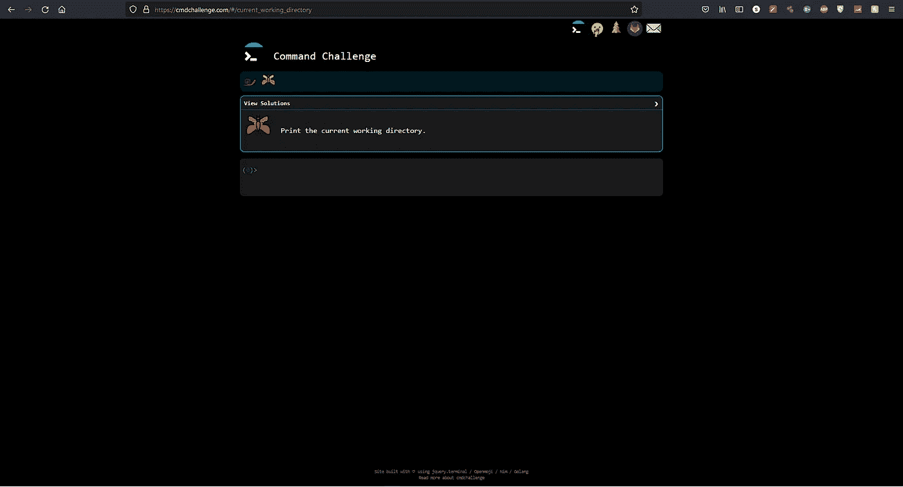

cmdchallenge.com 网站

# 利用教育

" *exploit.education 提供各种资源，可用于学习漏洞分析、漏洞开发、软件调试、二进制分析和一般网络安全问题。*——[剥削教育](https://exploit.education/)

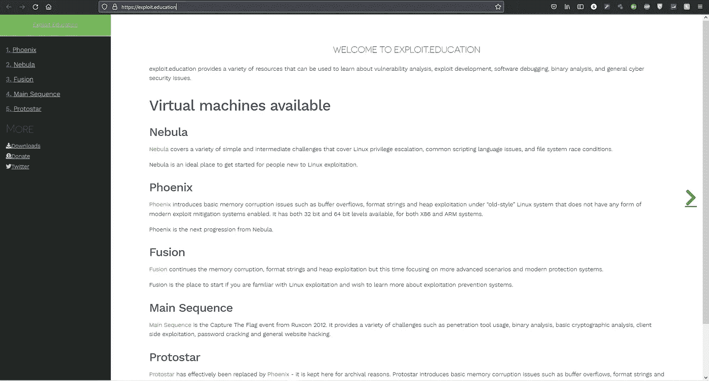

exploit.education 网站

# 保卫网络

"*保卫网络是一个交互式安全平台，您可以在这里学习和挑战您的技能。尝试并完成我们所有的 60+黑客水平。*——[保卫网页](https://defendtheweb.net/)

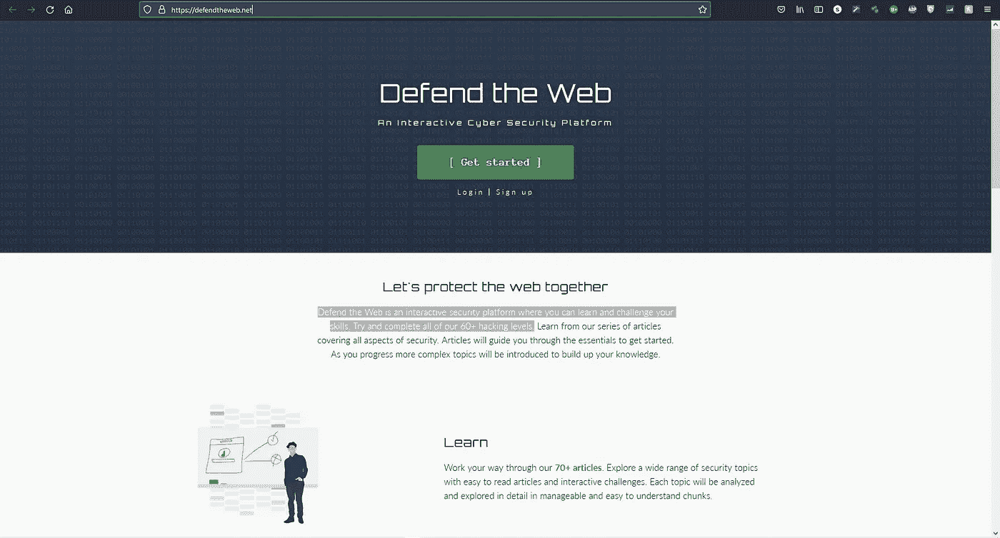

defendtheweb.net 网站

# 黑客入侵

利用这个平台学习和练习不同的漏洞([hacks 训练网站链接](https://www.hacksplaining.com/lessons))。

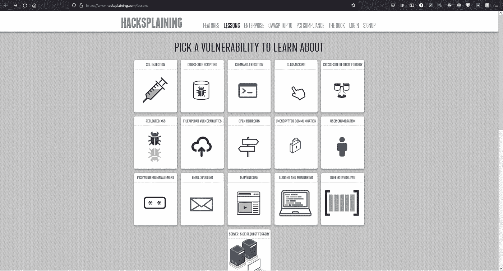

hacksplaining.com 网站

# TryHackMe

*学习网络安全的有趣方式*——[TryHackMe](https://tryhackme.com/)

我目前是前 3%的用户，努力在 2023 年前达到前 1%。我还会在我的媒体页面上发布更多的文章。

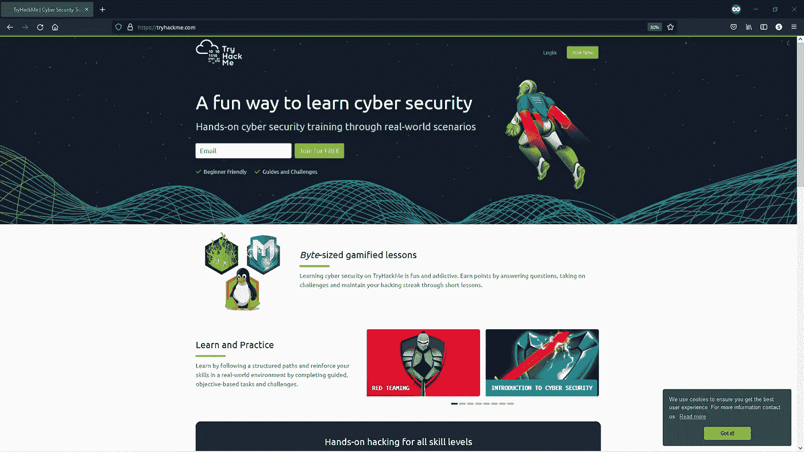

tryhackme.com 网站

# 黑客盒子

一个巨大的黑客游乐场——黑客盒子

在不久的将来，我将开始创作一些来自 HTB 的文章。

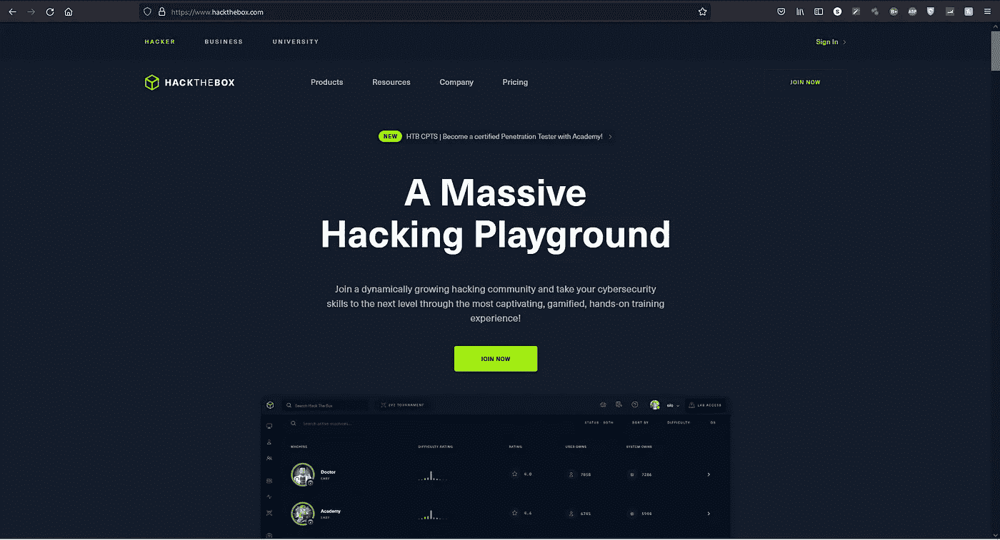

hackthebox.com 网站

# VulnHub

*提供材料，让任何人都能获得数字安全、计算机软件&网络管理方面的实际“动手”经验。*’—[VulnHub](https://www.vulnhub.com/)

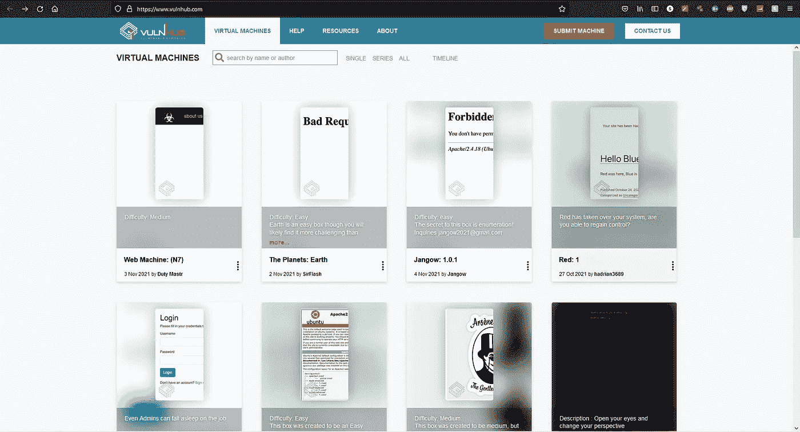

vulnhub.com 网站

# Root-Me

训练你的黑客技能的快速、简单和经济的方法。 ' — [Root-Me](https://www.root-me.org/?lang=en)

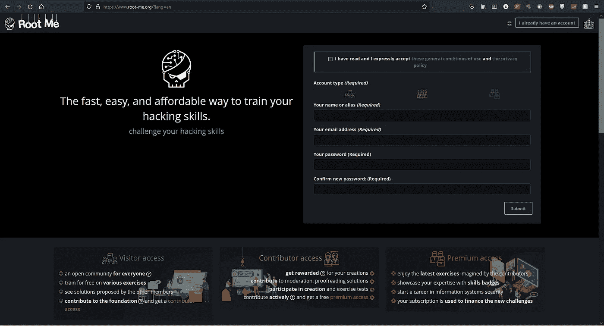

root-me.org 网站

# 扎根监狱

类似于 THM，HTB & Root-Me ( [Root In Jail 网站链接](https://rootinjail.com/index.html#))的平台。

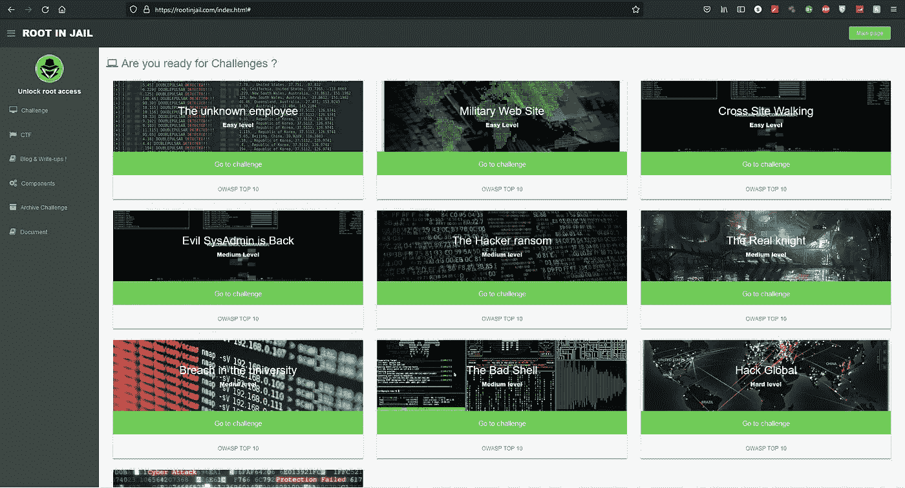

rootinjail.com 网站

# 越线

*overthe wire 社区提供的战争游戏可以帮助你以充满乐趣的游戏形式学习和实践安全概念。要找到更多关于某个战争游戏的信息，只需访问左侧菜单中的链接页面。*——[越线](https://overthewire.org/wargames/)

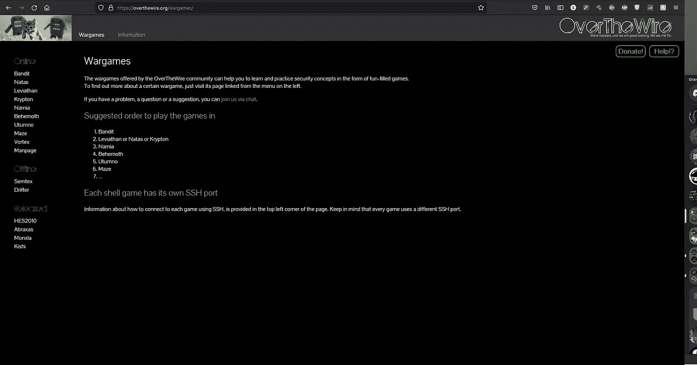

overthewire.org 网站

# Cryptopals 加密挑战

与上课或看书相比，这是一种不同的学习加密的方式。我们给你问题去解决。’—[Cryptopals 密码挑战](https://cryptopals.com/)

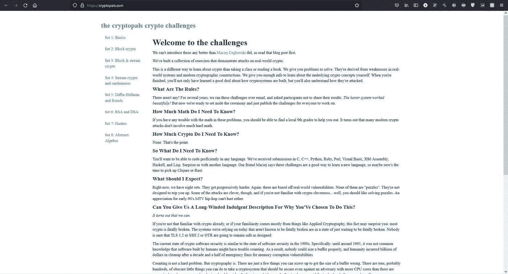

cryptopals.com 网站

# 让我们防御

*LetsDefend 通过在模拟足球赛中调查真实的网络攻击，帮助您建立具有实践经验的蓝队职业生涯。* ' — [让我们防御](https://letsdefend.io/)

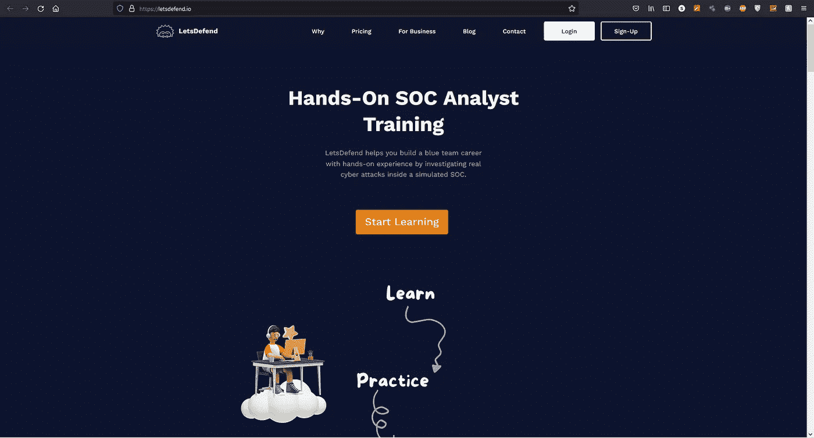

letsdefend.io 网站

# 网络卫士

*蓝场——蓝队挑战*——[网络卫士](https://cyberdefenders.org/blueteam-ctf-challenges/)

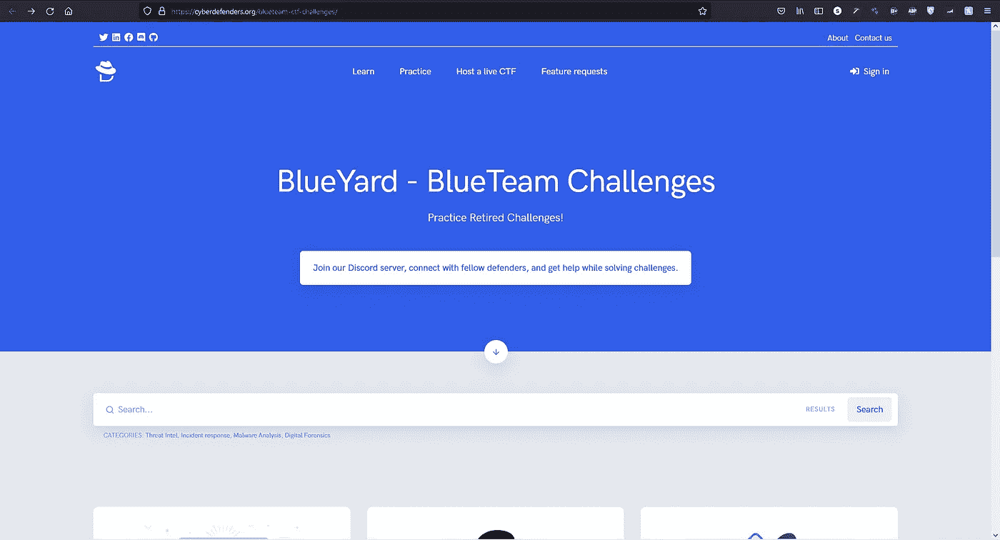

cyberdefenders.org 网站

# W3Challs

*我们的社区为您提供学习和练习黑客技术的安全挑战。*’——[W3Challs](https://w3challs.com/)

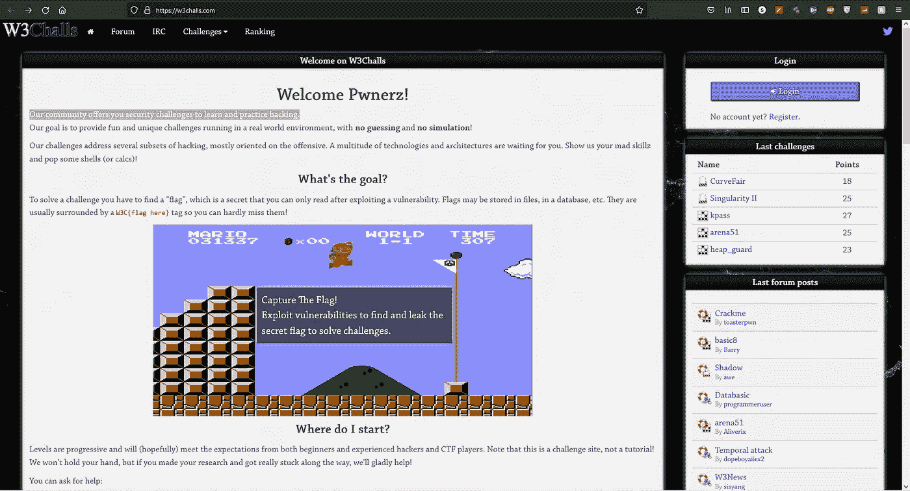

w3challs.com 网站

这些只是我所知道的一些最好的 CTF 平台，可能还有更多。如果你知道任何，你想让他们被提及，那么请让我在下面的评论中知道。

*如果你喜欢看我的故事，* [*关注我*](https://medium.com/@stefan-p-bargan) *了解更多类似的内容。此外，如果你不是中等会员，但你想无限制地访问平台，可以考虑注册***！每月只有 5 美元，我只能得到很少的一部分。谢谢！**

***中等会员**——[https://stefan-p-bargan.medium.com/membership](https://stefan-p-bargan.medium.com/membership)*

***我的 LinkTree【https://linktr.ee/StefanPBargan】——***

## *来自 Infosec 的报道:Infosec 每天都有很多内容，很难跟上。[加入我们的每周简讯](https://weekly.infosecwriteups.com/)以 5 篇文章、4 条线索、3 个视频、2 个 GitHub Repos 和工具以及 1 个工作提醒的形式免费获取所有最新的 Infosec 趋势！*