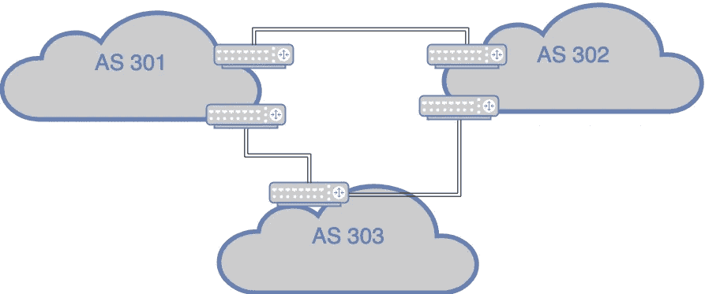
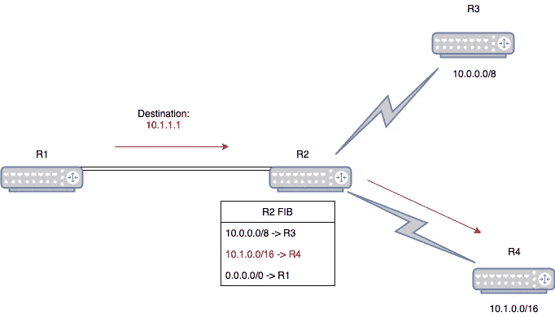
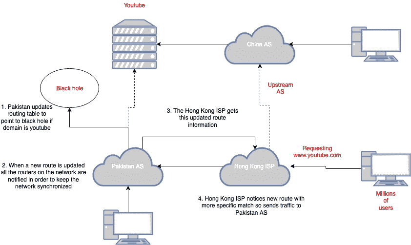

# BGP:互联网的薄弱环节！什么是 BGP，黑客如何利用它？

> 原文：<https://infosecwriteups.com/bgp-the-weak-link-in-the-internet-what-is-bgp-and-how-do-hackers-exploit-it-d899a68ba5bb?source=collection_archive---------0----------------------->

> 解释 BGP 的最佳方式是酒吧里的人发誓戴夫就是戴夫，因为他们以前见过他。但有时他们喝醉了，会把戴夫当成丹尼斯。这是可以理解的，因为鲍勃发誓丹尼斯是戴夫 12 品脱。
> 
> *—凯文·博蒙特(*[*)@ GossiTheDog*](https://twitter.com/GossiTheDog)*)*[*2018 年 4 月 24 日*](https://twitter.com/GossiTheDog/status/988844409683955712?ref_src=twsrc%5Etfw)

[布莱森锤](https://unsplash.com/@trhammerhead?utm_source=medium&utm_medium=referral)在 [Unsplash](https://unsplash.com?utm_source=medium&utm_medium=referral) 上拍照

# #1 什么是 BGP

BGP 代表边界网关协议。它是一种在多个自治系统(AS)之间交换路由信息的路由协议。它被视为我们在互联网上路由流量的方式。

## 自治系统

自治系统是具有相同网络策略的路由器或网络的集合，通常受单一管理控制。—[https://www . Cisco . com/c/en/us/about/press/internet-protocol-journal/back-issues/table-contents-12/autonomous-system-numbers . html](https://www.cisco.com/c/en/us/about/press/internet-protocol-journal/back-issues/table-contents-12/autonomous-system-numbers.html)

自治系统向其他 as 通告它拥有的或者可以到达的前缀地址。路由信息是通过 BGP 通告的。

BGP 用于在一个 AS(内部)的路由器之间和多个 AS(外部)之间传递信息。

iBGP 在 AS 中创建了完全的互连性

注意:内部网关协议应该使用全网状网络。这意味着每个 iBGP 发言人必须与其他 iBGP 发言人对等，如上图所示。

外部 BGP (EGP)是运行在 TCP 上的 as 之间使用的路由协议。

跨多个自治系统的 EGP 示例

内部和外部 BGP 的区别

## 内部

*   在与相同的路由器之间
*   路由器通常离得很远
*   应该是全网状拓扑

## 外部

*   不同 as 中的路由器之间
*   几乎总是通过以太网等直接连接路由器。

# # 2 BGP 是如何工作的

BGP 如何决定到达目的路由器的路径？

选择的道路应该是最短和最可靠的。

这个决定是通过称为链路状态的协议来完成的。使用链路状态协议，每台路由器都会向网络中的所有其它路由器广播其链路和 IP 子网的状态。然后，每台路由器从其它路由器接收信息，构建整个网络的完整拓扑视图。下一跳路由表基于此拓扑视图。

链路状态协议使用计算机科学领域的一种著名算法，即 Dijkstra 最短路径算法。它是这样工作的:

1.  我们从路由器开始考虑到所有直接邻居的路径开销。(注意:路径开销就是 AS 路径长度，更多信息请访问[此处](https://www.cisco.com/c/en/us/about/press/internet-protocol-journal/back-issues/table-contents-12/autonomous-system-numbers.html)。)
2.  然后选择最短的路径
3.  然后，我们重新查看我们可以到达的所有邻居，并用开销信息更新我们的链路状态表。然后，我们继续选择最短路径，直到访问完所有路由器。

现在我们知道了 BGP 是如何建立路由表的。路由表是一个简单的表格，包含网络中所有可能的路由以及到每个目的地的距离。

## 朝着正确的方向前进

*当我们指定一个我们希望与之通信的 IP 地址时，我们的路由器如何知道数据包要发送到哪里(方向)？*

路由器的主要功能之一是通过网络传输数据包。它决定发送数据包的目的地是由其**转发表**中包含的信息决定的。

***注意*** *:转发表并不存储每个 IP 地址，因为这样会使表变得很大！！相反，使用前缀。* ***最长/最具体的*** *匹配总是赢！！！*

根据 R2 的 FIB，R4 具有最长的匹配，因此数据包被发送到那里

***注*** *: 0.0.0.0/0 被认为是默认网关，匹配一切*

# #3 以前使用 BGP 的黑客攻击

BGP 黑客攻击可用于执行一系列恶意活动，包括:

*   拒绝服务
*   《中间人》( MITM)
*   黑色孔洞

在过去，BGP 已经被黑客在大规模的黑客攻击中利用过很多次。2018 年，myetherwallet.com 持有的钱包发生了一次著名的[加密货币抢劫](https://www.bankinfosecurity.com/cryptocurrency-heist-bgp-leak-masks-ether-theft-a-10898)，利用 BGP 劫持执行中间人攻击。

另一次黑客攻击导致谷歌服务瘫痪，利用 BGP 操纵流量通过俄罗斯、中国和尼日利亚进行路由，随后被封锁。—[https://security affairs . co/WordPress/77971/hacking/Google-traffic-BGP-leak . html](https://securityaffairs.co/wordpress/77971/hacking/google-traffic-bgp-leak.html)

[Youtube 2008 黑洞](http://www.enterprisenetworkingplanet.com/netsp/article.php/3615896/Networking-101-Understanding-BGP-Routing.htm)——巴基斯坦决定通过创建一条通向黑洞的 BGP 路由来屏蔽 Youtube。相反，这些路由信息被传输到香港的 ISP，并从那里意外传播到世界各地，这意味着数百万人被路由到这个黑洞，因此无法访问 YouTube。

> *BGP 黑客攻击通常被称为网络整形或流量整形。*

# #4 了解 BGP 劫持

正如我们在前面的巴基斯坦 YouTube 事故中看到的，通过破坏 BGP 路由表，我们能够影响互联网上的流量流向！这种行为被称为 BGP 劫持。

还记得我之前说过最具体/最长的前缀匹配总是获胜吗？事实证明，我们可以利用这个特性来重新路由流量！

通过毒化路由表，我们可以指定比其他 as 当前提供的更具体的路由匹配。如果新路由比其他广告路由更具体，流量将被定向到我们这里！我们也可以声称拥有同样效果的前缀。

我们之前在本文中讨论过的另一件事是 BGP 如何创建路由表。这是由基于 Dikjstra 最短路径算法的链路状态协议完成的。这可以通过通告比其他 AS 更短的 AS 路径来利用。通过这样做，其他路由器的下一个最短跳将是我们的路由器，因此我们可以接收流量。

为了执行这个 [BGP 劫持](https://en.wikipedia.org/wiki/BGP_hijacking)假设我们可以访问网络，并且我们可以更改路由表，但是这是非常不可能的，除非作为内部攻击进行。然而，确实存在另一种方法来实现劫持，它需要以下条件:

1.  成为自治系统的外部对等体
2.  当一个新的对等体被添加时，它的所有被通告的路由被存储在其它设备的路由表中，然后被通告给其它 EBGP。
3.  要执行第 2 步，ISP 必须设置为无过滤，这意味着我们可以通告我们的所有路由

# 结论

总之，对我来说，无论是意外还是故意，理论上劫持和接管互联网是多么容易。ISP 可以通过对客户设置过滤条件来限制可能被广告的路由，从而减少潜在的攻击。然而，这并不容易，也不是有效的任务。

我对 BGP 的另一个担心是它的信任度。它只是传递信息包，而不验证接收者是谁。在未来探索 BGP 黑客攻击的可能防御和路由协议的改进将是令人感兴趣的。

如果你们对 BGP 及其弱点有所了解，或者只是觉得这个博客很有趣，那么请点击“喜欢”按钮来表示你们对这篇文章的支持！这真的激励我去做更多😃。

*关注* [*Infosec 报道*](https://medium.com/bugbountywriteup) *获取更多此类精彩报道。*

 [## 信息安全报道

### 收集了世界上最好的黑客的文章，主题从 bug 奖金和 CTF 到 vulnhub…

medium.com](https://medium.com/bugbountywriteup)