# 大篮子虫赏金记

> 原文：<https://infosecwriteups.com/bigbasket-bug-bounty-writeup-9fedc490b814?source=collection_archive---------1----------------------->

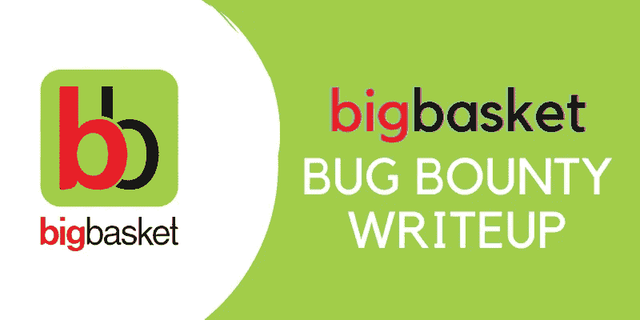

**大篮子虫赏金**

# 大家好！

这是我第一次写文章。

我是**洛斯·高达 M** (安全工程师)。由于新冠肺炎，大多数员工得到了在家工作的选择。它帮助我学习了一些新的 Bug Bounty。2020 年 6 月开始了我的虫子赏金之旅。

做安全工程师和兼职 Bug Bounty 是学习这个领域新东西的好方法，我们也可以在日常工作生活中实施。

我感谢我的团队([维什瓦](https://www.linkedin.com/in/vishva-shankar/)、[哈里什](https://www.linkedin.com/in/harish-channegowda-231909106/))和[哈克蒂菲网络安全](https://hacktify.in/)的支持和指导。

这篇关于大篮子不安全数据存储漏洞的文章

说到技术细节…

我发现其中一个大篮子应用程序使用“**允许备份方法=真**”

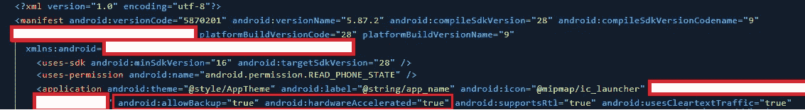

android:allowBackup=" true "

**Android 中什么是允许备份标志？**

**允许备份标志**

**android:allowBackup** 属性定义启用 USB 调试的用户是否可以备份和恢复应用程序数据。如果备份标志设置为 true，即使设备不是根设备，它也允许攻击者通过 ADB 备份应用程序数据。因此，处理和存储诸如卡细节、密码等敏感信息的应用程序。应该将此设置显式设置为 false，因为默认情况下，它被设置为 true 以防止此类风险。

*<应用*

Android:allow backup = " false "

*</应用>*

ADB 备份功能是备份所有文件的好工具。如果启用，拥有你手机的恶意用户可以复制你手机中此应用程序的所有敏感数据。结果发现，如果攻击者能够访问未锁定的手机，他们可以通过 ADB 的备份功能从应用程序的沙箱中获取任何数据。

if**Android:allow backup = " true "**如果数据没有加密，我们可以很容易地从根存储( **Android shared Preferences 和 Db** )中提取任何数据。

> 大多数 Bug Bounty 程序不会接受这个 Bug，因为它需要物理接触设备。但是如果你有任何与内部基础设施相关的敏感数据，请立即报告。

**所以来剥削……**

对于这个开发，我使用 Genymotion 仿真器和 Kali Linux 进行 ADB 调试。

1.在我的机器上安装了 Genymotion(适用于 Windows、Linux 和 Mac OS)

2.之后，在我的模拟器上安装了 android 设备(Android v 8.1)

3.设置完成后，我在我的设备上安装了一个大篮子应用程序。

4.我使用以下命令在 Kali Linux 上调试应用程序。

> ***【ADB 连接到设备(Genymotion 设备默认端口号 5555)***

**装置连接**

> ***验证设备是否连接。***

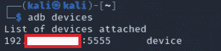

***在设备列表中可以看到***

> ***然后我输入了备份移动的命令以及包名。***

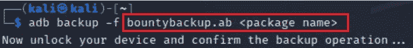

**亚行备份命令**

> ***设备上的备份屏幕。请点击备份我的数据。***

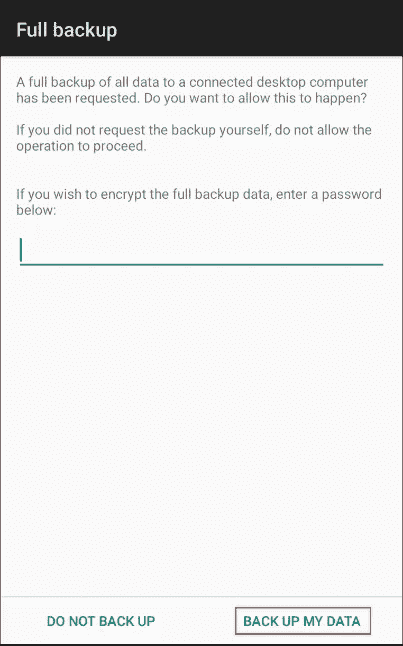

一旦我们确认，它将创建一个 Android 备份文件，并带有一个“.ab”扩展。通常，前 24 个字节是报头。因此，我们将使用 **DD** 工具删除前 24 个字节，并创建剩余部分的 tar 文件。这可以如下所示完成(对任何备份文件使用下面的命令)。其他一些 **DD** 命令可用，但有时无法工作，所以我使用了这个)。

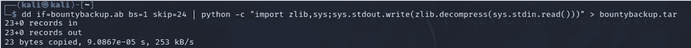

**上面的命令跳过了输入文件的第一块，这是我们 Android 备份的头部分。(这是一个示例文件，不是真正的文件，通常它会给出一些只有 23 字节的大量记录)**

> ***现在，创造一个”。list "文件，它来自我们在上一步中生成的 tar 文件。这是为了确保重新打包备份时的正确顺序。***

我们现在应该有以下文件。(您可以为备份文件指定任何名称，但包名应该相同)

慷慨的支持。ab —实际的 Android 备份来自设备

**bountybackup.tar**—使用 dd 生成的文件

**慷慨备份。列表** —使用 tar 文件生成的文件

> *我们可以使用下面的命令* 简单地提取 bountybackup.tar 文件

**备份文件**

1.一旦完成这个备份过程，我们就有了一个名为“apps”的新文件夹。我们可以进入这个目录来查看特定于应用程序的信息。

2.导航到程序包名称文件夹，然后转到 SP 文件夹。

**Android 中的 SP 文件夹是什么？**

> ***Android 共享首选项:****Android 应用程序的一个常见组件——是一组管理每种类型的开发人员数据的 API，提供了一种干净的方法来永久存储和从设备中检索这些数据。几乎每个 android 应用程序都使用它们。*
> 
> 现在，我们有了一个“SP”文件夹，其中包含存储我们的目标应用程序数据的 XML 文件。 ***我发现了一些仪表板内部的 IP，这里有一个秘密令牌*** *。*

**这是我的一些调查结果的概念验证…**

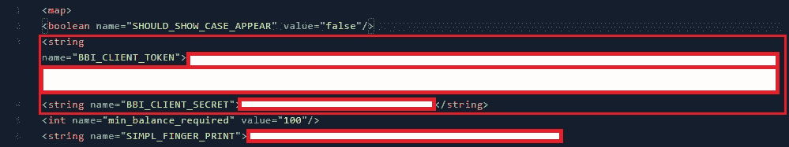

**客户端秘密令牌**

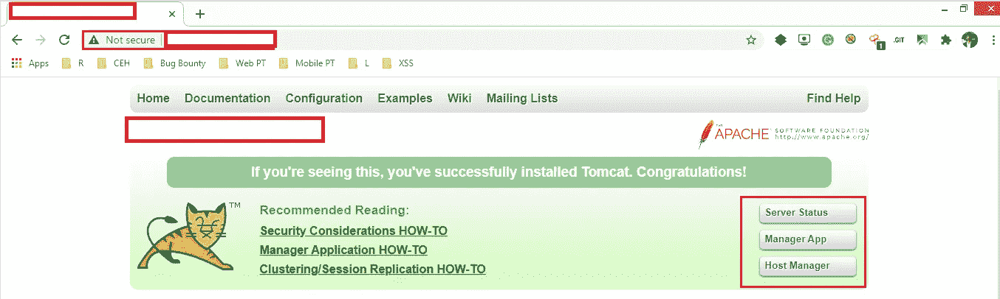

**Apache 主机管理器访问**

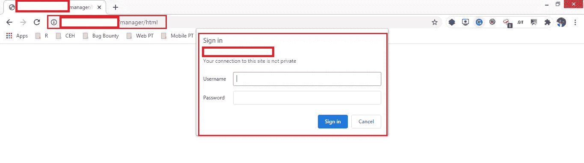

**管理面板**

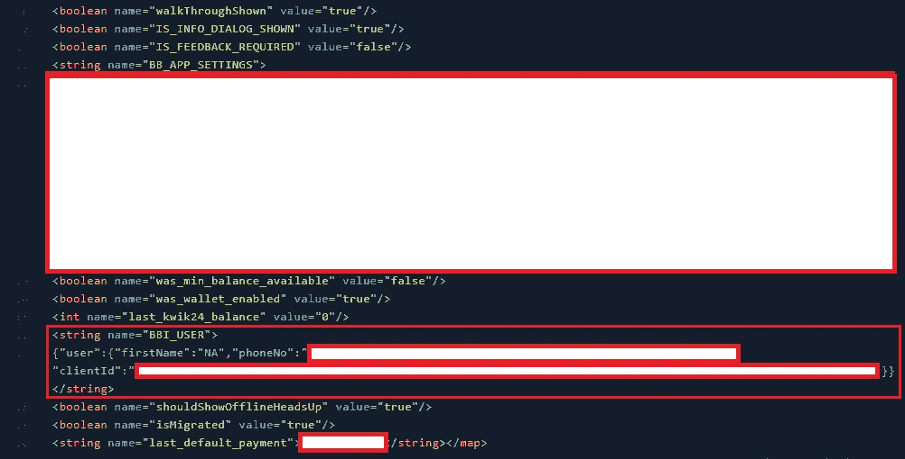

**硬编码的用户详细信息和令牌**

我得到了他们安全团队的奖励，并在他们的 [**名人堂**](https://tech.bigbasket.com/security-at-bigbasket/) **中得到表彰。**

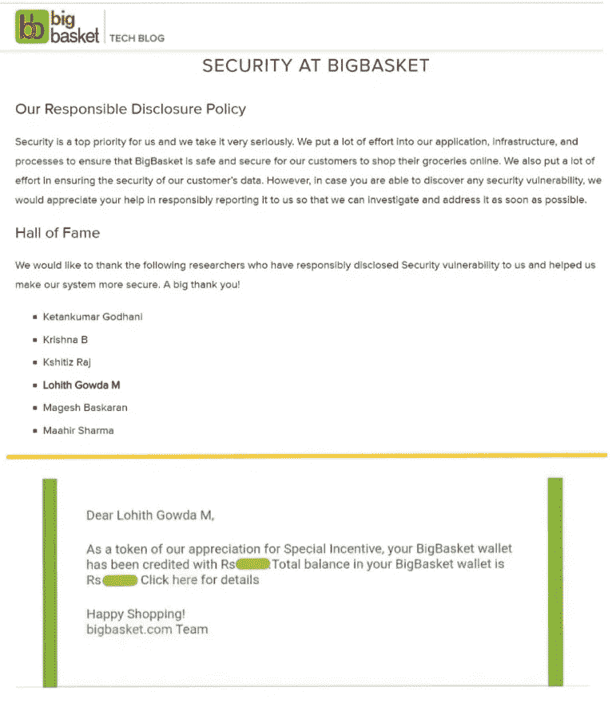

**名人堂+赏金**

**报告详情:**

2020 年 10 月 5 日，星期一，01:04-向大篮子安全团队报告了错误。

2020 年 10 月 6 日星期二 10:00 —收到团队的第一个回复

2020 年 10 月 12 日，星期一，18:25-接受

2020 年 12 月 8 日星期二 11:26 —错误被标记为已修复

2020 年 12 月 8 日星期二 07:38 —重新测试并确认了修复

Fri，2021 年 1 月 8 日，10:27——获得赏金+ [名人堂](https://tech.bigbasket.com/security-at-bigbasket/)

**感谢阅读！….黑客快乐！**

> *Linkedin:*[*Lohith Gowda M*](https://www.linkedin.com/in/lohigowda/)
> 
> *推特:*[*lohigowda _ in*](https://twitter.com/lohigowda_in)
> 
> *insta gram:*[*lohigowda . in*](https://www.instagram.com/lohigowda.in/)
> 
> *作品集:*[*https://www.lohigowda.in/*](https://www.lohigowda.in/)