# 现代二进制开发文章 0x01

> 原文：<https://infosecwriteups.com/binary-exploitation-5fe810db3ed4?source=collection_archive---------0----------------------->

这是 [RPISEC](https://rpis.ec/) 的**工具和基本逆向工程**的第一篇文章，它是**现代二进制开发**课程的一个子部分。

讲座链接:-[http://security.cs.rpi.edu/courses/binexp-spring2015/](http://security.cs.rpi.edu/courses/binexp-spring2015/)

所有的课堂材料和其他必要的文件都可以在上面的链接中找到。

_ _ _ _ _ _ _ _ _ _ _ _ _ _ _ _ _ _ _ _ _ _ _ _ _ _ _ _ _ _ _ _ _ _ _ _ _ _ _ _ _ _ _ _ _ _ _ _ _ _ _ _**下一篇特写** [➡️](https://medium.com/bugbountywriteup/modern-binary-exploitation-writeups-ii-62c092f7f389)

# crackme0x00a

**使用*文件*命令**收集信息

```
$file crackme0x00a
```

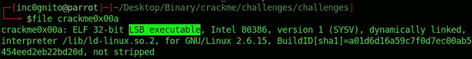

32 位 LSB 可执行文件

*   该文件为 32 位， **LSB** 可执行*(最低有效字节)。*
*   这意味着文件是小端的。


使用 *rabin2* 工具收集信息。

```
$rabin2 -I crackme0x00a
```

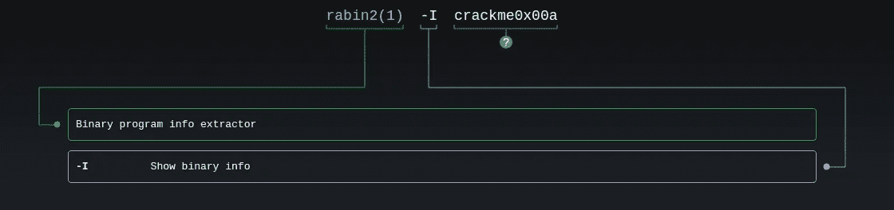

man rabin2

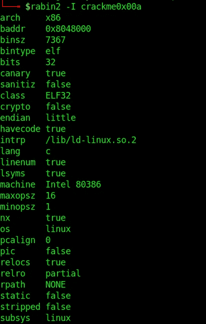

拉宾 2

**使用字符串破解文件**

```
$strings crackme00x0a
```

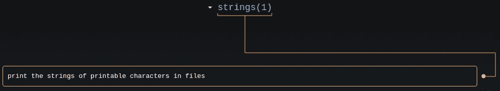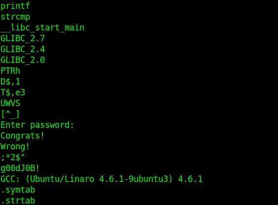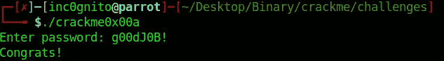

**使用 xxd 破解文件**

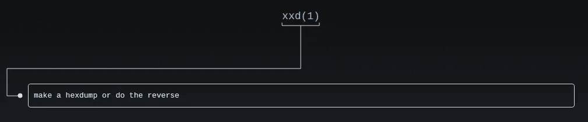

```
$xxd crackme0x00a
```

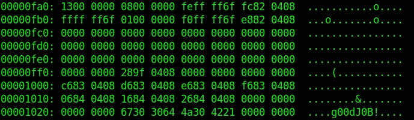

**使用 rabin2 破解文件**

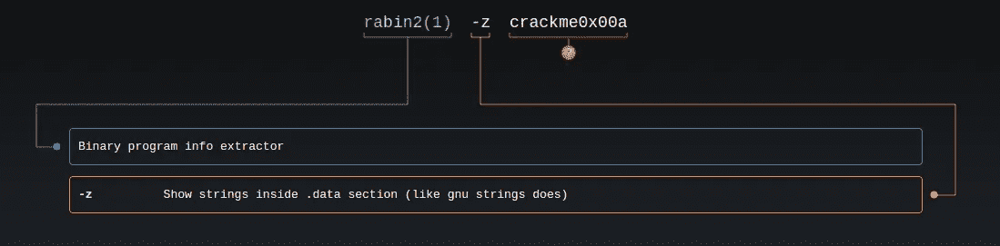

man rabin2

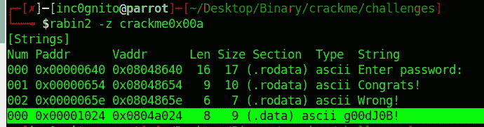

**使用 ltracre 破解文件**

```
$ltrace ./crackme0x00a
```

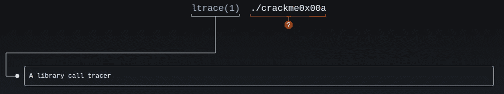

男子跑道

ltrace 基本上截取并打印程序执行的系统调用。

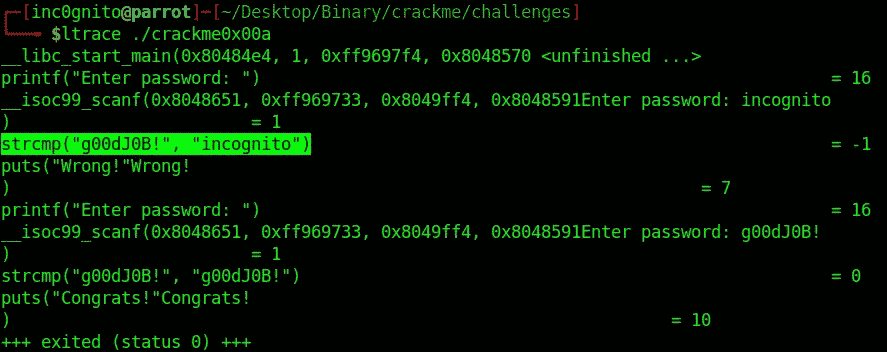

ltrace

**使用 strace 破解文件:(**

```
strace ./crackme0x00a
```

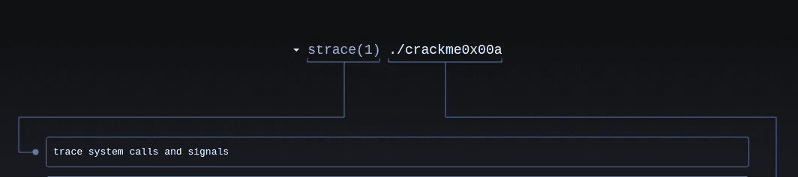

man strace

strace 用于跟踪系统调用。它不会跟踪像 strncmp 这样的字符串比较，因为它不需要任何系统调用。

**使用 radare2 破解文件**

```
$radare2 crackme0x00a
 [0x08048430]> aaa
 [0x08048430]> pdf @ main
```

*   aa:-全部分析。
*   aaa:-用更多信息分析所有内容。
*   pdf:-打印反汇编功能。

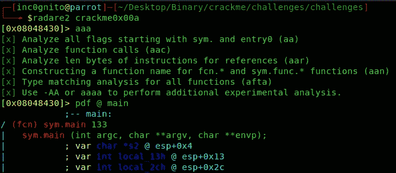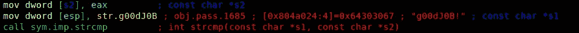

radare2 给出了代码的视图。

*   有一个*s2 字符型指针，它指向一些字符串，即我们的输入(密码)。*s1 是“g00dJ0B！”在下一步中，使用 strcmp 对两者进行比较。


**使用 gdb-peda 破解文件**

gdb-peda 就像是 gdb 的一个插件，你可以从 [GitHub](https://github.com/longld/peda) 安装。

```
$gdb crackme0x00a
>gdb-peda$ disassemble main
```

***反汇编主*** 将显示二进制的主功能。

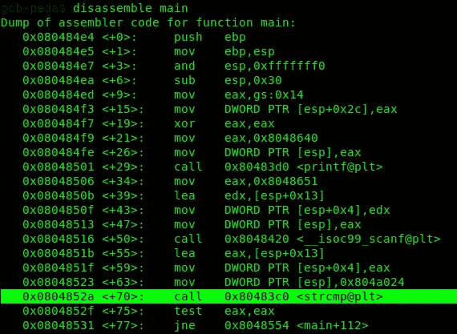

主要功能

在上有一个 strcmp 指令，所以让我们在这个位置设置断点并运行程序。

```
 gdb-peda$ break *0x0804852a
gdb-peda$ run
```

输入密码来测试程序，在这种情况下，我输入 ***化名*** 作为密码。

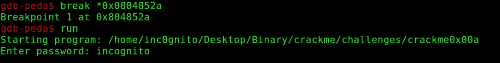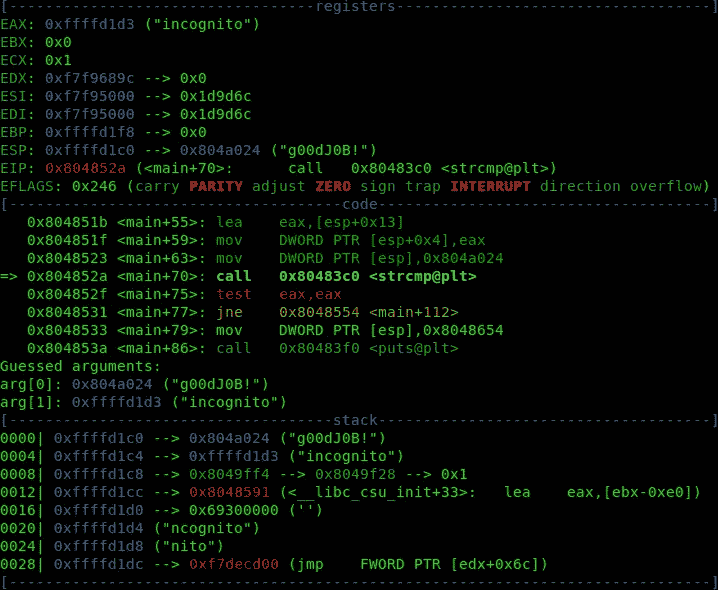

《微服私访》是和《g00dj0B》相比较的！，gdb-peda 也展示了一些猜测论点。


*感谢阅读！如果你喜欢这个故事，请* ***点击*** 👏 ***按钮，分享*** *它来帮助别人！欢迎发表评论*💬*下图。有反馈？下面我们连线上* [*推特*](https://twitter.com/yashanand155) *。*

## ❤️由[增加到](https://twitter.com/yashanand155)