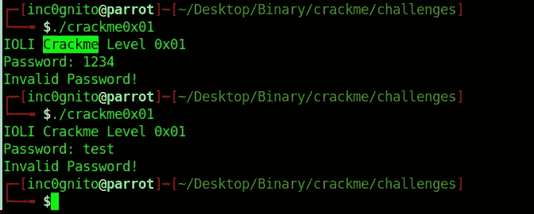
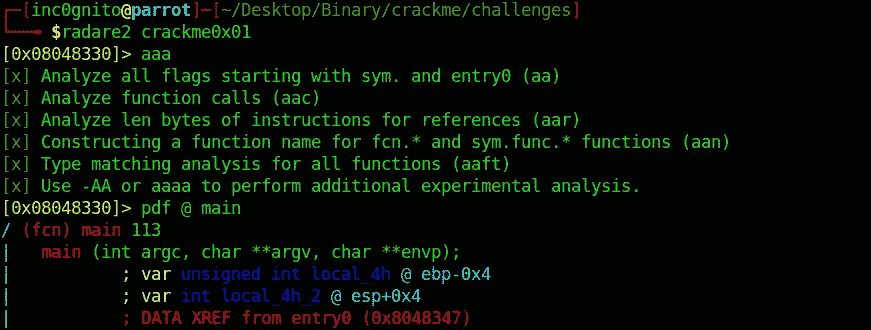
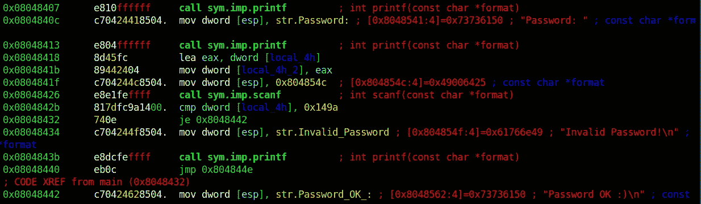
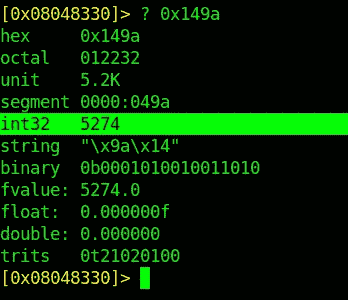
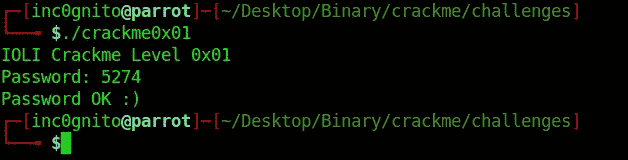
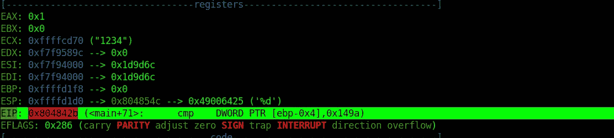
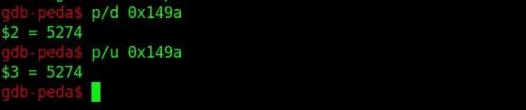
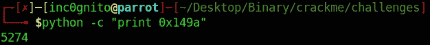

# 现代二进制开发文章-0x03

> 原文：<https://infosecwriteups.com/binary-writeup-0x03-9a9546711ef2?source=collection_archive---------0----------------------->

这是**现代二进制开发**课程的子部分 [RPISEC](https://rpis.ec/) 关于**工具和基本逆向工程**的第三篇综述。

讲座链接:-[http://security.cs.rpi.edu/courses/binexp-spring2015/](http://security.cs.rpi.edu/courses/binexp-spring2015/)

所有的课堂材料和其他必要的文件都可以在上面的链接中找到。

[⬅️](https://medium.com/bugbountywriteup/modern-binary-exploitation-writeups-ii-62c092f7f389) **上一篇报道**_ _ _ _ _ _ _ _ _ _ _ _ _ _ _ _ _ _ _ _ _ _ _ _ _ _ _ _**下一篇报道** [➡️](https://medium.com/bugbountywriteup/binary-writeup-0x04-baeed833ddf)

# crackme0x01

```
$./crackme0x01
```



crackme0x01

**使用雷达 2 进行破解**

```
radare2 crackme0x01 
[0x08048330]> aaa
[0x08048330]> pdf @ main
```

*   **aa:-** 分析全部。
*   aaa:- 分析更多信息。
*   **pdf:-** 打印拆解功能。



雷达 2



主要在 radare2

在位置 **0x0804842b** 有 ***local_4h*** 与 ***0x149a 的 cmp(比较)。*** local_4h 是我们存储输入(密码)的变量。



转换

将 0x149a(comapred 值)作为 int(5274)输入。



二进制文件

**使用 gdb 破解**

```
**$gdb** crackme0x01
**gdb-peda$** disassemble main
```


```
**gdb-peda$** break *0x0804842b
Breakpoint 1 at 0x804842b
**gdb-peda$** run
```



**0x 804842 b**CMP DWORD***PTR【ebp-0x 4】***， ***0x149a*** 。PTR [ebp-0x4]是接受输入(密码)并与 **0x149a 进行比较的变量。**

**DWORD:-** 它指的是双字，双字是 32 位或 4 字节(8 位=1 字节)。

**PTR:-** 指针的缩写。

**【ebp-0x 4】:-**从 ebp(基址指针)寄存器中减去 4 个字节，所以现在指向子程序的第一个局部变量。



转换

```
$p/d 0x149a
```

*   **p:-** 打印命令(缩写为 **p** )
*   **d:-** 打印为带符号十进制的整数。

```
$p/u 0x149a
```

*   **p:-** 打印命令(缩写 **p**
*   **u:-** 打印为无符号十进制整数。

使用 python 转换 **'0x149a'**

```
$ python -c "print 0x149a"
```



特别感谢 Aleksey Covacevice 对我的帮助。

*感谢阅读！如果你喜欢这个故事，请* ***点击*** 👏 ***按钮，分享*** *帮助他人！欢迎发表评论*💬*下图。有反馈？下面我们连线上* [*推特*](https://twitter.com/yashanand155) *。*

## ❤️由[增加到](https://twitter.com/yashanand155)