# 现代二进制开发文章-0x04

> 原文：<https://infosecwriteups.com/binary-writeup-0x04-baeed833ddf?source=collection_archive---------0----------------------->

这是**现代二进制开发**课程的子部分 [RPISEC](https://rpis.ec/) 关于**工具和基本逆向工程**的第四篇综述。

讲座链接:-[http://security.cs.rpi.edu/courses/binexp-spring2015/](http://security.cs.rpi.edu/courses/binexp-spring2015/)

所有的课堂材料和其他必要的文件都可以在上面的链接中找到。

[⬅️](https://medium.com/bugbountywriteup/binary-writeup-0x03-9a9546711ef2) **上一篇报道**_ _ _ _ _ _ _ _ _ _ _ _ _ _ _ _ _ _ _ _ _ _ _ _ _ _ _ _ _ _ _**下一篇报道**

# crackme0x02

```
$ ./crackme0x02
```

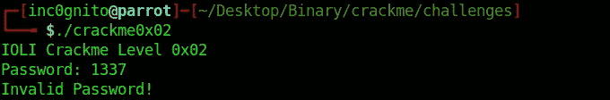

crackme0x02

**使用 *rabin2* 工具收集信息。**

```
rabin2 -I crackme0x02
```

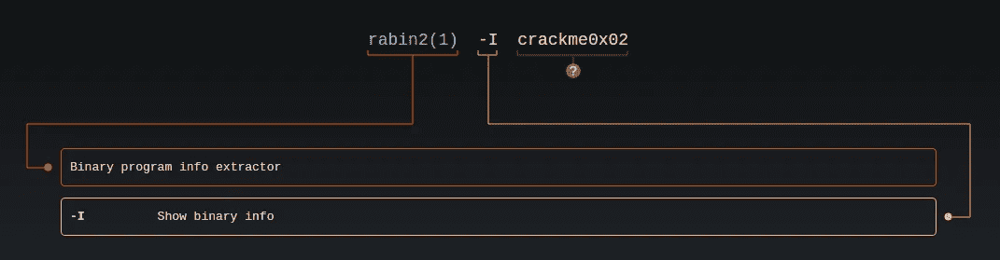

man rabin2

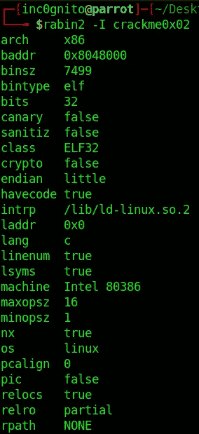

信息

# 使用雷达 2 进行破解

```
radare2 crackme0x02
[0x08048330]> aaa
[0x08048330]> pdf @ main
```

*   **aa:-** 分析全部。
*   aaa:- 分析更多信息。
*   **pdf:-** 打印拆解功能。

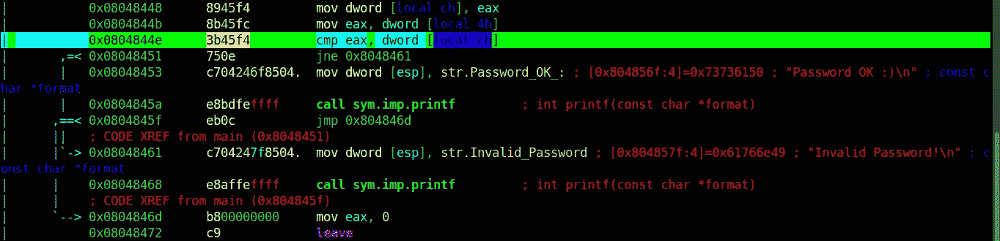

主要功能

```
[0x08048330]> dr
```

**dr:-** 打印带有数值的数据寄存器。

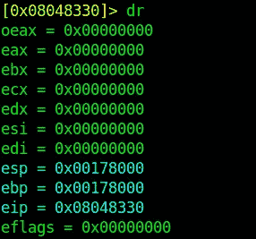

数据寄存器

它显示带有“0”的 eax，这是不正确的，它必须包含一些值。radar 2 在静态模式下分析二进制文件，因此我们必须使用 radar 2 调试模式，这样我们就可以在程序之间设置断点并找到更多信息。

# 使用 radare2 调试模式破解

```
$radare2 -d crackme0x02
```

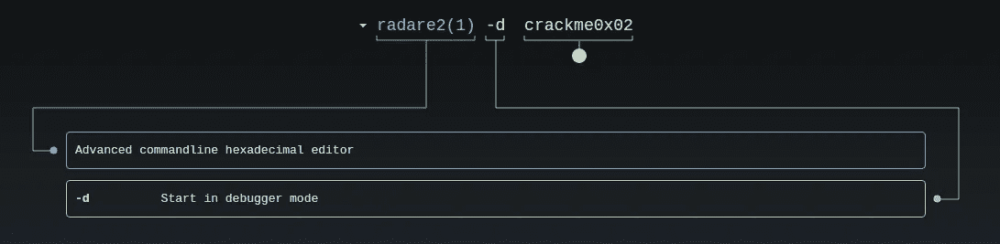

man radare2

*   **aa:-** 分析全部。
*   aaa:- 用更多信息分析所有内容。
*   **pdf:-** 打印拆解功能。

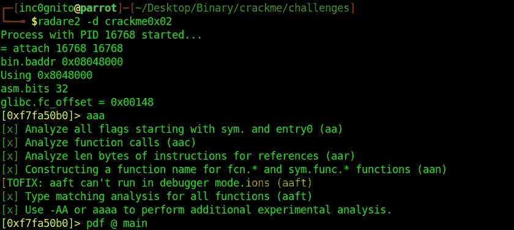

调试方式

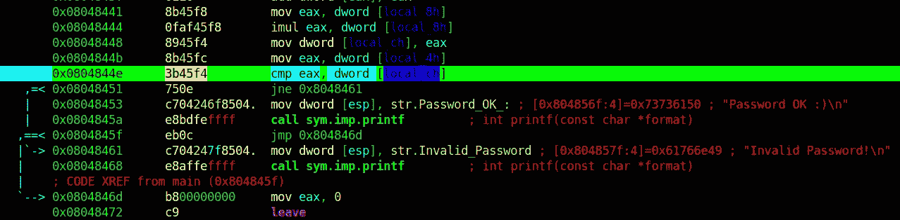

主要功能

在地址“0x0804844e”处有 cmp 指令，因此让我们在那里设置断点。

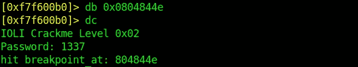

在 cmp 时中断

*   **db *flag* :-** 在*标志*处放置一个断点，其中*标志*可以是地址也可以是函数名。
*   **dc :-** 运行程序。

*cmp eax，dword [local_ch]，*现在我们试着找出$ **eax** 寄存器和 **local_0xc 的值。**

寻找 **eax** 的值。

```
[0x0804844e]> ? eax
```

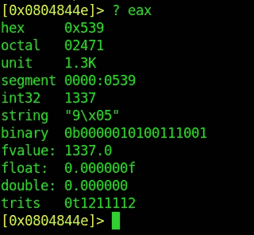

eax 寄存器

还有一种方法可以获得 eax 寄存器的值。

```
[0x0804844e]> dr eax
[0x0804844e]> ? 0x00000539
```

*   **dr flag:-** 打印数据寄存器值。

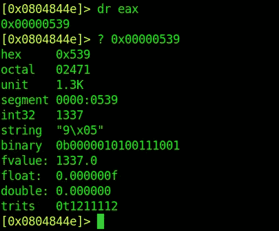

eax 寄存器

求 **local_ch 的值。**

```
[0x0804844e]> afvd local_ch
[0x0804844e]> pxr $w [@ebp](http://twitter.com/ebp)-0xc
[0x0804844e]> ? 0x00052b24
```

*   **afvd:-** afvd name 输出 r2 命令，用于在调试器中显示 args/locals 的值。

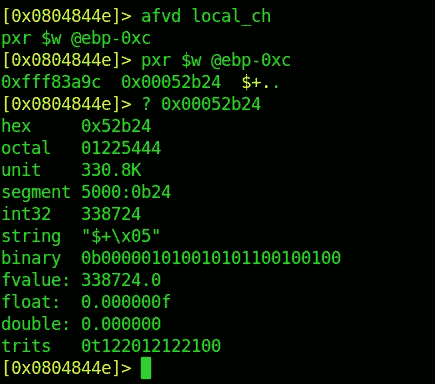

本地频道

求 local_ch 值的另一种方法。

```
[0x0804844e]> afvd
[0x0804844e]> ? 0x00052b24
```

*   **afvd:-** afvd name 输出 r2 命令，用于显示调试器中 args/locals 的值。

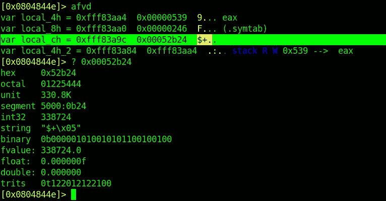

afvd

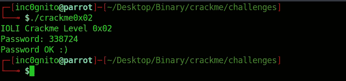

嘲笑

# 使用 gdb 裂解

```
$gdb crackme0x02
gdb-peda$ disassemble main
```

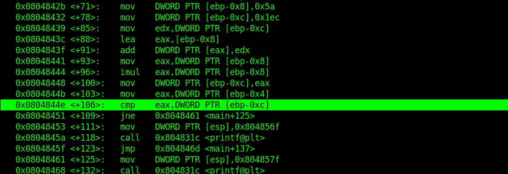

广发银行主页

```
gdb-peda$ break *0x0804844e
```


break @ cmp 指令

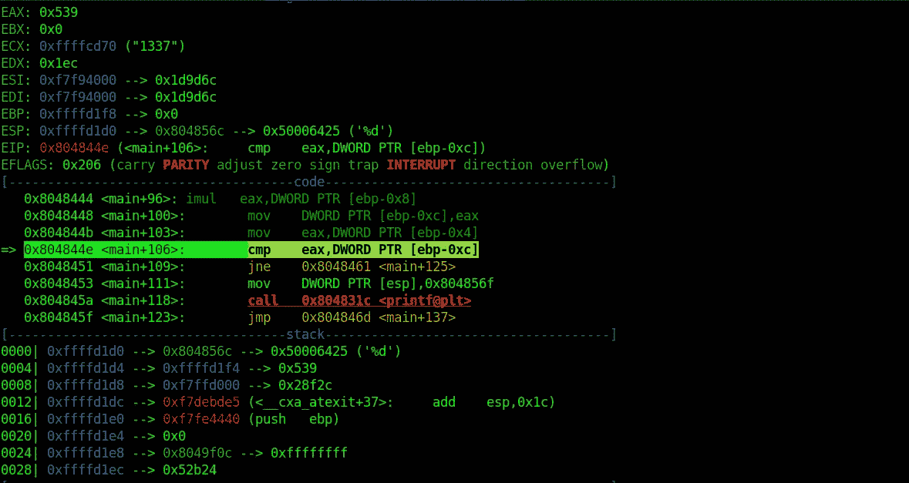

寄存器|代码|堆栈

**cmp eax，DWORD PTR [ebp-0xc]**

*   **eax** :- eax 寄存器包含 **0x539，** *0x* 显示为十六进制。
*   **DWORD:-** 指的是双字，双字是 32 位或 4 字节(8 位=1 字节)。
*   **PTR:-** 指针的缩写。
*   **ebp-0xc:-** 从 ebp(基址指针)中减去 0xc(十进制 12)。

因此，在该指令中，eax 与存储在地址 **ebp-0xc** 中的*字(数字)*进行比较。

让我们来看看 ***eax*** 和 ***ebp-0xc 中存储了什么。***

从上图来看， **eax** 显示值 ***0x539***

```
p/d 0x539
```

*   **p:-** 打印命令(缩写为 **p** )。
*   **d:-** 打印为带符号十进制的整数。

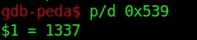

转变

**1337** 存储在 **$eax** 中，我们给它一个输入。

```
gdb-peda$ x/x $ebp-0xc
0xffffd1ec: 0x00052b24
gdb-peda$ p/d 0x00052b24
$9 = 338724
```

**x** 命令用于 e **X** 胺。

*   **/x:-** 以十六进制打印地址$ebp 和该地址的内容。

**p** 命令用于 **P** 打印。

*   **/d:-** 以小数形式打印内容。

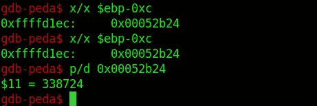

转变

```
$./crackme0x02
```


嘲笑

使用 python 转换 **'0x00052b24'**

```
python -c "print 0x00052b24"
```

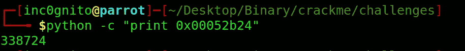

大蟒

使用 **rax2** 转换 **'0x00052b24'**

```
rax2 0x00052b24
```

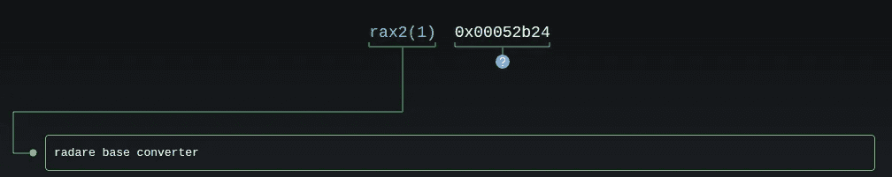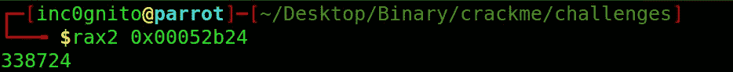

rax2

*感谢阅读！如果你喜欢这个故事，请点击**👏 ***按钮，分享*** *帮助他人！欢迎留言评论*💬*下图。有反馈？下面我们连线上* [*推特*](https://twitter.com/yashanand155) *。**

## *❤️按[inco gnito](https://twitter.com/yashanand155)*