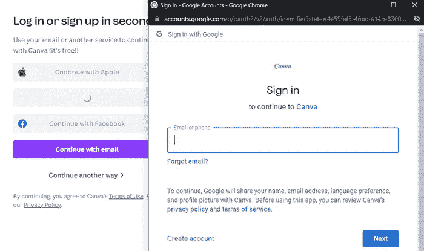
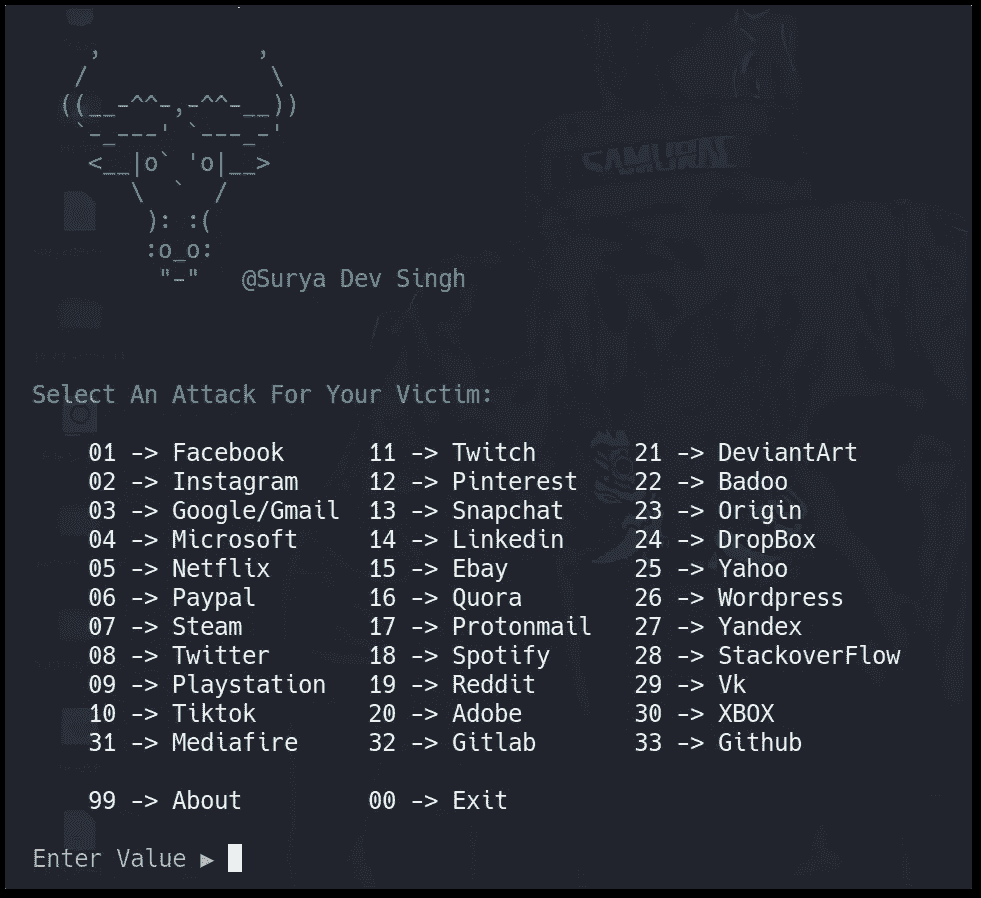
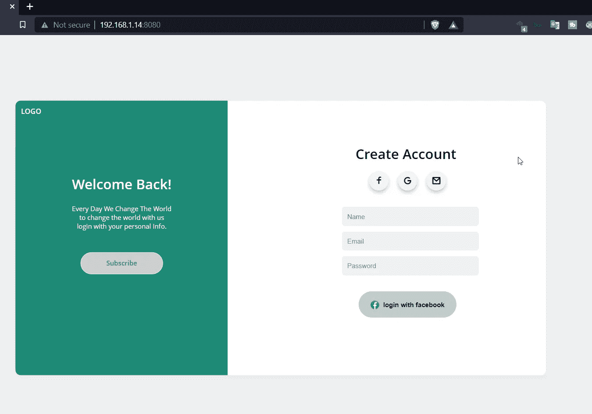
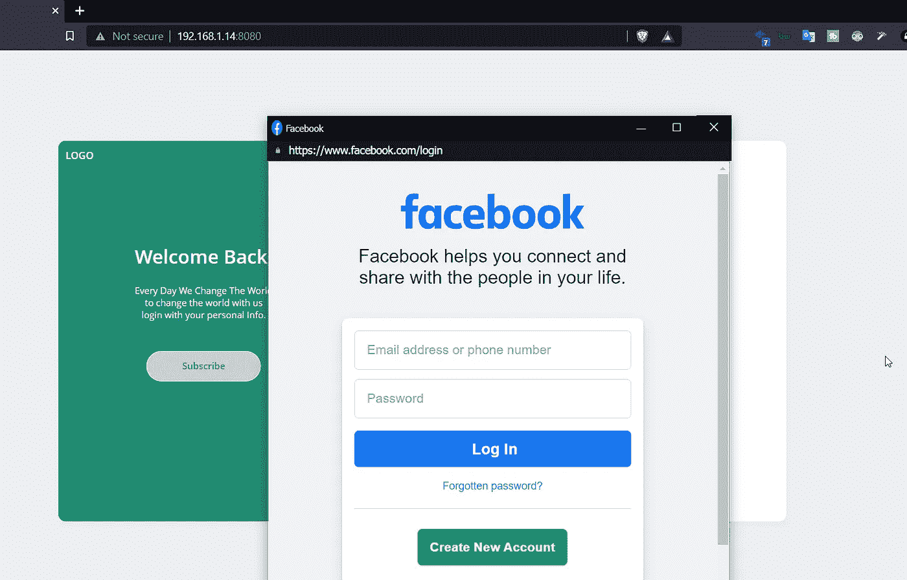

# BITB(浏览器中的浏览器)攻击

> 原文：<https://infosecwriteups.com/bitb-browser-in-the-browser-attack-e2008c405701?source=collection_archive---------0----------------------->

使用 BITB 攻击使网络钓鱼几乎不可检测！！

# **✅什么是 BITB 攻击？**

浏览器攻击中的 BITB 攻击浏览器是一种更高级、更复杂的网络钓鱼攻击，可以欺骗用户相信虚假网站是真实的。

它实际上是让用户相信一个假的 SSO 窗口是真实的。

不清楚？好的，你在 canva 有每次登录吗？你会看到一个类似这样的窗口:

新的 **SSO** 窗口允许你用谷歌认证。

> **▶️什么是单点登录？**
> 
> SSO 是**单点登录**认证机制，允许你一次登录，然后你就可以访问所有的资源，而不需要反复输入用户名和密码。谷歌，一旦你用谷歌账户登录，你就可以访问 youtube，drive，gamail 和其他谷歌产品，这叫做单点登录。

从上面的图片中，你可以看到我们有了一个新的谷歌弹出窗口。如果我们看 URL 参数，那么它是 **SSL 保护的**，有 **HTTPS** ，也没有 [**IDN 同形攻击**](https://en.wikipedia.org/wiki/IDN_homograph_attack) ，这是一个合适的 google 域名。

但现在的诀窍是，它是一个完全独立的窗口，但开发人员可以使用 HTML 中的 **< ifram >** 标签创建相同的窗口，并通过使用正确的 CSS 和 JS 使其作为独立的 SSO 窗口更加可信。但实际上，它只是一个窗口中的窗口，而不是一个独立的窗口！！

请看这张由**d0x 先生拍摄的图片**

两者看起来一样，有相同的域，SSL 挂锁图标，和一个完整的克隆。

# ✅如何执行 BITB 攻击？

为了简单了解一下 **BITB** 的攻击会如何运作，我创建了一个 BITB 框架:[https://github.com/surya-dev-singh/BITB-framwork](https://github.com/surya-dev-singh/BITB-framwork)

*   在您的系统上克隆 git repo。
*   它有几个模板可以在流行的网站上使用。

*   **您可以通过在 main.html 文件中输入自定义 html 和 css 来修改基础/主机网站，因为基础网站尚未进行移动优化。**

*   假的 SSO 窗口将允许您捕获登录信息:

# ✅如何检测 BITB 攻击？

由于这种攻击是基于 HTML 代码的，因此很难检测到，也很难创建危害指示器(IOC)。**一种可能的检测方法是检查弹出的单点登录窗口是否能够跳出浏览器。因为如果是 BITB 攻击，它将利用 iframe 标签，这就像是窗口中的窗口，但它不能真正逃出浏览器。**

— — — — — — — — — — — — — — — — — — — — — — — — — — — —

谢谢你看我的文章！！👊👊

请在媒体和其他社交平台上关注我，支持我:

[https://surya-dev.medium.com/](https://surya-dev.medium.com/)

https://twitter.com/kryolite_secure

https://【www.instagram.com/kryolite_security/ 

[https://github.com/surya-dev-singh/](https://github.com/surya-dev-singh/)

你们可以订阅我🙌在 YouTube 上:**我在那里发布演练和其他道德黑客相关的视频。**

 [## Kryolite 安全公司

### 你好世界！在 Kryolite Security 上，你可以找到关于道德黑客、网络安全、渗透测试、CTFs 的视频…

www.youtube.com](https://www.youtube.com/channel/UCNKXlqfPevPg2Cv1R5YZ6Jw) 

下面是我的一些其他评论:

 [## Nmap —完整指南[第 1 部分]

### Nmap 侦察—完整指南

systemweakness.com](https://systemweakness.com/nmap-the-complete-guide-part-1-4f6464c94edd)  [## 巴隆·萨姆迪特·CVE

### 在 Unix Sudo 程序中探索 CVE-2021–3156 的教程演练。

infosecwriteups.com](/baron-samedit-cve-2021-3156-tryhackme-76d7dedc3cff)  [## 脏管道:CVE-2022–0847

### 利用 Linux 内核中的脏管道(CVE-2022–0847)的交互式实验室的 tryhackme 演练

systemweakness.com](https://systemweakness.com/dirty-pipe-cve-2022-0847-tryhackme-7a652910596b)  [## 阿拉托斯尝试黑客演练

### 你喜欢阅读吗？你喜欢浏览大量的文本吗？阿拉托斯有你需要的东西！

systemweakness.com](https://systemweakness.com/aratus-tryhackme-walkthrough-8b1c842eaeb0)  [## 攻击目录—利用易受攻击的域控制器[TryHackMe]

### 99%的企业网络使用 AD。但是您能利用易受攻击的域控制器吗？

systemweakness.com](https://systemweakness.com/attacktive-directory-tryhackme-90465c2d48ea)