# 爆破手演练-TryHackMe

> 原文：<https://infosecwriteups.com/blaster-walkthrough-tryhackme-f44f0adb6814?source=collection_archive---------0----------------------->

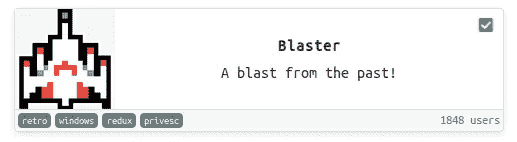

爆破手演练-Tryhackme 作者:阿克谢·克尔卡

因此，我们首先进行了 Nmap 扫描，以了解开放的端口。

> 开始 Nmap 7.80([https://nmap.org](https://nmap.org))2020–06–03 06:13 UTC
> 统计:0:00:02 已过去；0 台主机已完成(1 台启动)，1 台正在进行 SYN 隐形扫描
> SYN 隐形扫描计时:约 0.50%完成
> 10 . 10 . 134 . 156 的 Nmap 扫描报告
> 主机已启动(0.18 秒延迟)。
> 未显示:998 过滤端口
> 端口状态服务版本
> 80/TCP open http Microsoft IIS httpd 10.0
> | http-methods:
> | _ 潜在风险方法:TRACE
> | _ http-Server-header:Microsoft-IIS/10.0
> | _ http-title:IIS Windows Server
> 3389/TCP open ms-wbt-Server Microsoft 终端服务
> | RDP-1 距离扫描仪时间+5 秒。
> 警告:OSScan 结果可能不可靠，因为我们找不到至少 1 个打开和 1 个关闭的端口
> 设备类型:通用
> 运行(只是猜测):微软 Windows 2016 (89%)，FreeBSD 6。x(85%)
> OS CPE:CPE:/o:Microsoft:Windows _ Server _ 2016 CPE:/o:FreeBSD:FreeBSD:6.2
> 激进 OS 猜测:Microsoft Windows Server 2016 (89%)，FreeBSD 6.2-RELEASE (85%)
> 没有与主机完全匹配的 OS(测试条件不理想)。
> 网络距离:2 跳
> 服务信息:OS:Windows；CPE: cpe:/o:microsoft:windows
> 
> 主机脚本结果:
> | _ 时钟偏差:平均值:4 秒，偏差:0 秒，中位数:4 秒
> 
> TRACEROUTE(使用端口 3389/tcp)
> 跳 RTT 地址
> 1 157.79 ms 10 . 9 . 0 . 1
> 2 165.12 ms 10 . 10 . 134 . 156
> 
> 执行操作系统和服务检测。请在[https://nmap.org/submit/](https://nmap.org/submit/)报告任何不正确的结果。
> Nmap 完成:在 38.52 秒内扫描了 1 个 IP 地址(1 台主机启动)

因此，我们有两个开放端口端口(80)端口(3389)在端口 80 上，Microsoft IIS 正在运行，端口 3389 是 Microsoft 终端服务，这是一种 RDP 服务。所以我们来看看网页。

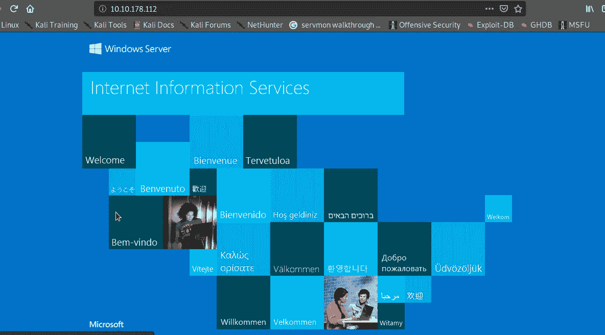

所以标题是 Windows IIS 服务器我们可以使用 Gobuster 来检查隐藏的目录。

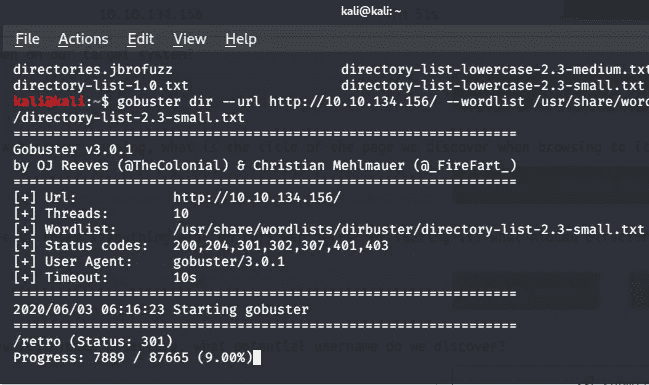

我们有一个导演，让我们查一下目录

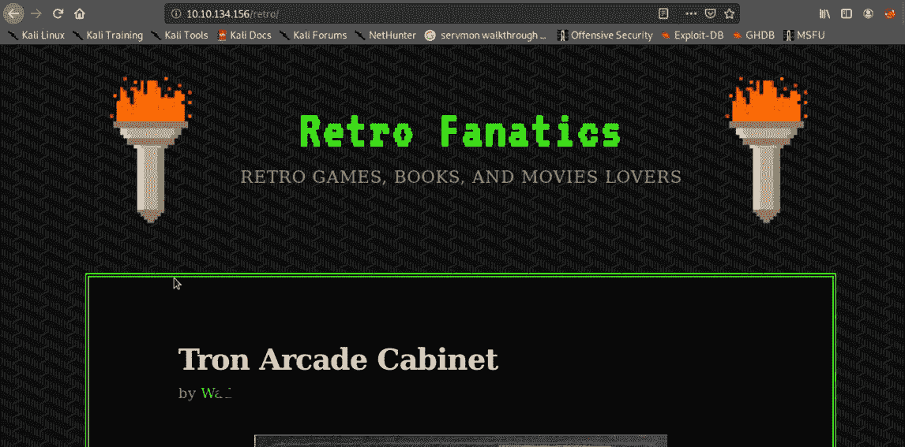

隐藏目录网页显示了一些文章和作者的名字，这可能是一个提示

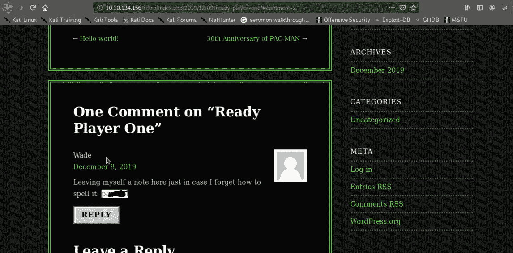

我们还得到了另一个提示，第一个可能是用户名，这必须是密码，所以现在我们可以尝试通过 RDP 登录。

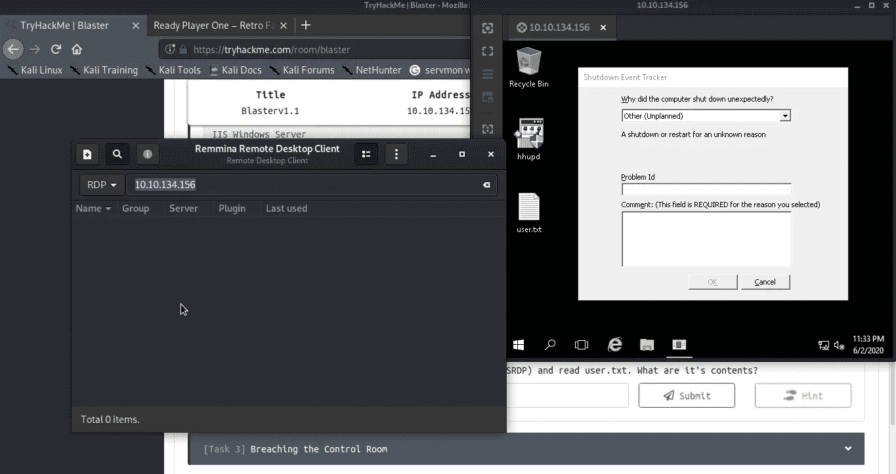

根据用户名和密码，我们已经成功登录，我们可以看到 user.txt 文件出现在桌面上，您可以查看 user.txt 文件并提交用户标志。

在检查了浏览器的历史之后，我们得到了一些有用的信息。

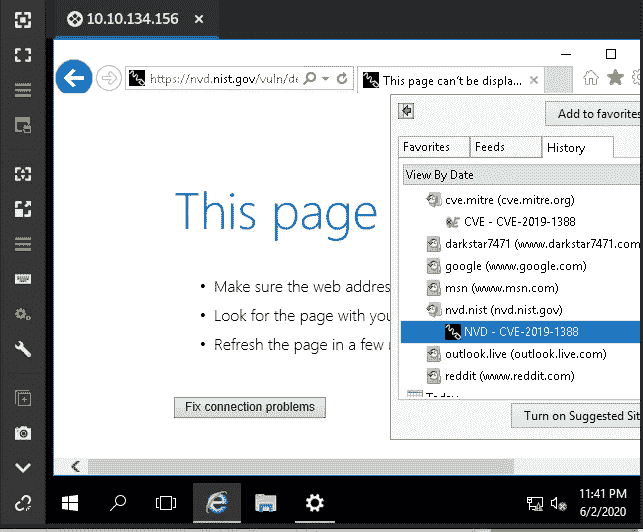

在谷歌上搜索后，我们发现我们可以利用这个漏洞获得 root 访问权限。如果你想了解这个漏洞，你可以访问这个网站

[CVE-2019–1388 | Windows 证书对话框特权提升漏洞](https://portal.msrc.microsoft.com/en-US/security-guidance/advisory/CVE-2019-1388)

现在是时候取消我们的特权了，我们可以看到在桌面上有一个程序，让我们运行这个程序

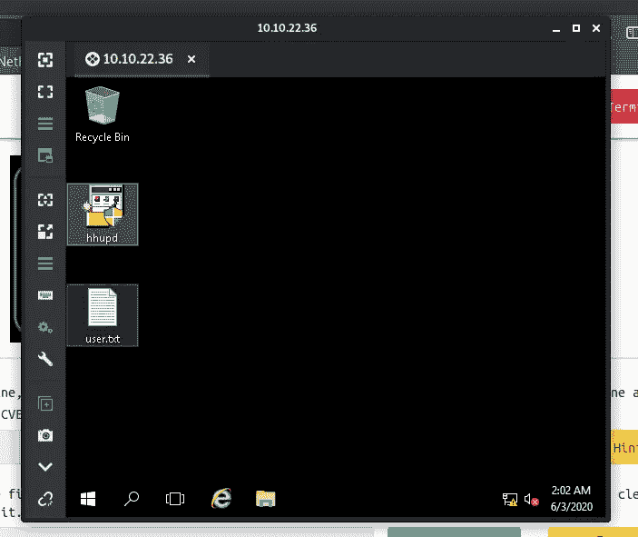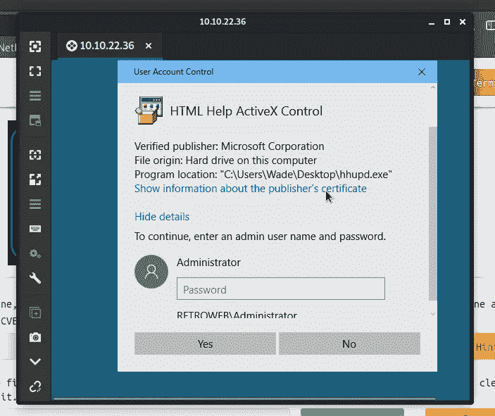

它要求输入管理员密码。让我们单击“显示发行者证书的相关信息”

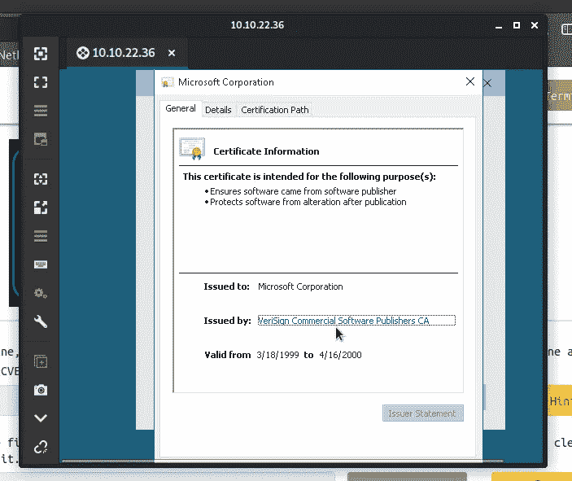

并点击“VeriSign 商业软件发行商 CA ”,然后 Internet explorer 将打开。

点击“设置”“文件”，然后点击“另存为”

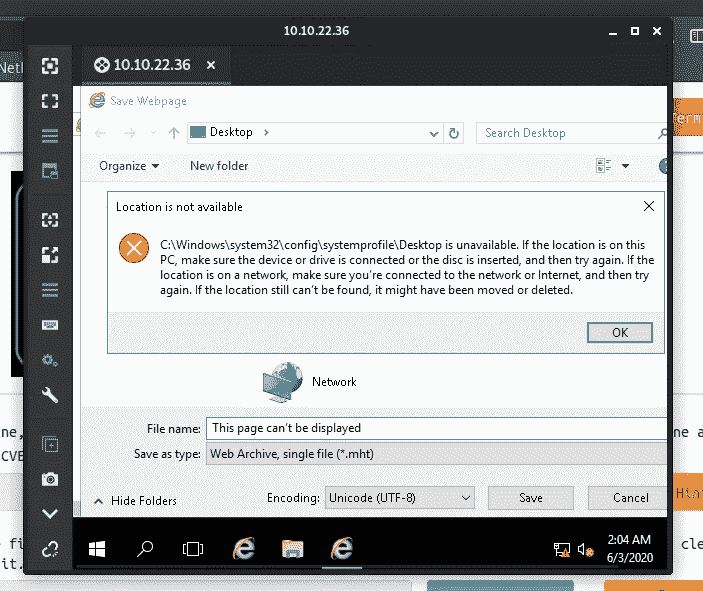

所以你可以看到我们得到了错误点击“确定”，并在“文件名”输入这个命令

> C:\Windows\System32\*。*

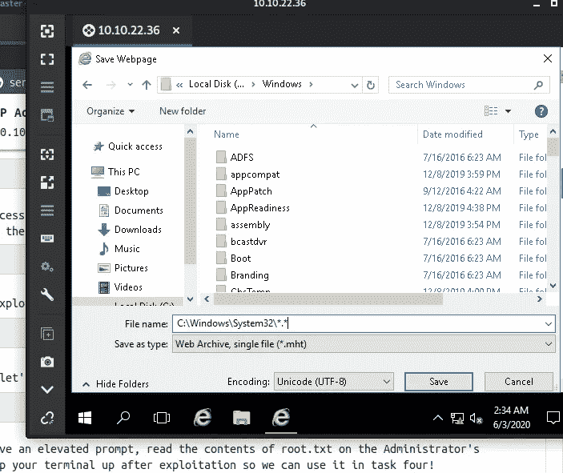

搜索“cmd”后打开。

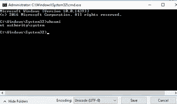

现在，我们可以读取根标志。我们知道我们的受害者计算机正在运行 Windows Defender，让我们继续尝试不同的有效负载交付方法。我们可以使用 Metasploit 模块，该模块将启动 web 服务器并提供有效负载，因此加载该模块，发出命令“show targets ”,将目标设置为 powershell，并根据您的 Tryhackme 连接设置“LHOST”和“LPORT”。

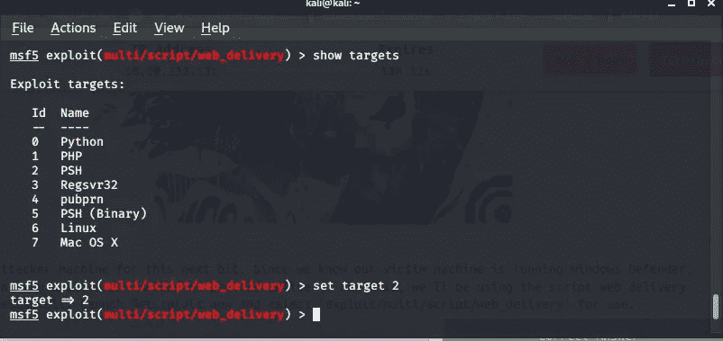

并将有效负载设置为反向 http

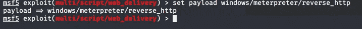

并使用命令“run -j”将模块作为作业运行

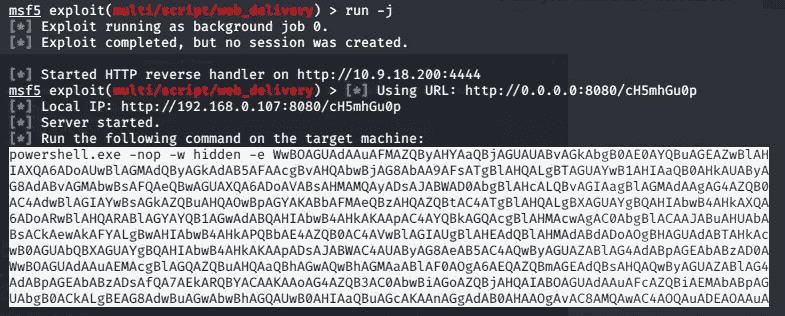

复制漏洞并将其粘贴到受损的机器上，以获得反向连接。

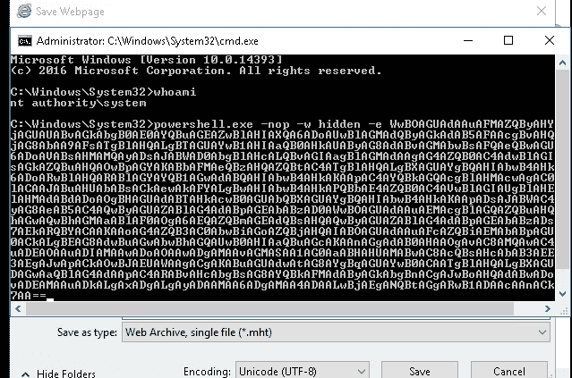

并按“回车”键，检查攻击者的机器，如果我们得到了一个反向连接或没有

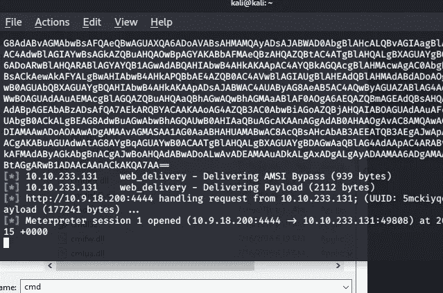

我们开了一个抄表员会议。