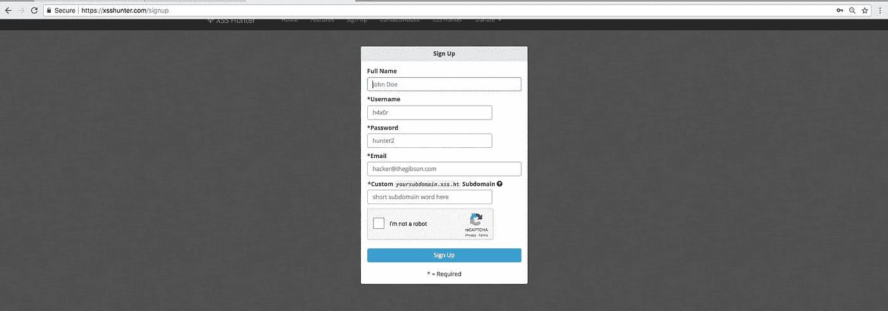
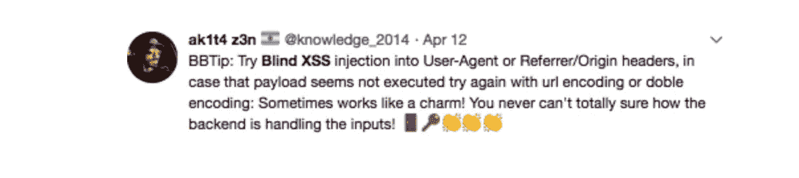
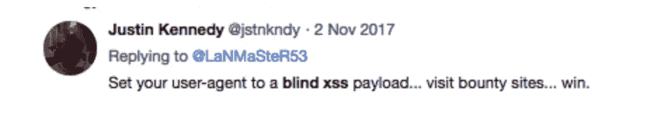
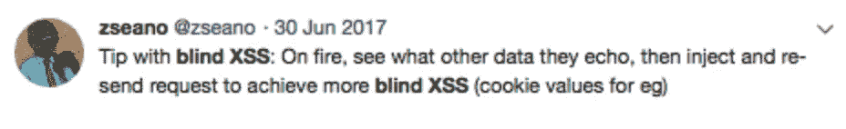
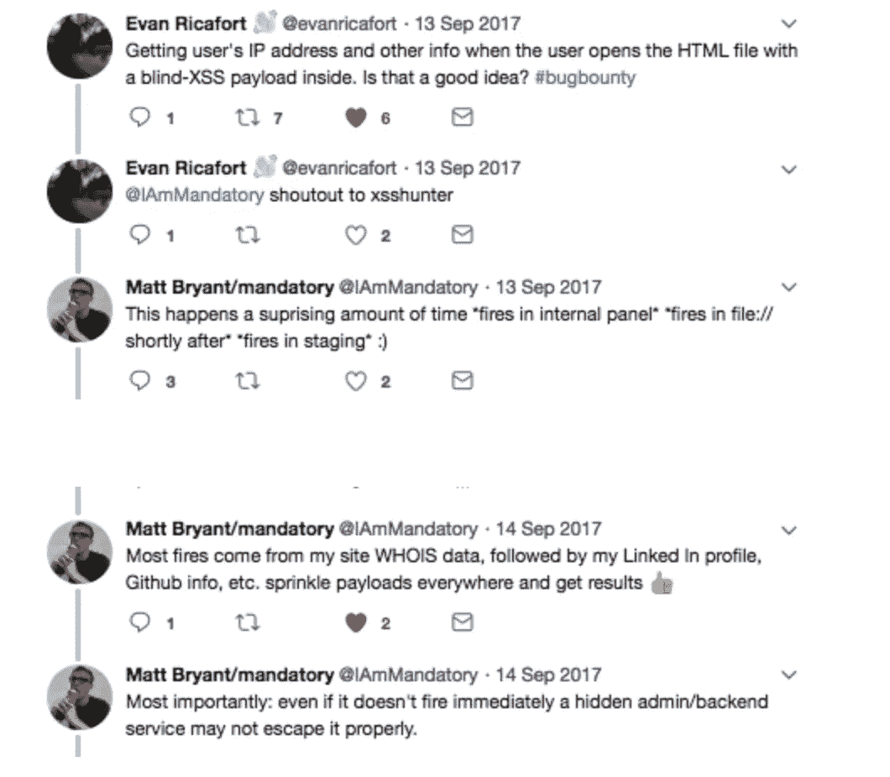
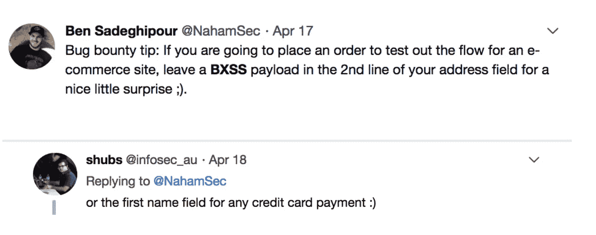
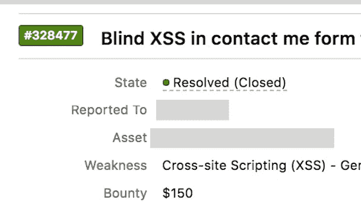
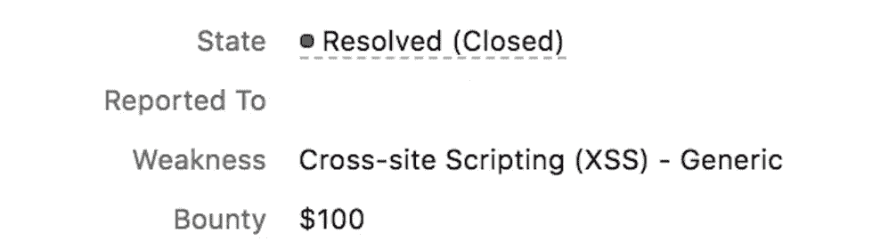

# 初学者盲人 XSS

> 原文：<https://infosecwriteups.com/blind-xss-for-beginners-c88e48083071?source=collection_archive---------0----------------------->

我在 twitter 上收到很多 DM 的提问，关于盲人 XSS，比如使用哪种工具，如何在 XSShunter 中注册，在哪里喷洒有效载荷等等。所以我写这篇博客，希望能回答这些问题。
**注**:这篇文章是写给刚开始打虫子赏金猎人的。Leets 可以把这个博客留在这里:)

**什么是盲人 XSS？**

这是一种存储 XSS，攻击者的输入由服务器保存，并反映在系统管理员/团队成员使用的完全不同的应用程序中。

**盲人 XSS 可以使用的工具:**

目前我使用网页版的 [XSShunter](https://xsshunter.com/features) 寻找盲人 XSS。您可以使用的其他工具很少:

*   [**ezXSS**](https://github.com/ssl/ezXSS) (具有 2FA、邮件报告、分享报告功能)
*   [**bXSS**](https://github.com/LewisArdern/bXSS) (具有时差/短信通知功能)
*   [**KNOXSS**](https://knoxss.me/?page_id=2) (有邮件功能)
*   **打嗝合作者**

**如何注册 XSShunter？免费吗？我们的名字中需要一个域名才能使用 XSShunter 吗？**

我使用网页版的 XSShunter，因为我没有耐心在我的服务器上安装这个工具:)它是免费的，你可以通过访问 [XSShunter](https://xsshunter.com/signup) 网站来安装它。输入所有必填字段，在自定义子域文本框中，您可以输入任意 2-3 个字符。( ***你不应该在这里输入你的网址* :)** )。这样你就可以开始使用这个工具了。

你可以按照这些[指令](https://github.com/mandatoryprogrammer/xsshunter)在你的服务器上设置 XSSHunter

我有时也使用火狐插件。如果诺克斯在一个网站上发现了盲人 xss，它会给你发送漏洞细节。

那么，你从哪里获得有效载荷，在哪里喷洒有效载荷呢？

在 XSShunter 中有一个有效载荷的标签，你可以从那里得到所有的有效载荷，最好在本地有一个所有有效载荷的副本，这样你就可以在需要的时候使用/喷射它。

现在转到在哪里喷洒这些有效载荷的问题，这已经在 twitter/slack 上讨论了很多次。以下是来自顶级 BB 猎人的一些建议。

我发现了什么有趣的事情？

*   在一个私人赏金网站上，有一个创建报告的选项。我创建了一个新的报告，报告名称为盲 XSS 有效负载。幸运的是，该公司有一个每日批处理作业，可以在所有 QA/Stage 和 pentest 环境中同步数据。第二天，我的 XSShunter 门户网站上充斥着客户拥有的 6-7 个不同内部环境中的有效负载触发报告。公司为 6 个不同端点的 BXSS 支付了 5000 美元。
*   在 PBB 计划的**联系我**表单中提交盲人 XSS 有效载荷，它在他们的后端 salesforce 应用程序中启动。

*   在聊天请求中提交了盲人 XSS 有效载荷，它在 marketo 应用程序中触发，该公司使用该应用程序来收集聊天数据。

**还有其他文章/教程可以参考吗？**

*   [https://the hacker blog . com/breaking-a-ca-blind-cross-site-scripting-bxss-in-the-geotrust-SSL-operations-panel-using-XSS-hunter/index . html](https://thehackerblog.com/breaching-a-ca-blind-cross-site-scripting-bxss-in-the-geotrust-ssl-operations-panel-using-xss-hunter/index.html)
*   [https://mhmdiaa.github.io/blind-xss-in-spotify/](https://mhmdiaa.github.io/blind-xss-in-spotify/)
*   [https://hackerone.com/reports/275518](https://hackerone.com/reports/275518)
*   [https://hackerone.com/reports/314126](https://hackerone.com/reports/314126)
*   [https://brutelogic.com.br/blog/blind-xss-code/](https://brutelogic.com.br/blog/blind-xss-code/)
*   [http://www . agar ri . fr/kom/archives/2017/04/04/exploining _ a _ blind _ XSS _ using _ burp _ suite/index . html](http://www.agarri.fr/kom/archives/2017/04/04/exploiting_a_blind_xss_using_burp_suite/index.html)
*   [https://the hacker blog . com/poisoning-the-well-compromising-go daddy-customer-support-with-blind-XSS/](https://thehackerblog.com/poisoning-the-well-compromising-godaddy-customer-support-with-blind-xss/)

**更新(2018 年 7 月 30 日)**

你们中的许多人都有关于如何检查 XSShunter 是否工作正常的问题。简单！

从 XSShunter 站点获取所有有效负载，并将其保存到一个 html 文件中，然后在浏览器中打开该 HTML 文件。文件打开后，进入 XSShunter，检查你是否看到任何新的条目。如果有条目，那么 XSShunter 工作正常。

如有任何问题，您可以通过[语法错误](https://twitter.com/SYNTAXERRORBA)与我联系

直到下次