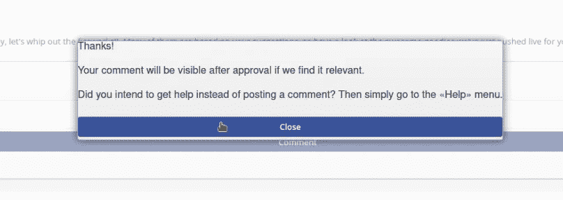
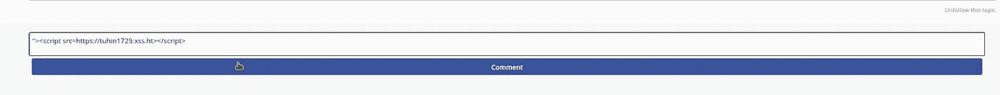
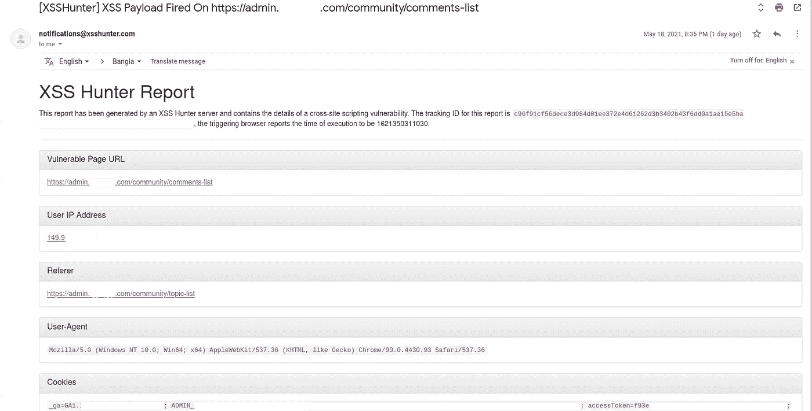
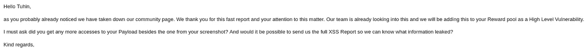

# 盲目的 XSS 完全控制价值$$$的论坛

> 原文：<https://infosecwriteups.com/blind-xss-to-full-control-of-forum-worth-badfdf2522c1?source=collection_archive---------1----------------------->

大家好。我叫图欣·博斯( [@tuhin1729](https://instagram.com/tuhin1729) )。我目前在[虚拟网络实验室](https://virtualcyberlabs.com)担任首席技术官。在这篇文章中，我将分享我在盲人 XSS 的一个发现，它帮助我赚了$$$。

所以不浪费时间，让我们开始吧:

tuhin1729

# 简介:

在列举子域时，我遇到了一个有趣的子域，比如说 community.redacted.com。基本上，这是一种论坛，redacted.com 的用户可以发表他们的疑问，也可以对其他人的疑问发表评论。但是要发表评论，需要得到 redacted.com 管理员的批准。

tuhin1729

在测试了 IDOR、SQLi 和其他漏洞之后，我决定在那里试试盲人 XSS。

# 什么是盲人 XSS？

当攻击者的输入被 web 服务器保存并在应用程序的另一部分或另一个应用程序中作为恶意脚本执行时，就会出现盲目的跨站脚本漏洞。例如，攻击者向联系/反馈页面中注入恶意有效载荷，当应用程序的管理员查看反馈条目时，攻击者的有效载荷将被加载。攻击者的输入可以在完全不同的应用程序中执行(例如，管理员查看访问日志或应用程序异常的内部应用程序)。

# 复制步骤:

我赶紧复制了我的[xs shunter](https://xsshunter.com)payload[**">**]并评论说，

tuhin1729

你猜怎么着！！！在 1-2 分钟内，我收到了以下电子邮件:

tuhin1729

嘣！我们的有效载荷被执行了！

我去了有效载荷被执行的 URL。有一个管理员登录面板。我用这些 cookies(从有效载荷中捕获的)劫持了 admin 的帐户。现在，我可以控制整个论坛了！！！

我在那里结束了我的狩猎，做了一个漂亮的 POC 并发送给他们。

30 分钟内，我得到了他们的回复:

tuhin1729

**时间线**:

2021 年 5 月 18 日晚上 9:23—报告了漏洞

2021 年 5 月 18 日，晚上 9:44——关闭他们的社区页面，用赏金邮件回复我

在 Twitter 上关注我:@ [tuhin1729](https://twitter.com/tuhin1729_) _

感谢阅读。我希望你喜欢这个博客。