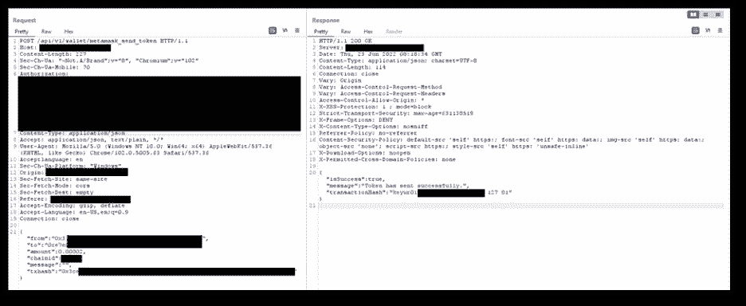
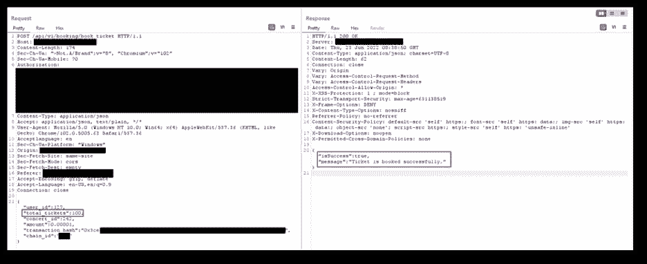
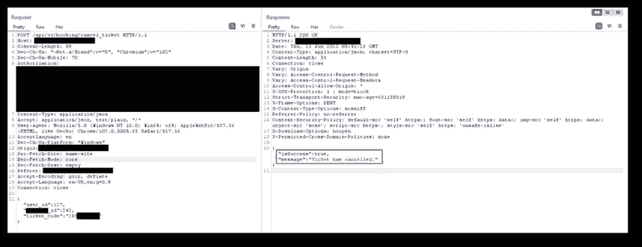
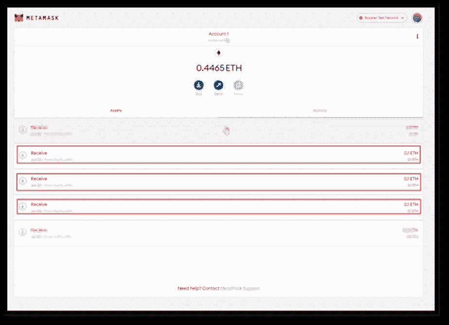
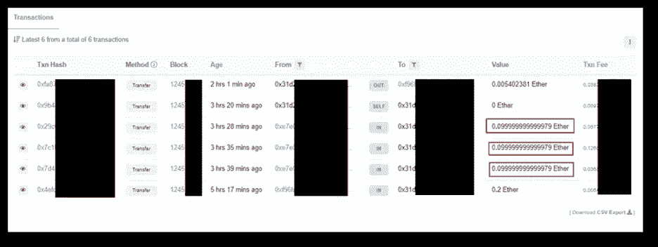

# 区块链网络安全了！但不是应用程序和它们的集成

> 原文：<https://infosecwriteups.com/blockchain-network-is-secured-but-not-the-apps-and-their-integrations-8077195d2c49?source=collection_archive---------2----------------------->

# 概观

在对一个基于区块链的 [web 应用](https://wesecureapp.com/blog/attacks-on-blockchain/)进行安全评估的过程中，观察到一些功能容易受到未经验证的 ETH 从管理员钱包传输到攻击者钱包的攻击。这个网络应用程序是一个订票应用程序，用户可以通过一个[加密](https://wesecureapp.com/blog/how-do-cryptocurrencies-affect-cybersecurity/)令牌订票和付款。此外，该应用程序与 Metamask 框架相集成，以支持区块链上的 web3 事务。

# 工作流程

1.  用户启动订票功能。假设一张票(T1)需要支付(0.1 ETH)才能转移到管理员的钱包中。
2.  网络应用程序发送从集成 Metamask 钱包中转移 **0.1 ETH** 的请求。
3.  用户从元掩码签署交易。
4.  在 **0.1 ETH** 交易成功后，web 应用程序通过对**的 POST API 调用来确认支付**

****

**5.现在，应用程序从 Metamask 获得了成功的事务确认，通过 POST 请求为用户预订了机票**

**[**https://Redacted.com/api/v1/booking/book_ticket/**](https://redacted.com/api/v1/booking/book_ticket/)**

****

**6.这个 POST 请求是为了一个成功的交易。包含两个参数，即 **transaction_hash** 和 **total_tickets。**发现这两个参数没有映射在一起。**

**7.因为它只检查 **transaction_hash，**，所以可以操作另一个参数来预订相同金额的多张票。**

**8.恶意用户可以篡改" **total_tickets"** 参数，并可以预订任意数量的门票，仅用于 **0.1 ETH** 。在这个例子中，我们预订了 100 张 0.1 日的门票。**

**9.在进一步利用该漏洞时，发现有一个功能允许用户取消预订并获得相应的退款。**

**10.当用户取消预订的机票时，后端服务器只验证预订的机票是否有效。验证成功后，开始退款。**

**11.访问该功能流时，将执行以下功能:**

*   ****Get _ total _ booked _ ticket()****
*   ****退款()****

**12.如果用户的钱包包含有效的票 id，则底层服务器执行发送到端点的 POST 请求:[**【https://Redacted.com/api/v1/booking/cancel_ticket/】**](https://redacted.com/api/v1/booking/cancel_ticket/)，以**用户 ID** 和**票 ID**作为参数。后端服务器从" **ticket_id"** 中检索票证的值，并将 ETH 发送到用户的钱包。**

****

**13.任何退款/购买交易都将直接转入/转出管理员的钱包**

**14.由于 [API](https://wesecureapp.com/blog/api-security-top-5-best-practices-to-follow/) 调用缺乏其请求参数之间的正确映射，并且不验证与票号相对应的交易，恶意用户可以很容易地利用这一缺陷来大幅增加票号，并获得超过消费金额的退款。**

**15.在这里，为了购买 1 张花费 0.1 ETH 的票，预订了 100 多张票。一旦开始退款，只需改变门票的数量就可以取回任何金额。**

**16.由于在这种情况下有大量有效票证，威胁参与者可以从管理员的钱包中检索多达 **10 ETH** (100*0.1=10)，并耗尽管理员钱包中的 ETH。**

****

**17.通过验证来自以太网扫描(一个跟踪所有基于以太网的区块链交易的网站)的区块链哈希，这一支付漏洞得到了进一步证实**

****

# **结论**

**区块链网络确实很难渗透，因为区块链有安全的网络来构建 DAPPS，但是**应用架构、** [源代码](https://wesecureapp.com/services/application-security/secure-code-review/) **、工作流和配置**对于这种攻击总是开放的。有必要应用[安全审计](https://wesecureapp.com/blog/the-penetration-testing-guide-for-compliance-and-audits/)和定期评估来发现工作流程中的漏洞和错误。一个小问题可能会导致未经认证的令牌从钱包中流失，从而对用户以及整个社区造成不良影响。**

****

# **关于作者**

**基尤尔·塔拉提**

## **来自 Infosec 的报道:Infosec 每天都有很多内容，很难跟上。[加入我们的每周简讯](https://weekly.infosecwriteups.com/)以 5 篇文章、4 个线程、3 个视频、2 个 GitHub Repos 和工具以及 1 个工作提醒的形式免费获取所有最新的 Infosec 趋势！**