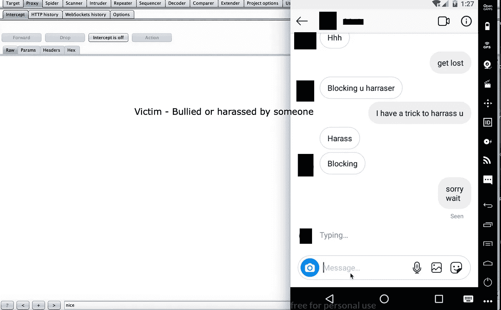
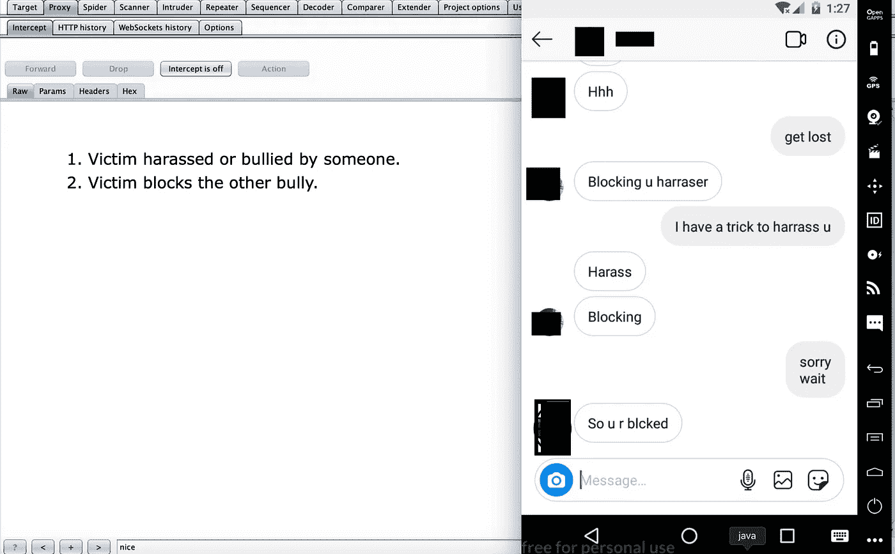
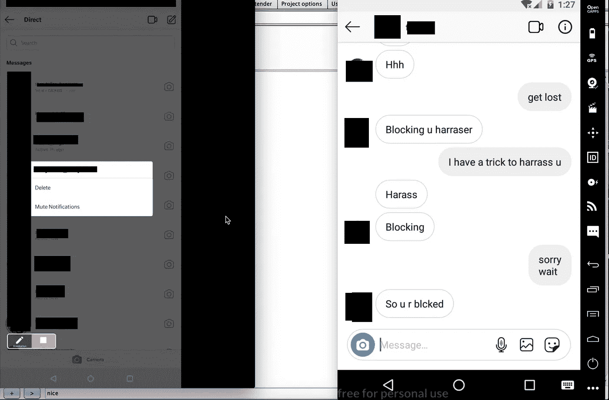
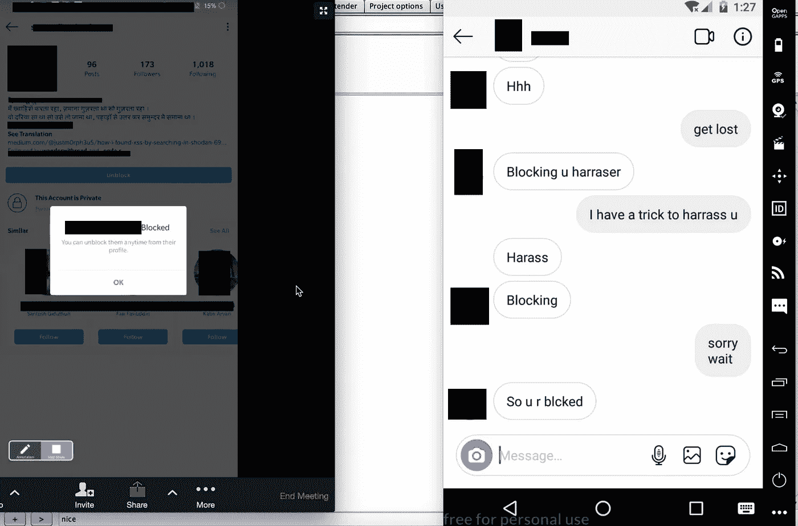
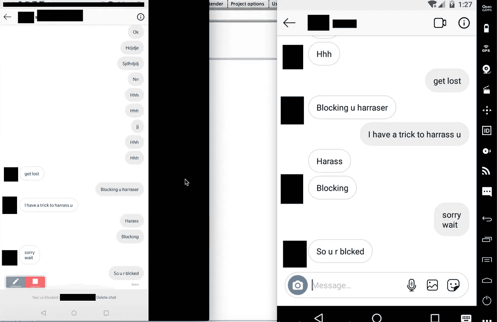
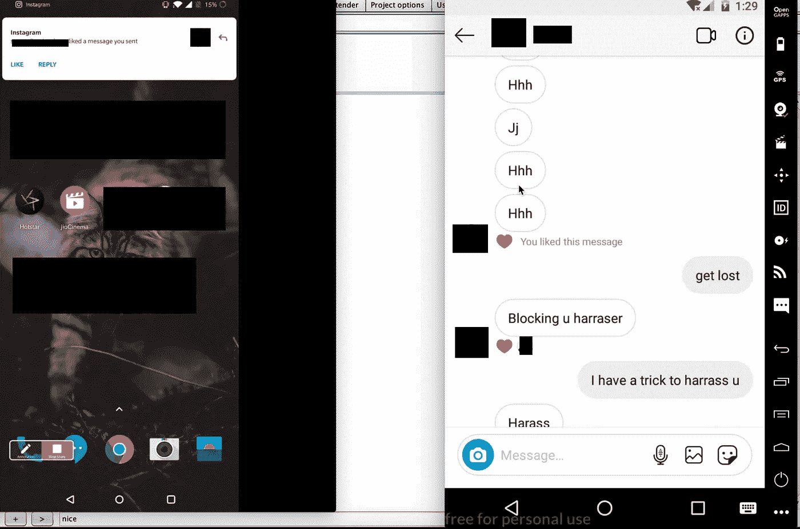
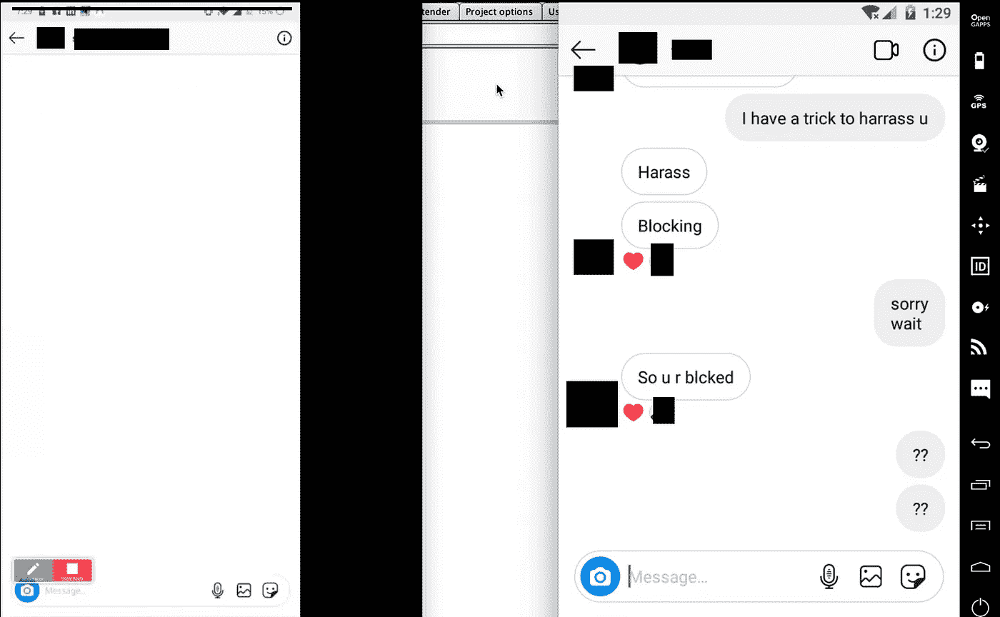
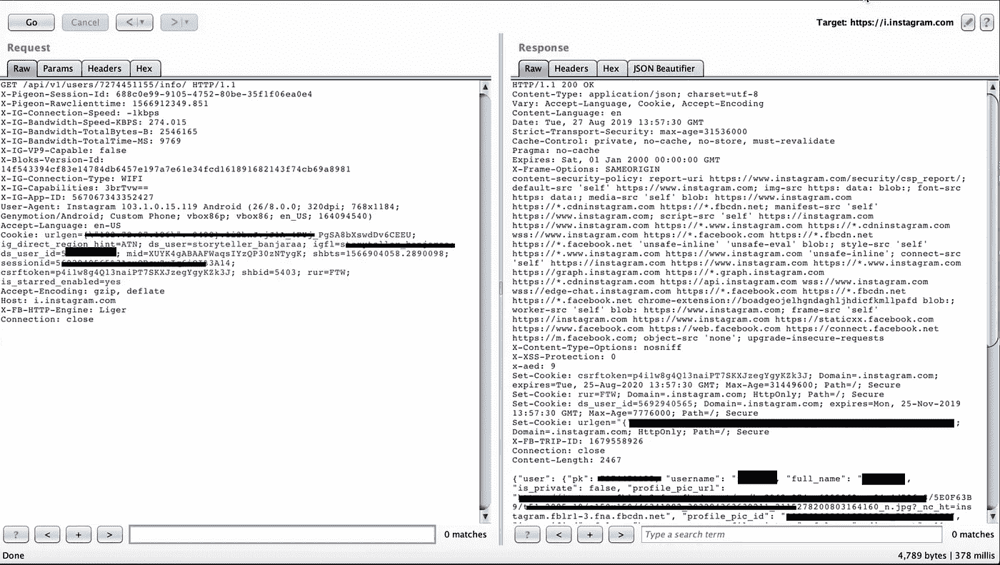
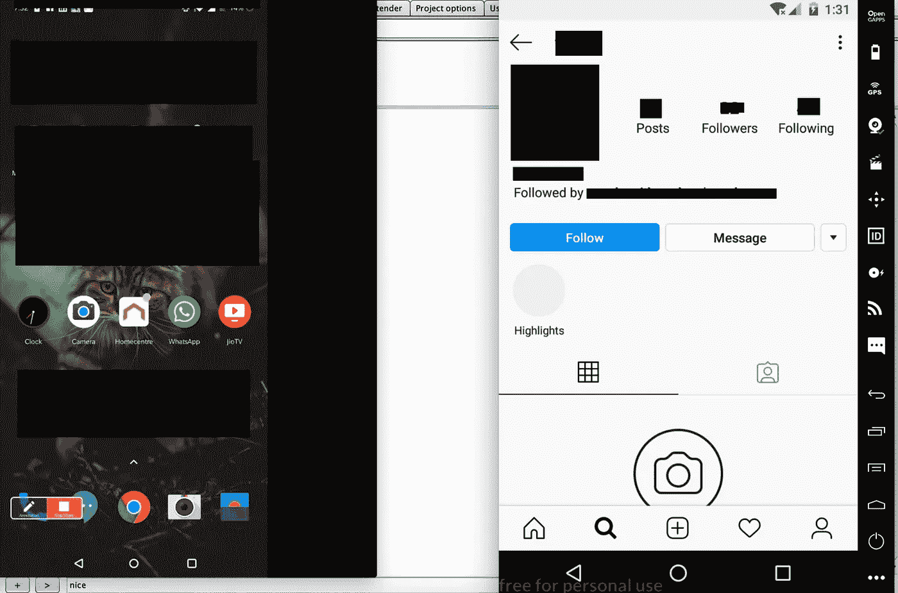
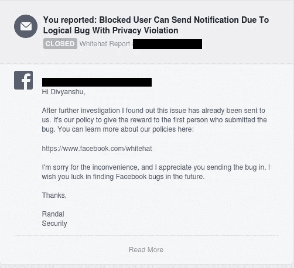

# 由于 Instagram 中的逻辑错误，被阻止的用户可以发送通知|第一个 Instagram 错误

> 原文：<https://infosecwriteups.com/blocked-user-can-send-notification-due-to-logical-bug-in-instagram-first-instagram-bug-2bd09aa52f14?source=collection_archive---------1----------------------->

**隐私侵犯问题 Instagram。**

# **描述:**

阻止功能允许任何用户阻止他们不想与之互动或查看其个人资料的任何其他用户。当一个用户不想屏蔽另一个用户，但又不想查看他们的帖子/故事/消息时，有一个单独的静音按钮。

在这里测试时，我能够找到一种方法，阻止了另一个用户的用户仍然可以收到通知，这可能导致隐私侵犯。

# **Vuln 类型:**

隐私/授权

# **产品:**

机器人

版本:108.0.23.19

# **影响:**

假设用户 A 在骚扰用户 B，那么用户 B 屏蔽了骚扰者。但是早些时候他们彼此认识，所以他们在消息中有所有的聊天。但是当骚扰者想要的时候，他可以确保用户 B 在 Instagram 上收到一个可能会打扰已经屏蔽了用户 A 的用户 B(骚扰者)的通知。

在单独的场景中，即使在阻止骚扰(用户 B)之后，用户 B 也可以在没有任何工具/特殊脚本的情况下看到简档图片中的变化，并且还可以下载图片。

# **预期行为:**

阻止功能是完全阻止任何用户在照片，评论甚至通知中没有可见性。被阻止的用户和被阻止的用户都不应该被允许查看个人资料图片的变化，甚至不应该被允许接收彼此的通知。

# **概念验证:**

1.  用户 A 和用户 B 正在通过消息聊天，并且随着时间的推移，他们已经收集了相当多的聊天记录。
    用户 A —攻击者
    用户 B —受害者

攻击者骚扰受害者

2)现在用户 A 开始骚扰用户 B，用户 B 屏蔽了用户 A。

用户 B(受害者)|用户 B 被用户 A 骚扰——所以 B 屏蔽了 A。

3)用户 B(受害者)在阻止攻击者(用户 A)后删除了 messages 中的聊天。

左(用户 A 攻击者)|右(用户 B 受害者)

受害者(用户 B)删除了攻击者的所有聊天记录

4)一旦被阻止，攻击者就不能向受害者发送消息，根据逻辑，攻击者和受害者之间不应该有任何类型的通知，反之亦然。

用户 B(受害者)阻止了用户 A(攻击者)

攻击者(左)|受害者(右):攻击者无法向受害者发送消息

5)用户 A(骚扰者/攻击者)开始喜欢聊天中发送的消息和照片。

攻击者开始喜欢过去的消息，即使攻击者被阻止，受害者也会收到通知。左边(受害者)|右边(攻击者)

6)用户 B 收到来自攻击者的通知，但是在打开时通知屏幕是空白的。

打开时，通知屏幕是空白的

7)在另一个测试场景中，用户 B 改变了他/她的个人资料图片，并且用户 A(骚扰者)即使在他/她被阻止时也可以看到图片中的改变。

攻击者请求捕获受害者用户 id

8)在这种情况下，尽管攻击者可以查看消息并遵循选项。不会影响用户。这种情况从未发生过，只是概念验证的一部分。

在重放查看用户请求并替换为受害者的公共用户 id 时，攻击者可以看到带有 follow 和 message 请求的页面，尽管攻击者试图发送 follow 请求，但受害者不会收到通知。

# **结果:**

这期杂志被复制了。

复制

谢谢
贾斯莫斐斯

*关注* [*Infosec 报道*](https://medium.com/bugbountywriteup) *获取更多此类精彩报道。*

 [## 信息安全报道

### 收集了世界上最好的黑客的文章，主题从 bug 奖金和 CTF 到 vulnhub…

medium.com](https://medium.com/bugbountywriteup)