# BOLO:逆向工程—第 1 部分(基本编程概念)

> 原文：<https://infosecwriteups.com/bolo-reverse-engineering-part-1-basic-programming-concepts-f88b233c63b7?source=collection_archive---------1----------------------->

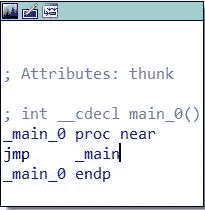

逆向工程

在逆向工程的学习过程中，我发现自己需要一个简单的指南来指导我在浏览汇编代码时应该寻找什么。虽然我是阅读源代码和信息手册的忠实信徒，但我完全理解在一个地方拥有简明、易于理解的信息的愿望。这个《BOLO:逆向工程》系列正是如此！在这一系列文章中，我将向你展示关于逆向工程代码时的**B**e**O**n**L**ook**O**ut 的事情。理想情况下，这一系列文章将使初级逆向工程师更容易掌握许多不同的概念！

# 前言

在整篇文章中，你会看到 C++代码和汇编代码的截图，以及一些关于你所看到的和为什么事情看起来是这样的解释。此外，本系列文章**将不会涵盖汇编**的基础知识，它将只展示模式和反编译代码，以便您可以大致了解应该寻找什么/如何解释汇编代码。

在本文中，我们将涵盖:

1.  可变引发
2.  基本输出
3.  数学运算
4.  功能
5.  循环(用于循环/ While 循环)
6.  条件语句(IF 语句/ Switch 语句)
7.  用户输入

*请注意:本教程是在微软 Visual Studio 2015(我知道，过时版本)中用 visual C++做的。一些汇编代码(即 cin 的用户输入)将反映这一点。此外，我使用 IDA Pro 作为我的反汇编程序。*

# 可变引发

变量在编程时极其重要，这里我们可以看到几个重要的变量:

1.  一根绳子
2.  int
3.  布尔型
4.  一个 char
5.  双份
6.  一辆花车
7.  char 数组

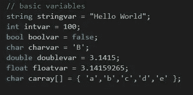

基本变量

*请注意:在 C++中,‘string’不是一个原始变量，但我认为向您展示它是很重要的。*

现在，让我们来看看装配:

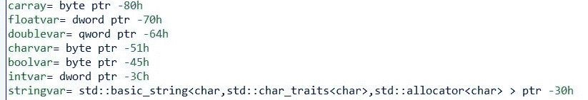

初始变量

这里我们可以看到 IDA 是如何表示变量的空间分配的。如你所见，我们在实际初始化变量之前，为每个变量分配了空间。

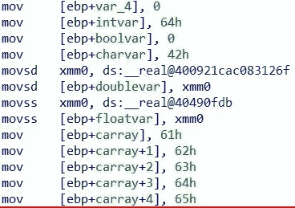

初始化变量

一旦分配了空间，我们就把我们想要为每个变量设置的值移动到我们为该变量分配的空间中。尽管大多数变量在这里被初始化，下面你会看到 C++字符串初始化。

C++字符串初始化

正如您所看到的，初始化一个字符串需要调用一个内置函数来初始化。

# 基本输出

*前言信息:在这一节中，我将讨论被压入堆栈并用作 printf 函数参数的项目。函数参数的概念将在本文后面更详细地解释。*

虽然本教程是用 visual C++编写的，但我选择使用 *printf* 而不是 *cout* 进行输出。

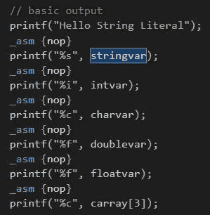

基本输出

现在，让我们来看看组件:

首先，字符串文字:

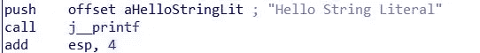

字符串文字输出

如您所见，字符串被压入堆栈，作为 *printf* 函数的参数被调用。

现在，让我们来看看其中一个变量输出:

可变输出

如您所见，首先将 *intvar* 变量移入 EAX 寄存器，然后将其与用于指示整数输出的“%i”字符串一起推入堆栈。然后从堆栈中取出这些变量，并在调用 *printf* 函数时用作参数。

# 数学函数

在本节中，我们将讨论以下数学函数:

1.  添加
2.  减法
3.  增加
4.  分开
5.  按位 AND
6.  按位或
7.  按位异或
8.  按位非
9.  按位右移
10.  按位左移

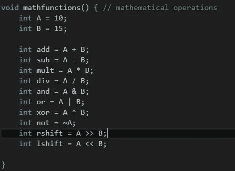

数学函数代码

让我们将每个功能分解成程序集:

首先我们将 *A* 设置为十六进制 0A，代表十进制 10，将 *B* 设置为十六进制 0F，代表十进制 15。

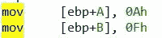

可变设置

我们使用“add”操作码添加:

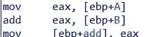

添加

我们使用“sub”操作码进行减法运算:

减法

我们使用“imul”操作码相乘:

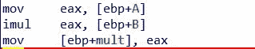

增加

我们使用“idiv”操作码进行除法运算。在这种情况下，我们还使用“cdq”将 EAX 的大小加倍，以便我们可以适应除法运算的输出。

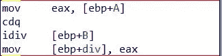

分开

我们使用“and”操作码执行按位 AND 运算:

按位 AND

我们使用“OR”操作码执行按位“或”运算:

按位或

我们使用“异或”操作码执行按位异或运算:

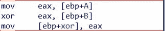

按位异或

我们使用“NOT”操作码执行按位非运算:

按位非

我们使用“sar”操作码执行按位右移:

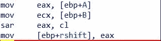

按位右移

我们使用“shl”操作码执行按位左移:

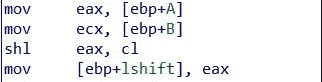

按位左移

# 函数调用

在本节中，我们将了解 3 种不同类型的函数:

1.  一个基本的空函数
2.  返回整数的函数
3.  接受参数的函数

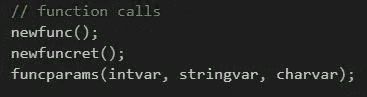

调用函数

首先，让我们看一下调用 *newfunc()* 和 *newfuncret()* 的情况，因为这两个函数实际上都不接受任何参数。

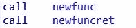

调用不带参数的函数

如果我们跟踪对 *newfunc()* 函数的调用，我们可以看到它真正做的只是打印出“Hello！我是新功能！”：

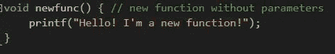

newfunc()函数代码

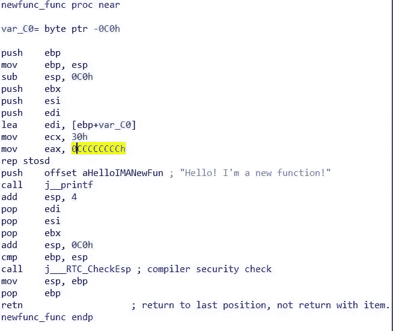

newfunc()函数

正如你所看到的，这个函数确实使用了 *retn* 操作码，但只是返回到先前的位置(这样程序可以在函数完成后继续运行)。)现在，让我们来看看 *newfuncret()* 函数，它使用 C++ *rand()* 函数生成一个随机整数，然后返回该整数。

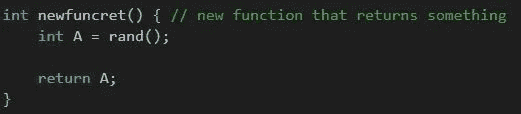

newfuncret()函数代码

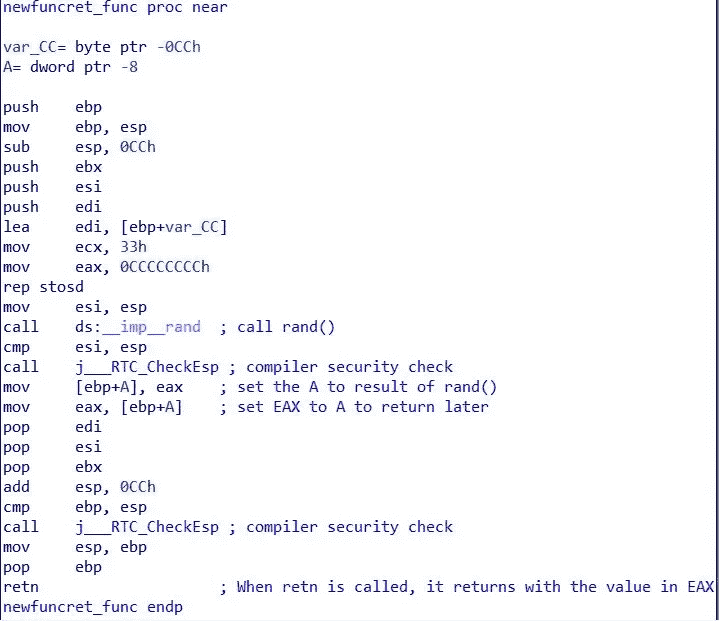

newfuncret()函数

首先，为变量*分配空间。然后，调用 *rand()* 函数，将一个值返回到 EAX 寄存器中。接下来，将 EAX 变量移入 *A* 变量空间，有效地将 *A* 设置为 *rand()* 的结果。最后，*一个*变量被移入 EAX，这样函数就可以用它作为返回值。*

现在我们已经了解了如何调用函数，以及函数返回某个值时是什么样子，让我们来讨论用参数调用函数:

首先，让我们再看一看 call 语句:

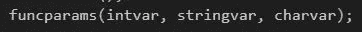

在 C++中调用带参数的函数

调用带参数的函数

尽管 C++中的字符串需要调用一个 *basic_string* 函数，但调用带参数的函数的概念是相同的，与数据类型无关。首先，将变量移入寄存器，然后将寄存器压入堆栈，然后调用函数。

让我们来看看这个函数的代码:

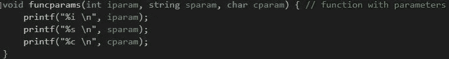

funcparams()函数代码

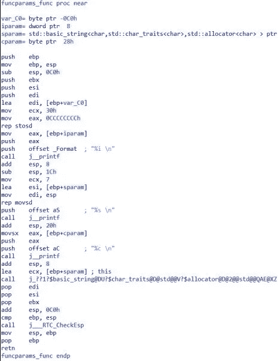

funcparams()函数

这个函数所做的就是接收一个字符串、一个整数和一个字符，并使用 *printf* 将它们打印出来。正如你所看到的，首先 3 个变量被分配在函数的顶部，然后这些变量作为 *printf* 函数的参数被压入堆栈。很简单。

# 环

现在我们已经有了函数调用、输出、变量和数学，让我们继续到流控制。首先，我们将从 for 循环开始:

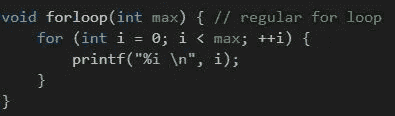

For 循环代码

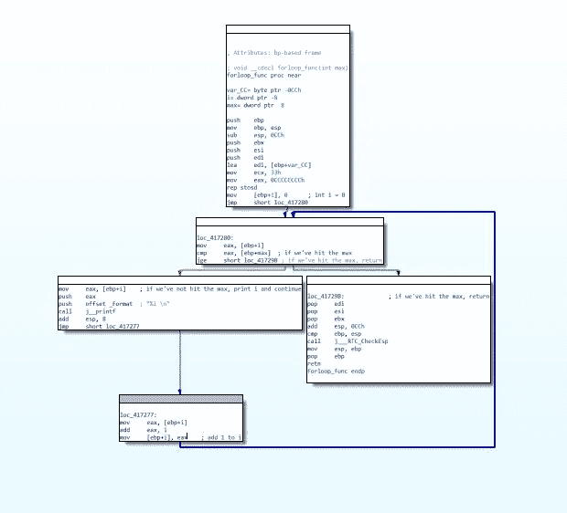

For 循环的图形概述

在我们将汇编代码分解成更小的部分之前，让我们看一下总体布局。如您所见，当 for 循环开始时，它有两个选项；它可以转到右边的框(绿色箭头)并返回，也可以转到左边的框(红色箭头)并返回到 for 循环的起点。

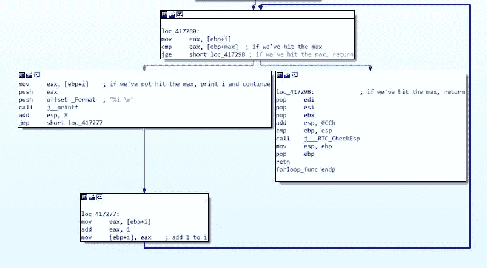

详细 For 循环

首先，我们通过比较变量 *i* 和变量 *max* 来检查我们是否达到了最大值。如果 *i* 变量不大于或等于 *max* 变量，我们继续向左下方打印出 *i* 变量，然后将 *i* 加 1，继续返回到循环的起点。如果 *i* 变量实际上大于或等于 *max* ，我们简单地退出 for 循环并返回。

现在，让我们来看看 while 循环:

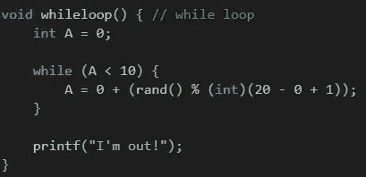

While 循环代码

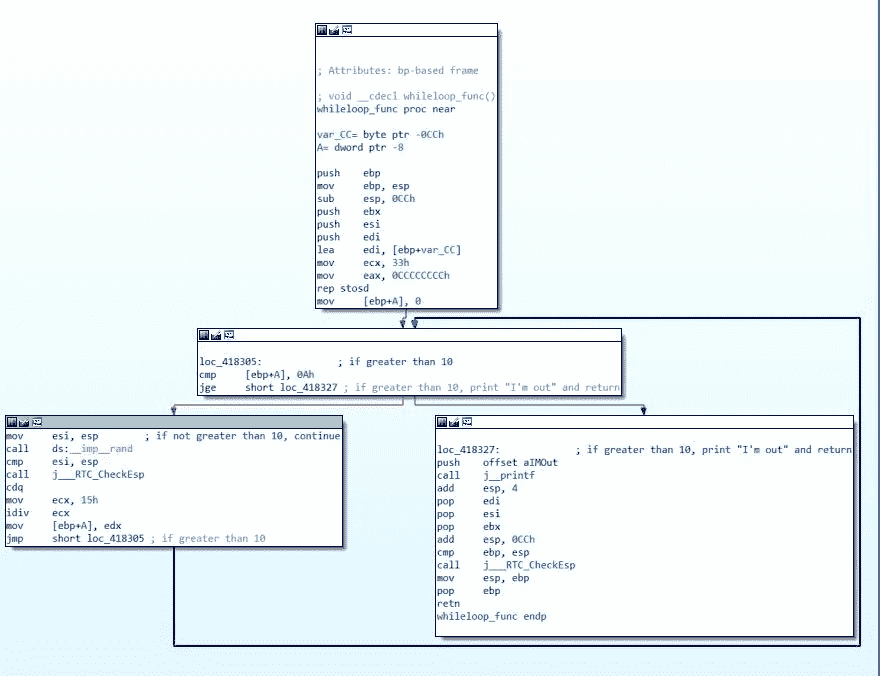

While 循环

在这个循环中，我们所做的就是生成一个 0 到 20 之间的随机数。如果数字大于 10，我们退出循环并打印“我出来了！”否则，我们继续循环。

在汇编中， *A* 变量被生成并最初设置为 0，然后我们通过比较 *A* 和代表十进制 10 的十六进制数 0A 来初始化循环。如果 *A* 不大于或等于 10，我们生成一个新的随机数，然后将其设置为 A，我们继续返回到比较。如果 *A* 大于等于 10，我们就跳出循环，打印出“我出来了”然后返回。

# If 语句

接下来，我们将讨论 *if 语句*。首先，让我们看一下代码:

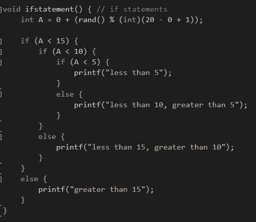

IF 语句代码

该函数生成一个 0 到 20 之间的随机数，并将该数存储在变量 *A* 中。如果 *A* 大于 15，程序将打印出“大于 15”。如果 *A* 小于 15 但大于 10，程序会打印出“小于 15，大于 10”。这种模式将持续到 *A* 小于 5，在这种情况下，程序将打印出“小于 5”。

现在，让我们来看看装配图:

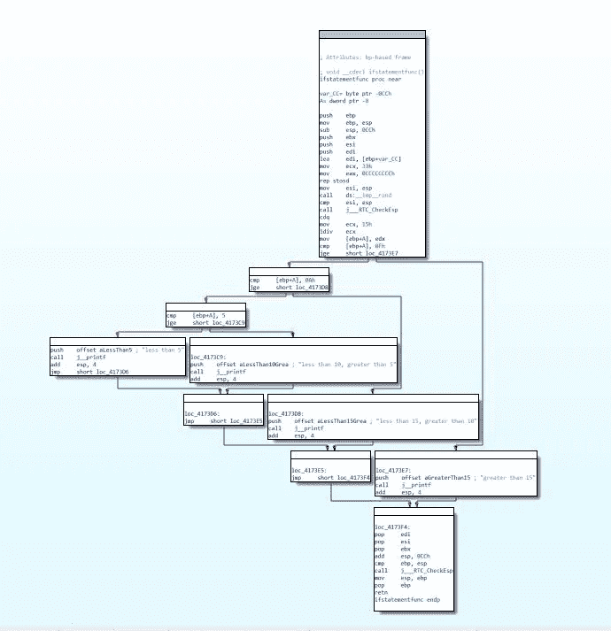

IF 语句汇编图

如您所见，程序集的结构与实际代码相似。这是因为 IF 语句就是“If X Then Y Else Z”。如果我们观察从顶部出来的第一组箭头，我们可以看到变量 *A* 和代表十进制 15 的十六进制 0F 之间的比较。如果 *A* 大于等于 15，程序会打印出“大于 15”然后返回。否则，程序会将 *A* 与代表十进制 10 的十六进制 0A 进行比较。这种模式将持续到程序打印并返回。

# Switch 语句

Switch 语句与 IF 语句非常相似，只是在 Switch 语句中，一个变量或语句与多个“cases”(或可能的等价关系)相比较。让我们看一下我们的代码:

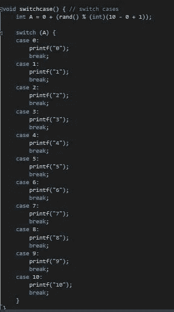

开关语句代码

在这个函数中，我们将变量 *A* 设置为 0 到 10 之间的一个随机数。然后，我们使用 Switch 语句将*和*进行比较。如果 *A* 等于任何一个可能的案例，那么案例号将被打印出来，然后程序将跳出 Switch 语句，函数将返回。

现在，让我们来看看装配图:

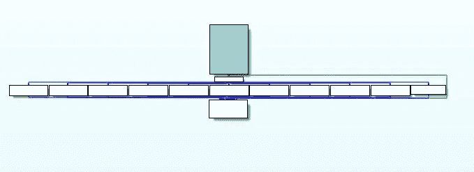

开关盒装配图

与 IF 语句不同，switch 语句不遵循“If X Then Y Else Z”规则，相反，程序只是将条件语句与 case 进行比较，并且只执行与条件语句等价的 case。让我们先来看看最初的两个盒子:

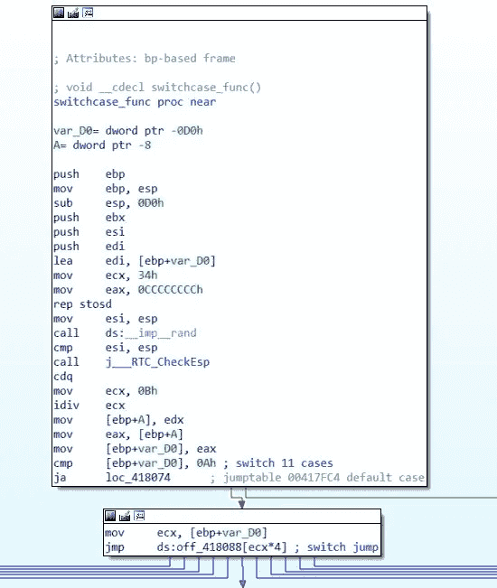

前两个图形部分

首先，程序生成一个随机数，并将其设置为 *A* 。然后，程序初始化 switch 语句，首先设置一个临时变量( *var_D0* )等于 *A* ，然后确保 *var_D0* 满足至少一种可能的情况。如果 *var_D0* 需要缺省，程序沿着绿色箭头向下到最终返回部分(见下文)。否则，程序启动一个切换跳转到等效案例的部分:

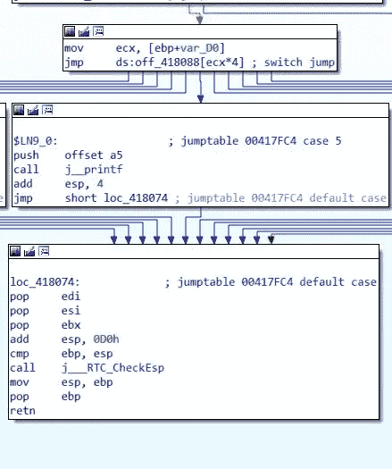

在 *var_D0* ( *A* )等于 5 的情况下，代码会跳转到上面的 case 段，打印出“5”，然后跳转到 return 段。

# 用户输入

在这一节中，我们将讨论使用 C++ *cin* 函数的用户输入。首先，让我们看看代码:

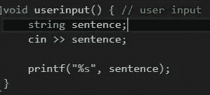

用户输入代码

在这个函数中，我们简单地使用 C++ *cin* 函数向变量*句子*中输入一个字符串，然后通过 *printf* 语句打印出*句子*。

让我们把它分解成组件。第一，C++ *cin* 部分:

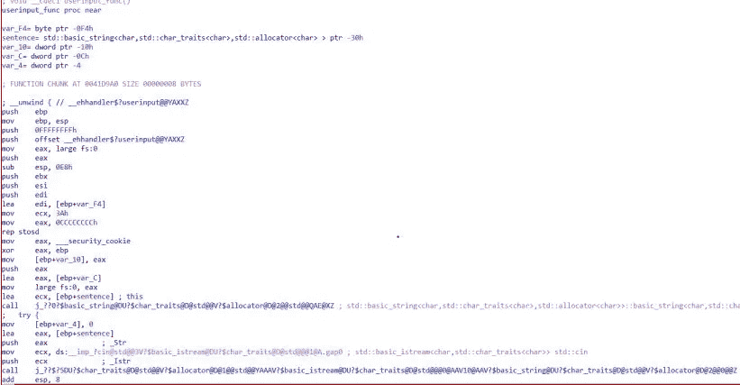

C++ cin

这段代码简单地初始化字符串*语句*，然后调用 *cin* 函数，并将输入设置为*语句*变量。让我们来看看 *cin* 叫得更近一点:

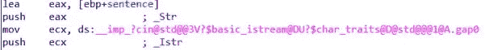

C++ cin 函数特写

首先，程序将*语句*变量的内容设置为 EAX，然后将 EAX 推送到堆栈上，用作 *cin* 函数的参数，然后调用该函数，并将其输出移入 ECX，然后将其放在堆栈上用于 *printf* 语句:

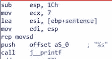

用户输入 printf 语句

# 谢谢！

希望这篇文章能让你对汇编语言中的基本编程概念有一个很好的理解。请关注本系列的下一部分， *BOLO:逆向工程—第 2 部分(高级编程概念)*！

> **lea eax，【ebp+阅读】；【阅读】
> 推送 eax
> lea ecx，【ebp+For】；【For】
> 推送 ecx
> mov edx，【ebp+感谢】；【感谢】
> 推送 edx
> 推送 offset _ Format" %s %s %s"
> 调用 j_printf**

逆向工程无疑是信息安全领域的一个利基话题，虽然它是最难学习的利基之一，但也是最有趣的。如果你想了解更多，你可以在 Guided Hacking 的[逆向工程](https://guidedhacking.com/threads/ghb2-beginners-guide-to-reverse-engineering.13446/)教程部分找到很多很棒的视频指南。