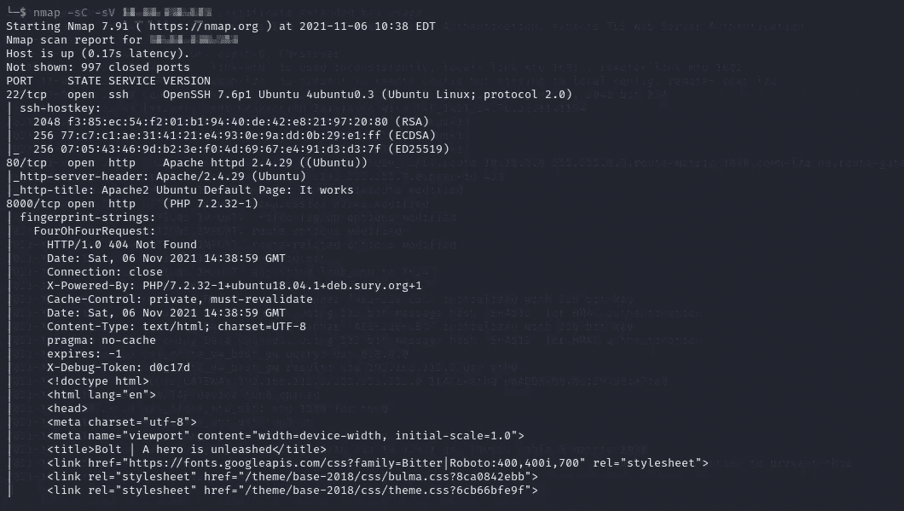
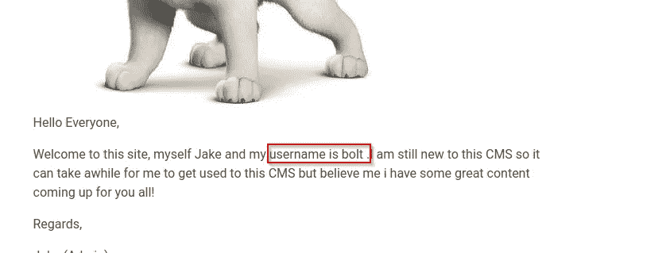
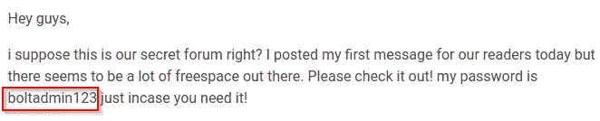
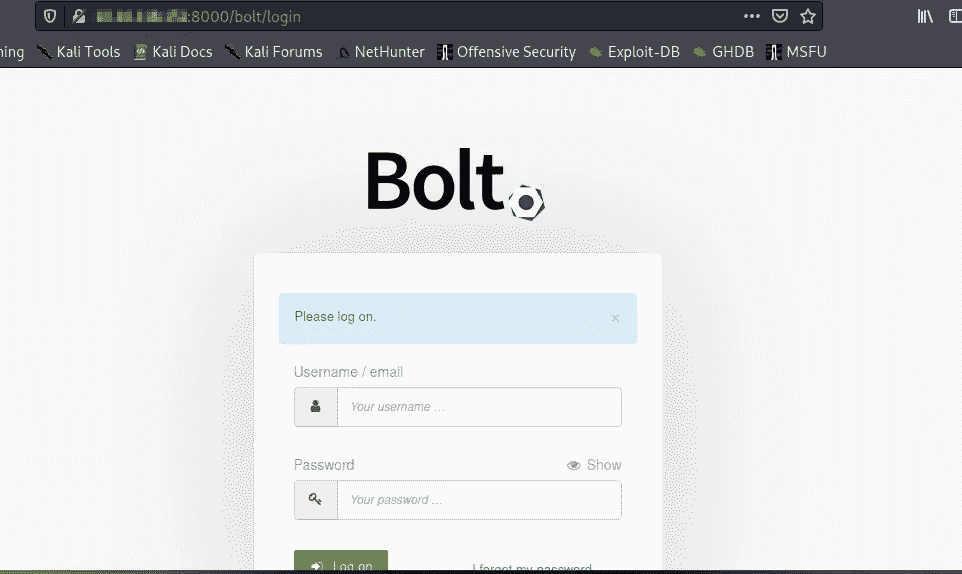
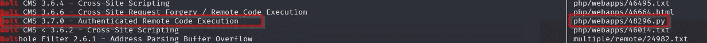
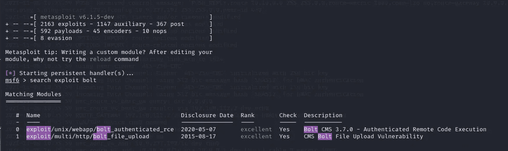
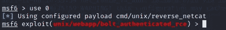
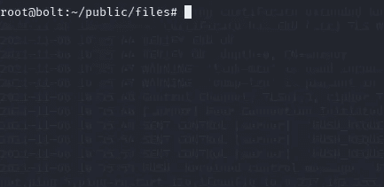
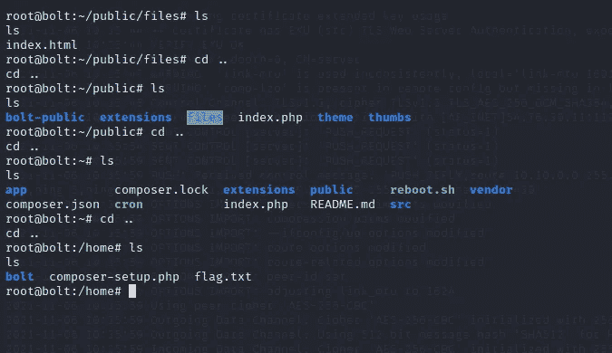
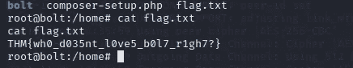

# 博尔特—特里哈克姆

> 原文：<https://infosecwriteups.com/bolt-tryhackme-f049c07e2a50?source=collection_archive---------1----------------------->

## 写文章

欢迎回到神奇的黑客，在这个博客中，我将向你展示一个有趣的演练，可能对 bug bounty 的发现有用。

让我们开始写文章，首先部署机器，然后进行一些 Nmap 扫描以找到有用的信息。

从 Nmap 结果中，我知道有 3 个端口是开放的，分别是端口 22、80 和 8000。

我在浏览器中打开端口 8000，结果出现在 ***Bolt*** 网站。关于网站用户名和密码泄露的进一步发现。

从上面两张图，我们得到了一个用户名和密码。

进一步挖掘，我得到了一个登录页面 ***/bolt/login。***

我使用收集的用户名和密码登录，并成功登录。成功登录后，我发现了一个版本的 **Bolt (Bolt 3.7.1)**

通常，如果版本泄露，我们必须对版本进行漏洞扫描或 ***漏洞利用。***

我了解到这个 ***Bolt*** 版本的漏洞是 ***远程代码执行。***

**远程代码执行:**

远程代码执行是一种网络攻击，攻击者可以在另一个人的计算设备上远程执行命令。

rce 通常是由主机下载的恶意软件引起的，无论设备的地理位置如何，都可能发生。

我启动了 Metasploit 控制台，然后开始了开发过程。

> 我使用的漏洞利用模块是**exploit/UNIX/web app/bolt _ authenticated _ rce**

然后我启用了 **LHOST、RHOST、用户名、密码和会话。然后开始利用你会进入的目标机器。**

然后，如上图所示，尝试将目录更改为 home，这样就可以获得标志。

