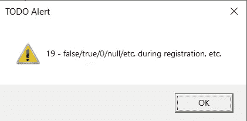
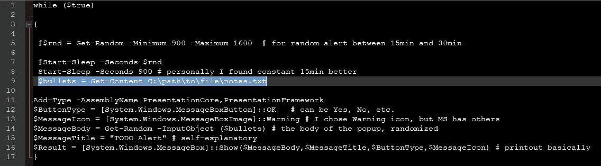

# 提高您的 Bug 搜索效率

> 原文：<https://infosecwriteups.com/boosting-your-bug-hunting-productivity-eb1302fa5e64?source=collection_archive---------6----------------------->

，或者如何使用 powershell 启动 bug 搜索会话



**Powershell for productivity** 在这个越来越疯狂的世界里，对各个领域改进的追求也越来越强烈。追求的目标之一是提高生产率。但是，为了提高你的生产力，你必须首先了解/接受阻碍你前进的是什么。对我来说，它已经迷失在一个想法/要点中，完全忘记了所有其他的想法，直到我去睡觉。这时我会想到我完全忘记尝试/应用越来越高的笔记中的某些内容:)

**自定义提醒** 这个想法来自于我时常发现的事实，通常当我感到困惑时，我会决定检查我的笔记。毫无疑问，我会发现自己充满了想法，思想的洪流，它会变得势不可挡。这种情况会持续一段时间，但之后我会在其他要点上停留一段时间。直到记起检查我的笔记。这个循环会继续下去。解决方案——如果在我寻找 bug 的过程中，每隔 15-20 分钟。我的 bug 搜索笔记中的一个随机点会弹出来，提醒我还有其他东西要测试/检查/等等。但是，它必须是“简单的”。我不需要一整套带有自定义主题等的软件套件。只是一个弹出消息框。这就是 powershell 发挥作用的地方。

我以前做过很多 visual basic 代码，所以利用这些知识是有意义的，当然也需要进行必要的更新。消息框弹出是最简单的东西，可能是我编写的第一个东西(消息框中的 hello world)。显然，这一次我需要更多的东西。
最简单的方法是将睡眠功能设置为 15 分钟。(在我的例子中)，另一件需要做的事情是从文本文件中读取行。最后的步骤是随机化该行，并在消息框中显示该行。简单。嗯，可能对于那些一直在做 powershell 脚本的人来说。另一方面，我不得不谷歌如何读取文件，如何随机化输出，然后如何在消息框中显示输出。度过了快乐的时光:)

*powershell 脚本*



唯一的先决条件是 notes.txt 有每个注释项目符号/新行

*在行动中*


这来自某人的推特

并在 powershell 命令提示符下将其作为后台进程启动:


并验证它正在运行(忽略第一个任务，这是我的 ps 脚本，它在我的鼠标插入 usb 时启动特定的软件:):


要终止进程(其中 2 是作业的 id):

```
PS C:\WINDOWS\system32> stop-job 2
```

额外好处
你也可以弹出一个实际的图像/文档来代替消息框。如果您倾向于截取其他 bug 猎人的待办事项列表的截图以获得灵感/改进/另一种形式的提醒，这将非常有用(您可以在消息框代码之前或之后放置以下内容，或者代替它):

```
start C:\path\to\screenshots\bh-todo-list-2.png
```

现在，我很确定你们大多数人，如果不是所有人，都听说过每小时站起来做伸展运动。嗯，做一些小的修改，你也可以有 ps 脚本来提醒你这样做。而且，因为弹出窗口倾向于忽略一切，除非你正在做什么，并且在弹出窗口出现的时候按下了回车键，否则很难忽略它(至少对我来说)。此外，如果你在玩视频游戏，弹出窗口会迫使你退出(对黑暗灵魂来说不是理想的)，所以在结束你的 WFH 日之前记住这一点。