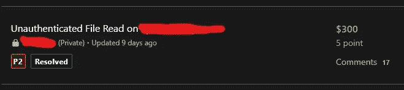
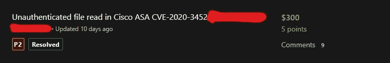

# $$对思科 ASA CVE 公司未经验证的文件读取的奖励-2020–3452

> 原文：<https://infosecwriteups.com/bounties-for-unauthenticated-file-read-in-cisco-asa-cve-2020-3452-9a0b9143370e?source=collection_archive---------0----------------------->

嘿，朋友们，又回来写文章了，我有点懒于写昆虫赏金的文章，但是我来了！！。

2020 年 7 月 22 日，思科自适应安全设备软件和火力威胁防御软件 Web 服务存在一个路径遍历漏洞，任何用户都可以通过 SSL VPN 服务读取思科 ASA 上的文件。该漏洞是由于受影响设备处理的 HTTP 请求中缺少正确的 URL 输入验证造成的。*例如，这可能允许攻击者冒充另一个 VPN 用户，并以该用户的身份与设备建立无客户端 SSL VPN 或 AnyConnect VPN 会话。*

以下是易受攻击的配置

AnyConnect IKEv2 远程访问(带客户端服务)

```
crypto ikev2 enable <interface_name> client-services port <port #>
```

AnyConnect SSL VPN

```
webvpn
 enable <interface_name>
```

无客户端 SSL VPN

```
webvpn
 enable <interface_name>
```

AnyConnect IKEv2 远程访问(带客户端服务)1，2

```
crypto ikev2 enable <interface_name> client-services port <port #>
```

AnyConnect SSL VPN1，2

```
webvpn
 enable <interface_name>
```

# **那么如何对这个漏洞进行攻击呢？**

让我们以此为例

**脆弱的亚撒**

[https://1.1.1.1/+CSCOE+/logon.html?fcadbadd=1#form_title_text](https://122.249.69.26/+CSCOE+/logon.html?fcadbadd=1#form_title_text)

在谷歌黑客数据库上查看我的呆子，你可以找到类似的登录

**呆瓜**[https://www.exploit-db.com/ghdb/6441](https://www.exploit-db.com/ghdb/6441)

**易受攻击的端点**

> /+CSCOT+/OEM-定制？app = any connect & type = OEM & platform =..&资源类型=..& name = % 2b scoe % 2b/portal _ Inc . Lua
> 
> /+CSCOT+/翻译表？type = MST & textdomain =/% 2b scoe % 2b/portal _ Inc . Lua & default-lang & lang =../

如果终端易受攻击，您可以通过 Burp Suite 或浏览器查看 ASa 文件，这些文件将被下载。

我发现许多顶级组织都有这个漏洞，并且因为它接受 P2 而赚了不少钱。



测试你的网络是否有这些漏洞，或者试试你的运气

回头见！！