# 赏金黑客:CTF-TryHackMe 演练

> 原文：<https://infosecwriteups.com/bounty-hacker-ctf-tryhackme-walkthrough-bb4f664c766d?source=collection_archive---------2----------------------->

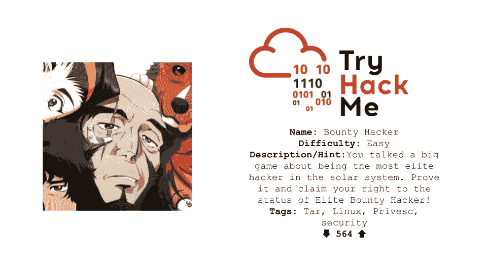

*免责声明:本文仅用于教育目的，未经被黑对象的事先同意，不要试图黑入任何人的设备，并且仅将这些信息用于道德目的。此外，不要侵入文章中显示的 IP 地址，因为你需要 VPN 访问才能看到它们，而且它总是在变化。*

学习道德黑客的最好方法是实践。但是真的很难找到愿意同意你黑他们的人**。这就是 Capture the Flag(CTF)公司发挥作用的地方，这些公司(如 TryHackMe)允许你合法地在他们的机器上进行道德黑客行为。在这篇文章中，我将带你浏览一下**赏金黑客** CTF 在 **TryHackMe 的黑客活动。****

## **扫描和计数**

我总是做的第一件事是用 Nmap 运行网络扫描，这样我就可以了解网络结构/架构，信息=能力。

```
nmap -A -T4 -v [IP]
```

*   A =获取设备信息
*   -T4 =跑得更快
*   -v =扫描时打印输出

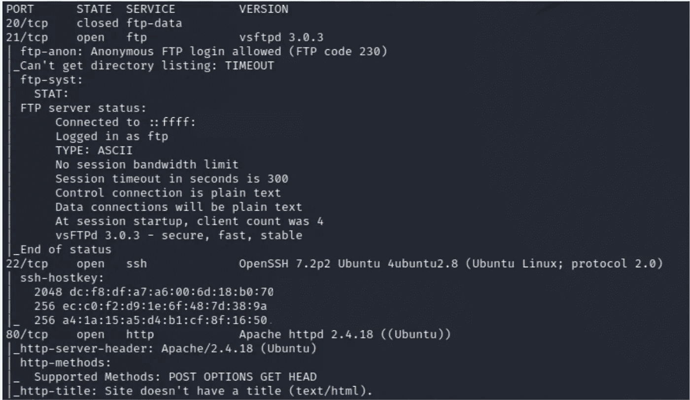

Nmap 扫描结果

我看到 FTP 对匿名访问开放。FTP 是文件传输协议，帮助人们传输文件。


Nmap 扫描显示允许匿名访问

所以我在 FTP 上做了更多的枚举，通过登录它(用户名=匿名，密码=匿名)

```
ftp [ip]
```

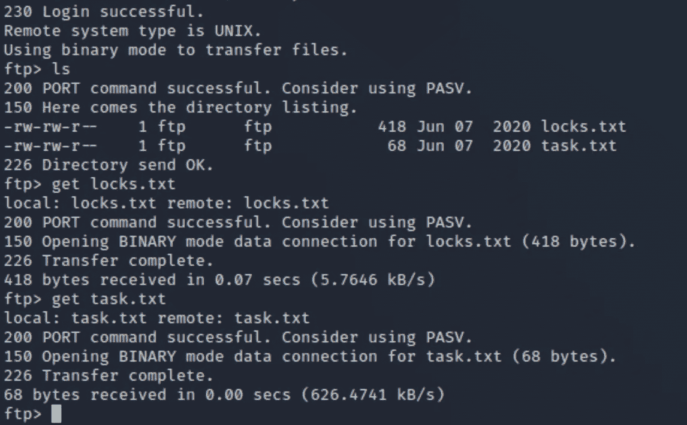

登录 FTP 并获取文件

我首先执行了一个 *ls* 来查看目录中是否有任何内容。我看到了 *locks.txt* 和 *task.txt.* 然后我使用 *get c* 命令将它们放到我的本地桌面上。

我先打开 *task.txt*

```
cat task.txt
```

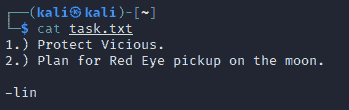

阅读 task.txt

我们现在有了一个可能的用户名的想法。然后我打开 *locks.txt*

```
cat locks.txt
```

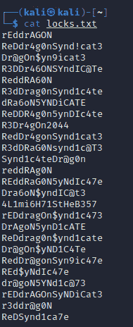

阅读 locks.txt

看起来我们有一个可能的密码列表。

## **利用**

现在我们可以尝试使用密码喷涂 ssh 登录，因为我们已经有了用户名和密码列表。

```
hydra -l lin -P locks.txt [ip] ssh
```

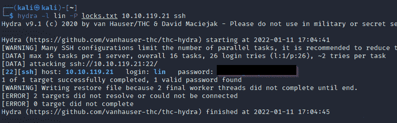

密码喷射 ssh

成功了，现在我们有了登录 ssh 的密码和用户名。

```
ssh lin@[ip]
```

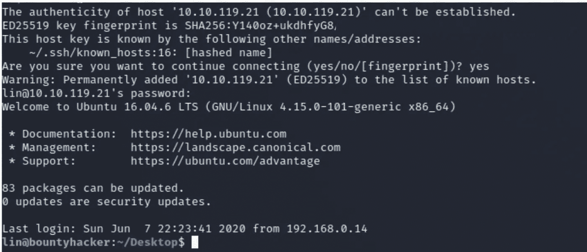

通过 ssh 登录

我们现在有了对机器的低级访问权限

## **权限提升**

当我想提升我的权限时，我做的第一件事就是检查 sudo 权限(例如:我可以作为 root 运行什么)

```
sudo -l
```

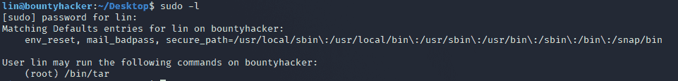

寻找我们可以作为 root 运行的内容

我看到我们可以以 root 身份运行 **tar** ，这样我们就可以去 [GTFObins](https://gtfobins.github.io/) 寻找升级技术。

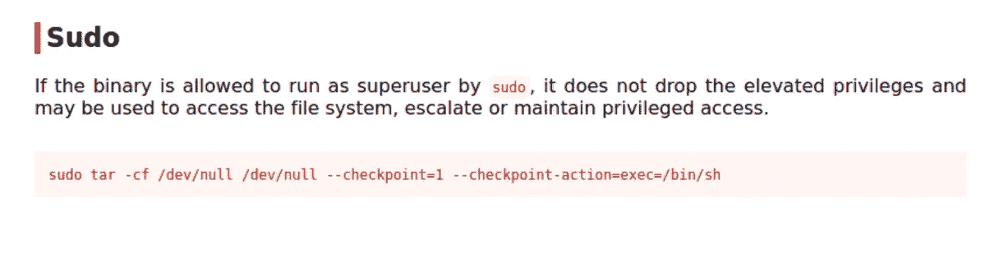

在 GTFObins 上查找 tar 命令

运行命令

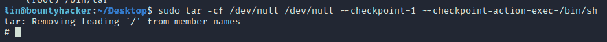

运行 tar 升级技术

现在我们有了根用户权限

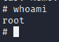

发现我们是谁

恭喜你，你已经根了机器。感谢您阅读本 CTF 演练，请记住**仅**将此信息用于**道德目的。**

# 🔈 🔈Infosec Writeups 正在组织其首次虚拟会议和网络活动。如果你对信息安全感兴趣，这是最酷的地方，有 16 个令人难以置信的演讲者和 10 多个小时充满力量的讨论会议。[查看更多详情并在此注册。](https://iwcon.live/)

[](https://iwcon.live/) [## IWCon2022 - Infosec 书面报告虚拟会议

### 与世界上最优秀的信息安全专家建立联系。了解网络安全专家如何取得成功。将新技能添加到您的…

iwcon.live](https://iwcon.live/)